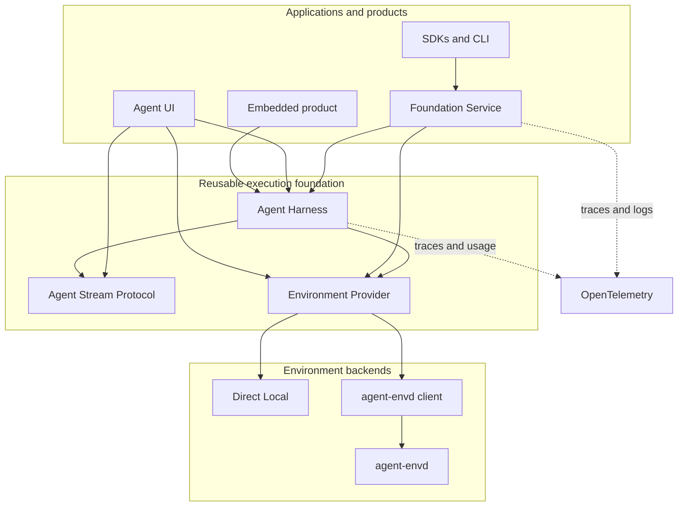

# Agent Foundation (A13N)

[](https://github.com/converge-ai-labs/agent-foundation/actions/workflows/ci.yml)
[](https://agent-foundation-docs.converge.ai/)
[](https://www.python.org/)
[](LICENSE)

**Build agents as libraries first. Run them locally, embed them in products, or host them as durable services when you need to scale.**

Agent Foundation is a Python-first open-source foundation for agents and multi-agent systems. It combines a code-first Agent Harness, portable Environment boundaries, local WebUI and TUI workflows, optional durable hosting, typed SDKs, and OpenTelemetry-native observability without taking ownership of your product or business logic.

## Why Agent Foundation?

- **Harness-first**: embed agent execution directly in an existing Python application without adopting a hosted platform.
- **Pydantic AI native**: use upstream models, tools, messages, events, usage, and continuation semantics rather than parallel abstractions.
- **Portable Environments**: expose files, commands, processes, and ports through provider-neutral contracts backed by direct local execution or `agent-envd`.
- **Local and hosted paths**: start with Agent UI for local work, then use Foundation Service when durable control and execution are required.
- **Protocol-based presentation**: project public Harness observations into AG-UI without coupling execution to one interface.
- **Composable by design**: applications retain authentication, product policy, user experience, and final delivery.
- **Observable end to end**: export structured logs, traces, usage, and stable run/thread correlation through standard telemetry boundaries.

## Quick Start

Install the Harness:

```bash
uv add a13n-harness
```

The following example runs entirely offline with Pydantic AI's deterministic `FunctionModel`:

```python
import asyncio
from collections.abc import AsyncIterator

from a13n_harness import HarnessBuilder, RunBindings
from pydantic_ai.agent.spec import AgentSpec
from pydantic_ai.messages import ModelMessage
from pydantic_ai.models.function import AgentInfo, FunctionModel


async def respond(
    messages: list[ModelMessage],
    info: AgentInfo,
) -> AsyncIterator[str]:
    del messages, info
    yield "Hello from Agent Foundation"


async def main() -> None:
    executable = HarnessBuilder().build_code(
        AgentSpec(model="logical:example"),
        output_type=str,
        model=FunctionModel(stream_function=respond),
    )

    async with executable:
        result = await executable.run(
            "Say hello",
            bindings=RunBindings.embedded(),
        )

    print(result.output_or_raise())


if __name__ == "__main__":
    asyncio.run(main())
```

```text
Hello from Agent Foundation
```

Continue with the [Getting Started guide](docs/agent-harness/getting-started.md), or explore the runnable [Agent Application](examples/agent-app/README.md) and [plugin integration](examples/plugins/README.md) examples.

## Choose Your Path

### Embed the Harness

Use `a13n-harness` inside an existing Python process when your application already owns lifecycle, identity, persistence, and delivery. Add only the Capabilities and Environment integrations required by each Agent definition.

### Run Locally with Agent UI

Use `a13n-ui` for a complete local single-user Host with reloadable configuration, Sessions, managed Environments, a bundled WebUI, and a TUI.

```bash
uv tool install a13n-ui
```

### Host Durable Workloads

Use `a13n-service` when Agents need durable definitions, execution attempts, scheduling, recovery, APIs, and independently scalable control and execution roles. Foundation SDKs and the `agent-foundation` CLI access the service through its public `/api` boundary.

## Architecture



Agent Foundation keeps these boundaries deliberately separate:

- the Harness owns process-local construction and execution, not durable product lifecycle;
- Environment providers own resources and attachments, not Agent execution;
- Agent Stream Protocol observes public Harness events, not private internals;
- Foundation Service hosts durable work without redefining the Agent loop;
- applications own authentication, authorization, business policy, and user experience.

The complete accepted architecture is maintained in the [platform specification](spec/README.md).

## Packages

Agent Foundation uses `a13n`—a numeronym for “Agent Foundation”—as its package namespace. The project and product name remain **Agent Foundation**.

| Component             | Distribution or artifact    | Source                                                                                 |
| --------------------- | --------------------------- | -------------------------------------------------------------------------------------- |
| Agent Harness         | `a13n-harness`              | [`packages/agent-harness`](packages/agent-harness/README.md)                           |
| Environment Provider  | `a13n-environment-provider` | [`packages/agent-environment-provider`](packages/agent-environment-provider/README.md) |
| Agent Stream Protocol | `a13n-stream-protocol`      | [`packages/agent-stream-protocol`](packages/agent-stream-protocol/README.md)           |
| Agent UI              | `a13n-ui`                   | [`packages/agent-ui`](packages/agent-ui/README.md)                                     |
| agent-envd client     | `a13n-envd-client`          | [`packages/agent-envd-client`](packages/agent-envd-client/README.md)                   |
| Logging               | `a13n-logging`              | [`packages/logging`](packages/logging/)                                                |
| Foundation Service    | `a13n-service`              | [`packages/foundation-service`](packages/foundation-service/README.md)                 |
| Foundation SDK        | `a13n-sdk`                  | [`sdk`](sdk/README.md)                                                                 |
| Environment daemon    | `agent-envd`                | [`crates/agent-envd`](crates/agent-envd/README.md)                                     |
| Foundation CLI        | `agent-foundation`          | [`sdk/rust/agent-foundation-cli`](sdk/rust/agent-foundation-cli/README.md)             |

Python distribution names use hyphens and their import packages use underscores, for example:

```text
a13n-harness  ->  a13n_harness
a13n-service  ->  a13n_service
```

The Python, Rust, and TypeScript Foundation SDKs share the public package name `a13n-sdk`. The Go SDK uses its repository module path. The native daemon deliberately keeps the established `agent-envd` component name.

## Documentation

- [User documentation](https://agent-foundation-docs.converge.ai/)
- [Agent Harness guide](docs/agent-harness/index.md)
- [Environment Provider guide](docs/agent-environment-provider/index.md)
- [Agent Stream Protocol guide](docs/agent-stream-protocol/index.md)
- [Accepted architecture](spec/README.md)
- [Runnable examples](examples/README.md)

## Development

Clone the repository and install the locked development environment:

```bash
git clone git@github.com:converge-ai-labs/agent-foundation.git
cd agent-foundation
make install
```

Run the fast development gate:

```bash
make check
make test
```

Run the complete repository gate before opening a broad pull request:

```bash
make check-all
```

Useful development commands include:

```bash
make dev          # Foundation Service and Foundation Web
make agent-ui     # Agent UI WebUI
make agent-ui tui # Agent UI TUI
make docs-serve   # local documentation site
make eip-check    # EIP generation and conformance
```

See [CONTRIBUTING.md](CONTRIBUTING.md) for the Issue-to-PR workflow and local setup. Service engineering requirements are defined in [DEVELOPMENT.md](DEVELOPMENT.md), and semantic review ownership is defined in [MAINTAINERS.md](MAINTAINERS.md).

## Versioning

Agent Foundation packages currently use `0.0.x` versions while public contracts are refined. Release channels are independent where component compatibility requires it; the Harness group releases together, while Agent UI, Foundation Service, agent-envd, SDKs, and Foundation CLI have their own channels.

Stable releases use `X.Y.Z`. Release candidates use `X.Y.Z-rc.N`, with standard ecosystem-specific normalization where required.

## Contributing

Issues are the primary venue for proposals, design discussion, questions, and coordination. Pull requests are welcome for specifications, documentation, implementation, tests, examples, and automation.

Before contributing:

1. read [CONTRIBUTING.md](CONTRIBUTING.md);
2. search existing [issues](https://github.com/converge-ai-labs/agent-foundation/issues);
3. open an issue for material product, architecture, security, compatibility, or scope changes;
4. run the relevant checks and report their exact outcomes in the pull request.

## License

Agent Foundation is licensed under the [Apache License 2.0](LICENSE).

Copyright 2026 Converge AI.
