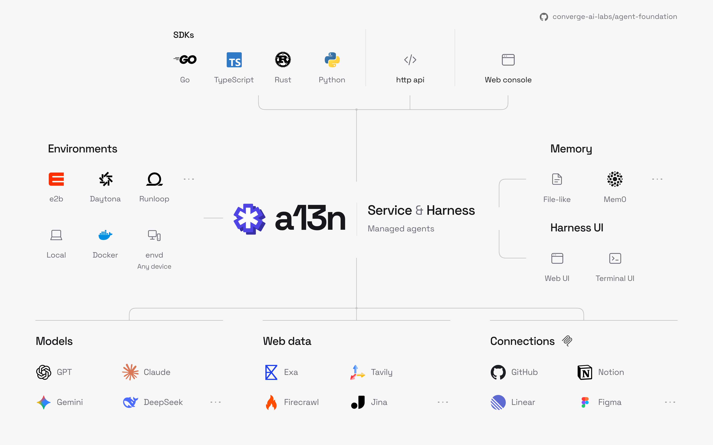
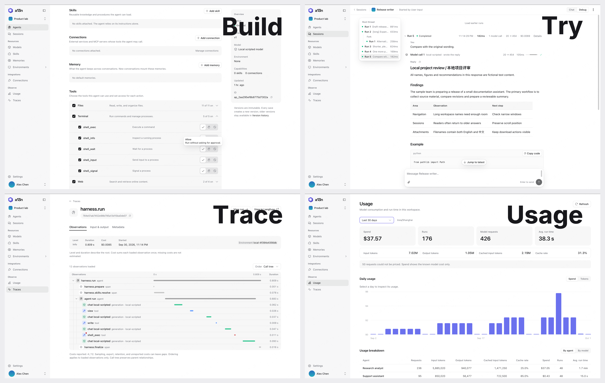
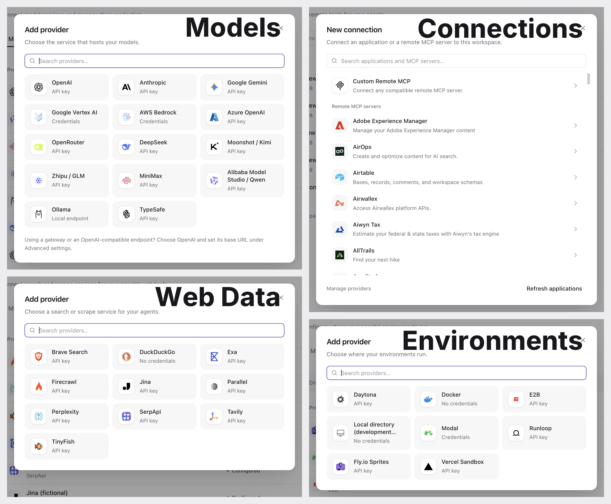
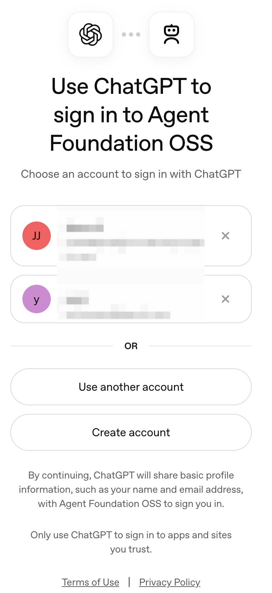
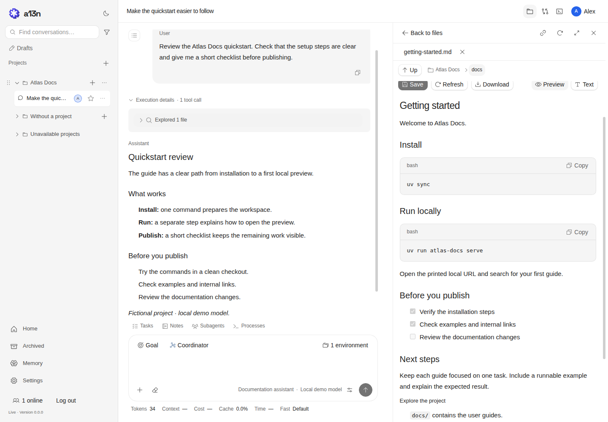

<p align="center">
  
</p>

<h1 align="center">Agent Foundation (a13n)</h1>

[](https://github.com/converge-ai-labs/agent-foundation/actions/workflows/ci.yml) [](https://a13n-docs.converge.ai/) [](https://www.python.org/) [](LICENSE)

**The open-source, self-hosted foundation for AI agents.**

Agent Foundation is an open-source library and platform for building and running your own agent systems. Managed agents, memory, sandboxes, computer use, and durable execution come together in a self-hosted service, ready to integrate into your applications.



- **Build with Service.** Configure agents and connect them to your product through APIs, with resource management, permissions, and execution recovery already in place.
- **Extend with Harness.** Embed the runtime directly and shape its behavior through plugins, custom tools, and providers.
- **Explore with Harness UI.** Try models, tools, and agent configurations in a terminal and web playground—without building an application first.

> Agent Foundation is in active `0.x` development. APIs and configuration may change between minor releases. This README and the documentation site track `main`; check release notes and package metadata when using a published version.

## Run Service with Docker Compose

You need **Docker with Docker Compose** and either a model provider API key or an eligible ChatGPT plan. The stack includes Service, Console, PostgreSQL, Redis, and access to your host Docker Engine for agent execution. No repository clone, Make, Python, Node.js, or source build is needed.



*Console — Build agents, try runs, inspect execution traces, and monitor usage. Shown with fictional demo data.*

Download the [Compose file](deploy/docker/compose/a13n-service.yaml) and start the stack:

```bash
mkdir a13n-service
cd a13n-service
curl -fL https://raw.githubusercontent.com/converge-ai-labs/agent-foundation/main/deploy/docker/compose/a13n-service.yaml -o a13n-service.yaml
docker compose -f a13n-service.yaml up -d --wait --pull always
```

Then open **<http://127.0.0.1:8080>**:

1. **First launch: register the administrator account.** Enter your email and choose a password of at least **8 characters**. This creates the first administrator, organization, and workspace, and signs you in automatically.
2. **Connect a model.** Under **Models**, add a provider using an API key or **Sign in with ChatGPT**, then select a model.
3. **Try an agent.** Create an agent, choose the model, and send your first message with **Try agent**.

The first account created on an uninitialized Service is its administrator. On later visits, sign in with the email and password you registered; restarting preserves your account and data. Additional users join through invitations from an administrator.

**Already in a repository checkout?** Run `make compose-up` from the repository root to pull images, start the same stack, and print its Console URL.

The stack binds to loopback and mounts the host Docker socket for Docker execution environments. The source Compose file uses the published `latest` image; release assets pin a release version. See the [deployment guide](deploy/docker/compose/README.md) before exposing Service to other machines.

Continue with the [Service quickstart](docs/a13n-service/get-started.md) for model setup, API usage, stop/resume, and troubleshooting.

## Choose your agent stack

Build your agent stack in Console: choose model providers, web data services, execution environments, and remote MCP servers.



| Capability       | Explore                                                                                                                                  |
| ---------------- | ---------------------------------------------------------------------------------------------------------------------------------------- |
| **Models**       | [14 provider types](docs/a13n-service/models.md#model-providers), including cloud APIs, gateways, and local Ollama endpoints.            |
| **Web Data**     | [10 search and scrape providers](docs/a13n-service/tools.md#web-search-and-scrape), including Brave, Exa, Tavily, and TinyFish.          |
| **Environments** | [Docker and hosted sandboxes](docs/a13n-service/environments.md#providers), including E2B, Daytona, Modal, Runloop, Sprites, and Vercel. |
| **Connections**  | [Browse remote MCP servers](docs/a13n-service/tools.md#remote-mcp-servers) or connect your own compatible endpoint.                      |

*Explore the full-size screenshots in the linked guides. The Local directory environment is available only in development.*

## Sign in with ChatGPT

Harness UI and Service support **Sign in with ChatGPT**: use your eligible ChatGPT plan for agent requests without an OpenAI API key. See [Harness UI setup](docs/a13n-harness-ui/models-and-authentication.md#chatgpt-subscription) or [Service setup](docs/a13n-service/models.md#chatgpt-subscription-provider).

<p align="center">
  
</p>

*Sign in with ChatGPT — Authorize Agent Foundation OSS on OpenAI's sign-in page. Account details are obscured.*

## Use Harness UI

For individual work or trusted collaborators, Harness UI offers a terminal agent and browser workbench over the same Harness. Explore repositories, edit files, run commands, and try models, tools, Skills, and environments interactively.



*Harness UI — Review agent output alongside project files in WebUI. Shown with a fictional project and a local demo model.*

```bash
uv tool install a13n-harness-ui
cd your-repository
a13n-harness-ui          # TUI
# Or: a13n-harness-ui webui
```

First-use setup connects a model and selects execution permissions. Full Control runs as your host account. Share WebUI only with trusted collaborators; `--no-share-computer` disables its native host file and terminal access. See [installation](docs/a13n-harness-ui/installation.md), [execution permissions](docs/a13n-harness-ui/environments-and-projects.md#execution-permissions), and [browser access](docs/a13n-harness-ui/webui.md).

## Build on Harness

Harness gives your application reusable agents, typed tools and outputs, streaming observations, portable execution environments, and state you can save and resume. Your application owns persistence, credentials, and recovery policy.

Start with the [Harness quickstart](docs/a13n-harness/getting-started.md), then explore [runnable examples](examples/README.md). The [package catalog](docs/overview/packages.md) covers supporting components such as Envd, Stream Protocol, and logging.

## Work from source

```bash
git clone https://github.com/converge-ai-labs/agent-foundation.git
cd agent-foundation
```

| Work on             | Command                                   | Guide                                                   |
| ------------------- | ----------------------------------------- | ------------------------------------------------------- |
| Harness             | `uv sync --locked --package a13n-harness` | [Getting started](docs/a13n-harness/getting-started.md) |
| Harness UI terminal | `make cli`                                | [Local UI development](dev/harness-ui/README.md)        |
| Harness UI browser  | `make webui`                              | [Local UI development](dev/harness-ui/README.md)        |
| Service and Console | `make dev`                                | [Local Service development](dev/service/README.md)      |
| Documentation       | `make docs-serve`                         | [Contributing](CONTRIBUTING.md)                         |

Source development uses Python 3.13, uv, and Make. Browser builds also need Node.js 24 and the pinned pnpm version; Service development needs Docker. Follow [CONTRIBUTING.md](CONTRIBUTING.md) for the toolchain and checks relevant to your change.

## Contribute

Bug reports, documentation fixes, examples, and focused improvements are welcome. Search [GitHub Issues](https://github.com/converge-ai-labs/agent-foundation/issues) and read the [contribution guide](CONTRIBUTING.md) before starting. Discuss unresolved product or architecture decisions before implementing them.

- [User documentation](https://a13n-docs.converge.ai/)
- [Development standards](DEVELOPMENT.md)
- [Accepted specifications](spec/README.md)
- [Maintainers](MAINTAINERS.md)

## Security

Report suspected vulnerabilities privately to [support@converge.ai](mailto:support@converge.ai), not in public issues or pull requests. See [SECURITY.md](SECURITY.md) for what to include.

## License

Agent Foundation is licensed under the [Apache License 2.0](LICENSE).

Copyright 2026 Converge AI.
