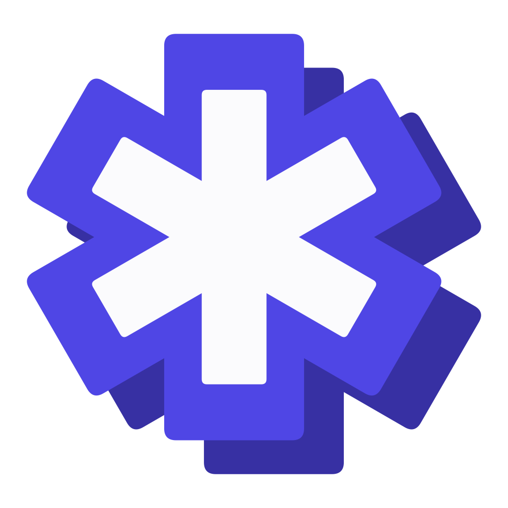
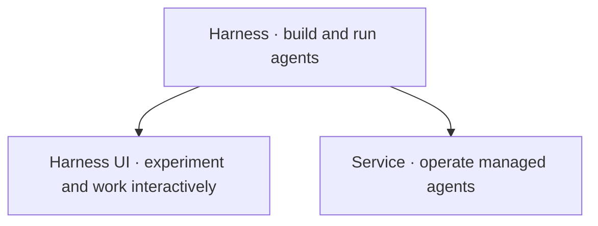

<p align="center">
  
</p>

<h1 align="center">Agent Foundation (a13n)</h1>

[](https://github.com/converge-ai-labs/agent-foundation/actions/workflows/ci.yml) [](https://agent-foundation-docs.converge.ai/) [](https://www.python.org/) [](LICENSE)

**One agent foundation. An interactive playground. A managed runtime.**

Agent Foundation is an open-source toolkit for building and running agents. **Harness** is the execution foundation. **Harness UI** is its playground and workbench for individuals and trusted small teams. **Service** runs managed agents with durable execution and access control.



Harness UI and Service both embed Harness. They are two ways to use the same foundation, not successive deployment tiers or separate agent engines.

> Agent Foundation is in active `0.x` development. APIs and configuration may change between minor releases. This README and the documentation site track `main`; check release notes and package metadata when using a published version.

## Choose your starting point

| You want to…                              | Start with                                                               | What it owns                                                                                |
| ----------------------------------------- | ------------------------------------------------------------------------ | ------------------------------------------------------------------------------------------- |
| Build agents into your application        | [Harness](https://agent-foundation-docs.converge.ai/a13n-harness/)       | Agent composition, tools, scoped execution, streaming, and continuation state               |
| Work with agents and try new capabilities | [Harness UI](https://agent-foundation-docs.converge.ai/a13n-harness-ui/) | Terminal and browser interaction, editable configuration, projects, and saved conversations |
| Operate agents for users or applications  | [Service](https://agent-foundation-docs.converge.ai/a13n-service/)       | Managed resources, authorization, durable runs, recovery, and workers                       |

### Harness UI: the playground

Use an agent to explore a repository, edit files, run commands, review changes, or delegate a focused task. Try models, instructions, tools, Skills, and environments without building a host application first.

- **Terminal:** a full-screen coding-agent experience with streaming output, approvals, attachments, and conversation resume.
- **Browser:** a shared workbench with conversations, live output, shared drafts, files, Git changes, terminals, and configuration.
- **Your setup:** choose models and execution permissions; keep configuration in editable files or manage it through the browser.

The browser is designed for trusted collaborators sharing one instance. It does not isolate participants, credentials, or projects into separate tenants. Active execution belongs to the running application; saved checkpoints are not a durable job queue. Use Service when you need managed access and execution that outlives a worker process.

### Service: managed agents

Service adds organizations and workspaces, versioned agent definitions, shared resources, permissions, durable acceptance, and worker recovery around Harness. Use its Console to manage agents and conversations, or integrate through the HTTP API, [language SDKs, and remote CLI](docs/a13n-service/sdks.md).

Console belongs to Service; it is not the Harness UI browser. Service SDKs and the remote CLI are maintained in independent repositories.

## Try Harness UI

Install with [uv](https://docs.astral.sh/uv/getting-started/installation/):

```bash
uv tool install a13n-harness-ui
cd your-repository
```

Choose the terminal:

```bash
a13n-harness-ui
```

Or start the browser workbench and open the login link printed in your terminal:

```bash
a13n-harness-ui webui
```

First-use setup connects a model and asks you to choose execution permissions. The installed package includes both interfaces; no source checkout or Node.js is required. Start with a read-only task such as “Explain this repository's entry points and tests. Do not modify files.”

**Choose permissions deliberately.** Full Control runs as your host account, not in a sandbox. WebUI enables native host file and terminal access by default; use `--no-share-computer` to disable those browser features. Share the instance only with people you trust with that access. See [installation](docs/a13n-harness-ui/installation.md), [execution permissions](docs/a13n-harness-ui/environments-and-projects.md#execution-permissions), and [browser access](docs/a13n-harness-ui/webui.md).

## Build on Harness

Harness gives your application reusable agents, typed tools and outputs, streaming observations, portable execution environments, and state you can save and resume. Your application owns persistence, credentials, and recovery policy.

Start with the [Harness quickstart](docs/a13n-harness/getting-started.md), then explore [runnable examples](examples/README.md). Supporting components such as Envd, Stream Protocol, and logging are covered in the [package catalog](docs/packages.md); you do not need to deploy every component.

## Work from source

```bash
git clone https://github.com/converge-ai-labs/agent-foundation.git
cd agent-foundation
```

| Work on             | Command                                   | Guide                                                   |
| ------------------- | ----------------------------------------- | ------------------------------------------------------- |
| Harness             | `uv sync --locked --package a13n-harness` | [Getting started](docs/a13n-harness/getting-started.md) |
| Harness UI terminal | `make cli`                                | [Local UI development](dev/harness-ui/README.md)        |
| Harness UI browser  | `make webui`                              | [Local UI development](dev/harness-ui/README.md)        |
| Service and Console | `make dev`                                | [Local Service development](dev/service/README.md)      |
| Documentation       | `make docs-serve`                         | [Contributing](CONTRIBUTING.md)                         |

Source development uses Python 3.13, uv, and Make. Browser builds also need Node.js 24 and the pinned pnpm version; Service development needs Docker. Follow [CONTRIBUTING.md](CONTRIBUTING.md) for the toolchain and checks relevant to your change.

## Contribute

Bug reports, documentation fixes, examples, and focused improvements are welcome. Search [GitHub Issues](https://github.com/converge-ai-labs/agent-foundation/issues) and read the [contribution guide](CONTRIBUTING.md) before starting. Discuss unresolved product or architecture decisions before implementing them.

- [User documentation](https://agent-foundation-docs.converge.ai/)
- [Development standards](DEVELOPMENT.md)
- [Accepted specifications](spec/README.md)
- [Maintainers](MAINTAINERS.md)

## Security

Report suspected vulnerabilities privately to [support@converge.ai](mailto:support@converge.ai), not in public issues or pull requests. See [SECURITY.md](SECURITY.md) for what to include.

## License

Agent Foundation is licensed under the [Apache License 2.0](LICENSE).

Copyright 2026 Converge AI.
