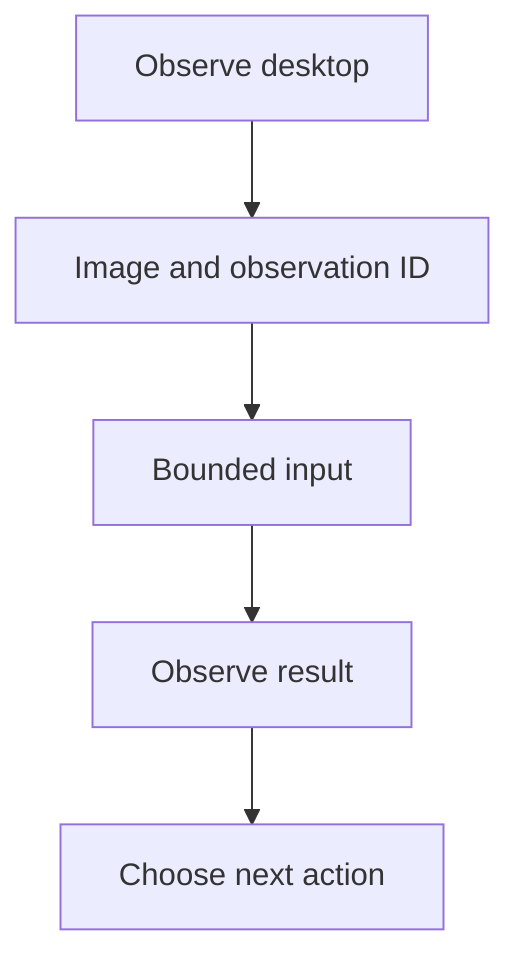

Use Envd to let a model view screenshots and operate a shared desktop. WebUI shows each screenshot with its tool result.

## Requirements and limits

| Platform | Required desktop                                                            | Input support                                                                |
| -------- | --------------------------------------------------------------------------- | ---------------------------------------------------------------------------- |
| macOS    | Logged-in graphical session; Screen Recording and Accessibility permissions | Pointer gestures, physical key chords, Unicode text, advertised scroll units |
| Linux    | Authenticated X11 with RandR 1.5, XKB, XTEST, and a TrueColor root visual   | Pointer gestures, physical key chords, wheel steps; no literal text entry    |
| Windows  | Signed-in, unlocked interactive user session                                | Pointer gestures, scan-code chords, Unicode text, wheel steps                |

Wayland/XWayland, Windows services, disconnected sessions, and login/UAC secure desktops are unsupported. Windows input cannot control higher-integrity targets.

Select an image-capable model and an Agent with `dynamic_environment` tools. Use disabled Sandbox and inherited egress. Actions use the logged-in user's authority across the shared desktop, not just the working directory.

## Connect the desktop

1. Open **Settings → Environments → Connect Device** in WebUI.
2. Run the displayed command in the desktop's graphical session, adding the opt-in:

```console
a13n-envd connect https://your-harness-ui.example.com --computer-use true
```

3. Compare the verification code and approve the connection in WebUI.
4. Complete the platform readiness step below and keep Envd running.

Use a reachable HTTPS WebUI origin, or loopback HTTP on the same machine. Restart with the same command to reuse a paired registration.

Computer use is off by default and independent of command `full_control`. For JSON, environment variables, and precedence, see [daemon configuration](configuration.md).

### Wait for macOS authorization

In **System Settings → Privacy & Security**, grant Screen Recording and Accessibility to the process or launcher named by macOS. Envd waits up to 120 seconds and connects once both are ready. Timeout or Ctrl+C exits with a nonzero status. Restart the launcher and Envd if macOS requests it.

For a longer wait, set `A13N_ENVD_COMPUTER_USE_PERMISSION_TIMEOUT_MS=300000`. A stdio parent must drain stderr and set `initialization_timeout` above the permission wait plus startup time: for example, 135 seconds for the default 120-second wait, or 315 seconds for the 300-second setting above. The Python client defaults to ten seconds.

### Linux X11 readiness

Launch in the intended X11 session with `DISPLAY` and any `XAUTHORITY`. Keep X11 authentication enabled. A lost X server requires a new Session and screenshot.

Use `unit="steps"`, at most 100 steps per axis. Physical key chords follow the active layout; Linux has no literal text entry.

### Windows readiness and input

Launch from an ordinary terminal on the desktop to control. After a lock or disconnect, unlock or reconnect manually and capture again.

Use `unit="steps"` for scrolling. Display geometry uses physical pixels even with display scaling. Protected content may appear black. Some applications do not accept Unicode entry; verify after typing.

Release held keys or buttons before input. Keep Windows protections enabled rather than elevating Envd to work around a failure.

## Bind the desktop to a Thread

1. Open **Environments** in the composer, or **Conversation details → Configuration** for saved next-Run settings.
2. Add the connected Device and select an existing working directory.
3. Set the alias to `desktop`.
4. Select **Full control** under **Allowed actions**. This binding preset includes desktop actions advertised by the Device; it is distinct from daemon `full_control`.
5. Select the default environment, or ask the Agent to use alias `desktop`.
6. Save the selection and start a new Run.

The binding authorizes model access; **Read only** excludes desktop actions. Changes apply to the next Run.

For observation-only access, save an exact ceiling in Project or Thread configuration:

```yaml
environment_bindings:
  - device_id: device-your-mac
    alias: desktop
    working_directory: /Users/your-account
    permission_ceiling:
      operations:
        - environment.computer.describe
        - environment.computer.observe
default_environment: desktop
```

Replace the Device ID and path. Add input actions only when control is intended.

## Observe, act, verify

Begin with observation:

> Use the desktop environment. Describe its displays and capture a screenshot. Do not click or type yet.

Then use the returned `observation_id` and image pixel coordinates for pointer input. Click the intended field before keyboard or text input, which uses current foreground focus. Capture again to verify the application outcome.



| Tool                              | Purpose                                                                    |
| --------------------------------- | -------------------------------------------------------------------------- |
| `computer_describe`               | List displays and native readiness                                         |
| `computer_observe`                | Capture the primary or selected display; maximum dimension 256–2048 pixels |
| `computer_click`, `computer_move` | Use a returned image position                                              |
| `computer_drag`                   | Perform a bounded drag and release the button                              |
| `computer_scroll`                 | Use an advertised unit; positive means right/down                          |
| `computer_type_text`              | Enter literal Unicode text on macOS or Windows                             |
| `computer_press_keys`             | Press and release a chord such as `["meta", "a"]`                          |

Key names include `meta` (Command/Super/Windows), `alt` (Option/Alt), `enter`, `page_up`, and `page_down`. Expired references or display-layout changes require a fresh observation. Input results describe native effects and cleanup, not application success. Inspect the desktop before retrying partial or unknown input, incomplete release, or transport loss.

Expand **Observe desktop** in WebUI to view the screenshot. Temporary image copies can expire. Close screenshot readers promptly to release transfer capacity.

## Python client

Given a ready `EIPSession`, use the verified screenshot reader:

```python
async with session.observe_computer(max_dimension=1280) as reader:
    screenshot = b"".join([chunk async for chunk in reader])
    observation = reader.opened.observation
# Closing the reader releases image bytes, not the Session's geometry reference.
```

Use a fresh operation context for each new input action. Reconcile uncertain effects with the original operation identity. Session setup and transfer limits are in [Python EIP client](python-client.md).

## Validation

The opt-in [Linux desktop fixture](https://github.com/converge-ai-labs/agent-foundation/tree/main/dev/fixtures/linux-desktop) checks real GUI input and changed screenshots in a disposable container. Portable scripted-peer tests check integration, not native desktop behavior.

On the target OS, try harmless input in a disposable application and verify the next screenshot. Also test permission/session loss and display-layout changes.
