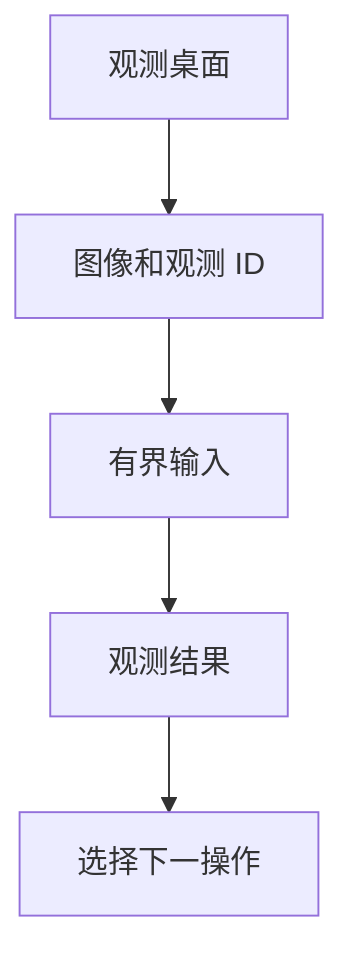

使用 Envd 让模型查看截图并操作共享桌面。WebUI 随工具结果显示每张截图。

## 要求与限制

| 平台    | 所需桌面                                                            | 输入支持                                           |
| ------- | ------------------------------------------------------------------- | -------------------------------------------------- |
| macOS   | 已登录的图形会话；屏幕录制和辅助功能权限                            | 指针手势、物理组合键、Unicode 文本、声明的滚动单位 |
| Linux   | 经身份验证的 X11，支持 RandR 1.5、XKB、XTEST 和 TrueColor 根 visual | 指针手势、物理组合键、滚轮步数；不支持字面文本输入 |
| Windows | 已登录、未锁定的交互用户会话                                        | 指针手势、扫描码组合键、Unicode 文本、滚轮步数     |

不支持 Wayland/XWayland、Windows 服务、断开的会话和登录/UAC 安全桌面。Windows 输入不能控制更高完整性级别的目标。

选择支持图像的模型和具备 `dynamic_environment` 工具的 agent。使用禁用的 Sandbox 和继承的出站网络。操作使用已登录用户的权限，覆盖共享桌面，而不只是工作目录。

## 连接桌面

1. 在 WebUI 打开**设置 → 环境 → 连接设备**。
2. 在桌面图形会话中运行显示的命令，添加启用选项：

```console
a13n-envd connect https://your-harness-ui.example.com --computer-use true
```

3. 核对验证码，在 WebUI 批准连接。
4. 完成下面的平台就绪步骤，保持 Envd 运行。

使用可访问的 HTTPS WebUI origin，或同机回环 HTTP。以相同命令重启可复用已配对注册。

电脑操作默认关闭，独立于命令 `full_control`。JSON、环境变量和优先级见[守护进程配置](configuration.md)。

### 等待 macOS 授权

在**系统设置 → 隐私与安全性**中，为 macOS 指定的进程或启动者授予屏幕录制和辅助功能权限。Envd 等待最多 120 秒，两项就绪后连接。超时或 Ctrl+C 以非零状态退出。macOS 要求时，重启启动者和 Envd。

需要更长等待时，设置 `A13N_ENVD_COMPUTER_USE_PERMISSION_TIMEOUT_MS=300000`。stdio 父进程须消费 stderr，并将 `initialization_timeout` 设为长于权限等待加启动时间，例如 135 秒。Python 客户端默认为十秒。

### Linux X11 就绪检查

在预期 X11 会话中启动，设置 `DISPLAY` 和所需 `XAUTHORITY`。保持 X11 身份验证启用。X 服务器丢失后需要新的 Session 和截图。

使用 `unit="steps"`，每轴最多 100 步。物理组合键遵循当前布局；Linux 没有字面文本输入。

### Windows 就绪检查与输入

从要控制的桌面上的普通终端启动。锁定或断开后，手动解锁或重连，再次截图。

滚动使用 `unit="steps"`。即使开启显示缩放，显示几何仍采用物理像素。受保护内容可能显示为黑色。部分应用不接受 Unicode 输入，请在输入后验证。

输入前释放已按住的按键或按钮。保持 Windows 保护启用，不要为绕过失败而提升 Envd 权限。

## 将桌面绑定到线程

1. 在输入区打开**环境**，或在**对话详情 → 配置**中设置下一次执行配置。
2. 添加已连接的设备，选择已有工作目录。
3. 将别名设为 `desktop`。
4. 在**允许操作**中选择**完全控制**。此绑定预设包含设备声明的桌面操作，与守护进程 `full_control` 不同。
5. 选择默认环境，或要求 agent 使用别名 `desktop`。
6. 保存选择，开始新的执行。

绑定授权模型访问；**只读**不包含桌面操作。更改从下一次执行生效。

如需仅观测，在项目或线程配置中保存精确上限：

```yaml
environment_bindings:
  - device_id: device-your-mac
    alias: desktop
    working_directory: /Users/your-account
    permission_ceiling:
      operations:
        - environment.computer.describe
        - environment.computer.observe
default_environment: desktop
```

替换设备 ID 和路径。只有需要控制时，才添加输入操作。

## 观测、操作、验证

从观测开始：

> 使用 desktop 环境。描述它的显示器并截取屏幕。暂时不要点击或输入。

使用返回的 `observation_id` 和图像像素坐标执行指针输入。键盘和文本输入使用当前前台焦点，请先点击目标字段。再次截图验证应用结果。



| 工具                              | 用途                                             |
| --------------------------------- | ------------------------------------------------ |
| `computer_describe`               | 列出显示器和原生就绪状态                         |
| `computer_observe`                | 截取主显示器或所选显示器；最大尺寸 256–2048 像素 |
| `computer_click`, `computer_move` | 使用返回图像中的位置                             |
| `computer_drag`                   | 执行有界拖动并释放按钮                           |
| `computer_scroll`                 | 使用声明的单位；正值表示向右/向下                |
| `computer_type_text`              | 在 macOS 或 Windows 输入字面 Unicode 文本        |
| `computer_press_keys`             | 按下并释放组合键，如 `["meta", "a"]`             |

键名包含 `meta`（Command/Super/Windows）、`alt`（Option/Alt）、`enter`、`page_up` 和 `page_down`。引用过期或显示布局变化需要新观测。输入结果描述原生效果和清理，不代表应用成功。对部分执行、结果不明、释放不完整或传输丢失，重试前先检查桌面。

在 WebUI 展开**观测桌面**查看截图。临时图像副本可能过期。及时关闭截图 reader，释放传输容量。

## Python 客户端

已有就绪 `EIPSession` 时，使用带验证的截图 reader：

```python
async with session.observe_computer(max_dimension=1280) as reader:
    screenshot = b"".join([chunk async for chunk in reader])
    observation = reader.opened.observation
# Closing the reader releases image bytes, not the Session's geometry reference.
```

每个新输入动作使用新的操作上下文。用原操作身份核对不确定效果。Session 设置和传输限制见 [Python EIP 客户端](python-client.md)。

## 验证

可选 [Linux 桌面 fixture](https://github.com/converge-ai-labs/agent-foundation/tree/main/dev/fixtures/linux-desktop) 在临时容器中检查真实 GUI 输入和截图变化。可移植脚本化对端测试检查集成，不验证原生桌面行为。

在目标 OS 的临时应用中尝试无害输入，检查下一张截图。也要测试权限/会话丢失和显示布局变化。
