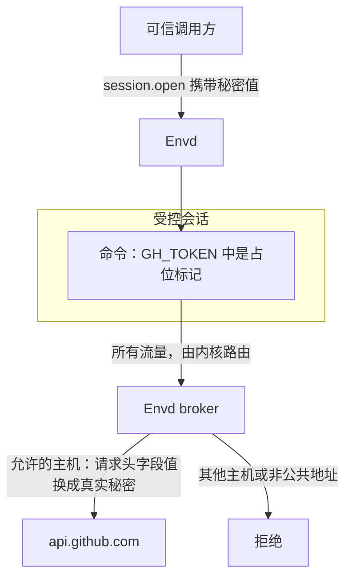

通过 `A13N_ENVD_EGRESS_MODE=controlled`、`--egress-mode controlled`，或存放在工作目录之外的守护进程 JSON 选择受控出站网络：

```json
{
  "full_control": true,
  "default_working_directory": "/workspace",
  "egress": {"mode": "controlled"}
}
```

这会在 Linux 上启用受控会话。以 root 启动守护进程，并提供原生 mount/PID/IPC/network 命名空间权限。Envd 要求 Linux 6.1.2 或更新版本、seccomp、pidfd、挂载树克隆、`/usr/bin/unshare`、`/usr/sbin/ip`、`/usr/sbin/nft`、`/usr/bin/ldd` 和系统 CA bundle。它使用原生账号，而非单 UID 用户命名空间。未设置执行 UID/GID 时，会话保留 root 启动者身份。要以其他预置账号运行，请按[配置](configuration.md#native-identity-and-sudo)显式设置其 UID/GID 和原生 sudoers。Envd 不会假定或创建账号；root 执行也受同一出站网络边界约束。缺少权限或能力会导致启动或会话准备失败，不会回退。

[沙箱镜像](sandbox.md)包含用户态前置工具和 root 启动者，但默认设置为 `egress.mode: inherit`。选择 controlled 模式仍需外层运行时权限，以及每个会话的显式策略；镜像不会自动提权或绕过平台限制。

controlled 模式在接收工作前准备私有管理运行时。每个会话使用独立 worker，且必须显式提供目标策略。省略策略会导致会话创建失败。inherit 和 deny 设备会拒绝会话出站网络策略。Sandbox 授权独立于出站网络模式：受限 worker 只开放授权目录和最小只读系统视图，禁用 Sandbox 则保留原生文件系统访问。

## 创建受控会话

在 `initialize` 之后，向 `session.open.params` 添加 `egress`：

```json
{
  "expected_device_id": "device-example",
  "expected_generation": 123,
  "protocol_version": "0.1",
  "working_directory": "/workspace",
  "egress": {
    "destinations": {"mode": "allowlist", "hosts": ["api.github.com"]},
    "secrets": [
      {
        "env": "GH_TOKEN",
        "value": "<real token supplied by the trusted caller>",
        "inject_hosts": ["api.github.com"]
      }
    ]
  }
}
```

返回的描述符包含修订号和秘密元数据，例如 `{"env":"GH_TOKEN","sentinel":"a13n_7d4e9c2a_GH_TOKEN","inject_hosts":["api.github.com"]}`。它绝不会返回 `value`。通过经过身份验证的 EIP 传输通道提供真实值，不要放入守护进程配置或命令参数。避免记录请求载荷。

命令在 `GH_TOKEN` 中收到占位标记：

```bash
curl https://api.github.com/user -H "Authorization: Bearer $GH_TOKEN"
```

无需设置 `HTTP_PROXY` 或 `HTTPS_PROXY`。内核路由将会话的所有流量送入 Envd broker；该 broker 运行在会话 worker 之外。对于 443 端口上的 HTTPS，broker 只替换请求**头字段值** 中的占位标记，且仅对该秘密的 `inject_hosts` 生效。URL 和请求体保持原样。broker 验证上游 TLS。通过 `SSL_CERT_FILE`、`REQUESTS_CA_BUNDLE`、`CURL_CA_BUNDLE` 和 `NODE_EXTRA_CA_CERTS` 提供包含系统信任和会话 CA 的私有 bundle。使用证书固定或独立信任库的客户端需要显式集成。Envd 不会覆盖原生系统 CA bundle，因此 `update-ca-certificates` 仍可正常运行。



原生 sudo 通常会移除这些环境变量。对于 root HTTPS 命令，请按现有 sudoers 策略保留所需变量，例如：

```bash
sudo --preserve-env=SSL_CERT_FILE,CURL_CA_BUNDLE curl https://api.github.com/
```

也可以配置应用的信任库。Envd 不会悄悄修改 sudoers 或全局信任库。即使客户端 TLS 信任配置有误，目标限制仍然生效。

响应头值、响应体字节和 trailers 中与秘密值完全相同的内容会被脱敏，包括跨块匹配。这是字面值脱敏，无法阻止上游服务故意编码或转换秘密。HTTP 使用 HTTP/1.1；协议升级和压缩响应会被拒绝。请求压缩不会被改写。80 端口上的 HTTP 不注入凭据，并拒绝请求头中带有占位标记的请求。其他 TCP 端口和 UDP 转发允许的流量，不替换秘密。

## 目标策略

| 必填的 `destinations`                             | 行为                                           |
| ------------------------------------------------- | ---------------------------------------------- |
| `{"mode":"public"}`                               | 允许公共 DNS 名称，不允许直接 IP 连接。        |
| `{"mode":"allowlist","hosts":[]}`                 | 拒绝外部访问。                                 |
| `{"mode":"allowlist","hosts":["api.github.com"]}` | 只允许明确列出的 DNS 名称或显式列出的公共 IP。 |

不支持通配符、后缀匹配或 URL 模式。`inject_hosts` 不能为空，在 allowlist 模式下必须是 `hosts` 的子集。public 模式也只允许对 `inject_hosts` 注入凭据。守护进程层不存在第二份目标列表。

broker 拒绝私有、回环、链路本地、元数据及其他非公共上游地址，包括含有任何非公共地址的 DNS 响应。直接 IP 访问始终不允许凭据注入。当前拦截路径在会话内使用 IPv4；DNS 名称可以在上游解析为 IPv4 或 IPv6。载荷发起的原生 IPv6 连接没有外部路由。

会话自身回环命名空间中的本地服务仍可访问。它们并不指向外层沙箱的回环服务。

## 无需重启更新策略

发送 `egress.update`，携带会话选择器及其当前修订号：

```json
{
  "jsonrpc": "2.0",
  "id": 7,
  "eip_session": "session-example",
  "method": "egress.update",
  "params": {
    "expected_revision": 1,
    "destinations": {"mode": "allowlist", "hosts": ["api.github.com", "example.com"]},
    "set_secrets": [
      {"env":"GH_TOKEN","value":"<replacement token>","inject_hosts":["api.github.com"]}
    ],
    "remove_secrets": []
  }
}
```

每次原子更新成功都会递增 `revision`。旧修订号返回 `conflict`；决定如何重试前，通过 `environment.describe` 或 `session.attach` 读取当前元数据。省略的更新字段保持不变。`destinations: {"mode":"allowlist","hosts":[]}` 拒绝外部访问；`destinations: {"mode":"public"}` 恢复公共域名访问。更新不能改变设备的 Sandbox、身份或网络模式。

`set_secrets` 添加或替换绑定。轮换保留原占位标记，因此已在使用 `$GH_TOKEN` 的进程会在下一次 HTTPS 请求中取得新值。`remove_secrets` 删除绑定；删除后重新添加会分配新占位标记。已删除的旧标记出现在拦截请求头中时会被拒绝。拒绝某个主机时，在同一次更新中删除或修改它的秘密注入绑定。

新命令接收当前绑定。运行中的进程保留原环境：添加变量不会将其插入已有进程，删除变量也不会清除其中的旧占位标记。命令不能通过命令环境配置覆盖或移除绑定的秘密和 CA 变量。重试指纹使用原命令请求，因此策略变化不会意外启动重复操作。

## 文件、socket 与生命周期

受控命令和文件操作在同一个原生身份 worker 中运行。设置 `sandbox.mode: disabled` 时，**外层沙箱的原始系统树仍然可写**：授权的 sudo 软件安装、服务用户、权限、ACL、链接器/CA 更新和系统文件修改都会跨会话保留，并对外层沙箱可见。`/tmp`、`/run`、设备与内核视图以及共享内存使用私有挂载；`/tmp` 下的工作目录会重新绑定到原始底层目录。小型不可变管理运行时仅用于 broker 和启动，不替代工作负载镜像。

Envd 隐藏其配置、传输凭据、broker 运行时和启动账号的 `.a13n` 目录。遮蔽在克隆 worker 视图前完成，因此重命名祖先目录不会向后续会话暴露受保护文件。受保护文件存在额外硬链接，或工作目录与受保护路径重叠时，准备会被拒绝。无关凭据应放在工作目录和镜像之外；这不是通用的文件系统保密策略。

禁用 Sandbox 时，默认启用原生 sudo，沿用现有 sudoers。Linux 受限 Sandbox 则移除 capabilities 并阻止提权，包括 UID 0。会话内 Unix socket、socketpair、PTY 和低端口服务可正常使用。命名空间/挂载重配置、raw/packet/VSOCK 网络、网络管理 capabilities、不安全的设备与内核控制，以及 io_uring 绕过均不可用，sudo 后也不例外。这些限制用于保护显式出站网络策略和 broker 凭据，不会让普通系统管理变为只读。Host 仍负责 CPU/内存限制和外层沙箱生命周期。

### 部署前置条件

使用专用、可丢弃的沙箱，不能存在无关的特权服务、执行载荷可写文件的 cron/systemd 作业，或通过共享路径可访问的外部特权/网络代理 socket。否则，worker 命名空间之外的服务可能执行已修改文件，或在网络策略之外转发 socket 请求。不要把 Docker socket、外部 SSH-agent 或数据库代理挂载到共享树中，再假定逐进程出站网络策略可以约束它们。

启动者必须为每次守护进程启动提供可信文件。私有管理快照保护运行中的 broker 不受后续系统树修改影响；它不能让已被修改的沙箱镜像在下次启动时重新可信。按需重新构建或恢复可信启动文件。这不提供整机流量隔离，也不隔离共享可写系统树的彼此敌对会话。

分离连接后，在会话的断线宽限期内保留 worker 和策略。重新附加返回当前策略元数据。关闭、过期、broker 失败或守护进程死亡都会停止受控执行和网络。真实秘密与会话 CA 私钥只保留在 broker 内存中。

每个受控会话创建时，会从设备总预算中预留已配置的会话预算。这种保守分配可能使可接纳的空闲会话数量低于 `max_sessions`；需要时提高对应设备总额。确认 worker 死亡后释放容量。如果无法证明暂存文件已清理，则其预留一直计费到守护进程销毁；重复清理失败不能绕过设备计量。

## 云平台验证记录

以下结果记录于 **2026-09-22** 或之前。五个云平台使用同一个 Linux x86_64 二进制文件和生成的测试凭据。provider 凭据保留在会话之外。这些是在临时沙箱中的 Envd 运行时探测，不代表验证了 provider/Service 出站网络集成或所有厂商镜像。

**这些结果早于 2026-09-22 引入的原生身份和 sudo 变更。** 当前出站网络要求 root 启动者、原生账号和本页开头列出的前置条件。下面旧的非 root 启动结果不能证明当前支持非 root 启动者。只读系统树和拒绝命名 Unix socket 的检查属于旧实现；当前可写系统和原生 socket 行为见[文件、socket 与生命周期](#files-sockets-and-lifetime)。这份云平台矩阵尚未针对该实现重新运行。

### 被测二进制文件的云平台结果

| 平台 / 运行时     | 观测到的内核           | 被测 Envd 启动身份    | 结果与覆盖范围                                                                  |
| ----------------- | ---------------------- | --------------------- | ------------------------------------------------------------------------------- |
| E2B               | `6.1.158+`             | 默认账号，UID 1000    | 完整 HTTPS fixture 和受控会话生命周期通过。                                     |
| Runloop           | `6.18.32`              | 默认账号，UID 1000    | 完整 HTTPS fixture 和受控会话生命周期通过。                                     |
| Vercel Sandbox    | `6.18.49`              | 通过 `sudo` 使用 root | 完整 HTTPS fixture 和受控会话生命周期通过。                                     |
| Daytona           | `6.8.0-138-generic`    | 通过 `sudo` 使用 root | GitHub 请求头 fixture 和受控会话生命周期通过；外部回显站点被阻止。              |
| Modal 默认 gVisor | 报告为 `4.19.0-gvisor` | Root                  | 普通会话/就绪检查、shell 执行和文件读写通过。受控会话创建返回 `unsupported`。   |
| Modal VM Sandbox  | `7.2.6`                | Root                  | 普通 Envd 流程、完整 HTTPS fixture、受控会话生命周期和 VM 内 TCP/UDP 回显通过。 |

**完整 HTTPS fixture** 验证通过替换请求头完成 Basic Auth、对回显响应中的精确秘密值脱敏，以及会话元数据不含真实秘密。**受控会话生命周期** 检查策略热更新、重放、被测版本的文件系统/socket 限制、配额复用，以及 broker 死亡后对已分离 `setsid` 后代进程的清理。探测使用公开 EIP 接口。两个 Modal 运行时还分别运行了普通会话 shell/文件冒烟检查；其他云平台使用受控会话 fixture。

使用 `--local-network-fixture` 时，TCP/UDP 回显在临时特权本地 Linux 容器和 Modal VM 中通过。回显服务运行在外层测试环境内部；这些结果不表示已验证外部互联网 TCP/UDP 互操作。E2B、Runloop、Vercel 和 Daytona 未测试 TCP/UDP 回显。Sprites 及其他未列出的平台不在本次验证范围内。

### Daytona 网络限制

绕过 Envd 直接请求 `httpbin.org`、`httpbingo.org` 和 `example.com` 失败，而 `api.github.com` 仍可访问。这与 Daytona 的[组织套餐网络限制](https://www.daytona.io/docs/en/network-limits/)一致；被测组织的套餐未经独立核实，测试未修改其网络策略。Envd allowlist 无法覆盖外层平台限制。

`--http-host api.github.com` fixture 首先因不支持的 `Accept` 值收到 HTTP 415。将占位标记替换为 `application/json` 后得到 HTTP 200，响应 `Content-Type` 中的同一值也被脱敏。这证明了请求头替换和响应头脱敏，不代表通过了被阻止的 Basic Auth/响应体回显场景。

### 选择 Modal 运行时

默认 gVisor 拒绝被测的受控 `session.open`，返回 `unsupported` 和 `unshare: Operation not permitted`。独立的 `nft list ruleset` 探测返回 `Protocol not supported`。以 root 运行也无法提供缺失能力。

[VM Sandbox 运行时（Beta）](https://modal.com/docs/guide/vm-sandboxes)通过测试。通过 Modal SDK 创建沙箱时选择它：

```python
sandbox = modal.Sandbox.create(
    app=app,
    image=image,
    experimental_options={"vm_runtime": True},
)
```

这个 SDK 设置选择外层运行时；它不是 Envd 配置字段，也不是本次验证向内置 Modal provider 添加的选项。部署新二进制文件或镜像前，准备当前 Envd 的前置条件，并重新运行下方测试。

### 测试准备与限制

测试镜像补装了缺失的网络工具和 CA 证书。临时启动探测使用 Vercel 账号接受的超时值，省略与 Daytona 默认快照不兼容的资源覆盖。Modal 的本地 SDK 客户端需要代理支持依赖，并为宿主 Python 安装显式配置 CA bundle 路径；这些是客户端连接设置，不是载荷代理配置。这些探测调整均未改动生产 provider 代码。

所有临时云沙箱均已终止；原生 provider 实例已核对为不存在，五个 Modal 实例（包括连接诊断尝试）也全部确认停止。新一轮验证应一并记录日期、镜像、运行时、内核、启动身份和 fixture 覆盖范围，包括尚未重测的行为变更。某个镜像或旧 Envd 二进制文件通过，不构成整个平台的支持保证。

## 验证沙箱镜像

1. 安装上述前置条件。
2. 预置执行账号。
3. 以部署使用的 root 启动者运行公开 EIP 集成测试：

```bash
python3 crates/a13n-envd/tests/egress_linux.py /path/to/a13n-envd

# Additional native sudo, package, identity, file and cleanup checks.
# Requires a disposable Debian/Ubuntu sandbox, sudo, ACL tools and UID/GID 1000
# with a test-only NOPASSWD sudoers rule. This test changes the sandbox system.
python3 crates/a13n-envd/tests/execution_linux.py /path/to/a13n-envd --controlled
```

测试使用生成的测试凭据请求 `httpbin.org`。`--http-host httpbingo.org` 可选择其他兼容端点。仅允许必要开发服务的镜像可用 `--http-host api.github.com`，通过 GitHub 媒体类型验证检查请求头替换和响应头脱敏，替代 Basic 身份验证和响应体回显。测试覆盖真实 HTTPS 身份验证、响应脱敏、策略更新、重放、文件系统访问、原生 Unix socket、容量复用和 broker 死亡清理。`--local-network-fixture` 还会在外层测试命名空间创建临时公共地址别名，用于 TCP/UDP 回显检查；仅在可丢弃的特权 Linux 沙箱中使用。
