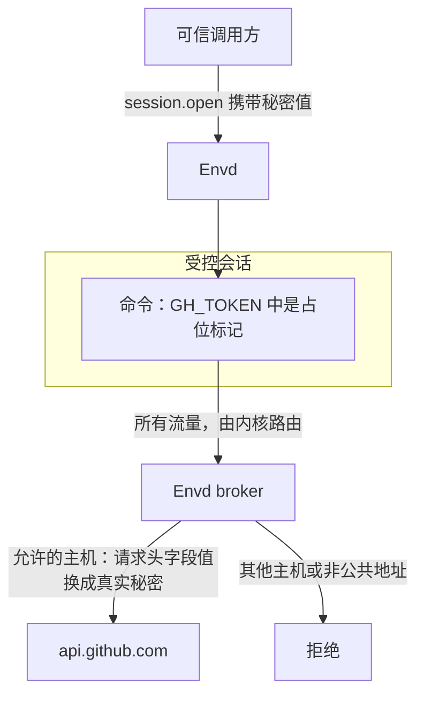

受控出站网络让会话访问获准服务，同时让命令持有凭据占位标记，而非真实秘密。Envd broker 检查访问目标，并向允许的 HTTPS 请求头注入秘密。先准备 Linux 沙箱，再启用 controlled 模式，并为每个会话提供策略。

设置 `A13N_ENVD_EGRESS_MODE=controlled`、传入 `--egress-mode controlled`，或将以下守护进程 JSON 放在工作目录之外：

```json
{
  "full_control": true,
  "default_working_directory": "/workspace",
  "egress": {"mode": "controlled"}
}
```

守护进程需要具有 mount/PID/IPC/network 命名空间权限的 root 启动者。准备 Linux 6.1.2 或更新版本、seccomp、pidfd、挂载树克隆、系统 CA bundle，以及 `/usr/bin/unshare`、`/usr/sbin/ip`、`/usr/sbin/nft`、`/usr/bin/ldd`。缺少这些能力会阻止启动或会话准备。[沙箱镜像](sandbox.md)提供用户态工具和 root 启动者；默认仍为 `egress.mode: inherit`，所需权限由外层运行时授予。

会话使用原生账号。未配置执行 UID/GID 时，会话保留 root 启动者身份。要使用其他账号，先预置账号，再配置[执行身份和 sudo](configuration.md#native-identity-and-sudo)。两种身份都受出站网络边界约束。Sandbox 授权独立配置：`restricted` 开放授权目录和最小只读系统视图；`disabled` 保留原生文件系统访问。

## 创建受控会话

1. 初始化设备连接。
2. 使用初始化返回的设备身份和代际，向 `session.open.params` 添加 `egress`。
3. 通过经过身份验证的 EIP 传输通道发送请求。真实秘密应避开守护进程配置、命令参数和请求日志。

```json
{
  "expected_device_id": "device-example",
  "expected_generation": 123,
  "protocol_version": "0.3",
  "working_directory": "/workspace",
  "egress": {
    "destinations": {"mode": "allowlist", "hosts": ["api.github.com"]},
    "secrets": [
      {
        "env": "GH_TOKEN",
        "value": "<real token supplied by the trusted caller>",
        "inject_hosts": ["api.github.com"]
      }
    ]
  }
}
```

每个受控会话都必须提供显式目标策略。使用 `inherit` 或 `deny` 的设备会拒绝会话出站网络策略。返回的会话描述符包含修订号和秘密元数据，例如 `{"env":"GH_TOKEN","sentinel":"a13n_7d4e9c2a_GH_TOKEN","inject_hosts":["api.github.com"]}`；秘密的 `value` 只可写入。

命令使用 `GH_TOKEN` 中提供的占位标记：

```bash
curl https://api.github.com/user -H "Authorization: Bearer $GH_TOKEN"
```

内核路由将会话流量送入 worker 外部的 broker，客户端无需设置 `HTTP_PROXY` 或 `HTTPS_PROXY`。在 HTTPS 443 端口上，broker 只针对该秘密的 `inject_hosts` 替换请求**头字段值**中的占位标记。URL 和请求体保持原样。broker 验证上游 TLS。


```mermaid
flowchart TB
    Caller["可信调用方"] -->|"session.open 携带秘密值"| Envd["Envd"]
    subgraph Session["受控会话"]
        Command["命令：GH_TOKEN 中是占位标记"]
    end
    Envd --> Command
    Command -->|"所有流量，由内核路由"| Broker["Envd broker"]
    Broker -->|"允许的主机：请求头字段值换成真实秘密"| Upstream["api.github.com"]
    Broker -->|"其他主机或非公共地址"| Refused["拒绝"]

    class Caller app
    class Envd,Broker a13n
    class Upstream ext
    class Refused danger
```

Envd 通过 `SSL_CERT_FILE`、`REQUESTS_CA_BUNDLE`、`CURL_CA_BUNDLE` 和 `NODE_EXTRA_CA_CERTS` 提供包含系统信任与会话 CA 的私有 bundle。使用证书固定或独立信任库的客户端需要显式集成。原生系统 CA bundle 仍可由 `update-ca-certificates` 更新。

sudo 通常会移除这些变量。按现有 sudoers 策略保留 root HTTPS 客户端所需的变量，或配置该客户端的信任库：

```bash
sudo --preserve-env=SSL_CERT_FILE,CURL_CA_BUNDLE curl https://api.github.com/
```

客户端 TLS 信任配置有误时，目标检查仍然生效。Envd 保持 sudoers 和全局信任库不变。

broker 会在响应头、响应体字节和 trailers 中脱敏与秘密值完全相同的内容，包括跨块匹配。编码或转换后的值不在字面值脱敏范围内。支持 HTTP/1.1；协议升级和压缩响应会被拒绝。请求压缩保持原样。HTTP 80 端口拒绝带有占位标记的请求头，也不注入凭据。其他 TCP 端口和 UDP 转发获准流量，不替换秘密。

## 目标策略

为必填的 `destinations` 选择一个值：

| 必填的 `destinations`                             | 行为                                           |
| ------------------------------------------------- | ---------------------------------------------- |
| `{"mode":"public"}`                               | 允许公共 DNS 名称，不允许直接 IP 连接。        |
| `{"mode":"allowlist","hosts":[]}`                 | 拒绝外部访问。                                 |
| `{"mode":"allowlist","hosts":["api.github.com"]}` | 只允许明确列出的 DNS 名称或显式列出的公共 IP。 |

使用精确名称：通配符、后缀匹配和 URL 模式均无效。秘密的 `inject_hosts` 不能为空，使用 allowlist 时还必须是 `hosts` 的子集。public 模式下，`inject_hosts` 仍限制该秘密的发送目标。会话策略就是 Envd 的目标列表；外层平台限制独立生效。

broker 拒绝私有、回环、链路本地、元数据及其他非公共上游地址。DNS 响应只要包含非公共地址就会被拒绝。直接 IP 连接需要显式 allowlist 条目，且始终不会注入凭据。

会话拦截路径使用 IPv4；broker 可以连接 DNS 解析出的 IPv4 或 IPv6 上游地址。命令发起的原生 IPv6 连接没有外部路由。本地服务仍可通过会话自身的回环地址访问，该回环与外层沙箱分离。

## 无需重启更新策略

从会话元数据读取当前修订号，再携带会话选择器发送 `egress.update`。以下示例在一次更新中添加 `example.com` 并轮换 `GH_TOKEN`：

```json
{
  "jsonrpc": "2.0",
  "id": 7,
  "eip_session": "session-example",
  "method": "egress.update",
  "params": {
    "expected_revision": 1,
    "destinations": {"mode": "allowlist", "hosts": ["api.github.com", "example.com"]},
    "set_secrets": [
      {"env":"GH_TOKEN","value":"<replacement token>","inject_hosts":["api.github.com"]}
    ],
    "remove_secrets": []
  }
}
```

更新经过验证后原子发布，再递增 `revision`。若返回 `conflict`，先通过 `environment.describe` 或 `session.attach` 读取当前元数据，再决定新的更新内容。省略的字段保留原值。空 allowlist 拒绝外部访问；public 模式恢复公共域名访问。设备身份、Sandbox 授权和网络模式保持固定。

`set_secrets` 添加或替换绑定。轮换保留占位标记，因此已使用 `$GH_TOKEN` 的进程会在下一次 HTTPS 请求中使用新值。`remove_secrets` 停用绑定；删除后重新添加会创建新标记。拦截请求头包含已停用标记时，请求会被拒绝。移除获准主机时，在同一次更新中删除或修改它的注入绑定。

新命令接收当前绑定。运行中的进程保留原环境：添加绑定不会为它们新增变量，删除绑定也会让旧标记留在其内存中。命令环境设置不能覆盖或移除绑定的秘密或 CA 变量。重试匹配使用原命令请求，因此修改策略不会创建新操作。

## 文件、socket 与生命周期

命令和文件操作共用同一个原生身份 worker。设置 `sandbox.mode: disabled` 时，软件安装、服务账号、权限、ACL、链接器/CA 更新及系统文件修改都作用于外层沙箱的原始可写系统树。这些修改跨会话保留。`/tmp`、`/run`、设备/内核视图和共享内存使用私有挂载；位于 `/tmp` 下的工作目录会重新绑定到原始底层目录。

接收工作前，Envd 为 broker 和启动流程准备不可变的私有运行时。worker 使用原始系统树，其中的 Envd 配置、传输凭据、broker 运行时和启动账号的 `.a13n` 目录已被遮蔽。遮蔽在克隆 worker 前完成，因此重命名祖先目录不会向后续会话暴露这些文件。受保护文件存在额外硬链接，或工作目录与受保护路径重叠时，准备会被拒绝。将无关凭据存放在工作目录和镜像之外。

禁用 Sandbox 时，默认按现有 sudoers 启用原生 sudo。Linux 受限 Sandbox 则移除 capabilities 并阻止提权，包括 UID 0。两者都保留受控出站网络限制：sudo 后仍不能修改命名空间/挂载、使用 raw/packet/VSOCK 网络、网络管理 capabilities、不安全的设备/内核控制或 io_uring 绕过。会话内 Unix socket、socketpair、PTY 和低端口服务可正常使用。Host 提供 CPU/内存限制，并负责外层沙箱的生命周期。

### 部署前置条件

使用专用、可丢弃的沙箱。共享树中应排除无关特权服务、执行载荷可写文件的 cron/systemd 作业，以及外部特权或网络代理 socket。否则，worker 外部的服务可能执行被修改的文件，或转发策略之外的流量。这包括 Docker socket、外部 SSH-agent 和数据库代理。

每次启动守护进程都应提供可信启动文件。管理快照保护运行中的 broker 不受后续系统修改影响；若系统树已被 root 工作负载修改，重启前应恢复或重建可信文件。彼此敌对的会话应使用独立部署。受控出站网络约束 worker 流量，不覆盖共享机器上的所有进程。

分离连接后，worker 和策略保留到断线宽限期结束；重新附加返回当前策略元数据。关闭、过期、broker 失败或守护进程死亡会停止受控执行和网络。真实秘密与会话 CA 私钥保留在 broker 内存中。

每个会话在创建时按配置预算预留设备总额。如果空闲会话在达到 `max_sessions` 前耗尽设备总额，应提高相应总额。确认 worker 死亡后释放容量。如果无法确认暂存文件清理完成，其预留会一直计费到守护进程销毁。

## 验证沙箱镜像

1. 安装上述前置条件，并预置执行账号。
2. 使用可丢弃的沙箱，启动者与部署时的 root 启动者一致。
3. 运行仓库的公开 EIP 集成测试：

```bash
python3 crates/a13n-envd/tests/egress_linux.py /path/to/a13n-envd

# Additional native sudo, package, identity, file and cleanup checks.
# Requires a disposable Debian/Ubuntu sandbox, sudo, ACL tools and UID/GID 1000
# with a test-only NOPASSWD sudoers rule. This test changes the sandbox system.
python3 crates/a13n-envd/tests/execution_linux.py /path/to/a13n-envd --controlled
```

egress fixture 使用生成的测试凭据访问 `httpbin.org`；`--http-host httpbingo.org` 可选择兼容端点。它检查 HTTPS 身份验证、响应脱敏、策略更新、重放、文件系统/socket 行为、容量复用和 broker 死亡清理。若网络只允许开发服务，可用 `--http-host api.github.com` 通过媒体类型验证检查请求头替换和响应头脱敏，替代 Basic Auth/响应体回显检查。

仅在可丢弃的特权 Linux 沙箱中添加 `--local-network-fixture`。它在外层测试命名空间创建临时公共地址别名，用于 TCP/UDP 回显检查。

## 云平台验证记录

这份历史记录涵盖截至 **2026-09-22** 完成的探测，五个云平台使用同一个 Linux x86_64 二进制文件。测试使用生成的凭据；provider 凭据保留在会话之外。

**该矩阵早于 2026-09-22 引入的原生身份和 sudo 变更，尚未针对该实现重新运行。** 当前部署采用上文的 root 启动者要求。旧的非 root 启动、只读系统树检查和命名 socket 拒绝行为描述的是被测二进制文件。当前行为见[文件、socket 与生命周期](#files-sockets-and-lifetime)。记录覆盖这些 Envd 沙箱探测，不代表 Provider/Service 集成验证或整个平台的支持保证。

### 被测二进制文件的云平台结果

| 平台 / 运行时     | 观测到的内核           | 被测 Envd 启动身份    | 结果与覆盖范围                                                                  |
| ----------------- | ---------------------- | --------------------- | ------------------------------------------------------------------------------- |
| E2B               | `6.1.158+`             | 默认账号，UID 1000    | 完整 HTTPS fixture 和受控会话生命周期通过。                                     |
| Runloop           | `6.18.32`              | 默认账号，UID 1000    | 完整 HTTPS fixture 和受控会话生命周期通过。                                     |
| Vercel Sandbox    | `6.18.49`              | 通过 `sudo` 使用 root | 完整 HTTPS fixture 和受控会话生命周期通过。                                     |
| Daytona           | `6.8.0-138-generic`    | 通过 `sudo` 使用 root | GitHub 请求头 fixture 和受控会话生命周期通过；外部回显站点被阻止。              |
| Modal 默认 gVisor | 报告为 `4.19.0-gvisor` | Root                  | 普通会话/就绪检查、shell 执行和文件读写通过。受控会话创建返回 `unsupported`。   |
| Modal VM Sandbox  | `7.2.6`                | Root                  | 普通 Envd 流程、完整 HTTPS fixture、受控会话生命周期和 VM 内 TCP/UDP 回显通过。 |

**完整 HTTPS fixture** 检查替换后的 Basic Auth 请求头、回显响应中精确秘密值的脱敏，以及不含真实秘密的会话元数据。**受控会话生命周期** 检查策略更新、重放、该二进制文件的文件系统/socket 限制、配额复用及 broker 死亡后对已分离 `setsid` 后代进程的清理。两个 Modal 运行时还运行了普通会话 shell/文件冒烟检查；其他平台运行受控 fixture。

通过 `--local-network-fixture`，特权本地 Linux 容器和 Modal VM 的 TCP/UDP 回显通过。回显服务位于外层测试环境内。外部互联网 TCP/UDP，以及 E2B、Runloop、Vercel 和 Daytona 的 TCP/UDP 均未测试。Sprites 和未列出的平台不在本轮验证范围内。

### Daytona 网络限制

绕过 Envd 的直接请求可以访问 `api.github.com`，但访问 `httpbin.org`、`httpbingo.org` 和 `example.com` 失败。Envd allowlist 无法扩大外层平台允许的目标范围。

GitHub fixture 因不支持的 `Accept` 值收到 HTTP 415。将占位标记替换为 `application/json` 后得到 HTTP 200，再从响应 `Content-Type` 中脱敏该值。这验证了请求头替换和响应头脱敏；Basic Auth/响应体回显仍被阻止。

### 选择 Modal 运行时

被测默认 gVisor 运行时拒绝受控 `session.open`，返回 `unsupported` 和 `unshare: Operation not permitted`；独立执行 `nft list ruleset` 返回 `Protocol not supported`。root 启动也未提供缺失能力。

被测 VM Sandbox 运行时通过测试，使用了以下 Modal SDK 选择：

```python
sandbox = modal.Sandbox.create(
    app=app,
    image=image,
    experimental_options={"vm_runtime": True},
)
```

这个 SDK 设置选择外层运行时。它既不是 Envd 字段，也不是新增的内置 Modal Provider 选项。使用新镜像或二进制文件时，准备当前前置条件，并重新运行[镜像验证](#verify-a-sandbox-image)。

### 测试准备与限制

探测补装了缺失的网络工具和 CA 证书。Vercel 使用账号接受的超时值；Daytona 省略了与默认快照不兼容的资源覆盖。Modal 的宿主 Python 客户端使用代理支持依赖和显式 CA bundle。这些是测试准备调整，生产 Provider 代码保持不变。

所有临时沙箱均已终止。原生 Provider 实例已核对为不存在，五个 Modal 实例（包括诊断尝试）也已确认停止。重复验证时，一并记录日期、镜像、运行时、内核、启动身份和 fixture 覆盖范围，包括仍待测试的行为变更。
