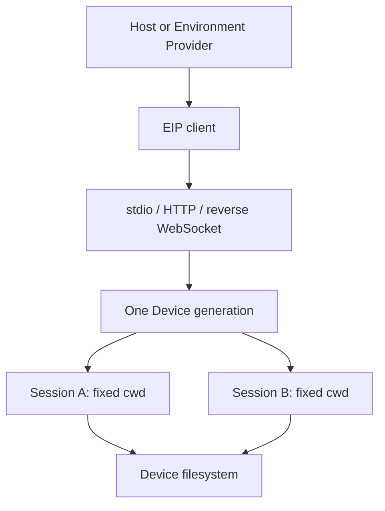

Envd (`a13n-envd`) serves the **Environment Interaction Protocol (EIP)** over stdio, HTTP(S), or an outbound reverse WebSocket connection.

Connect Agents through [Harness Environment Providers](../environments/index.md), or use the [Python EIP client](python-client.md) directly.

## Choose your path

| Situation                                                  | Start here                                                                          |
| ---------------------------------------------------------- | ----------------------------------------------------------------------------------- |
| Using Harness UI                                           | [Harness UI execution permissions](../a13n-harness-ui/environments-and-projects.md) |
| Trying a local EIP Environment without a model             | [Local Envd example](#try-local-envd)                                               |
| Installing a matching native executable                    | [Installation](installation.md)                                                     |
| Running an agent development container                     | [Sandbox image](sandbox.md)                                                         |
| Operating your own daemon or EIP transport                 | [Configuration and transports](configuration.md)                                    |
| Viewing and controlling a shared desktop                   | [Desktop computer use](computer-use.md)                                             |
| Restricting command destinations and injecting credentials | [Session egress](egress.md)                                                         |
| Diagnosing access or missing methods                       | [Execution boundaries and troubleshooting](isolation.md)                            |
| Connecting through an Environment Provider                 | [Remote Envd](../environments/remote-envd.md)                                       |
| Implementing an EIP client or Provider                     | [Python EIP client](python-client.md)                                               |
| Managing Sessions, retained output, and uncertain results  | [Sessions and output](operations.md)                                                |

## What it provides

- Read, write, search, and transfer files.
- Run commands, send input, read output, and stop processes.
- Inspect ports and wait for them to open.
- Optionally observe and control a shared desktop ([computer use](computer-use.md)).
- Check operation results, cancel work, and inspect failures.
- Discover available operations for each platform and configuration.



One daemon serves a Device and multiple independent Sessions. Each Session owns its operations, processes, retained output, transfers and evidence. Working directory is a default, not an access boundary. Mutually untrusted workloads need separate Host-enforced outer boundaries; EIP Sessions do not isolate workloads from each other.

## Try Local Envd

The repository's [Environment Provider example](../environments/examples.md#local-envd) exercises file operations through a private Envd Device without a model, cloud account, or server. From the repository root:

```bash
cargo build --locked --package a13n-envd
cd examples/environment-provider
uv sync --locked
uv run environment-provider-example local_envd \
  --executable ../../target/debug/a13n-envd
```

The example creates its own working directory, starts a private daemon over stdio, creates one Session for its adapter, and verifies that closing the adapter preserves that directory. The example's `LocalEnvdProviderRuntime` then closes the daemon. For Agent integration, supply a **fresh** Local Envd adapter to Harness with `DynamicEnvironmentCapability`; [Harness integration](../a13n-harness/environments.md) shows that boundary. A Host can reuse its `LocalEnvdProviderRuntime` across adapters, but each adapter opens an independent Session.

Configure `LocalEnvdLaunchConfiguration` on that runtime when you need execution identity, Sandbox grants, egress mode, executable roots, shell profiles, or limits. Envd manages Session workers; the Host owns outer container or VM isolation. See [execution boundaries](isolation.md) and [Session credential references](../environments/remote-envd.md#session-egress-and-credential-references).

## Lifecycle and ownership

Device discovery opens no Session. Session preparation checks fixed cwd, required methods and readiness. Cancellation or failure of one adapter cannot close a healthy shared Device. See [daemon lifecycle](configuration.md#lifecycle-and-ownership).

## Reference topics

| Topic                                                                               | Guide                                                                                 |
| ----------------------------------------------------------------------------------- | ------------------------------------------------------------------------------------- |
| <span id="build-the-matching-binary"></span>Build the matching binary               | [Build the matching binary](installation.md#build-the-matching-binary)                |
| <span id="install-a-published-binary"></span>Install a published binary             | [Install a published binary](installation.md#install-a-published-binary)              |
| <span id="isolation-behavior"></span>Isolation behavior                             | [Isolation behavior](isolation.md#isolation-behavior)                                 |
| <span id="minimal-standalone-configuration"></span>Minimal standalone configuration | [Minimal standalone configuration](configuration.md#minimal-standalone-configuration) |
| <span id="enable-commands"></span>Enable commands                                   | [Enable commands](configuration.md#enable-commands)                                   |
| <span id="carrier-profiles"></span>Carrier profiles                                 | [Carrier profiles](configuration.md#carrier-profiles)                                 |
| <span id="validate-from-this-repository"></span>Validate from this repository       | [Validate from this repository](isolation.md#validate-from-this-repository)           |
| <span id="troubleshooting"></span>Troubleshooting                                   | [Troubleshooting](isolation.md#troubleshooting)                                       |
| <span id="references"></span>References                                             | [References](isolation.md#references)                                                 |
