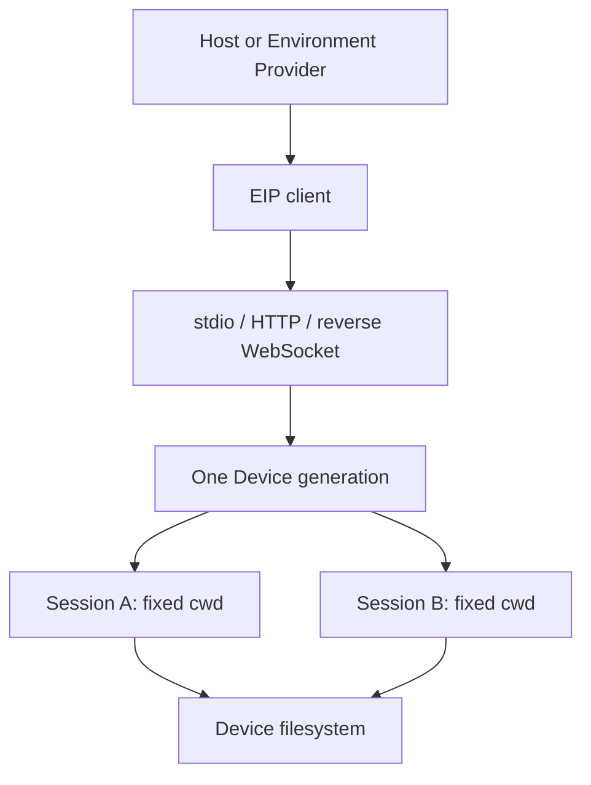

# Envd

Envd (`a13n-envd`) is the native daemon for the **Environment Interaction Protocol (EIP)**. It exposes Device files, commands, process observations, output, and ports over stdio, HTTP(S), or an outbound reverse WebSocket connection.

It does not run an Agent, store conversations, or provide a browser API. Use [Harness](../a13n-harness/index.md) for Agent execution and [Environments](../environments/index.md) for the Python Provider interface.

## Choose your path

| Situation                                                 | Start here                                                                          |
| --------------------------------------------------------- | ----------------------------------------------------------------------------------- |
| Using the terminal product                                | [Harness UI execution permissions](../a13n-harness-ui/environments-and-projects.md) |
| Embedding an Agent with local EIP                         | [Local Envd Provider example](#recommended-harness-path)                            |
| Installing a matching native executable                   | [Installation](installation.md)                                                     |
| Running an Agent development container                    | [Sandbox image](sandbox.md)                                                         |
| Operating your own daemon or EIP transport                | [Configuration and transports](configuration.md)                                    |
| Diagnosing access or missing methods                      | [Outer security and troubleshooting](isolation.md)                                  |
| Connecting through an Environment Provider                | [Remote Envd](../environments/remote-envd.md)                                       |
| Implementing an EIP client or Provider                    | [Python EIP client](python-client.md)                                               |
| Managing sessions, retained output, and uncertain results | [Sessions and output](operations.md)                                                |

## What it provides

- Typed, bounded file operations and binary transfer.
- Command and process lifecycle with explicit output observations and cleanup evidence.
- Correlated requests, cancellation, operation receipts, typed failures, and readiness.
- Exact advertised method availability based on configuration and platform support.



One daemon serves a Device and multiple independent Sessions. Each Session owns its operations, processes, retained output, transfers and evidence. Working directory is a default, not an access boundary. Mutually untrusted workloads need separate Host-enforced outer boundaries; EIP Sessions are not tenant isolation.

## Recommended Harness path

Resolve the built-in Local Envd Provider, construct one fresh Environment, and pass that adapter to a Harness Run:

```python
from a13n_harness.providers.environment.builtins import select_builtin_environment_providers
from a13n_harness.providers.environment.local_envd.runtime import (
    LocalEnvdProviderRuntime,
    TemporaryLocalEnvdRuntimeAllocator,
    resolve_a13n_envd_executable,
)

(local_envd,) = select_builtin_environment_providers(("local_envd",))
async with LocalEnvdProviderRuntime(
    executable=resolve_a13n_envd_executable(),
    allocate_private_runtime=TemporaryLocalEnvdRuntimeAllocator(),
) as runtime:
    environment = await local_envd.create(
        {"working_directory": "/work/project"},
        environment_id="local-project",
        runtime=runtime,
    )
    result = await executable.run("Inspect the workspace", environment=environment)
```

The Host runtime lazily launches one daemon and shares its Device connection. Every adapter opens an independent Session. Harness close ends that Session, not the daemon; Host runtime close shuts down the owned daemon and removes only its private runtime. Create a fresh adapter for each independent Run, but reuse the compatible Host runtime.

The example selects an existing Device directory and enables file operations. Configure `LocalEnvdLaunchConfiguration` on the runtime for executable roots, shell profiles and limits. The Host must supply any outer sandbox; the Provider does not construct per-command isolation.

## Lifecycle and ownership

Device discovery opens no Session. Session preparation checks fixed cwd, required methods and readiness. Cancellation or failure of one adapter cannot close a healthy shared Device. See [daemon lifecycle](configuration.md#lifecycle-and-ownership).

## Reference topics

| Topic                                                                               | Guide                                                                                 |
| ----------------------------------------------------------------------------------- | ------------------------------------------------------------------------------------- |
| <span id="build-the-matching-binary"></span>Build the matching binary               | [Build the matching binary](installation.md#build-the-matching-binary)                |
| <span id="install-a-published-binary"></span>Install a published binary             | [Install a published binary](installation.md#install-a-published-binary)              |
| <span id="isolation-behavior"></span>Isolation behavior                             | [Isolation behavior](isolation.md#isolation-behavior)                                 |
| <span id="minimal-standalone-configuration"></span>Minimal standalone configuration | [Minimal standalone configuration](configuration.md#minimal-standalone-configuration) |
| <span id="enable-commands"></span>Enable commands                                   | [Enable commands](configuration.md#enable-commands)                                   |
| <span id="carrier-profiles"></span>Carrier profiles                                 | [Carrier profiles](configuration.md#carrier-profiles)                                 |
| <span id="validate-from-this-repository"></span>Validate from this repository       | [Validate from this repository](isolation.md#validate-from-this-repository)           |
| <span id="troubleshooting"></span>Troubleshooting                                   | [Troubleshooting](isolation.md#troubleshooting)                                       |
| <span id="references"></span>References                                             | [References](isolation.md#references)                                                 |
