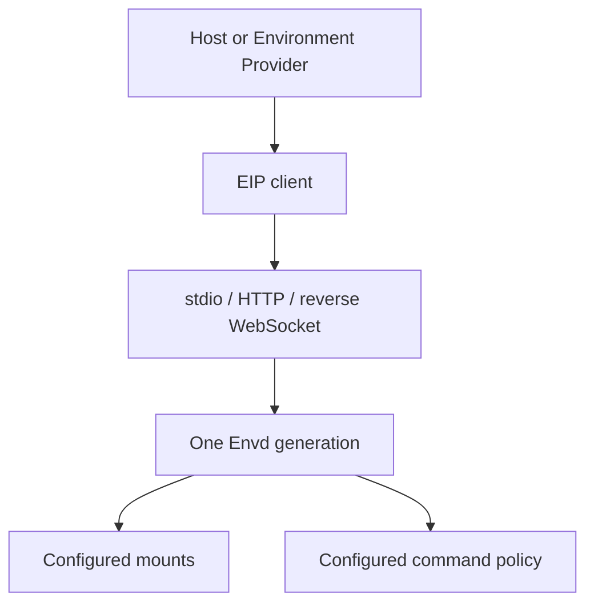

# Envd

Envd (`a13n-envd`) is the native daemon for the **Environment Interaction Protocol (EIP)**. It exposes configured files, commands, process observations, output, and ports over stdio, HTTP(S), or an outbound reverse WebSocket connection.

It does not run an Agent, store conversations, or provide a browser API. Use [Harness](../a13n-harness/index.md) for Agent execution and [Environment](../a13n-environment/index.md) for the Python Provider interface.

## Choose your path

| Situation                                                 | Start here                                                                          |
| --------------------------------------------------------- | ----------------------------------------------------------------------------------- |
| Using the terminal product                                | [Harness UI execution permissions](../a13n-harness-ui/environments-and-projects.md) |
| Embedding an Agent with local isolation                   | [Local Envd Provider example](#recommended-harness-path)                            |
| Installing a matching native executable                   | [Installation](installation.md)                                                     |
| Operating your own daemon or EIP transport                | [Configuration and transports](configuration.md)                                    |
| Diagnosing isolation or missing methods                   | [Isolation and troubleshooting](isolation.md)                                       |
| Connecting through an Environment Provider                | [Remote Envd](../a13n-environment/remote-envd.md)                                   |
| Implementing an EIP client or Provider                    | [Python EIP client](python-client.md)                                               |
| Managing sessions, retained output, and uncertain results | [Sessions and output](operations.md)                                                |

## What it provides

- Typed, bounded file operations and binary transfer.
- Command and process lifecycle with explicit output observations and containment evidence.
- Correlated requests, cancellation, operation receipts, typed failures, and readiness.
- Exact advertised method availability based on configuration and platform support.



One daemon serves one configured Environment identity and admits at most one active initialized session. Independent or mutually untrusted sessions need separate daemon generations and runtime resources; EIP sessions are not tenant isolation.

## Recommended Harness path

Resolve the built-in Local Envd Provider, construct one fresh Environment, and pass that adapter to a Harness Run:

```python
from pathlib import Path

from a13n_harness.providers.environment import (
    LocalEnvdProviderRuntime,
    TemporaryLocalEnvdRuntimeAllocator,
    build_environment_provider_catalog,
    resolve_a13n_envd_executable,
)

catalog = build_environment_provider_catalog(
    builtin_keys=("a13n.local-envd",),
)
provider = catalog.require("a13n.local-envd")
configuration = provider.validate_configuration(
    schema_version="1",
    value={
        "workspace": {"path": str(Path("./workspace").resolve())},
        "execution_network": "deny",
    },
)
environment = provider.create_environment(
    configuration=configuration,
    environment_id="sandbox",
    state=None,
    runtime=LocalEnvdProviderRuntime(
        executable=resolve_a13n_envd_executable(),
        allocate_private_runtime=TemporaryLocalEnvdRuntimeAllocator(),
    ),
)

result = await executable.run(
    "Inspect the workspace",
    environment=environment,
)
```

Each Local Envd adapter owns one daemon generation, one private runtime allocation, one reusable stdio carrier, and one EIP session while entered. Harness close stops the daemon and removes only its private runtime, not the selected workspace. Construct another fresh adapter for every independent Run.

## Lifecycle and ownership

The Provider owns executable selection, private-runtime allocation, session admission, and cleanup. Daemon readiness is established through EIP and the production isolation probe, not an HTTP `/healthz` endpoint. See [daemon lifecycle](configuration.md#lifecycle-and-ownership).

## Reference topics

| Topic                                                                               | Guide                                                                                 |
| ----------------------------------------------------------------------------------- | ------------------------------------------------------------------------------------- |
| <span id="build-the-matching-binary"></span>Build the matching binary               | [Build the matching binary](installation.md#build-the-matching-binary)                |
| <span id="install-a-published-binary"></span>Install a published binary             | [Install a published binary](installation.md#install-a-published-binary)              |
| <span id="isolation-behavior"></span>Isolation behavior                             | [Isolation behavior](isolation.md#isolation-behavior)                                 |
| <span id="minimal-standalone-configuration"></span>Minimal standalone configuration | [Minimal standalone configuration](configuration.md#minimal-standalone-configuration) |
| <span id="enable-commands"></span>Enable commands                                   | [Enable commands](configuration.md#enable-commands)                                   |
| <span id="carrier-profiles"></span>Carrier profiles                                 | [Carrier profiles](configuration.md#carrier-profiles)                                 |
| <span id="validate-from-this-repository"></span>Validate from this repository       | [Validate from this repository](isolation.md#validate-from-this-repository)           |
| <span id="troubleshooting"></span>Troubleshooting                                   | [Troubleshooting](isolation.md#troubleshooting)                                       |
| <span id="references"></span>References                                             | [References](isolation.md#references)                                                 |
