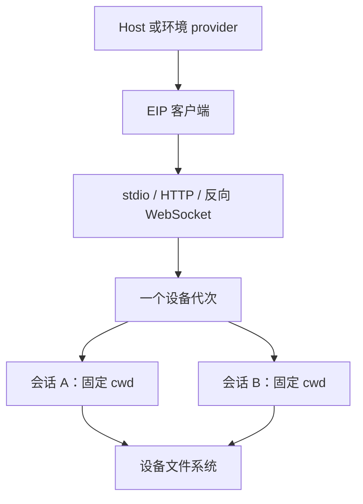

Envd（`a13n-envd`）通过 stdio、HTTP(S) 或向外建立的反向 WebSocket 连接提供**环境交互协议（EIP）**。

通过 [Harness 环境 provider](../environments/index.md) 连接 agent，也可以直接使用 [Python EIP 客户端](python-client.md)。

## 选择使用方式

| 使用场景                             | 从这里开始                                                             |
| ------------------------------------ | ---------------------------------------------------------------------- |
| 使用终端产品                         | [Harness UI 执行权限](../a13n-harness-ui/environments-and-projects.md) |
| 不连接模型，试用本地 EIP 环境        | [Local Envd 示例](#try-local-envd)                                     |
| 安装版本匹配的原生可执行文件         | [安装](installation.md)                                                |
| 运行 agent 开发容器                  | [沙箱镜像](sandbox.md)                                                 |
| 运维自己的守护进程或 EIP 传输        | [配置与传输](configuration.md)                                         |
| 排查访问问题或缺失的方法             | [外层安全边界与故障排查](isolation.md)                                 |
| 通过环境 provider 连接               | [Remote Envd](../environments/remote-envd.md)                          |
| 实现 EIP 客户端或 provider           | [Python EIP 客户端](python-client.md)                                  |
| 管理会话、保留输出和结果不确定的操作 | [会话与输出](operations.md)                                            |

## 提供的功能

- 读取、写入、搜索和传输文件。
- 运行命令、发送输入、读取输出和停止进程。
- 检查操作结果、取消工作和查看错误。
- 查询不同平台与配置下可用的操作。



一个守护进程服务于一个设备（Device）和多个独立会话（Session）。每个会话分别管理自己的操作、进程、保留输出、传输和执行证据。工作目录是默认值，不是访问边界。彼此不信任的工作负载需要由宿主（Host）提供独立的外层边界；EIP 会话不提供租户隔离。

## 试用 Local Envd

仓库中的[环境 provider 示例](../environments/examples.md#local-envd)通过私有 Envd 设备执行文件操作，无需模型、云账号或服务器。在仓库根目录运行：

```bash
cargo build --locked --package a13n-envd
cd examples/environment-provider
uv sync --locked
uv run environment-provider-example local_envd \
  --executable ../../target/debug/a13n-envd
```

示例自行管理工作空间，通过 stdio 启动私有守护进程，为适配器创建一个会话，并验证关闭适配器后工作空间仍然保留。随后由 Host 运行时关闭守护进程。接入 agent 时，通过 `DynamicEnvironmentCapability` 向 Harness 提供一个**新建的** Local Envd 适配器；[Harness 集成](../a13n-harness/environments.md)介绍了这条边界。Host 可以在多个适配器之间复用 `LocalEnvdProviderRuntime`，但每个适配器都会打开独立会话。

需要设置执行身份、Sandbox 目录授权、出站网络模式、可执行文件根目录、shell 配置或限制时，在运行时上配置 `LocalEnvdLaunchConfiguration`。Envd 管理会话 worker；Host 管理外层容器或虚拟机隔离。参见[执行边界](isolation.md)和[会话凭据引用](../environments/remote-envd.md#session-egress-and-credential-references)。

## 生命周期与归属

设备发现不会打开会话。会话准备会检查固定的 cwd、必需方法和就绪状态。单个适配器的取消或失败不能关闭健康的共享设备。参见[守护进程生命周期](configuration.md#lifecycle-and-ownership)。

## 参考主题

| 主题                                                                  | 指南                                                                    |
| --------------------------------------------------------------------- | ----------------------------------------------------------------------- |
| <span id="build-the-matching-binary"></span>构建匹配版本的二进制文件  | [构建匹配版本的二进制文件](installation.md#build-the-matching-binary)   |
| <span id="install-a-published-binary"></span>安装已发布的二进制文件   | [安装已发布的二进制文件](installation.md#install-a-published-binary)    |
| <span id="isolation-behavior"></span>隔离行为                         | [隔离行为](isolation.md#isolation-behavior)                             |
| <span id="minimal-standalone-configuration"></span>独立运行的最小配置 | [独立运行的最小配置](configuration.md#minimal-standalone-configuration) |
| <span id="enable-commands"></span>启用命令                            | [启用命令](configuration.md#enable-commands)                            |
| <span id="carrier-profiles"></span>传输通道配置                       | [传输通道配置](configuration.md#carrier-profiles)                       |
| <span id="validate-from-this-repository"></span>在本仓库中验证        | [在本仓库中验证](isolation.md#validate-from-this-repository)            |
| <span id="troubleshooting"></span>故障排查                            | [故障排查](isolation.md#troubleshooting)                                |
| <span id="references"></span>参考资料                                 | [参考资料](isolation.md#references)                                     |
