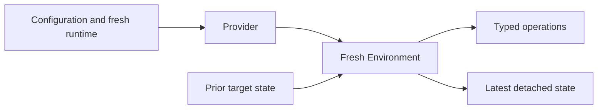

# Environment

Environment (`a13n-environment`) is a Python library for portable files, commands, processes, output, and port observations. Use it directly in automation or supply a fresh adapter to Harness. It does not require an Agent, model credentials, or a hosted service.

## Start here

| Task                                                  | Guide                                                  |
| ----------------------------------------------------- | ------------------------------------------------------ |
| Read and write a file with no network dependencies    | [Getting started](getting-started.md)                  |
| Choose local, sandbox, container, or remote execution | [Choose a backend](../environments/index.md)           |
| Understand close, state, re-entry, and destruction    | [Lifecycle and state](lifecycle.md)                    |
| Configure built-ins or implement a Provider           | [Providers](providers.md)                              |
| Understand paths, search patterns, and output limits  | [Operations](operations.md)                            |
| Run a complete built-in lifecycle                     | [Runnable examples](examples.md)                       |
| Connect HTTP or reverse WebSocket Envd                | [Remote Envd](remote-envd.md)                          |
| Expose Environment tools to an Agent                  | [Harness integration](../a13n-harness/environments.md) |

## Three concepts

- **Provider:** validates configuration and constructs adapters without target I/O.
- **Environment:** one single-use adapter that prepares a target, exposes operations, and closes local resources.
- **EnvironmentState:** portable Provider-owned target evidence, supplied to a later fresh adapter.

`close()` is non-destructive; explicit `destroy()` is a separate Host decision. Some Providers, including Direct Local, have no portable target state and do not own target destruction. A root directory, target ID, or successful connection is not proof of isolation.

## Package boundary

Environment owns the single-target operation and Provider contracts. Harness owns multi-mount routing and model-facing tools. Envd serves EIP operations. Your Host owns credentials, target selection, durable state, and retention.

These guides track `main`; the [source quickstart](getting-started.md) uses the locked workspace. Published Environment and Harness packages share one release version.

## Reference topics

| Topic                                                                                       | Guide                                                                                     |
| ------------------------------------------------------------------------------------------- | ----------------------------------------------------------------------------------------- |
| Lifecycle at a glance                               | [Lifecycle at a glance](lifecycle.md#lifecycle-at-a-glance)                               |
| Resolve and construct an Environment | [Resolve and construct an Environment](lifecycle.md#resolve-and-construct-an-environment) |
| Re-enter a stateful target                     | [Re-enter a stateful target](lifecycle.md#re-enter-a-stateful-target)                     |
| Explicit destruction                                 | [Explicit destruction](lifecycle.md#explicit-destruction)                                 |
| Provider catalog and plugins                 | [Provider catalog and plugins](providers.md#provider-catalog-and-plugins)                 |
| Built-in Providers                                     | [Built-in Providers](providers.md#built-in-providers)                                     |
| Local Envd runtime                                     | [Local Envd runtime](providers.md#local-envd-runtime)                                     |
| Docker runtime                                             | [Docker runtime](providers.md#docker-runtime)                                             |
| Environment operations and tools         | [Environment operations and tools](operations.md#environment-operations-and-tools)        |
| E2B runtime                                                   | [E2B runtime](providers.md#e2b-runtime)                                                   |
| File search patterns                                 | [File search patterns](operations.md#file-search-patterns)                                |
