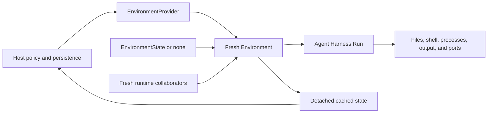

# Lifecycle and state

Use this guide when embedding an Environment in a Host that retains work between Runs. A Provider creates adapters; an adapter connects to one target; state lets a later adapter identify that target. None is a durable worker lease.

For a first file operation without an Agent, start with [Getting started](getting-started.md).

## Lifecycle at a glance



A normal Run follows this sequence:

1. The Host resolves an allowlisted Provider.
2. The Provider validates credential-free desired configuration.
3. The Host loads the latest authoritative `EnvironmentState` and creates fresh runtime collaborators.
4. The Provider constructs one fresh adapter without external I/O.
5. The Host prepares eagerly, or lets the first operation prepare lazily. Harness binds the local scope, uses operations, exports cached state, and closes it.
6. The Host persists the latest state and applies retention policy separately.

`close()` releases process-local clients, sessions, daemons, temporary output, and admission owned by that adapter. It is idempotent and non-destructive. Harness never calls `destroy()`.

When retention policy selects removal, the Host constructs a different fresh adapter from the exact current state and calls `destroy()` explicitly. Successful destruction clears that adapter's cached state. A failed or unknown outcome preserves the last validated state for inspection or retry.

## Resolve and construct an Environment

A persisted `EnvironmentProviderSpec` contains only a provider key, exact configuration schema version, and credential-free JSON configuration:

```python
from a13n_environment import (
    EnvironmentProviderSpec,
    build_environment_provider_catalog,
)

spec = EnvironmentProviderSpec(
    provider_key="direct-local",
    schema_version="1",
    configuration={
        "root": {"path": "/srv/agent-workspaces/current"},
    },
)

catalog = build_environment_provider_catalog(
    builtin_keys=("direct-local",),
)
provider = catalog.require(spec.provider_key)
configuration = provider.validate_configuration(
    schema_version=spec.schema_version,
    value=spec.configuration,
)
environment = provider.create_environment(
    configuration=configuration,
    environment_id="workspace",
    state=None,
)
```

Provider construction, `validate_configuration()`, and `create_environment()` are inert. `enter()` also performs no target I/O. `prepare()` creates, resumes or connects the target; `ensure_ready()` triggers it on first use when preparation is lazy.

Pass the fresh adapter to Harness:

```python
result = await executable.run(
    "Inspect the workspace",
    environment=environment,
)
```

Harness enters and closes the adapter exactly once. Construct another adapter for every independent Run, even when several Runs target the same workspace, container, VM, or remote sandbox.

## Re-enter a stateful target

The Host supplies state before entry:

```python
current_state = await state_store.load(environment_key)
environment = provider.create_environment(
    configuration=configuration,
    environment_id="workspace",
    state=current_state,
    runtime=fresh_runtime,
)

try:
    result = await executable.run(
        "Continue the task",
        environment=environment,
        previous_state=previous_harness_state,
    )
finally:
    await state_store.publish(environment_key, environment.dump_state())
```

`dump_state()` is synchronous and performs no target I/O. It returns a detached deep copy of the latest validated cached state, so caller mutation cannot alter the adapter's cache. Providers update that cache as soon as changed target identity is known, before later readiness work that might fail.

State is a soft reference, not proof that a target still exists. Construction validates its codec and compatibility; during preparation, the Provider inspects the exact target selected by that validated state. Merely entering the adapter does not perform that inspection. It may create a replacement only after authoritative absence and according to that Provider's contract. It never treats an incompatible target, ambiguous discovery, unavailable control plane, or unknown mutation outcome as absence.

`EnvironmentState` contains no bearer credential, live client, task, process-local handle, Harness mount policy, or destruction authority. Storage, authorization, retention, scheduling, and selection of the authoritative version remain Host responsibilities.

## Explicit destruction

Destroy requires a fresh, not-yet-entered adapter:

```python
cleanup = provider.create_environment(
    configuration=configuration,
    environment_id="workspace",
    state=current_state,
    runtime=fresh_runtime,
)
try:
    await cleanup.destroy()
finally:
    await state_store.publish(environment_key, cleanup.dump_state())
    await cleanup.close()
```

The Provider removes only the exact backing target and provider-owned bootstrap material represented by validated state. Shared Host directories, Docker bind sources, and external named volumes remain externally owned.

Do not use context exit, Harness completion, suspension, or cancellation as an implicit destruction signal. Those paths close process-local resources only.

## Readiness, recovery, and maintenance

| Operation                                   | What it does                                                                                                 |
| ------------------------------------------- | ------------------------------------------------------------------------------------------------------------ |
| `enter()` / `async with`                    | Bind the one-use scope; no target preparation                                                                |
| `prepare()`                                 | Create, resume, or connect according to current validated state; requires entry                              |
| `check_ready(operations)`                   | Check an entered connection without provisioning or recovery                                                 |
| `ensure_ready(operations)`                  | Prepare on first use, check required families, and perform only Provider-supported recovery                  |
| `recover()`                                 | Explicitly authorized in-scope recovery where supported; not generic mutation replay                         |
| `reconcile()`                               | Observe an abandoned preparation as running/stopped/absent without creating, starting, or replacing a target |
| `stop()`                                    | Resumable target stop where supported; distinct from close and destroy                                       |
| `keepalive(deadline=..., operation_id=...)` | Refresh retention for a supported target under Host maintenance ownership                                    |
| `dump_state()`                              | Detached cached state, with no target I/O                                                                    |
| `close()`                                   | Idempotent local-resource cleanup                                                                            |
| `destroy()`                                 | Remove the exact owned target through a fresh, unentered adapter                                             |

A supported readiness recovery can report `environment_connection_refreshed` or `environment_rebuilt` rather than silently continuing the originally requested operation. Same-target reconnection and replacement of a lost generation have different consequences. Recheck process observations and temporary files before continuing. Remote Envd preparation failures require fresh adapters rather than assumed in-scope recovery.

Provider capability declarations tell a Host which maintenance paths it may select:

| Built-in Provider            | Managed selection    | Resumable stop | Destroy | Keepalive required |
| ---------------------------- | -------------------- | -------------- | ------- | ------------------ |
| Direct Local                 | Yes, stateless       | No             | No      | No                 |
| Local Envd                   | Yes, stateless       | No             | No      | No                 |
| Docker                       | Yes                  | Yes            | Yes     | No                 |
| E2B                          | Yes                  | Yes            | Yes     | Yes                |
| Remote HTTP / WebSocket Envd | No, externally owned | No             | No      | No                 |

Managed selection does not mean every Provider creates storage or owns the Host directory. Unsupported base methods are not usable merely because they appear on the abstract interface. Schedule keepalive from the Provider's `keepalive_horizon` and actual target policy; do not treat the base default as a universal cloud TTL.

## Handle typed failures

Configuration, catalog, lifecycle, and backend failures use `EnvironmentProviderError`. Operation failures use `EnvironmentError`. They are not interchangeable with a model-tool error envelope.

A Provider error has a stable code, category, certainty, recovery hint, bounded context, and richer local description/details. Categories are `invalid`, `unsupported`, `missing`, `denied`, `conflict`, `unavailable`, `timeout`, `unknown_outcome`, `cleanup`, and `provider_failure`.

| Evidence                    | Host response                                                                                   |
| --------------------------- | ----------------------------------------------------------------------------------------------- |
| Certainty `not_dispatched`  | No dispatch occurred; fix the stated input/runtime condition before deciding on another attempt |
| Certainty `known`           | Use the known outcome; do not infer that every known error is retryable                         |
| Certainty `unknown`         | Reconcile the original operation/target before any possible replay                              |
| Hint `fix_input`            | Correct validated configuration or request data                                                 |
| Hint `refresh_runtime`      | Reconstruct current authorized runtime collaborators                                            |
| Hint `retry_same_operation` | Preserve the owning operation identity and its retry contract                                   |
| Hint `reconcile`            | Inspect durable Provider/Host evidence                                                          |
| Hint `none`                 | No automatic recovery recommendation                                                            |

Use `error.safe_projection()` for public presentation. It retains bounded correlation and a safe category message, excluding the rich local description/details. Keep local diagnostic access appropriate to the Host; blindly serializing the exception is not equivalent to the safe projection.

Always publish the latest validated cached state according to Host policy, including after failed readiness or unknown cleanup. Never convert control-plane unavailability into target absence, replace a target to hide incompatible state, or call `destroy()` as generic error handling.

## Host checklist

- Construct one fresh adapter per independent Run, including resumed Runs.
- Persist the latest detached state after success or failure; publishing it remains a Host policy decision.
- Treat an unavailable control plane or unknown mutation outcome as uncertainty, not target absence.
- Close local resources independently of retention. Destroy only an exact validated target through a fresh adapter.
- Keep credentials, authorization, and live clients out of both Environment and Harness continuation data.
