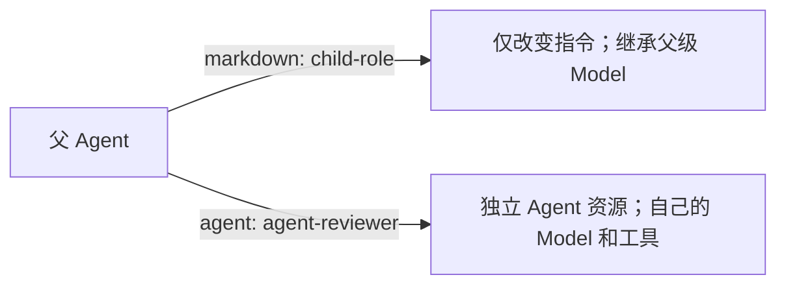

**Agent** 是可复用的 YAML 配置，选择 Model、指令、工具、扩展和子角色清单。**Markdown subagent** 是继承父级 Model 的轻量子角色。子级需要独立配置时，也可引用已有 Agent。

根据子级需要改变的内容选择形式：



两种形式都通过 Harness 执行，不会启动独立守护进程。

| 我想要…               | 参考                                                         |
| --------------------- | ------------------------------------------------------------ |
| 交互式添加 Agent      | 运行 `a13n-harness-ui add agent`                             |
| 编写可用的 Agent YAML | [从文件创建 Agent](#create-an-agent-from-files)              |
| 查阅全部 Agent 字段   | [Agent 文件参考](#agent-file-reference)                      |
| 为子级指定独立 Model  | [引用已有 Agent](#reference-an-existing-agent-as-a-subagent) |
| 只修改子级指令        | [编写 Markdown subagent](#write-a-markdown-subagent)         |
| 开启自带辅助角色      | [内置 subagent](#built-in-subagents)                         |
| 添加仓库或全局指导    | [指令与指导](#instructions-and-guidance)                     |

## 从文件创建 Agent

在选中 `a13n-harness-ui.yaml` 旁的同级目录创建 Model 和 Agent（通常位于 `~/.a13n-harness-ui/`）。只有审查角色需要自己的 Model 或工具时，才单独配置它。

### 1. 创建 Model

创建 `models/primary.yaml`：

```yaml title="models/primary.yaml"
schema_version: "1"
kind: model
id: model-primary
name: Primary API model
route: openai-responses:gpt-5
authentication:
  kind: api_key
  env: OPENAI_API_KEY
```

环境变量必须在启动 Harness UI 的进程中设置。也可使用已存 `credential_ref` 或订阅 Model，见[模型与身份验证](models-and-authentication.md)。不要在此文件中填写 API 密钥。

### 2. 创建根 Agent

创建 `agents/coder.yaml`：

```yaml title="agents/coder.yaml"
schema_version: "1"
kind: agent
id: agent-coder
name: Coding agent
model: model-primary
instructions: |
  Make focused changes, validate the affected behavior, and report limitations.
capabilities:
  - capability: dynamic_environment
    configuration:
      files_enabled: true
      shell_enabled: true
  - capability: skills
    configuration: {}
  - capability: runtime_context
    configuration: {}
  - capability: handoff
    configuration: {}
  - capability: compaction
    configuration: {}
harness_plugins: null
mcp_servers: null
tools: null
subagents: []
```

列出的 Capability 开启文件/shell 工作、Skill 发现、上下文提醒、交接和压缩。Harness UI 还在 TUI 和 WebUI 中提供默认任务工具、配置的问题工具和其他原生应用基础设施。`tools: null` 保留集成提供的工具可见，不会创建 Capability 中缺少的工具。

### 3. 选择并验证

编辑根 `a13n-harness-ui.yaml`，保留其他设置：

```yaml
schema_version: "1"
defaults:
  agent: agent-coder
  environment_profile: environment-native
subagents:
  include: [code-reviewer, executor, explorer]
```

然后运行：

```console
a13n-harness-ui config validate
cd /absolute/path/to/your-repository
a13n-harness-ui --agent agent-coder
```

`defaults.agent` 已选择该 Agent 后，可省略显式 `--agent`。它开始新对话（新的根 Thread），不能与 `--resume` 同用。启动目录决定该对话的 Project 和默认工作目录。常见单目录场景不需要 Project 文件。

## 引用已有 Agent 作为 subagent

子级需要自己的 Model、推理、Capability、MCP 选择或嵌套角色清单时，使用 Agent 引用。这是唯一可选择独立 Model 的子级配置形式。

### 1. 定义审查 Model

创建 `models/review.yaml`：

```yaml title="models/review.yaml"
schema_version: "1"
kind: model
id: model-review
name: Review API model
route: openai-responses:gpt-5
authentication:
  kind: api_key
  env: OPENAI_API_KEY
settings:
  thinking: low
```

可以使用同一提供方路由的不同设置，也可使用其他支持的 Model。Harness UI 用 `thinking` 指定支持的推理设置；所选提供方/模型是否支持请求强度，仍由提供方决定。

### 2. 定义子 Agent

创建 `agents/reviewer.yaml`：

```yaml title="agents/reviewer.yaml"
schema_version: "1"
kind: agent
id: agent-reviewer
name: Independent reviewer
model: model-review
instructions: |
  Review the assigned change. Report only concrete material defects with file paths.
  Do not edit files; return findings to the parent.
capabilities:
  - capability: dynamic_environment
    configuration:
      files_enabled: true
      shell_enabled: false
tools: [glob, grep, ls, view]
harness_plugins: []
mcp_servers: []
subagents: []
```

工具过滤使此示例成为只读文件探查角色。仅有指令不是权限边界。精确允许列表必须匹配集成提供的工具名；未知名称会使组合失败。强制 Harness 基础设施独立于可选工具过滤，仍会保留。

### 3. 在父级清单中添加引用

将 `agents/coder.yaml` 中 `subagents: []` 替换为：

```yaml title="agents/coder.yaml"
subagents:
  - agent: agent-reviewer
```

完整引用就是这一项：**使用已有 Agent 的 `id`，不要使用文件名或显示名称**。它不复制 `reviewer.yaml`、不转成 Markdown，也不会用父级 Model 覆盖 `model-review`。

```console
a13n-harness-ui config validate
a13n-harness-ui --agent agent-coder
```

父级现在可委派给 **`agent-reviewer`**。子级独立 Agent ID 是委派清单名称。也可用 `a13n-harness-ui --agent agent-reviewer` 直接运行同一资源。

Agent 可引用多个 Agent 和 Markdown subagent：

```yaml
subagents:
  - agent: agent-reviewer
  - markdown: subagent-investigator
```

被引用 Agent 可有自己的显式子级。`agent-coder → agent-reviewer → agent-coder` 等循环无效。同一直接角色清单名称不能重复。子级工作仍遵循应用已有 Project、Environment、生命周期和授权规则；Agent 引用不能提升权限。

## 工具代理分组

将大型 MCP 和 Harness Plugin 工具集合分组，无须把全部工具 schema 加载到模型上下文。编辑 **Agent 文件**，不要编辑根默认值或另建分组资源：

```yaml
# In agents/coder.yaml; referenced resources must already exist.
tool_proxy:
  groups:
    knowledge:
      description: Search project documents and organizational memory
      mcp_servers: [mcp-docs]
      harness_plugins: [plugin-memory]
  config:
    search_name: search_proxy_tools
    call_name: call_proxy_tool
    max_results: 10
    max_search_bytes: 32768
```

`config` 可选。组名以字母开头，最多 32 个字母、数字、下划线或连字符，不得包含 `__`。描述不得为空，最多 512 字符。选择确切资源 ID，同一插件的多个实例需使用不同 ID。一个来源只能属于一组。同组不同来源必须有不同工具名；冲突会失败，不会编造别名。

**分组不会启用来源。** Agent `mcp_servers` 和 `harness_plugins` 仍是创建默认值；已有 Thread 保留持久来源选择。引用但关闭的来源保持休眠。未列入组的已启用来源仍直接呈现。空组不产生发现控件。Content Plugin 提供 Skill 和 subagent，不是 Harness Plugin 工具来源。

在 Agent YAML 中配置分组，再用 CLI 验证并检查。变更只应用于后续 Run，不影响活动 Run。WebUI 暂不支持编辑分组。

```console
a13n-harness-ui config validate
a13n-harness-ui config show --format json
```

`config show` 为已配置 Agent 提供 `tool_proxy_previews`。预览和验证不连接 MCP，也不发现工具。

使用精确 `tools` 允许列表时，列出 `knowledge__lookup` 等规范目标名，不能只列 `call_proxy_tool`。代理控件不授权所有成员。重命名组会改变规范名称，需更新受影响允许列表。已有 CodeAct 策略保留；分组不会让不符合条件的工具可被 CodeAct 调用。见 [ToolProxy 发现与执行](../a13n-harness/tool-proxy.md)。

独立 Agent 子级使用自己的分组。Markdown subagent 继承父级分组方案和已有来源/工具限制。没有分组方案的旧 Run 保留直接展示。

## 名称与引用速查

| 值              | 示例                        | 用途                                                          |
| --------------- | --------------------------- | ------------------------------------------------------------- |
| 文件名          | `agents/reviewer.yaml`      | 便于整理，可与 ID 不同                                        |
| Agent `id`      | `agent-reviewer`            | `--agent`、`defaults.agent`、`- agent:` 和 Agent 子级委派名称 |
| Agent `name`    | `Independent reviewer`      | 面向用户的标签                                                |
| Markdown `id`   | `subagent-investigator`     | `- markdown:` 引用                                            |
| Markdown `name` | `investigator`              | 委派清单名称；也用于派生默认 Markdown ID                      |
| 内置名称        | `explorer`                  | `subagents.include` 和内置委派名称                            |
| 内置来源 ID     | `subagent-builtin-explorer` | 显式引用包提供的 Markdown 角色                                |

## 内置 subagent

查看已安装目录和当前根级选择：

```console
a13n-harness-ui config subagents
a13n-harness-ui config subagents --format json
```

| 名称            | 角色                                                         | 适合提供的委派输入                                       |
| --------------- | ------------------------------------------------------------ | -------------------------------------------------------- |
| `code-reviewer` | 独立审查，深度与风险相称；报告具体实质问题，也接受无问题结果 | 确切修改路径/diff、预期行为、受影响不变量、聚焦/深入范围 |
| `executor`      | 自主执行范围明确的任务；报告完成、部分完成或阻塞             | 范围、约束、预期结果，以及已分配时的现有任务 ID          |
| `explorer`      | 探索仓库并收集证据                                           | 要定位的符号、流程或概念；起始路径和调查原因             |

这些角色是包内置的定义，采用 Harness UI 的 Markdown subagent 格式。它们继承父级完整 Model 配置，包括设置和上下文特征，以及 Capability 和可见工具。它们提供角色指令，没有独立凭据或特殊权限。explorer 预期的只读行为是指令指导，不是强制的独立工具沙箱。

在**根** `a13n-harness-ui.yaml` 中配置名称：

```yaml
# All shipped roles:
subagents:
  include: [code-reviewer, executor, explorer]
```

```yaml
# Just discovery and review:
subagents:
  include: [explorer, code-reviewer]
```

```yaml
# No automatic built-in children (also the default when omitted):
subagents:
  include: []
```

常规设置包含全部三种角色。`setup --advanced` 提供 **Include all defaults** 或 **Do not include defaults** 。选全部会保存具体名称，不创建用户维护的副本。选择部分时编辑 `subagents.include`。未知或重复名称无效。

按列表顺序将角色追加到根 Agent 编写的角色清单，不递归为子 Agent 加入全部默认角色。内置 Markdown subagent 是叶节点。要为特定 Agent 显式加入某个角色而不用全局选择，写入：

```yaml
subagents:
  - markdown: subagent-builtin-explorer
```

显式引用相同内置 ID 时，根级选择不会重复添加。若另一个来源也名为 `explorer`（如自己的 `subagent-explorer`），同时选择会冲突。应从 `include` 移除内置角色，或重命名自定义子级；Harness UI 绝不静默选一个。保留的 `subagent-builtin-*` ID 不能替换包定义。

每次 Run 捕获内置正文。包升级和选择变更影响后续捕获，不影响活动 Run 或已保存不可变组合。父级仍负责规划、集成和决策；包含审查角色不代表每次修改都需审查，包含执行角色也不要求每个任务都并行。

## 编写 Markdown subagent

只需不同指令的角色，可创建 `subagents/investigator.md`：

```markdown title="subagents/investigator.md"
---
name: investigator
description: Trace a bounded repository question and report evidence.
instruction: Use for focused read-only discovery before implementation.
tools: [glob, grep, ls, view]
---

Find the relevant implementation and tests. Return exact file paths and explain
how the pieces connect. Do not modify files. Stop at the assigned scope.
```

再从 Agent 引用：

```yaml
subagents:
  - markdown: subagent-investigator
```

| Frontmatter 字段 | 必需？ | 含义                                                   |
| ---------------- | ------ | ------------------------------------------------------ |
| `name`           | 是     | 委派清单名称；未显式指定 `id` 时派生 `subagent-<name>` |
| `description`    | 是     | 提供给父级的简短角色描述                               |
| `id`             | 否     | 显式稳定的 `subagent-` ID                              |
| `instruction`    | 否     | 展示给父级的额外路由指引                               |
| `tools`          | 否     | 子级可见工具的精确过滤；列表或逗号分隔名称             |

正文是子级额外指令。没有 `tools` 字段时继承父级可见工具过滤。Markdown 始终继承父级 Model，没有嵌套角色清单。

> [!IMPORTANT]
> **不要添加 `model: inherit` 或任何其他 `model` 字段。** 继承是隐式行为。从旧本地 Markdown 定义移除该字段。独立 Model 设置使用 [Agent 引用用法](#reference-an-existing-agent-as-a-subagent)，不要扩展 Markdown 格式。之前捕获的 Run 模型配置不会改写。

## Agent 文件参考

每个 Agent YAML 使用 `schema_version: "1"`、`kind: agent`、唯一 `agent-` ID 和面向用户的 `name`。

| 字段              | 默认值 | 含义                                                              |
| ----------------- | ------ | ----------------------------------------------------------------- |
| `model`           | `null` | Model 资源 ID；编写时可未配置，执行时必须有 Model                 |
| `instructions`    | `""`   | 额外指令，不替换系统提示                                          |
| `capabilities`    | `[]`   | 已安装目录中的有序 `{capability, configuration}` 选择             |
| `harness_plugins` | `null` | 继承根默认值；`[]` 不选任何项；列表选择确切 ID                    |
| `mcp_servers`     | `null` | 继承根默认值；`[]` 不选任何项；列表选择确切 ID                    |
| `tools`           | `null` | 不增加可见性过滤；`[]` 不公开任何可选集成工具；列表为精确允许列表 |
| `subagents`       | `[]`   | 有序 `agent` 或 `markdown` 引用                                   |

Plugin/MCP 默认值初始化新 Thread 的确切选择。后续全局默认值不改写持久选择。后续 Run 重新解析引用资源和所含子级，而捕获的执行保持不可变。

Capability 自行定义 JSON 配置 schema。见[工具与扩展用法](extensions-and-mcp.md)；任意设置不应放在 Agent 顶层。显式选择 Capability 不能绕过根级关闭开关。

## 指令与指导

每个 Agent 都收到包的基础系统提示，源文件为 [`a13n_harness_ui/assets/system_prompt.md`](https://github.com/converge-ai-labs/agent-foundation/blob/main/packages/a13n-harness-ui/a13n_harness_ui/assets/system_prompt.md)。它是发行版 Markdown 资源，不会复制到用户配置。每个 Run 捕获文本；后续包修改不改写已保存组合。Agent `instructions` 和 Markdown 正文通过原生 instructions 通道添加指令，不替换基础提示。

Harness UI 还读取根 YAML 旁和工作目录中的 `AGENTS.md`。这些是 user 角色上下文指导，保留在原生历史中，但在普通 TUI 和 `/history` 展示中隐藏。不扫描祖先目录，不回退到 `RULES.md` 或 `AGENTS.override.md`。全局指导随已接受配置捕获；工作目录指导使用 Environment 有界读取器。两种来源都不改变执行权限。

## 导入外部定义

TUI 中的 `/import` 提供 Codex 或 Claude Code 来源选择、范围、预览，以及显式的**导入并启用** 确认。它保留角色指令，同时继承父级 Model 和工具。保存导入文件和将其加入 Agent 角色清单是两个独立步骤；如果只有一步成功，Harness UI 会报告，供你重试另一步。

独立转换：

```console
a13n-harness-ui import subagents --product claude-code --scope user
a13n-harness-ui import subagents --product codex --scope project --project-root .
a13n-harness-ui import subagents --product cursor --scope user --apply
```

没有 `--apply` 时，命令只预览，不会将结果加入 Agent；需自行添加 `- markdown: subagent-<name>`。独立导入器可保留可表示的工具名，但绝不向 Markdown 导入独立 Model。外部模型选择和不支持的产品设置产生诊断。外部权限、钩子和 MCP 设置不会静默转为 Harness UI 行为。

导入不修改外部来源，也不持续同步。设置和 Run 组合绝不读取其他产品的定义目录；内置角色是已安装包内容。
