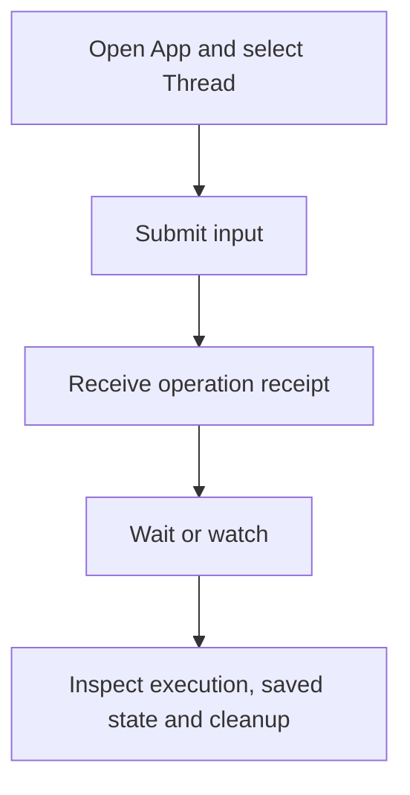

Use the Python App boundary when you need Harness UI's accepted configuration, saved Threads, attachments, root-operation receipts, and child coordination inside another local interface. Use [Harness directly](../a13n-harness/hosting.md) when your application should own those product decisions instead.

The App is process-local; use [Service](../a13n-service/index.md) if work must survive process failure and resume on another worker. Import APIs from their owning submodules (`a13n_harness_ui` itself exports only the version).

## Open, submit, and wait

This function uses an existing configured Model, Agent, and Environment profile. Run [setup](setup.md) first. Calling it opens local storage and can invoke a billable model or configured tools; it is not an offline example.

```python
from pathlib import Path

from a13n_harness_ui.app import open_harness_ui_app
from a13n_harness_ui.settings_loader import load_harness_ui_settings


async def run_once(configuration_file: Path, prompt: str):
    source = await load_harness_ui_settings(configuration_file)
    if source.candidate_error is not None:
        raise source.candidate_error
    async with open_harness_ui_app(
        source.settings,
        configuration_path=source.path,
        configuration_error=source.candidate_error,
    ) as app:
        thread = await app.create_thread(title="Embedded conversation")
        receipt = await app.submit_thread(thread_id=thread.thread_id, prompt=prompt)
        operation = await app.wait_root_operation(receipt.receipt_id)
        return thread.thread_id, operation
```

Pass both the loaded settings and selected configuration path. Bare `HarnessUiSettings()` does not load the user's resource tree. Reject a bad candidate before submitting work, as the example does.

`load_harness_ui_settings(path=None, data_root=None)` uses the normal configuration/data-root selection rules. Use an explicit separate data root for a distinct App instance or test; do not point a fixture at the user's real saved Threads. Startup opens storage, accepts/indexes configuration, prunes eligible scratch files, and can start the pricing updater. Deterministic offline fixtures disable `pricing_auto_update` and use test Model/runtime collaborators rather than provider requests.

`open_harness_ui_app()` owns startup and shutdown. `host_mode` defaults to `local`; the HTTP adapter selects `webui`. Selecting `webui` does not start an HTTP server; it enables WebUI-mode App behavior, such as the cross-Thread collaboration Capability. Do not construct the internal `HarnessUiApp` collaborator graph yourself. [Tracing](observation.md) explains the optional instrumentation boundary without requiring a telemetry backend for ordinary embedding.

## Receipts are not saved continuation



`submit_thread()` returns `RootRunReceipt(receipt_id, thread_id, submitted_at)` to acknowledge admission, not a successful answer. Wait for that receipt and inspect its outcome; only the saved Thread can be read after restart. Another submission while the Thread has an active root operation is rejected rather than queued.

`get_root_operation()` reads current status. `wait_root_operation(receipt_id, timeout_seconds=None)` waits for that exact operation; a bounded wait can return active state. `active_root_operation(thread_id)` discovers current local activity. Use `steer_root_operation(receipt_id=..., message=...)` and `cancel_root_operation(receipt_id)` only for that receipt's available actions.

Statuses are preparing, running, completed, suspended, failed, and cancelled. A finished operation view can have a preparation failure without an execution outcome. When `outcome` exists, inspect its three independent facts:

- `execution`: status, safe output/failure, omission flag, and usage.
- `continuation`: whether a continuation candidate was selected/persisted.
- `environment`: Environment-state publication and adapter cleanup outcome.

A successful execution is not proof of successful checkpoint publication or cleanup. Receipts and control authority disappear with their owning process; saved Thread continuations survive independently. After restart, read the Thread and retained transcript rather than trying to revive an old receipt.

## Thread queries and mutations

| App methods                                                               | Boundary                                                                                               |
| ------------------------------------------------------------------------- | ------------------------------------------------------------------------------------------------------ |
| `create_thread`, `get_thread`, `list_threads`                             | Creation/default selection, detail, bounded collections                                                |
| `get_thread_transcript`                                                   | Retained transcript pinned by continuation and cursor                                                  |
| `update_thread_metadata`                                                  | Metadata compare-and-set, including title/archive                                                      |
| `update_thread_configuration`, `patch_thread_configuration`               | Sticky configuration compare-and-set for later operations                                              |
| `stage_thread_attachment`, `read_thread_attachment`, `prune_thread_files` | Thread-scoped file handles and retention                                                               |
| `submit_thread`                                                           | Ordinary input, optional attachments, Thread configuration mutation, Model overrides, Skill references |
| `respond_thread`, `respond_decisions`                                     | Exact deferred continuation responses                                                                  |

`NewThreadDefaults` selects optional Project, Agent, `default_model_id`, Environment profile, Harness Plugin, Environment Run Extension, and MCP server IDs. Omitted resource selections use the configured defaults; a null or omitted default Model follows the Agent. Effective Model precedence is per-operation override, saved Thread default, then Agent Model. A versioned `ThreadConfigurationPatch` can set `default_model_id`, clear it with null, or omit it to retain the current value. Per-operation `RunModelOverrides` selects Model, thinking, or service tier without rewriting a resource or sticky Thread head.

Metadata `expected_version`, configuration `expected_version`, and `expected_continuation_id` are different preconditions. Read the appropriate current value; never substitute one for another. Metadata omission preserves a field, explicit null can clear a title, and supplied `archived` cannot be null. Archiving requires inactive root execution.

Thread lists default to 20 items, transcript pages to 50; follow returned cursors with unchanged filters/continuation. Bounded transcript text can omit or truncate values. It is a presentation projection, not an unbounded export of every native object.

## Answer the complete pending set

Read `thread_decisions(thread_id=..., expected_continuation_id=...)` or the detailed deferred view. A response must answer every selected request exactly once, with the correct kind and continuation ID.

`respond_decisions()` accepts `DecisionResponseBatch`, including questions, approvals, and external results. `respond_thread()` accepts the lower-level `ThreadDeferredResponse` with `ApprovalDecision` / `ExternalToolResult`. A denied external result needs a denial message and cannot also carry a successful result. An approved decision can carry argument overrides but no denial message; a denied decision can carry a denial message but no argument overrides.

Your adapter must authenticate the responding person or executor, then submit the complete current decision set. Ordinary prompts cannot answer pending decisions. Child Runs do not create durable deferred work.

## MCP input and integration control

WebUI and the TUI enable [MCP human input](mcp.md#human-input-from-mcp-servers). Headless `open_harness_ui_app()` defaults to `mcp_input_enabled=False`. An embedded adapter that can answer requests may explicitly pass `mcp_input_enabled=True`; it must consume requests concurrently with the active operation rather than waiting for completion first.

`mcp_input_requests(thread_id)` reads process-local form/URL requests for that Thread and its descendants. `respond_mcp_input(thread_id, request_id, McpInputResponse(...))` accepts `accept`, `decline`, or `cancel`; import `McpInputResponse` from `a13n_harness_ui.mcp_runtime.inputs`. An accepted form includes its `content` object; URL confirmation includes no form data. Exact duplicate answers reconcile and conflicting answers fail. There is no continuation ID or new Run admission here. `ThreadWatch.snapshot.mcp_inputs` closes the initial-query race, while summary invalidations request a refetch. Answers and pending requests do not survive restart.

`mcp_status(thread_id)` reports current retained generations without connecting. `close_mcp_integration(thread_id, server_id)` explicitly closes that Thread's generation; it does not remove the server selection or promise an already dispatched remote write had no effect. Connection lifetime follows [root MCP policy](mcp.md#connection-lifetime-and-protocol), independently of enabling the human-input channel.

## Attach files

Use `AttachmentUpload` from `a13n_harness_ui.thread_files` and stage it for an existing Thread. Pass returned IDs as the `attachment_ids` tuple on submission. Limits are eight attachments per input, 10 MiB per attachment, and 20 MiB combined.

A Thread attachment ID is not an arbitrary Host path or cross-Thread handle. Input normalization and media policy decide whether content is presented as model media or an Environment file. Staging bytes is separate from accepting an operation; input receipt is not proof that a checkpoint was saved.

## Watch without racing the initial query

`watch_thread(root_thread_id=...)` is an async context manager providing `ThreadWatch.snapshot` and `ThreadWatch.events`. It subscribes before querying the initial focused view and exposes a cutover sequence. Consume events concurrently with operation waiting; a serialized "wait until done, then subscribe" misses live activity.

`live_events(root_thread_id=..., after=LiveCursor(...))` resumes a focused bounded subscription. `summary_events(after=SummaryCursor(...))` carries summary invalidations. Cursors include a process epoch; sparse sequences are valid. Gaps/reset require refetch, not pretending every sequence is still retained. These are best-effort observations, not a durable event log. Closing a watch stops delivery, not the Run.

Python additionally exposes `query_child_executions`, `wait_child_executions`, `steer_child_execution`, and `cancel_child_execution` with explicit parent/execution scope. These methods do not all have HTTP equivalents. Saved child records and current local control availability are separate facts.

## Register trusted integrations

`HarnessUiIntegrations` supplies Host Capabilities, Environment providers/adapters, Harness Plugin factories, Environment Run Extension factories, and Provider-runtime factories. Installation/registration makes trusted code available; accepted resource selection and current Run authority determine use.

Keep callbacks, credentials, live clients, and operators in runtime collaborators, not YAML or persisted continuation. Reuse [configuration](configuration.md), [extension types](extensions-and-mcp.md), [Skills](skills-and-content-plugins.md), and [MCP](mcp.md) rather than creating an independent configuration language in your surface.

For a network-facing adapter, follow the separate [HTTP API](http-api.md). Do not apply Service SDK paths, cookie identity, or durable command semantics to this local App.
