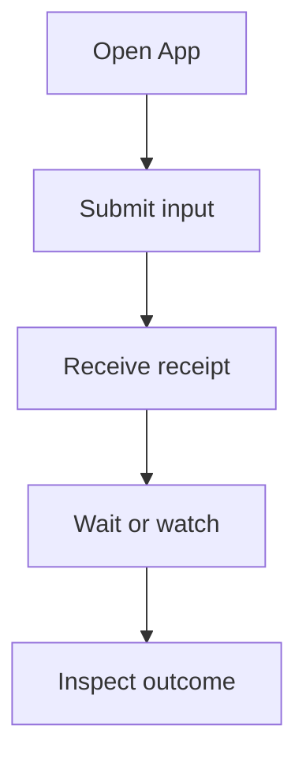

Embed the App to reuse Harness UI configuration, saved Threads, attachments, and operation control in your own interface. [Embed Harness directly](../a13n-harness/hosting.md) when you want to own those decisions. Use [Service](../a13n-service/index.md) for managed execution that can recover on another worker.

Import APIs from their owning submodules; `a13n_harness_ui` itself exports only the version.

## Open, submit, and wait

1. [Configure a Model and Agent](setup.md).
2. Load the selected configuration and open the App.
3. Create a Thread, submit input, and wait for the operation to finish.

The example runs the configured Model and tools:

```python
from pathlib import Path

from a13n_harness_ui.app import open_harness_ui_app
from a13n_harness_ui.settings_loader import load_harness_ui_settings


async def run_once(configuration_file: Path, prompt: str):
    source = await load_harness_ui_settings(configuration_file)
    if source.candidate_error is not None:
        raise source.candidate_error
    async with open_harness_ui_app(
        source.settings,
        configuration_path=source.path,
        configuration_error=source.candidate_error,
    ) as app:
        thread = await app.create_thread(title="Embedded conversation")
        receipt = await app.submit_thread(thread_id=thread.thread_id, prompt=prompt)
        operation = await app.wait_root_operation(receipt.receipt_id)
        return thread.thread_id, operation
```

Pass the loaded settings and configuration path together. `HarnessUiSettings()` alone does not load resource files. For a separate instance or test, pass an isolated `data_root` to `load_harness_ui_settings()`. Offline tests disable `pricing_auto_update`, set `A13N_OFFICIAL_MODELS_AUTO_UPDATE=0`, and supply test Model collaborators.

The context manager owns startup and shutdown. `host_mode="webui"` enables browser-mode collaboration tools without starting an HTTP listener. Use [the HTTP adapter](http-api.md) for a listener and [observation](observation.md) for optional tracing.

## Receipts are not saved continuation



`submit_thread()` returns `RootRunReceipt(receipt_id, thread_id, submitted_at)`. The receipt confirms admission; wait for the operation before reading the answer. A second submission to an active Thread is rejected.

| Task                               | App method                                                                               |
| ---------------------------------- | ---------------------------------------------------------------------------------------- |
| Inspect an operation               | `get_root_operation(receipt_id)`                                                         |
| Wait, optionally with a time limit | `wait_root_operation(receipt_id, timeout_seconds=...)`                                   |
| Find current Thread activity       | `active_root_operation(thread_id)`                                                       |
| Steer or cancel active work        | `steer_root_operation(receipt_id=..., message=...)`, `cancel_root_operation(receipt_id)` |

Statuses are preparing, running, completed, suspended, failed, and cancelled. Preparation can fail before an execution outcome exists. When `outcome` is present, inspect:

- `execution`: answer or failure, usage, and omission flag.
- `continuation`: whether the checkpoint was saved and selected.
- `environment`: Environment-state publication and cleanup.

Execution, saving, and cleanup can succeed or fail independently. Receipts are process-local; after restart, read the saved Thread instead.

## Thread queries and mutations

| Task                              | App methods                                                               |
| --------------------------------- | ------------------------------------------------------------------------- |
| Create or find a Thread           | `create_thread`, `get_thread`, `list_threads`                             |
| Read saved history                | `get_thread_transcript`                                                   |
| Change title or archive state     | `update_thread_metadata`                                                  |
| Change selections for later Runs  | `update_thread_configuration`, `patch_thread_configuration`               |
| Stage, read, or prune attachments | `stage_thread_attachment`, `read_thread_attachment`, `prune_thread_files` |
| Submit input                      | `submit_thread`                                                           |
| Answer deferred decisions         | `respond_thread`, `respond_decisions`                                     |

`NewThreadDefaults` selects Project, Agent, Model, Environment, and integrations at creation. Omitted selections use configured defaults. Model precedence is the operation's `RunModelOverrides`, the Thread's `default_model_id`, then the Agent's Model. A `ThreadConfigurationPatch` can set `default_model_id`, clear it with null, or omit it to retain the selection.

Read the version for the object you mutate: metadata and configuration each have an `expected_version`; decisions use `expected_continuation_id`. Omitting metadata preserves it; null clears a title. Archiving requires an inactive root operation.

Thread lists default to 20 items and transcript pages to 50. Follow cursors with unchanged filters and continuation. Transcript values can be clipped; use the returned disclosure rather than assuming a page is a complete export.

## Answer the complete pending set

1. Read `thread_decisions(thread_id=..., expected_continuation_id=...)`.
2. Collect an answer for every selected request.
3. Submit a `DecisionResponseBatch` through `respond_decisions()` with the same continuation ID.

Batches can include questions, approvals, and external results. For lower-level integration, `respond_thread()` accepts `ThreadDeferredResponse`. Approved decisions may override arguments; denied decisions may include a denial message. A denied external result requires a denial message instead of a successful result.

Authenticate the responder in your interface. An ordinary prompt does not answer pending decisions.

## MCP input and integration control

An interface that can display MCP forms or URL requests passes `mcp_input_enabled=True` to `open_harness_ui_app()`. The default is false. Consume requests while the operation runs; waiting for completion first can leave the server waiting for an answer.

- Read `mcp_input_requests(thread_id)` for the Thread and its descendants.
- Call `respond_mcp_input(thread_id, request_id, response)` with `McpInputResponse` from `a13n_harness_ui.mcp_runtime.inputs`.
- Choose `accept`, `decline`, or `cancel`. Accepted forms include `content`; URL confirmation has no form data.

`ThreadWatch.snapshot.mcp_inputs` includes pending requests at subscription time. Identical repeated answers reconcile; conflicting answers fail. Requests and answers last only for the current process.

`mcp_status(thread_id)` inspects retained connections without opening one. `close_mcp_integration(thread_id, server_id)` closes the selected connection generation without removing the configuration. For retention and in-flight operations, see [MCP connection lifetime](mcp.md#connection-lifetime-and-protocol).

## Attach files

1. Create an `AttachmentUpload` from `a13n_harness_ui.thread_files`.
2. Stage it on an existing Thread with `stage_thread_attachment()`.
3. Pass the returned IDs as `attachment_ids` to `submit_thread()`.

Each input supports eight attachments, 10 MiB per file, and 20 MiB combined. Attachment IDs belong to their Thread. Media policy determines whether the Model receives media or an Environment file; staging an upload does not submit input.

## Watch without racing the initial query

Use `watch_thread(root_thread_id=...)` as an async context manager. It subscribes before returning `ThreadWatch.snapshot` and `ThreadWatch.events`. Consume events concurrently with operation waiting.

`live_events(..., after=LiveCursor(...))` resumes a focused subscription; `summary_events(after=SummaryCursor(...))` supplies invalidations. Cursors include a process epoch. Refetch after a gap or reset. Closing a watch stops delivery, not execution.

For Subagents, use `query_child_executions`, `wait_child_executions`, `steer_child_execution`, and `cancel_child_execution` with the owning parent and execution ID. Saved records remain readable after live control ends.

## Register trusted integrations

Pass `HarnessUiIntegrations` to register Host Capabilities, Environment providers/adapters, Harness Plugin factories, Environment Run Extension factories, and Provider-runtime factories. Configuration selects which registered integrations a Run uses.

Keep credentials, callbacks, clients, and operators in runtime collaborators. Reuse the existing [configuration](configuration.md), [extension](extensions-and-mcp.md), [Skill](skills-and-content-plugins.md), and [MCP](mcp.md) formats in your interface.
