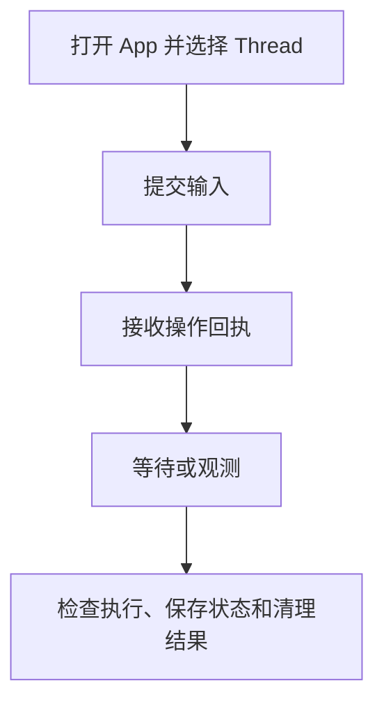

在其他本地界面中需要使用 Harness UI 的已接受配置、已保存 Thread、附件、根操作回执和子级协调时，应使用 Python App 边界。如果应用需要自己负责这些产品决策，则[直接使用 Harness](../a13n-harness/hosting.md)。

App 的状态和控制限于当前进程；如果工作必须在进程故障后由其他 worker 恢复，请使用 [Service](../a13n-service/index.md)。从各 API 所属的子模块导入（`a13n_harness_ui` 本身只导出版本）。

## 打开、提交与等待

下面的函数使用已有的 Model、Agent 和 Environment 配置。请先运行[设置](setup.md)。调用会打开本地存储，并可能调用计费模型或配置的工具，并非离线示例。

```python
from pathlib import Path

from a13n_harness_ui.app import open_harness_ui_app
from a13n_harness_ui.settings_loader import load_harness_ui_settings


async def run_once(configuration_file: Path, prompt: str):
    source = await load_harness_ui_settings(configuration_file)
    if source.candidate_error is not None:
        raise source.candidate_error
    async with open_harness_ui_app(
        source.settings,
        configuration_path=source.path,
        configuration_error=source.candidate_error,
    ) as app:
        thread = await app.create_thread(title="Embedded conversation")
        receipt = await app.submit_thread(thread_id=thread.thread_id, prompt=prompt)
        operation = await app.wait_root_operation(receipt.receipt_id)
        return thread.thread_id, operation
```

传入加载后的设置和选中的配置路径。单独构造 `HarnessUiSettings()` 不会加载用户资源树。应像示例一样，在提交工作前拒绝无效候选配置。

`load_harness_ui_settings(path=None, data_root=None)` 使用通常的配置/数据根选择规则。独立 App 实例或测试应显式使用独立的数据根；不要让测试夹具指向用户真实的已保存 Thread。启动会打开存储、接受配置并建立索引、清理符合条件的临时文件，并可能启动价格更新器。确定性的离线夹具应关闭 `pricing_auto_update`，使用测试 Model/运行时协作者，不向提供方发出请求。

`open_harness_ui_app()` 负责启动和关闭。`host_mode` 默认为 `local`；HTTP 适配器选择 `webui`。选择 `webui` 不会启动 HTTP 服务器；它开启 WebUI 模式的 App 行为，例如跨 Thread 协作 Capability。不要自己构造内部 `HarnessUiApp` 协作者依赖图。[追踪](observation.md)说明可选的观测边界；普通嵌入无须遥测后端。

## 回执与已保存续接不同



`submit_thread()` 返回 `RootRunReceipt(receipt_id, thread_id, submitted_at)`，表示请求已受理，不代表回答成功。等待该回执并检查结果；重启后只能读取已保存 Thread。Thread 有活动根操作时，另一次提交会被拒绝，不会排队。

`get_root_operation()` 读取当前状态。`wait_root_operation(receipt_id, timeout_seconds=None)` 等待该特定操作；限时等待可能返回活动状态。`active_root_operation(thread_id)` 查找当前本地活动。`steer_root_operation(receipt_id=..., message=...)` 和 `cancel_root_operation(receipt_id)` 只能执行对应回执当前可用的操作。

状态包括 preparing、running、completed、suspended、failed 和 cancelled。终态视图可能只包含准备失败，没有执行结果。存在 `outcome` 时，分别检查这三项独立事实：

- `execution`：状态、安全输出/失败信息、省略标记和用量。
- `continuation`：是否选择并持久化续接候选。
- `environment`：Environment 状态发布和适配器清理结果。

执行成功不能证明检查点发布或清理成功。回执和控制权限随所属进程消失；已保存的 Thread 续接独立保留。重启后应读取 Thread 和保留的对话记录，不要尝试恢复旧回执。

## Thread 查询与修改

| App 方法                                                                  | 边界                                                         |
| ------------------------------------------------------------------------- | ------------------------------------------------------------ |
| `create_thread`、`get_thread`、`list_threads`                             | 创建/默认选择、详情、有上限的集合                            |
| `get_thread_transcript`                                                   | 由续接和游标固定的保留对话记录                               |
| `update_thread_metadata`                                                  | 元数据比较并设置，包括标题/归档                              |
| `update_thread_configuration`、`patch_thread_configuration`               | 为后续操作比较并设置持久配置                                 |
| `stage_thread_attachment`、`read_thread_attachment`、`prune_thread_files` | Thread 范围内的文件句柄和保留                                |
| `submit_thread`                                                           | 普通输入、可选附件、Thread 配置修改、Model 覆盖和 Skill 引用 |
| `respond_thread`、`respond_decisions`                                     | 针对确切延迟续接的响应                                       |

`NewThreadDefaults` 可选择 Project、Agent、`default_model_id`、Environment 配置、Harness Plugin、Environment Run Extension 和 MCP 服务器 ID。省略的资源选择使用配置的默认值；默认 Model 为 null 或省略时跟随 Agent。实际 Model 优先级为单次操作覆盖、Thread 已保存默认值、Agent Model。带版本的 `ThreadConfigurationPatch` 可以设置 `default_model_id`，以 null 清除，或省略以保留当前值。单次操作的 `RunModelOverrides` 选择 Model、推理或服务层级，不会改写资源或 Thread 的持久配置头。

元数据 `expected_version`、配置 `expected_version` 和 `expected_continuation_id` 是不同的前置条件。读取对应当前值，不能互相替代。元数据字段省略时保留原值；显式 null 可清除标题；提供的 `archived` 不得为 null。归档要求根执行处于非活动状态。

Thread 列表默认每页 20 项，对话记录默认每页 50 项；后续游标请求应保持筛选条件/续接不变。有界对话文本可能省略或截断值。这是用于展示的投影，不是所有原生对象的无限制导出。

## 回答完整的待处理决策集

读取 `thread_decisions(thread_id=..., expected_continuation_id=...)` 或详细延迟视图。响应必须使用正确的类型和续接 ID，对每个选中的请求恰好回答一次。

`respond_decisions()` 接受 `DecisionResponseBatch`，包括问题、审批和外部结果。`respond_thread()` 接受更底层的 `ThreadDeferredResponse`，使用 `ApprovalDecision` / `ExternalToolResult`。拒绝外部结果时需要拒绝消息，不能同时携带成功结果。批准的决策可以携带参数覆盖，但不能携带拒绝消息；拒绝的决策可以携带拒绝消息，但不能携带参数覆盖。

你的适配器必须验证回答者或执行者的身份，然后提交当前完整决策集。普通提示不能回答待处理决策。子 Run 不会创建持久化的延迟工作。

## MCP 输入与集成控制

WebUI 和 TUI 开启 [MCP 人工输入](mcp.md#human-input-from-mcp-servers)。无界面的 `open_harness_ui_app()` 默认 `mcp_input_enabled=False`。能够回答请求的嵌入适配器可以显式传入 `mcp_input_enabled=True`；须在操作运行时并行消费请求，不能先等待完成。

`mcp_input_requests(thread_id)` 读取该 Thread 及其后代的进程内表单/URL 请求。`respond_mcp_input(thread_id, request_id, McpInputResponse(...))` 接受 `accept`、`decline` 或 `cancel`；从 `a13n_harness_ui.mcp_runtime.inputs` 导入 `McpInputResponse`。接受表单时传入 `content` 对象；URL 确认不包含表单数据。完全相同的重复答案核实结果，冲突答案失败。这不需要续接 ID，也不受理新 Run。`ThreadWatch.snapshot.mcp_inputs` 消除初始查询竞态，摘要失效通知要求重新获取。答案和待处理请求不跨重启保留。

`mcp_status(thread_id)` 报告当前保留的连接代，不建立连接。`close_mcp_integration(thread_id, server_id)` 显式关闭该 Thread 的代，不移除服务器选择，也不保证已派发的远程写入无副作用。连接生命周期遵循[根 MCP 策略](mcp.md#connection-lifetime-and-protocol)，与是否启用人工输入通道独立。

## 附加文件

从 `a13n_harness_ui.thread_files` 使用 `AttachmentUpload`，为已有 Thread 暂存附件。提交时，将返回 ID 放入 `attachment_ids` 元组。每次输入最多八个附件，每个 10 MiB，合计 20 MiB。

Thread 附件 ID 不是任意 Host 路径或跨 Thread 句柄。输入规范化和媒体策略决定内容以模型媒体还是 Environment 文件呈现。暂存字节与接受操作是两回事；输入回执不能证明检查点已保存。

## 订阅先于初始查询

`watch_thread(root_thread_id=...)` 是异步上下文管理器，提供 `ThreadWatch.snapshot` 和 `ThreadWatch.events`。它先订阅，再查询初始聚焦视图，并公开切换序列。等待操作时应并行消费事件；先串行等到完成再订阅会错过实时活动。

`live_events(root_thread_id=..., after=LiveCursor(...))` 恢复聚焦的有界订阅。`summary_events(after=SummaryCursor(...))` 传递摘要失效通知。游标包含进程 epoch；稀疏序列是有效的。出现缺口或重置时必须重新获取，不能假定所有序列仍被保留。这些是尽力交付的观测，不是持久事件日志。关闭监听只停止交付，不会停止 Run。

Python 还提供 `query_child_executions`、`wait_child_executions`、`steer_child_execution` 和 `cancel_child_execution`，明确限定父级/执行范围。这些方法并非都有对应 HTTP 接口。已保存子级记录与当前本地控制可用性是不同事实。

## 注册可信集成

`HarnessUiIntegrations` 提供 Host Capability、Environment provider/适配器、Harness Plugin 工厂、Environment Run Extension 工厂和 Provider 运行时工厂。安装/注册让可信代码可用；已接受的资源选择和当前 Run 权限决定其使用。

回调、凭据、活动客户端和 operator 应留在运行时协作者中，不应写入 YAML 或持久化续接。在界面中复用[配置](configuration.md)、[扩展类型](extensions-and-mcp.md)、[Skill](skills-and-content-plugins.md) 和 [MCP](mcp.md)，不要另建配置语言。

面向网络的适配器请遵循独立的 [HTTP API](http-api.md)。不要将 Service SDK 路径、cookie 身份或持久命令语义套用到这个本地 App。
