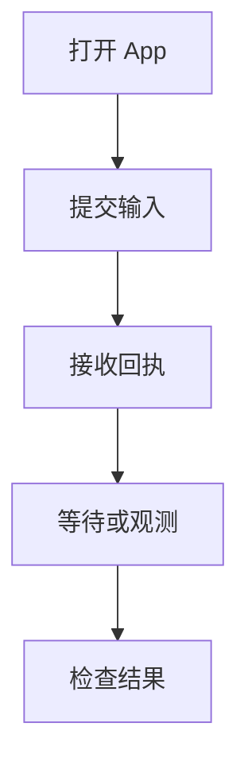

嵌入 App，在自己的界面中复用 Harness UI 配置、已保存的 Thread、附件和操作控制。如果这些功能由你的应用负责，请[直接嵌入 Harness](../a13n-harness/hosting.md)。需要能由其他 worker 恢复的托管执行时，使用 [Service](../a13n-service/index.md)。

从各 API 所属的子模块导入；`a13n_harness_ui` 本身只导出版本。

## 打开、提交与等待

1. [配置 Model 和 Agent](setup.md)。
2. 加载所选配置并打开 App。
3. 创建 Thread、提交输入，等待操作完成。

下面的示例会运行已配置的 Model 和工具：

```python
from pathlib import Path

from a13n_harness_ui.app import open_harness_ui_app
from a13n_harness_ui.settings_loader import load_harness_ui_settings


async def run_once(configuration_file: Path, prompt: str):
    source = await load_harness_ui_settings(configuration_file)
    if source.candidate_error is not None:
        raise source.candidate_error
    async with open_harness_ui_app(
        source.settings,
        configuration_path=source.path,
        configuration_error=source.candidate_error,
    ) as app:
        thread = await app.create_thread(title="Embedded conversation")
        receipt = await app.submit_thread(thread_id=thread.thread_id, prompt=prompt)
        operation = await app.wait_root_operation(receipt.receipt_id)
        return thread.thread_id, operation
```

同时传入加载后的设置和配置路径。单独构造 `HarnessUiSettings()` 不会加载资源文件。独立实例或测试应向 `load_harness_ui_settings()` 传入隔离的 `data_root`。离线测试关闭 `pricing_auto_update`，并提供测试 Model 协作者。

上下文管理器负责启动和关闭。`host_mode="webui"` 开启浏览器模式的协作工具，但不启动 HTTP 监听器。监听器使用 [HTTP 适配器](http-api.md)；可选追踪见[观测](observation.md)。

## 回执与已保存续接不同



`submit_thread()` 返回 `RootRunReceipt(receipt_id, thread_id, submitted_at)`。回执表示请求已受理；读取答案前应等待操作完成。向活动 Thread 再次提交会被拒绝。

| 任务                 | App 方法                                                                                 |
| -------------------- | ---------------------------------------------------------------------------------------- |
| 查看操作             | `get_root_operation(receipt_id)`                                                         |
| 等待，可设置时限     | `wait_root_operation(receipt_id, timeout_seconds=...)`                                   |
| 查找 Thread 当前活动 | `active_root_operation(thread_id)`                                                       |
| 引导或取消活动执行   | `steer_root_operation(receipt_id=..., message=...)`、`cancel_root_operation(receipt_id)` |

状态包括 preparing、running、completed、suspended、failed 和 cancelled。准备阶段可能在产生执行结果前失败。存在 `outcome` 时，分别查看：

- `execution`：答案或失败、用量和省略标记。
- `continuation`：检查点是否已保存并选中。
- `environment`：Environment 状态发布和清理。

执行、保存和清理可能分别成功或失败。回执只属于当前进程；重启后读取已保存的 Thread。

## Thread 查询与修改

| 任务                 | App 方法                                                                  |
| -------------------- | ------------------------------------------------------------------------- |
| 创建或查找 Thread    | `create_thread`、`get_thread`、`list_threads`                             |
| 读取已保存历史       | `get_thread_transcript`                                                   |
| 修改标题或归档状态   | `update_thread_metadata`                                                  |
| 修改后续 Run 的选择  | `update_thread_configuration`、`patch_thread_configuration`               |
| 暂存、读取或清理附件 | `stage_thread_attachment`、`read_thread_attachment`、`prune_thread_files` |
| 提交输入             | `submit_thread`                                                           |
| 回答延迟决策         | `respond_thread`、`respond_decisions`                                     |

`NewThreadDefaults` 在创建时选择 Project、Agent、Model、Environment 和集成。省略的选择使用配置默认值。Model 优先级为本次操作的 `RunModelOverrides`、Thread 的 `default_model_id`、Agent 的 Model。`ThreadConfigurationPatch` 可设置 `default_model_id`，用 null 清除，或省略以保留选择。

读取待修改对象对应的版本：元数据和配置各有自己的 `expected_version`；决策使用 `expected_continuation_id`。省略元数据字段会保留原值；null 清除标题。归档要求根操作处于非活动状态。

Thread 列表默认每页 20 项，对话记录默认每页 50 项。后续游标请求应保持筛选条件和续接不变。对话记录的值可能被截断；查看返回的完整性说明，不要将单页视为完整导出。

## 回答完整的待处理决策集

1. 读取 `thread_decisions(thread_id=..., expected_continuation_id=...)`。
2. 为每个选中的请求收集答案。
3. 通过 `respond_decisions()` 提交 `DecisionResponseBatch`，使用相同的续接 ID。

批次可包含问题、审批和外部结果。更底层的集成可向 `respond_thread()` 传入 `ThreadDeferredResponse`。批准的决策可覆盖参数；拒绝的决策可包含拒绝消息。拒绝外部结果时，需要拒绝消息，不能传入成功结果。

在自己的界面中验证回答者身份。普通提示不能回答待处理决策。

## MCP 输入与集成控制

能够显示 MCP 表单或 URL 请求的界面，向 `open_harness_ui_app()` 传入 `mcp_input_enabled=True`。默认值为 false。操作运行时就应消费请求；先等待操作完成，可能让服务器一直等待回答。

- 用 `mcp_input_requests(thread_id)` 读取该 Thread 及其后代的请求。
- 调用 `respond_mcp_input(thread_id, request_id, response)`，传入 `a13n_harness_ui.mcp_runtime.inputs` 中的 `McpInputResponse`。
- 选择 `accept`、`decline` 或 `cancel`。接受表单时传入 `content`；URL 确认没有表单数据。

`ThreadWatch.snapshot.mcp_inputs` 包含订阅时的待处理请求。完全相同的重复回答会核实原结果；冲突回答会失败。请求和答案只在当前进程中保留。

`mcp_status(thread_id)` 查看保留的连接，不建立新连接。`close_mcp_integration(thread_id, server_id)` 关闭选中的连接代，不移除配置。连接保留和进行中的操作见 [MCP 连接生命周期](mcp.md#connection-lifetime-and-protocol)。

## 附加文件

1. 从 `a13n_harness_ui.thread_files` 创建 `AttachmentUpload`。
2. 用 `stage_thread_attachment()` 将附件暂存在已有 Thread 中。
3. 将返回 ID 作为 `attachment_ids` 传给 `submit_thread()`。

每次输入最多八个附件，每个 10 MiB，合计 20 MiB。附件 ID 属于其 Thread。媒体策略决定 Model 收到媒体还是 Environment 文件；暂存上传不等于提交输入。

## 订阅先于初始查询

将 `watch_thread(root_thread_id=...)` 用作异步上下文管理器。它先订阅，再返回 `ThreadWatch.snapshot` 和 `ThreadWatch.events`。等待操作时并行消费事件。

`live_events(..., after=LiveCursor(...))` 恢复聚焦订阅；`summary_events(after=SummaryCursor(...))` 提供失效通知。游标包含进程 epoch。出现缺口或重置时重新获取数据。关闭监听只停止交付，不停止执行。

对 Subagent 使用 `query_child_executions`、`wait_child_executions`、`steer_child_execution` 和 `cancel_child_execution`，明确指定所属父级和执行 ID。活动控制结束后，已保存记录仍可读取。

## 注册可信集成

传入 `HarnessUiIntegrations`，注册 Host Capability、Environment provider/适配器、Harness Plugin 工厂、Environment Run Extension 工厂和 Provider 运行时工厂。配置决定 Run 使用哪些已注册集成。

凭据、回调、客户端和 operator 保留在运行时协作者中。在自己的界面中复用现有的[配置](configuration.md)、[扩展](extensions-and-mcp.md)、[Skill](skills-and-content-plugins.md) 和 [MCP](mcp.md) 格式。
