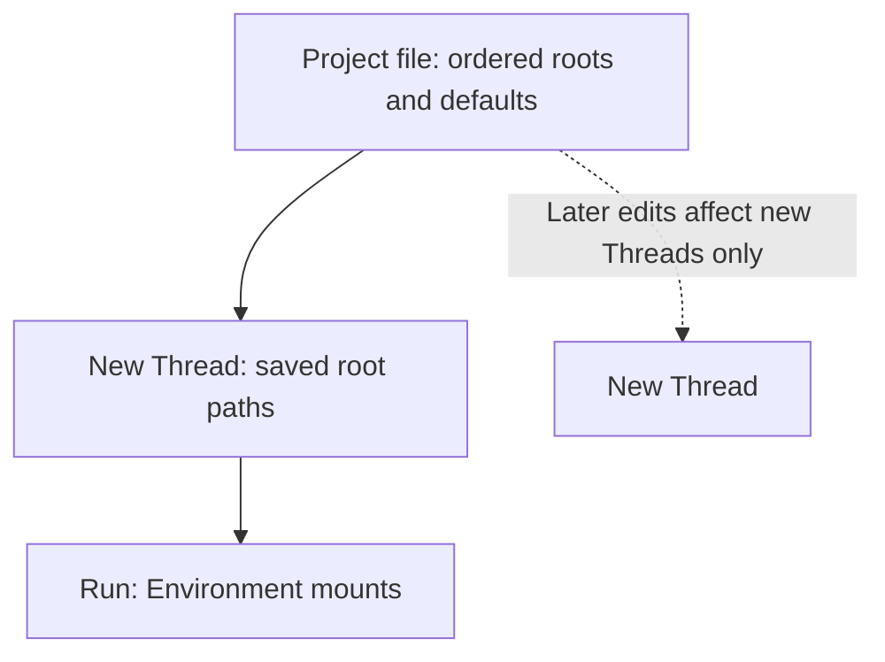

## Execution permissions

**Full Control** runs as your host account with ambient filesystem and network authority. It does not download or launch `a13n-envd`. Full Control uses the Direct Local Provider, which executes natively on Linux, macOS, and Windows without WSL. Windows uses PowerShell (`pwsh`, then Windows PowerShell), UTF-8 text streams, and a Job Object that owns the command's descendants. Cancellation, timeout, and exit clean up that owned tree. Portable interrupt signals are unavailable on Windows; cancellation uses tree termination instead. Full Control remains host-account execution, not a sandbox.

**Sandbox** asks Envd to prepare restricted Session workers with explicit directory grants and denied networking. Envd owns the complete worker boundary, including file RPCs and commands; Harness UI does not wrap the whole daemon. Project roots are writable, while the Thread file worker exposes attachments read-only and tmp read-write. Setup checks Sandbox readiness before saving. Outside setup, readiness is checked when execution needs it rather than on the initial landing view. A failure is explicit and does not fall back to Full Control. Fix the prerequisite and retry, or intentionally select `/environment full-control` before sending a new prompt. Harness UI never runs `sudo`, changes sysctls, or disables required isolation for you. Windows production Sandbox isolation is not supported. See the [outer security guide](../a13n-envd/isolation.md).

### Native command environment

Full Control commands inherit the complete environment of the Harness UI process, including `PATH`, proxy settings, tool-specific variables, and exported credentials. A command's explicit environment overrides or removals apply only to that command and its descendants; they do not change Harness UI or later commands. This applies to both Project and Thread-file native shell execution. Environment values are not copied into saved configuration or Run snapshots.

Launch Harness UI from a terminal where your tools and variables are already available. Changes made in another terminal after launch are not automatically reflected in the running process. Environment inheritance does not include aliases, unexported shell variables, or automatic sourcing of `.zshrc`/`.bashrc`. The TUI's `!command` also inherits the Host process environment. Sandbox keeps its separate isolation and environment policy.

## Windows local execution

Windows supports **Full Control only** for the built-in local modes. Setup and the TUI Environment selector offer Full Control and explain that commands run with the host account's filesystem and network permissions. Job Object cleanup is not Sandbox isolation. Explicit Sandbox requests fail without downloading Envd, changing saved selections, or falling back. Custom and remote Providers retain their own contracts.

## Files, Projects, and recovery



Model, Agent, Device, extension, MCP, and Project resources live in sibling YAML directories. A Project selects local directories, Device bindings, or both. Without an explicit default environment, the first local directory is its default working directory. Launching the CLI in that first directory uses the same Project and all its roots. For example, a Project with roots `[code, notes]` is entered from `code`; adding `notes` later does not create a new Project or hide existing conversations. A conversation is a root Thread as the TUI and WebUI show it.

The first prompt creates a single-root Project only when no Project's first directory matches. It never adopts a parent Project, treats a secondary root as another entry point, or rewrites an existing Project. Multiple matching Projects require resuming a specific conversation or editing their roots. To keep a conversation's Project and local directories, launch the CLI in its Project's first directory. An explicit resume from another directory selects the launch directory's Project and local path references, and makes `workspace` the default. History, Device bindings, and the local execution mode are preserved. Resuming within the same Project keeps the Thread's saved Environment selections even if that Project's roots have since changed. `--resume` cannot be combined with Agent, Environment, or title overrides; resume first, then use an explicit slash command.

Configuration publication failures belong to [setup recovery](setup.md#cancel-or-recover-setup), not Project selection. Review the completed paths before retrying setup.

If the Harness UI process stops, active operations, unsaved input, and incomplete output are lost. Resume continues the last saved checkpoint (which can contain safely retained partial progress); it does not replay interrupted side effects. Best-effort live output can be incomplete; if events are lost, the TUI labels recovery and prints the authoritative final answer.

## Select an Environment

```console
a13n-harness-ui environment list --format json
a13n-harness-ui --environment-mode full-control
a13n-harness-ui --environment-mode sandbox
a13n-harness-ui --environment-profile environment-team
```

`--environment-mode` selects a built-in mode; `--environment-profile` selects a configured profile. They are mutually exclusive. In the TUI, `/environment` shows choices and saves the selection for this conversation's later Runs. Resume first before changing a saved conversation's Environment; launch overrides cannot be combined with `--resume`.

## Project file reference

For a stable multi-directory Project, create `projects/work.yaml` beside root YAML. Replace both paths with existing directories:

```yaml title="projects/work.yaml"
schema_version: "1"
kind: project
id: project-work
name: Work
position: 0
roots:
  - path: /absolute/path/to/code
  - path: /absolute/path/to/notes
```

| Field            | Default            | Meaning                                                                                                        |
| ---------------- | ------------------ | -------------------------------------------------------------------------------------------------------------- |
| `schema_version` | Required `"1"`     | Resource schema                                                                                                |
| `kind`           | Required `project` | Resource type                                                                                                  |
| `id`             | Required           | Unique stable `project-` identity                                                                              |
| `name`           | Required           | Human-facing name                                                                                              |
| `position`       | `0`                | Catalog ordering                                                                                               |
| `roots`          | `[]`               | Up to 64 ordered unique local `{path: ...}` directories; at least one local root or Device binding is required |
| `defaults`       | `{}`               | Optional creation combination; see below                                                                       |

Local paths must be absolute after `~` expansion. You can save a Project whose directory is temporarily unavailable, but execution that selects it fails until the directory is available. The first local root is the TUI entry point and default working directory unless another default is selected. A remote-only Project has no local TUI entry point. New Threads capture root path references, not copies of files or worktrees; later Project edits do not change existing Threads. Roots organize Environment mounts but do not confine Full Control.

### Defaults for new conversations

A Project can select one default combination using existing resource IDs:

```yaml
defaults:
  agent: agent-reviewer
  environment_profile: environment-native
  harness_plugins: []
  environment_run_extensions: []
  mcp_servers: []
```

Place this `defaults` mapping alongside `roots` in the Project file, and replace `agent-reviewer` with a configured Agent ID. These fields, plus `environment_bindings` and `default_environment` described below, are optional. Omission or null continues fallback; an empty list selects none. A supplied list replaces the lower-priority list rather than merging with it. Model and Capability settings still belong to the chosen Agent.

New conversations resolve explicit selections first, then Project defaults, then the selected Agent's Plugin/MCP defaults, then root YAML defaults. An omitted Environment ultimately selects `environment-native`. An explicit projectless conversation skips Project defaults. Creation previews and the TUI's pre-conversation Skill catalog use these same choices.

Changing these defaults does not update existing conversations. Use the [HTTP configuration workflow](http-api.md#configure-projects-and-threads) to preview and explicitly apply only the Project's configured axes to a saved Thread. Other Thread choices remain unchanged; stale previews fail instead of silently applying changed defaults. In WebUI, edit these values under **Settings → Projects**. A conversation's **Conversation details → Configuration** separates its captured Run configuration from editable next-Run selections.

### Thread Environments and composer overrides

Each Thread stores its own local directories, local execution mode, Device bindings, and default Environment. In WebUI, changing its Project only changes grouping, not those selections; an explicit `/resume` or `--resume` from another directory also replaces its local directories (see above). A Thread can keep local directories without a Project.

- In **Conversation details → Configuration**, edit next-Run selections to save a new Environment combination for that Thread.
- Choose **Apply Project environments**, review the replacement, then apply it to replace just the four Environment axes. A local-only Project clears old Device bindings. Agent, Model, MCP, Plugins, and Run Extensions stay unchanged.
- In the composer, open **Environments**. **Local · Harness server** contains Full Control, Sandbox or a custom local mode and local directories. **Device environments** contains Device bindings; **Default working location** selects one directory or Thread files. Apply commits the whole draft; closing without applying discards edits. An active override applies to subsequent Runs in this tab until reset, not just one send. The local mode does not change remote shell permissions. **Use conversation defaults** clears temporary overrides.

Composer overrides do not change the saved Thread. Steering keeps the active Run's captured Environment. Deferred replies keep the suspended Run's Environment unless explicitly changed; a new child starts with the parent's captured selections and then owns them independently.

## Add Device bindings

A Device is one configured connection to an Envd daemon. A Device binding selects that Device, an existing absolute working directory, and a unique alias. Adding a binding does not start a Run or create a directory. Each execution gets its own Session. Multiple aliases can use the same Device without sharing process handles or retained output.

### Connect and approve Envd

In any **Add environment** dialog, choose **Connect new Device**, or use **Settings → Environments → Connect Device**. Install `a13n-envd` on the remote computer first and ensure it is on your PATH. Select POSIX shell or PowerShell. If the Agent must run commands, enable shell execution. Desktop access is a separate advanced option. Copy the command and run it on the computer whose files you want to use:

```console
a13n-envd connect https://your-harness-ui.example.com
```

WebUI generates the command from the current page origin; no separate server URL setting is needed. Open WebUI at an address reachable from the remote computer before copying the command. `http://127.0.0.1:8765` works for a same-computer setup; on another computer, localhost refers to that computer itself, and a remote connection requires HTTPS. The daemon initiates the connection, so its computer does not need an inbound port.

1. Keep the terminal open and note the verification code.
2. In the same dialog, check the Device name and matching code, then choose **Approve Device**.
3. Wait for **Device online**. Then choose a directory. If you started from **Settings**, the dialog ends at **Done** and adds no binding.

The command runs in the foreground, not as an installed service. Approval creates the Device configuration automatically. Closing before approval does not reject the request; closing afterward leaves the registered Device intact but discards unsaved binding edits. An expired or disappearing request is not proof of approval. You do not need to copy an API key, choose a transport, or create a Provider. Your browser login key is not the Device credential. Pending requests expire after ten minutes; reject requests you do not recognize.

After stopping Envd, rerun the same command and environment to reconnect with its saved identity and credential. Saved Host connections do not retain all launch flags: preserve the original shell and desktop settings, including when reconnecting by saved name. For a friendly saved Host name, add `--host personal` on the first connection and later run `a13n-envd connect personal`. Keep the state directory: deleting it loses that identity and credential. See [daemon configuration](../a13n-envd/configuration.md) for state-directory and TLS options.

Shell execution is opt-in on the **remote computer**, independently of the Host's local Full Control/Sandbox selection:

```bash
A13N_ENVD_FULL_CONTROL=1 a13n-envd connect https://your-harness-ui.example.com
```

On PowerShell:

```powershell
$env:A13N_ENVD_FULL_CONTROL = "1"
a13n-envd connect https://your-harness-ui.example.com
```

This runs commands with Envd's launching account and inherited command environment; it is not a sandbox. Without it, file operations remain available, but shell execution needs explicit `trusted_executable_roots` or `shell_profiles` in the Envd daemon configuration.

One Envd process connects to one Host. To connect the same physical computer to another Host, run another process with a different `--instance` name and repeat its approval. A named Host is a saved connection, not a multi-Host scheduler.

### Manual connections

For an existing HTTP daemon or a credential you manage yourself, open **Connect Device → Manual HTTP or WebSocket connection → Configure manually**. For HTTP, a `devices/build.yaml` resource looks like:

```yaml
schema_version: "1"
kind: device
id: device-build
name: Build machine
device_id: native-build
transport:
  kind: http
  configuration:
    endpoint: https://build.example.com
authentication:
  kind: api_key
  env: BUILD_DEVICE_TOKEN
```

`id` is the Harness UI resource ID; `device_id` is the daemon's stable identity. Configure the actual endpoint and export the referenced credential before starting Harness UI. Do not store the credential itself in YAML. For a Device that connects outward to Harness UI, use `transport: {kind: websocket, configuration: {}}` and point Envd at `/api/devices/device-build/connect` on the WebUI listener with the Device credential, not the WebUI instance key. See [daemon transports](../a13n-envd/configuration.md#carrier-profiles).

### Choose working directories

Under **Settings → Projects → Environments**, or **Conversation details → Configuration → Change next Run selections**, choose **Add environment**:

1. Select an existing Device or connect a new one inline. Review the suggested unique alias, such as `build`.
2. Enter a known absolute directory, choose **Use Device default**, or browse and explicitly select a directory.
3. Choose the allowed actions and the default working location, then save the enclosing settings.

Directory browsing works before a Run exists and opens no Session. An unavailable Device still permits a known path or removal. Disabled directory discovery permits manual paths and the advertised default. Windows Device paths use `/C:/work` or `/UNC/server/share/work`; these are not paths on the Harness UI server.

**Add project** also supports Device-only directories: add a Device binding without adding a local directory, choose its default working location, and save. The local mode stays visible because it still controls Thread files. Equivalent YAML:

```yaml
schema_version: "1"
kind: project
id: project-build
name: Remote build
roots: []
defaults:
  environment_bindings:
    - device_id: device-build
      working_directory: /work/project
      alias: build
  default_environment: build
```

For a controlled-egress Device, authored bindings can additionally include `egress.destinations`, secret source references and `expected_boundary`. These use the same [Provider recipe](../environments/remote-envd.md#session-egress-and-credential-references). Harness UI captures the references with the Run and resolves values only during preparation; never place token values in Project YAML. The Device's launch policy is configured on its own computer, not by the local Full Control/Sandbox selector.

A mixed Project keeps its local `roots` alongside these defaults. Local mounts use `workspace`, `workspace-2`, and so on; `thread-files` is available without a Project. These and other Host-owned mount names cannot be reused as Device aliases. Device bindings require an explicit default selected from the resulting mounts. The local execution profile controls local mounts only; it does not sandbox an external Device. A Device directory is a working-directory default, not a filesystem access boundary. Run mutually untrusted workloads behind separate Host-managed security boundaries.

For Project defaults, an unspecified binding collection leaves an existing Thread's collection unchanged when defaults are applied; an explicitly empty collection removes its Device bindings. The editor offers separate actions for these cases. Editing only the default does not silently turn an unspecified collection into an empty override. Saved Threads retain their selections until explicitly edited or updated through **Apply Project defaults**. Active and historical Runs retain their captured selections.

### Revoke a Device

Use **Settings → Environments → Revoke** to disconnect a paired Device and block its saved credential. This also interrupts access for Runs using that connection, but preserves remote files and captured history. A revoked registration remains visible after restart. The daemon stops on authentication rejection rather than silently creating a new credential.

Use revocation when you want to withdraw access. Use removal when you only want to stop selecting a directory, or forgetting when you only want to remove local configuration. These are different operations.

### Remove an unavailable environment

To remove one Project or Thread selection, choose **Remove** beside its alias. If it is the default, select a replacement in the same dialog. Save the enclosing settings. A Project must retain at least one local root or Device binding; a Thread may remove all Device bindings and use Thread files.

To forget the shared connection or a custom local profile, use **Settings → Environments → Forget**. This works without connecting to the target. Repair any General or Project defaults that reference the resource first; the dialog links to known Project references. Forget removes local configuration only: it neither deletes remote files nor stops the Device, cancels active Runs, or rewrites history. Built-in local profiles cannot be deleted.

Existing Threads are not silently rewritten. A missing Device appears as **Not configured** in next-Run selections. Remove it or replace it and choose a valid default before running again. Inspecting a previous Run still shows the configuration that produced it.

WebUI's native Files, Git Changes, and Terminal panels address the Harness UI server, not a selected Device. Remote-only Projects do not turn those panels into remote file or terminal clients.

## Custom Environment profiles

Most users should select a built-in mode rather than copy its configuration. Reserved IDs `environment-native` and `environment-sandbox` cannot be redefined.

Custom profiles live under `extensions/` and select an installed provider plus a compatible Project adapter. For example, this native profile still runs with host authority:

```yaml
schema_version: "1"
kind: environment_profile
id: environment-team
name: Team native environment
provider_key: direct_local
provider_configuration: {}
adapter_key: a13n.native-project-root
adapter_configuration: {}
```

Beyond the common resource envelope, all fields are shown above. The provider owns `provider_configuration`; the adapter owns `adapter_configuration` and Project-to-Environment mapping. Empty mappings are defaults, not a universal configuration for every provider. A provider package alone does not imply that every Project adapter is installed or compatible.

Use `defaults.environment_profile: environment-team` or the explicit launch option, then run `config validate` and `doctor`. Never treat a profile label as proof of isolation. Provider readiness and the actual execution contract determine that behavior.

Local Envd profiles separate immutable Device `launch` configuration from reference-only `session` configuration. For example, filesystem-restricted execution with inherited networking:

```yaml
schema_version: "1"
kind: environment_profile
id: environment-restricted-network
name: Restricted files with native networking
provider_key: local_envd
provider_configuration:
  launch:
    sandbox: {mode: restricted, grants: []}
    egress: {mode: inherit}
  session: {}
adapter_key: a13n.local-envd-project-root
adapter_configuration:
  project_access: read_write
```

The adapter adds each captured Project root to the grant set with `project_access`. Additional grants belong to `launch.sandbox.grants`. Inherited networking is deliberately different from built-in Sandbox's denied networking. For controlled egress, select `launch.egress.mode: controlled` and provide `session.egress` with the destination/reference recipe above; this requires the privileged Linux backend and is not a rootless desktop default. Changing Session policy does not rebuild a compatible daemon; changing the launch boundary does.

## Use a Mac desktop from WebUI

Envd can connect outward from a Mac and expose screenshots and bounded mouse/keyboard actions. Run `a13n-envd connect <your-WebUI-origin> --computer-use true`, approve the Device, then add a binding with **Full control** under **Allowed actions** (the default for new bindings). The **Full control** allowed action (a binding permission, not the local Full Control mode) includes files, command execution and computer use where enabled on the Device. **Read only** appears first and permits only file reading and browsing. Older bindings keep their existing permissions until you explicitly select a replacement. Device approval and the local Full Control profile do not themselves enable desktop tools; daemon computer-use enablement and operating-system permissions still apply. Use a Model with image input and an Agent with Dynamic Environment tools.

See [desktop computer use](../a13n-envd/computer-use.md) for native permissions, setup, observation-only configuration, screenshot preview and shared-desktop limitations.
