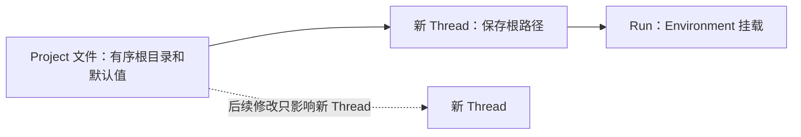

## 执行权限

**Full Control** 使用宿主机账户现有的文件系统和网络权限运行，不下载或启动 a13n-envd。Direct Local 在 Linux、macOS 和 Windows 上原生执行，不需要 WSL。Windows 使用 PowerShell（先 `pwsh`，再 Windows PowerShell）、UTF-8 文本流和管理命令子进程的 Job Object。取消、超时和退出会清理所管理的进程树。Windows 不提供可移植中断信号，取消使用进程树终止。Full Control 仍是宿主机账户执行，不是沙箱。

**Sandbox** 要求 Envd 使用显式目录授权和禁止联网来准备受限 Session worker。Envd 负责完整 worker 边界，包括文件 RPC 和命令；Harness UI 不会包裹整个守护进程。Project 根目录可写，Thread 文件 worker 将附件暴露为只读、tmp 暴露为可读写。设置向导在保存前检查 Sandbox 就绪状态。向导之外，在执行需要时检查，不在初始欢迎页检查。失败会明确报告，不降级到 Full Control。修复前置条件后重试，或发送新提示前有意选择 `/environment full-control`。Harness UI 绝不代你运行 `sudo`、改变 sysctl 或关闭必需隔离。Windows 不支持生产 Sandbox 隔离。见[外层安全指南](../a13n-envd/isolation.md)。

### 原生命令环境

Full Control 命令继承 Harness UI 进程的完整环境，包括 `PATH`、代理设置、工具专用变量和已导出凭据。命令显式的环境覆盖或移除只应用于该命令及其子进程，不改变 Harness UI 或后续命令。Project 和 Thread 文件原生 shell 执行均如此。环境值不会复制到已保存配置或 Run 快照。

从工具和变量已可用的终端启动 Harness UI。启动后在其他终端修改不会自动影响运行中的进程。环境继承不包括 alias、未导出的 shell 变量，也不会自动加载 `.zshrc`/`.bashrc`。TUI 的 `!command` 也继承 Host 进程环境。Sandbox 保留独立隔离和环境策略。

## Windows 本地执行

Windows 内置本地模式**仅支持 Full Control**。设置向导和 CLI Environment 选择器提供 Full Control，并说明命令使用 Host 账户文件系统和网络权限运行。Job Object 清理不是 Sandbox 隔离。显式 Sandbox 请求会失败，不下载 envd、不改变保存选择、不降级。自定义和远程 Provider 保留自己的契约。

## 文件、Project 与恢复



Model、Agent、Device、扩展、MCP 和 Project 资源存放在同级 YAML 目录。Project 可以选择本地目录、Device 工作环境，或两者一起使用。没有显式默认环境时，第一个本地目录是默认工作目录。从该目录启动 CLI 会使用同一 Project 及其全部根目录。例如根目录为 `[code, notes]` 的 Project 从 `code` 进入；之后添加 `notes` 不会创建新 Project，也不会隐藏已有 CLI 会话。

首次提示只有在不存在首目录匹配的 Project 时，才创建单根 Project。不会采用父 Project、将次要根目录当作另一入口，或改写已有 Project。多个 Project 匹配时，需要恢复特定会话或修改根目录。要保留对话工作区，应从其 Project 第一个目录启动。显式从其他目录恢复时，选择启动目录的 Project 和本地路径引用，并将 `workspace` 设为默认；历史、远程绑定和本地执行模式保留。在同一 Project 中恢复会保留 Thread 保存的环境选择，即使 Project 根目录已改变。`--resume` 不能与 Agent、Environment 或标题覆盖同用；先恢复，再用显式斜杠命令。

配置发布失败应按[设置恢复](setup.md#cancel-or-recover-setup)处理，不属于 Project 选择。重试设置前检查已完成路径和保留恢复文件。

进程丢失会丢弃活动回执和不完整输入/输出。恢复继续使用最后保存的检查点（可能包含安全保留的部分进度），不会重放中断副作用。尽力交付的实时输出可能不完整；事件丢失时，终端标明恢复并打印权威最终回答。

## 选择 Environment

```console
a13n-harness-ui environment list --format json
a13n-harness-ui --environment-mode full-control
a13n-harness-ui --environment-mode sandbox
a13n-harness-ui --environment-profile environment-team
```

`--environment-mode` 选择内置模式；`--environment-profile` 选择已配置 profile。两者互斥。聊天中 `/environment` 显示选项并改变下一操作的选择。改变已保存会话的 Environment 前先恢复；启动覆盖不能与 `--resume` 同用。

## Project 文件参考

需要稳定的多目录工作区时，在根 YAML 旁创建 `projects/work.yaml`。将两个路径替换为现有目录：

```yaml title="projects/work.yaml"
schema_version: "1"
kind: project
id: project-work
name: Work
position: 0
roots:
  - path: /absolute/path/to/code
  - path: /absolute/path/to/notes
```

| 字段             | 默认值         | 含义                                                                                |
| ---------------- | -------------- | ----------------------------------------------------------------------------------- |
| `schema_version` | 必需 `"1"`     | 资源 schema                                                                         |
| `kind`           | 必需 `project` | 资源类型                                                                            |
| `id`             | 必需           | 唯一、稳定的 `project-` 身份                                                        |
| `name`           | 必需           | 面向用户的名称                                                                      |
| `position`       | `0`            | 目录排序                                                                            |
| `roots`          | `[]`           | 最多 64 个有序、唯一的本地 `{path: ...}` 目录；至少需要一个本地根目录或 Device 绑定 |
| `defaults`       | `{}`           | 可选的创建配置组合，见下文                                                          |

本地路径在展开 `~` 后必须为绝对路径。目录暂时不可用时可以保存 Project，但选择它执行会失败，直到目录可用。第一个本地根目录是终端入口和默认工作目录，除非选择其他默认值。纯远程 Project 没有本地终端入口。新 Thread 捕获根路径引用，不复制文件或 worktree；后续 Project 修改不改变已有 Thread。根目录组织 Environment 挂载，不限制 Full Control 权限。

### 新对话默认值

Project 可用已有资源 ID 选择一组默认配置：

```yaml
defaults:
  agent: agent-reviewer
  environment_profile: environment-native
  harness_plugins: []
  environment_run_extensions: []
  mcp_servers: []
```

将此 `defaults` 映射与 `roots` 一同放入 Project 文件，并将 `agent-reviewer` 换成已配置 Agent ID。这些字段及下述 `environment_bindings`、`default_environment` 均可选。省略或 null 继续回退；空列表不选任何项。提供列表会替换较低优先级列表，不合并。Model 和 Capability 设置仍属于所选 Agent。

新对话先解析显式选择，再使用 Project 默认值、所选 Agent 的 Plugin/MCP 默认值、根 YAML 默认值。Environment 省略时最终选择 `environment-native`。显式无 Project 对话跳过 Project 默认值。创建预览和终端对话前 Skill 目录使用同样选择。

改变默认值不更新已有对话。通过 [HTTP 配置工作流](http-api.md#configure-projects-and-threads)预览，并显式将仅由 Project 配置的维度应用到已保存 Thread。其他选择不变；过时预览会失败，不静默应用新默认值。在 WebUI 的 **Settings → Projects** 中编辑。**Conversation details → Configuration** 将已捕获 Run 配置与可编辑的下一 Run 选择分开显示。

### Thread 环境与临时 Run 选择

每个 Thread 保存自己的本地目录、本地执行模式、远程绑定和默认环境。改变 Project 只改变分组，不改变这些选择。没有 Project 的 Thread 也能保留本地目录。

- 在 **Conversation details → Configuration** 编辑下一 Run 选择，为该 Thread 保存新的环境组合。
- 选择 **Apply Project environments**，检查替换内容后应用，只替换四个环境维度。纯本地 Project 会清除旧远程绑定。Agent、Model、MCP、Plugin 和 Run Extension 不变。
- 在输入框打开 **Environments**。**Local · Harness server** 包含 Full Control、Sandbox 或自定义本地模式及本地目录。**Device environments** 包含远程绑定；**Default working location** 选择一个目录或 Thread 文件。Apply 提交整个草稿；关闭而不应用会丢弃编辑。活动覆盖应用于本标签页后续 Run，直到重置，不只一次发送。本地模式不改变远程 shell 权限。**Use conversation defaults** 清除临时覆盖。

临时 Run 选择不改变已保存 Thread。执行指导保留活动 Run 捕获的环境。延迟回答保留挂起 Run 的环境，除非显式改变；新子级从父级捕获的选择开始，之后独立拥有自己的选择。

## 添加 Device 工作环境

Device 是到 Envd 守护进程的一条已配置连接。添加环境选择该 Device、已有绝对工作目录和唯一别名，不启动 Run 或创建目录。每次执行有自己的 Session。多个别名可使用同一 Device，但不共享进程句柄或保留输出。

### 连接并批准 envd

在任意 **Add environment** 对话框中选择 **Connect new Device** ，或使用 **Settings → Environments → Connect Device** 。先在 Device 安装 `a13n-envd` 并确保 PATH 可用。选择 POSIX shell 或 PowerShell，需要时显式开启 shell 执行；桌面访问是独立高级选项。复制命令，在你希望访问文件的计算机上运行：

```console
a13n-envd connect https://your-harness-ui.example.com
```

浏览器从当前 WebUI 页面 origin 生成命令，无须单独设置服务器 URL。复制前，从 Device 可达的地址打开 WebUI。同机设置可用 `http://127.0.0.1:8765`；在其他计算机上 localhost 指 Device 自身，远程连接要求 HTTPS。连接由守护进程发起，其计算机不需要入站端口。

1. 保持终端打开，记下验证码。
2. 在同一对话框检查 Device 名称和匹配验证码，选择 **Approve Device**。
3. 等待 **Device online**，再选择目录。Settings 在 **Done** 结束，不添加绑定。

命令在前台运行，不是已安装服务。审批自动创建 Device 配置。审批前关闭对话框不会拒绝请求；审批后关闭保留已注册 Device，但丢弃未保存绑定编辑。请求过期或消失不证明已批准。无需复制 API 密钥、选择传输或创建 Provider。浏览器登录密钥不是 Device 凭据。待处理请求十分钟后过期；不认识的请求应拒绝。

停止 envd 后，用同样命令和环境重新运行，可通过已保存身份和凭据重连。已保存 Host 连接不保留所有启动参数；应保留原 shell 和桌面设置，按已存名称重连时也是如此。首次连接加 `--host personal` 可保存易读 Host 名，之后运行 `a13n-envd connect personal`。保留状态目录，删除会丢失身份和凭据。状态目录和 TLS 选项见[守护进程配置](../a13n-envd/configuration.md)。

Shell 执行需在 **Device 计算机** 上主动开启，与 Host 本地 Full Control/Sandbox 选择相互独立：

```bash
A13N_ENVD_FULL_CONTROL=1 a13n-envd connect https://your-harness-ui.example.com
```

在 PowerShell 中：

```powershell
$env:A13N_ENVD_FULL_CONTROL = "1"
a13n-envd connect https://your-harness-ui.example.com
```

这使用 envd 启动账户和继承的命令环境执行，不是沙箱。未启用时文件操作仍可用，但 shell 执行需手动配置 profile。

一个 envd 进程连接一个 Host。同一物理计算机需要连接其他 Host 时，用不同 `--instance` 名称运行另一进程，并重新审批。命名 Host 是已保存连接，不是多 Host 调度器。

### 手动连接

已有 HTTP 守护进程或自行管理的凭据，可打开 **Connect Device → Manual HTTP or WebSocket connection → Configure manually**。HTTP 的 `devices/build.yaml` 资源如下：

```yaml
schema_version: "1"
kind: device
id: device-build
name: Build machine
device_id: native-build
transport:
  kind: http
  configuration:
    endpoint: https://build.example.com
authentication:
  kind: api_key
  env: BUILD_DEVICE_TOKEN
```

`id` 是 Harness UI 资源 ID；`device_id` 是守护进程稳定身份。配置实际端点，启动 Harness UI 前导出引用凭据。不要把凭据本身写入 YAML。向外连接 Harness UI 的 Device 使用 `transport: {kind: websocket, configuration: {}}`，让 Envd 指向 WebUI 监听器的 `/api/devices/device-build/connect`，使用 Device 凭据而非浏览器实例密钥。见[守护进程传输](../a13n-envd/configuration.md#carrier-profiles)。

### 选择工作目录

在 **Settings → Projects → Environments** 或 **Conversation details → Configuration → Change next Run selections** 中选择 **Add environment** ：

1. 选择已有 Device 或直接连接新 Device。检查建议的唯一别名，如 `build`。
2. 输入已知绝对目录，选择 **Use Device default**，或浏览并显式选择目录。
3. 选择允许的操作和默认工作位置，保存所在设置。

创建 Run 前就可浏览目录，不会打开 Session。Device 不可用时仍可填写已知路径或移除。目录发现关闭时，仍可手动填写路径并使用公开的默认目录。Windows Device 路径使用 `/C:/work` 或 `/UNC/server/share/work`，不是 Harness UI 服务器路径。

**Add project** 也支持只有 Device 目录：添加 Device 环境，不添加本地目录，选择默认工作位置并保存。本地模式仍可见，因为它仍控制 Thread 文件。等效 YAML：

```yaml
schema_version: "1"
kind: project
id: project-build
name: Remote build
roots: []
defaults:
  environment_bindings:
    - device_id: device-build
      working_directory: /work/project
      alias: build
  default_environment: build
```

受控出站 Device 的绑定还可包含 `egress.destinations`、密钥来源引用和 `expected_boundary`。遵循相同的 [Provider 用法](../environments/remote-envd.md#session-egress-and-credential-references)。Harness UI 随 Run 捕获引用，仅在准备时解析值；绝不将 token 值写入 Project YAML。Device 启动策略在其计算机上配置，不由本地 Full Control/Sandbox 选择器控制。

混合 Project 在这些默认值旁保留本地 `roots`。本地挂载使用 `workspace`、`workspace-2` 等；没有 Project 时也有 `thread-files`。这些及其他 Host 所有的挂载名不能用作 Device 别名。添加环境后必须从最终挂载中显式选择默认值。本地执行 profile 只控制本地挂载，不隔离外部 Device。Device 目录是工作目录默认值，不是文件系统访问边界。互不信任的工作负载应放在独立、由 Host 管理的安全边界后执行。

应用 Project 默认值时，未指定绑定集合会保留已有 Thread 的集合；显式空集合移除新增环境。编辑器为两种情况提供独立动作。只编辑默认值，不会静默将未指定集合变为空覆盖。已保存 Thread 保留选择，直到显式编辑或通过 **Apply Project defaults** 更新。活动和历史 Run 保留捕获选择。

### 撤销 Device

使用 **Settings → Environments → Revoke** 断开已配对 Device 并阻止其已保存凭据。也会中断使用该连接的 Run 访问，但保留远程文件和捕获历史。撤销注册在重启后仍可见。守护进程遇到身份验证拒绝会停止，不会静默创建新凭据。

要收回访问权限，使用撤销；只想停止选择目录，使用移除；只想删除本地配置，使用忘记。这些是不同操作。

### 移除不可用环境

要移除一个 Project 或 Thread 选择，点击别名旁的 **Remove**。如果它是默认项，在同一对话框选择替代项，再保存所在设置。Project 必须保留至少一个本地根或 Device 绑定；Thread 可移除所有新增环境并使用 Thread 文件。

忘记共享连接或自定义本地 profile，使用 **Settings → Environments → Forget**，无须连接目标。先修复引用该资源的 General 或 Project 默认值；对话框链接到已知 Project 引用。Forget 只删除本地配置，不删除远程文件、不停止 Device、不取消活动 Run，也不改写历史。内置本地 profile 不能删除。

已有 Thread 不会静默改写。下一 Run 选择中，缺失 Device 显示为 **Not configured**。再次执行前，移除或替换它，并选择有效默认值。查看之前 Run 时，仍显示产生该 Run 的配置。

浏览器原生 Files、Git Changes 和 Terminal 面板访问 Harness UI 服务器，不访问所选 Device。纯远程 Project 不会让这些面板成为远程文件或终端客户端。

## 自定义 Environment 配置

大多数用户应选择内置模式，不必复制配置。保留 ID `environment-native` 和 `environment-sandbox` 不能重新定义。

自定义 profile 位于 `extensions/`，选择已安装 provider 和兼容 Project adapter。以下原生 profile 仍使用宿主机权限运行：

```yaml
schema_version: "1"
kind: environment_profile
id: environment-team
name: Team native environment
provider_key: direct_local
provider_configuration: {}
adapter_key: a13n.native-project-root
adapter_configuration: {}
```

除通用资源结构外，所有字段如上。provider 负责 `provider_configuration`；adapter 负责 `adapter_configuration` 和 Project 到 Environment 映射。空映射是默认值，不是所有 provider 通用配置。仅安装 provider 包不意味着全部 Project adapter 已安装或兼容。

使用 `defaults.environment_profile: environment-team` 或显式启动选项，再运行 `config validate` 和 `doctor`。不要把 profile 标签当作隔离证明。Provider 就绪情况和实际执行契约决定行为。

本地 Envd profile 将不可变 Device `launch` 配置与仅含引用的 `session` 配置分开。例如限制文件系统但继承网络的执行：

```yaml
schema_version: "1"
kind: environment_profile
id: environment-restricted-network
name: Restricted files with native networking
provider_key: local_envd
provider_configuration:
  launch:
    sandbox: {mode: restricted, grants: []}
    egress: {mode: inherit}
  session: {}
adapter_key: a13n.local-envd-project-root
adapter_configuration:
  project_access: read_write
```

adapter 将每个捕获的 Project 根按 `project_access` 加入授权集合。其他授权属于 `launch.sandbox.grants`。继承网络与内置 Sandbox 禁止联网有意不同。受控出站使用 `launch.egress.mode: controlled`，并按上述目的地/引用用法提供 `session.egress`；它要求特权 Linux 后端，不是 rootless 桌面默认值。改变 Session 策略不重建兼容守护进程；改变启动边界会重建。

## 从 WebUI 使用 Mac 桌面

Envd 可从 Mac 向外连接，提供截图及有上限的鼠标/键盘操作。运行 `a13n-envd connect <your-WebUI-origin> --computer-use true`，批准 Device，再在 **Allowed actions** 中选择 **Full control** 添加绑定（新绑定默认值）。Full control 包含 Device 已开启的文件、命令执行和计算机操作。**Read only** 列在前面，只允许文件读取和浏览。旧绑定保留权限，直到你显式替换。Device 审批和本地 Full Control profile 本身不开启桌面工具；仍需守护进程开启 computer-use，并获得操作系统权限。使用支持图像输入的模型，以及带 Dynamic Environment 工具的 Agent。

原生权限、设置、仅观测配置、截图预览和共享桌面限制见[桌面计算机操作](../a13n-envd/computer-use.md)。
