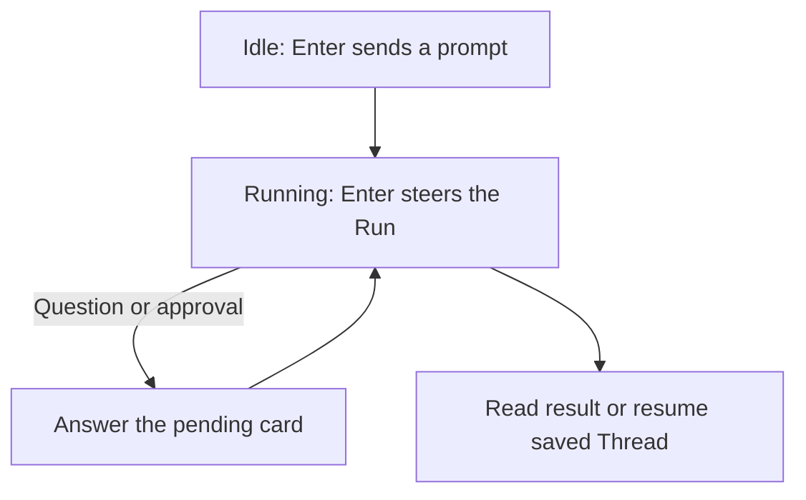

## Everyday interaction

Start in your repository with `a13n-harness-ui`. Type a prompt and press Enter to start a conversation: a root Thread that saves its history and settings. While the Agent works, Enter steers that Run rather than queuing another one; if a question or approval is pending, answer its card directly.



| Action                                              | Command or key                                                     |
| --------------------------------------------------- | ------------------------------------------------------------------ |
| Send the draft                                      | Enter                                                              |
| Insert a newline                                    | Ctrl+J or Alt+Enter                                                |
| Complete a slash command or supported argument      | Tab                                                                |
| Clear an idle draft; cancel active work             | Ctrl+C                                                             |
| Exit from an empty draft                            | Ctrl+D                                                             |
| Switch concise/detailed display                     | Ctrl+O or `/mode concise`, `/mode detailed`                        |
| Explain commands                                    | `/help` or `/help command`                                         |
| Start a new conversation without deleting history   | `/new`                                                             |
| Search and preview saved conversations              | `/resume`                                                          |
| Resume one saved conversation                       | `/resume <thread-id>`                                              |
| Read saved messages and tool details                | Ctrl+T or `/history`                                               |
| List/select configured Agents                       | `/agent`, `/agent agent-codex`, `/agent default`                   |
| Select temporary reasoning mode                     | `/pro`, `/pro on`, `/pro off`, `/pro reset`                        |
| Read/change reasoning                               | `/thinking`, `/thinking low`                                       |
| Toggle temporary Fast processing                    | `/fast`, `/fast on`, `/fast off`, `/fast ultrafast`, `/fast reset` |
| Read/change execution permissions                   | `/environment`, `/environment sandbox`                             |
| Show current settings, usage, and pending decisions | `/status`                                                          |
| Locate configuration and explain precedence         | `/config`                                                          |
| Steer the current Run with additional input         | Enter while running                                                |
| Cancel active work                                  | `/cancel`                                                          |
| Exit after cancelling and cleaning up active work   | `/quit` or `/exit`                                                 |

`/agent` changes the conversation's Agent for all later Runs, including its instructions, tools, tool-review policy, and default Model, while preserving conversation history and execution permissions. Create another Agent with `a13n-harness-ui add agent`.

`/model` opens a separate picker of configured Model resources. `/model <model-id>` changes only the Model and remembers your choice for this Project, without switching Agent or rewriting YAML. It survives `/new`, `/resume`, `/agent`, and TUI restarts. Resuming an old conversation uses its saved default Model when it has one; otherwise it uses the launch Project's preference, never its historical model. `/model default` clears the Project preference and returns to the selected Agent's Model. Selecting a Model or Agent clears temporary reasoning and service-tier settings; these settings are not part of the remembered preference. Both selection commands are unavailable during active work.

Other open TUI processes keep their current Model until restart. If the remembered Model was removed, startup falls back to the Agent's Model. `--agent`, one-shot `run`, and API callers skip this TUI preference.

### Work toward a Goal

Use `/goal <objective>` while idle when you want the Agent to keep checking whether its work meets a stated objective:

```text
/goal Implement the requested change, run its tests, and report any remaining blockers.
```

The initial response is check `0`. By default the same Agent can perform up to 10 additional checks, using its normal tools and execution permissions. A persistent Goal bar shows progress and the final outcome, including while you answer a question. Ctrl+C and `/cancel` still cancel execution. Goal mode does not broaden permissions or automatically approve tools.

The Agent completes the protocol by returning `[GOAL_COMPLETE]` on its own line. After summarization or compaction, it must first perform another audit against your original objective. **Verified is the Agent's own completion claim, not an independent review.** Exhaustion, cancellation, errors, and an unverified stop are not success.

Set `max_goal_iterations: 10` at the root of `a13n-harness-ui.yaml` to change the budget for new Goals. Zero or a negative value disables automatic follow-up checks. A suspended Goal keeps its captured budget when you answer its pending decision. Reopening a conversation alone never restarts unfinished work. Send ordinary input to return to normal behavior, or use `/goal` again to begin a new Goal and budget.

The WebUI offers the same policy through the **Goal** toggle in the composer header, on desktop and narrow screens. The selection applies to one Send, resets after confirmed acceptance, and stays selected if submission is rejected or uncertain. Open the Goal status for the original objective, audit state, and token totals. **Prepare new Goal** fills a draft for review; it does not send it.

### Find a saved conversation

`/resume` opens a conversation browser without changing your current conversation or draft. Rows use a manual name, or the first saved input when unnamed, and are ordered by saved conversation activity. The selected row immediately previews its latest saved input and reply. These are bounded excerpts, not AI-generated summaries; unfinished replies are labeled as progress.

| Conversation browser action                                         | Key               |
| ------------------------------------------------------------------- | ----------------- |
| Search names, IDs, and saved input/reply excerpts                   | Type in Search    |
| Select a row                                                        | Up / Down         |
| Load another result page                                            | PageUp / PageDown |
| Toggle current directory / all directories                          | Ctrl+A            |
| Inspect selected conversation's retained messages without switching | Ctrl+T            |
| Edit its name; an empty name restores the first-input label         | F2, then Enter    |
| Refresh results after changes or an error                           | F5                |
| Resume the selected conversation                                    | Enter             |
| Cancel naming or return to the original conversation                | Escape            |

The default search scope is this directory; Ctrl+A includes other directories and projectless conversations. Enter or `/resume <thread-id>` resumes using the **launch directory's Project and roots** while retaining history, Agent and execution permissions. Launch from the original Project's first root to keep its Project and directories. Browsing changes nothing; an active conversation cannot be resumed in another TUI.

Search, naming, preview, and history inspection make no model requests. Closing history returns to the same selection in the conversation browser. Cancelling the conversation browser or a failed resume preserves composer text, cursor, folded pastes, and attachments. A successful resume retains the existing policy of discarding only unchanged prior attachments.

Existing conversations remain resumable after upgrade. Older conversations have no saved excerpts until subsequent execution; they remain searchable by name and ID, and Ctrl+T still reads their retained messages. The upgrade does not scan or rewrite conversation checkpoints.

### Read retained history

`/resume <thread-id>` or `--resume <thread-id>` restores a saved conversation. Press Ctrl+T to browse history; use Up/PageUp for older pages and End for the latest. Close with Ctrl+T, q or Escape to return to your draft. Saved display history is separate from the Model's context: summarization and compaction keep already retained display content. A checkpoint covers its saved display position; newer live output can remain unsaved.

### Input, display, and status

Type `$` to list available Skills with short descriptions, then filter and complete the name. `$name` can appear within an ordinary prompt; `/` is reserved for commands.

Harness UI Agents inherit the default cold-start filter: after 3600 seconds without model activity, native cold compression can shorten already-consumed tool results. This is separate from transcript display limits.

Multiline paste remains a draft until Enter. Use Ctrl+J for a newline if your terminal intercepts Alt+Enter. A complete command name such as `/ps` runs the command. Unmatched slash text, such as `/ps-like output needs clearer colors`, is sent unchanged as ordinary input with a notice. Invalid arguments to a known command show an error and preserve the draft. The [Question Card](#answer-a-question) uses its own answer editor and scoped commands.

**Enter sends while idle and steers the active Run while working.** `/steer <message>` is the explicit alternative. Steering keeps authored order and appears in the transcript when applied at a model boundary; it does not immediately interrupt a tool or request. Idle input appears before admission, with any rejection marked explicitly.

Preparing, cancelling, or completed operations do not accept steering. Rejected or unconfirmed input stays in the draft, or is available through `/recover` if you have started another draft. It is never silently redirected to a new Run or resent automatically. Active-run Enter sends the complete draft, including inline images and file attachments, in authored order. Attachment-only steering is also supported with the same limits as an ordinary message. In an approval or question selector, Enter confirms that interaction instead.

Commands preserve Windows backslashes. Quote paths containing spaces, such as `/attach "C:\My Photos\image.png"`. External tool results use the pending decision interface rather than raw slash commands.

**Concise** shows Agent responses, short tool summaries and applied-edit previews. Press Ctrl+O or use `/mode detailed` to inspect retained arguments, tool output and full diffs without rerunning tools. Long lines wrap; large or unavailable content is marked as omitted rather than silently hidden. `/history` reads saved details independently of display mode.

Delegation rows show the child role, prompt excerpt and observed status. Use `/subagents` to inspect the child's result, or Ctrl+O for retained arguments and output. Summary and compaction panels show the generated text separately from execution status.

The status bar shows current state, requested Fast mode, cumulative observed tokens, latest root-request context percentage, cache, cost, Model and elapsed time as space allows. `--` means unavailable, not zero. Use `/status` for exact settings and `/usage details` for input/output/cache breakdowns. Token and cost totals include observed root, child and auxiliary-model requests; `ctx` concerns the latest root request only.

Image, audio, video, and document inputs remain native Harness content. TUI presentation shows compact media descriptions and available links, not base64. For integrators: AG-UI clients also receive structured media references and caller metadata such as `image_object_id`, so a frontend can resolve its own content without Harness UI returning image bytes.

### Tasks, usage, and terminal feedback

**System** labels distinguish command, steering, and cancellation feedback from Agent responses. File summaries shorten paths inside your launch directory; raw tool paths remain unchanged.

Press F2 to expand or collapse the task panel. It shows up to five saved task rows, active work first, with IDs and dependencies. The activity line shows subagent totals and observed background processes. These inspection commands also work during execution:

- `/subagents` lists up to 20 child executions, including completed work; `/subagents next` pages forward.
- `/subagents <execution-id>` opens retained details without switching conversations. Saved running work without local execution authority is marked unavailable.
- `/ps` shows up to 16 recent background-process observations with command, status, handle, and Run. Expand tool details for output.

Subagent totals come from saved records. Process counts cover only this conversation’s bounded live observations, including child Shell calls, not all Host processes. `+` means incomplete; unavailable does not mean exited. Switching conversations clears process observations.

`/status` shows the effective Agent, Model, reasoning, working directory (shown as `Workspace`), and latest root-request context footprint. `/usage` summarizes observed Thread tokens, cache and known model costs across root, child and auxiliary requests; `/usage details` shows their breakdown by model and source. WebUI usage details offer All, Root and Subagents scopes. These are recorded estimates, not a subscription invoice, and older history without usage records remains marked unavailable rather than guessed.

For a Codex Model, idle `/status` or `/usage subscription` shows each subscription window's **remaining percentage**, provider-reported local reset time, and available reset credits, without opening a menu. Missing limits are marked unavailable, not zero. Use `/usage reset` to review eligible credits: redeeming requires selecting an entitlement and explicitly confirming its account and redemption ID; **No** is the safe choice. A timeout or cancellation can leave the result unknown: keep this TUI open and use `/usage reset` to retry the same redemption ID. `/status` only reports the pending identity. A confirmed result remains confirmed even when the following usage refresh fails. OAuth token expiry is not a quota-reset time.

For a ChatGPT Model (`openai-chatgpt:`), idle `/status` and `/usage subscription` only report that subscription usage is unavailable and show a [Manage usage in ChatGPT](https://chatgpt.com/settings/usage) URL, without querying accounts or refreshing credentials. Numeric remaining allowance and reset times are not available in Harness UI; conversation token totals and Codex limits are not substitutes. Check that the browser uses the same ChatGPT account and workspace. `/usage reset` remains Codex-only.

A terminal bell announces a completed Run or a new decision. While idle, the first Ctrl+C clears the draft and immediately explains how to exit; a second within two seconds exits. Editing disarms that exit confirmation. During work, Ctrl+C acknowledges cancellation immediately and waits for owned cleanup rather than exiting early.

Unexpected execution or TUI failures write a private temporary JSON diagnostic report with exception chains, frame locations, version, and Thread ID, but no locals or transcript. Nothing is uploaded. Review exception messages for sensitive data before attaching the report to an issue. The recovery hint includes custom configuration/data paths; only already saved state is resumable, not unsent input or unsaved in-flight changes.

### Local host commands

Enter `!command` to run a command yourself on the local POSIX host, for example `!git status`. This is user-owned shell execution in the TUI's working directory with the host process environment, **outside the conversation's selected Environment, including Sandbox**. Selecting Sandbox for Agent tools does not sandbox `!command`. The command and its output are not injected into model context.

Local commands are accepted only while idle and outside interaction menus. A busy-state or menu rejection preserves the draft and attached files. Stdout and stderr are displayed as output events, followed by exit status and elapsed time. Commands are noninteractive: stdin receives EOF. Each command has a 120-second deadline and a combined 256 KiB output display limit; output beyond that limit is still drained rather than allowed to block the process.

Ctrl+C or `/cancel` terminates the owned process group and waits for cleanup before returning to idle. `!command` is explicitly unsupported on Windows until equivalent process-group cleanup is available; ordinary Windows CLI use and Agent tools remain supported under their existing execution contracts.

### Tool switches

Configure built-in tools in the root `a13n-harness-ui.yaml`:

```yaml
tools:
  enable_ask_user_question: true
  interaction_timeout_seconds: 120
  enable_codeact: true
```

`ask_user_question` is enabled by default. Set `enable_ask_user_question: false` to omit it from later Runs. Each displayed question waits up to `interaction_timeout_seconds` (a positive finite number). On timeout, the question call is returned as failed with an explicit no-answer message; no option is selected and no shell request is approved. A mixed batch still waits for its remaining decisions. `/cancel` keeps the request pending instead of returning a timeout.

CodeAct defaults on: restricted Python `run_code`/`run_program` plus `store`/`load`/`forget` for values in saved continuation. Host effects still require eligible tools and ordinary policy. Disable it with `enable_codeact: false`; configure advanced runner options in the Agent’s `codeact` Capability. Global switches and visibility filters take precedence. Changes apply to later Runs. TUI answer timeouts do not define one-shot or HTTP interaction lifetimes.

### Approvals and questions

Setup initializes the root `security.shell_review` shortcut for shell launches with an `extra_high` threshold and approval on flagged calls. It applies across Agents, including API-key connections. Non-timeout reviewer failures alone do not open approval; other tool-policy requirements still apply. Existing root settings and Agent files are preserved. Disabling the shortcut leaves explicit Agent policies untouched. See [shell review configuration](configuration-recipes.md#configure-shell-review).

Choose **Approve once**, **Deny** or **Deny with reason** using the displayed number or arrows and Enter. The reason editor uses Enter to submit, Ctrl+J/Alt+Enter for newline, and Esc to return. **Approve with edited arguments**, when offered, accepts a complete JSON object. Bound shell approvals cannot replace arguments; deny with a reason to request another command. Omitted arguments cannot be approved. Nothing is preselected, and free text cannot approve. Inspect risk, reason and command first; `/review request-id` opens retained details.

Requests needing an actual external result offer **Provide result** instead of approval. It opens a JSON editor; invalid JSON remains editable. Choosing this action does not run the tool or invent its result. **Deny** and **Deny with reason** work in both flows.

The active TUI uniformly waits up to `tools.interaction_timeout_seconds` for each approval, external result, or displayed question. Editing does not restart the timer. Timeout denies without an answer or approval. The separate reviewer Model deadline defaults to 120 seconds and also denies before dispatch on timeout. Neither is a durable server-side expiry of pending decisions.

From the action selector, `/cancel` discards local answers without approving anything; `/status` or resuming the conversation reopens pending decisions. Approvals and external results use this interface, not `/approve`, `/deny`, or `/result` commands.

#### Answer a question

A structured `ask_user_question` replaces the composer with a **Question Card**. Your draft, pastes, and attachments return when you leave the interaction. Scroll to read complete options. Clicking an option focuses it; wheel scrolling does not choose an answer.

| Action                                                      | Control                                                    |
| ----------------------------------------------------------- | ---------------------------------------------------------- |
| Move among choices                                          | Up / Down                                                  |
| Locate a numbered choice without submitting                 | Number keys                                                |
| Confirm a single choice or the current multiselect answer   | Enter                                                      |
| Toggle a choice in a multiselect question                   | Space                                                      |
| Scroll the card without changing the answer                 | PageUp / PageDown                                          |
| Write a custom answer                                       | Choose the custom-answer action, or press Tab / Ctrl+Space |
| Add a newline in the answer editor                          | Ctrl+J or Alt+Enter                                        |
| Submit typed answer text                                    | Enter in the editor                                        |
| Return from the editor to choices, keeping the answer draft | Tab / Ctrl+Space / Esc                                     |
| Cancel local collection and leave requests pending          | Esc from choices                                           |

The answer editor has its own draft: returning to choices and reopening it keeps your text, without replacing your saved composer draft. Up/Down edit the answer rather than recalling input history. A new question starts in selection mode with a fresh answer editor. Pasting multiline text does not submit it.

The answer editor accepts `/help`, `/mode`, `/status`, `/quit`, `/cancel`, `/theme`, `/mouse`, and `/review` as scoped commands. Other recognized commands are rejected and keep your draft; unmatched slash-prefixed input stays literal answer text. Ctrl+O inspects retained tool details, and Ctrl+T opens retained history without answering the question. Closing history returns to the card and its answer draft. These question controls do not change approval or setup selectors.

Answers are collected locally until the whole decision batch is ready. **Collected locally** and **Submitting question responses** show that submission is still pending; a question-and-answer receipt appears after a successful result. If you cancel collection, use `/status` to reopen the pending questions.

### Tasks and notes

Task, question and note tools are included by default. Use F2 for tasks and `/notes` for saved note values. The note panel shows up to 256 notes or 256 KiB and labels omissions. Changes appear after an operation or resume; Ctrl+O expands them. Set `configuration.notes_enabled: false` in the Agent's `working_state` Capability entry to disable notes.

### Theme, scrolling, paste, and attachments

- `/theme auto|dark|light` changes UI and Markdown syntax colors until you quit; `display.theme` sets the file default. Auto preserves your terminal foreground/background and ANSI palette; passive metadata selects syntax variants without consuming input.
- PageUp/PageDown scroll the bounded display history; Ctrl+End returns to following live output. Ctrl+T browses retained messages after display eviction.
- Scroll mode (`/mouse on`) routes the wheel to the panel under the pointer; selection mode (`/mouse off`) restores native copy/selection. Esc closes an interaction or completion first, otherwise toggles modes. Selectors scroll without choosing; click to highlight and Enter to confirm. Ctrl+Space switches focus. Question cards use Esc to leave the answer editor before cancelling. PageUp/PageDown and Ctrl+End work in both modes; scrolling up pauses live following and returning to the bottom resumes it.
- Ctrl+V, Alt+V, or `/paste-image` explicitly reads clipboard images. Normal text paste remains text and never submits itself. Some terminals intercept Ctrl+V; use Alt+V or the command there.
- `/attach "path/to/image.png"` or `/attach "path/to/notes.txt"` is the portable file fallback. Local Linux clipboard images require access to a display session and its helper (`wl-paste` for Wayland or `xclip` for X11); no helper is installed automatically.
- Over SSH, normal text paste still works through your terminal (Cmd+V in a macOS terminal). Image paste reads the clipboard on the host running the TUI, not your local computer. Installing a clipboard helper on the remote host does not forward your local clipboard. Upload the image first, for example with `scp`, then use `/attach <remote-path>`. Pasting a Mac `/Users/...` path does not upload the file. Clipboard failures explain the SSH boundary or missing local display/helper without clearing the draft; SSH detection does not block a working clipboard, such as a forwarded display.
- Images appear at the paste position as `[image#1]`, and files as `[file#2: requirements.md]`, inline with your instructions. File markers show the filename, not a parent path or content preview; long names are shortened in the middle. The same filename appears in the sent message and reopened history. Arrow keys cross each marker as one editing position; Backspace/Delete remove it as a whole, and Undo restores it with its content. Deleting a marker does not renumber the others in that draft. Idle Ctrl+C clears the draft. Up to eight attachments are accepted, with 10 MiB per file and 20 MiB total. PNG/JPEG/WebP/GIF images are validated and limited to 32 megapixels. Ordinary files remain available to the Agent through its Thread file mount.
- A `loading` marker stays where you pasted while you continue typing. Wait for it to finish before sending. A failed marker explains the problem and must be deleted before retrying. Deleting a pending marker or switching drafts prevents late image insertion. Sending preserves the text/image order; messages and reopened history keep the short markers without repeating internal image paths, MIME types, or byte counts. Typing or pasting the visible text `[image#1]` does not attach anything; plain input-history recall likewise restores labels as text, not pictures.
- Image-only and file-only prompts are supported. The selected Model must support the submitted modality; failures never silently drop images or switch Models. A failed pre-admission send restores its draft, or exposes `/recover` if you have already begun another draft. It is never resent automatically. A rejected `/new` or `/resume` also preserves attachments; failed commands restore their text or expose `/recover` without overwriting a newer draft.

### Long pasted text and Thread working files

Text pastes longer than 1000 characters fold into a compact `[Pasted text #N: ... chars]` marker. You can combine several blocks with your own instructions without filling the composer. Alt+E expands them for editing (moving the cursor inside a marker does the same); Backspace immediately after a marker (or Delete before it) removes the whole block. Enter submits the full authored text to the App, never the placeholder. Text paste does not inspect your clipboard for images and does not submit by itself.

Paste folding is display-only. Separately, authored text blocks strictly longer than `input.long_text_threshold_chars` (8000 Unicode characters by default) can be delivered to the model as retained text-file references. Enter restores the full authored text for App submission; it does not guarantee inline model delivery. See [long-text input policy](configuration.md#long-text-inputs) for disabling conversion, file-read prerequisites, fallback notices, failures, and attachment budgets.

The Agent has a `thread-files` Environment mount with `tmp/` for disposable downloads, scripts, conversions, and intermediate output. It belongs to the conversation, not an individual Run, and is reused after restarting the TUI. Submitted attachments are retained separately under `attachments/`; resuming a conversation does not depend on a clipboard temp file. Removing a draft marker does not delete a previously submitted file.

Oversized tool results are saved under the current Thread's `tmp/tool-results/`, including results from child Agents in their own Threads, rather than creating `.a13n/tmp/` in your Project. These particular files are Run-private: Harness attempts to remove them when the Run ends. They are not retained answers or attachments.

Temporary work is cleaned automatically at startup and hourly once it has been inactive for three days. An App conservatively protects every Thread directory it has used until it exits, including against cleanup by another local App. Cleanup never removes submitted attachments or Project files. Closing or archiving a conversation does not immediately delete its temporary directory. Do not store important final results in `tmp/`; ask the Agent to copy them to your Project or another chosen destination.

In Sandbox mode, a command running in the Project cannot automatically read a sibling Thread mount. Attachment processing must select a working directory inside the Thread mount. Custom providers can expose this mount through file tools only; the model sees the available operations. There is no additional remote-host or network permission grant.
