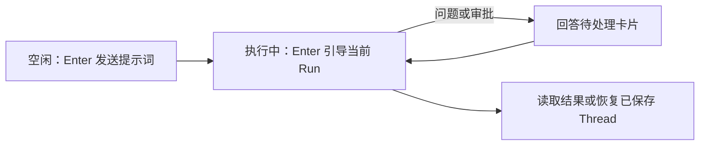

## 日常交互

在仓库目录中启动 `a13n-harness-ui`，输入任务并按 Enter。Agent 工作期间，Enter 会向当前 Run 补充指导，不会将另一轮执行排队；如有待回答的问题或审批，请直接操作对应卡片。



| 操作                           | 命令或按键                                                         |
| ------------------------------ | ------------------------------------------------------------------ |
| 发送草稿                       | Enter                                                              |
| 换行                           | Alt+Enter                                                          |
| 补全斜杠命令或支持的参数       | Tab                                                                |
| 清空空闲草稿；取消当前任务     | Ctrl+C                                                             |
| 在草稿为空时退出               | Ctrl+D                                                             |
| 切换简洁/详细显示              | Ctrl+O 或 `/mode concise`、`/mode detailed`                        |
| 查看命令说明                   | `/help` 或 `/help command`                                         |
| 开始新对话，保留历史           | `/new`                                                             |
| 搜索和预览已保存对话           | `/resume`                                                          |
| 恢复一段已保存对话             | `/resume session-id`                                               |
| 查看已保存消息和工具详情       | Ctrl+T 或 `/history`                                               |
| 列出/选择已配置 Agent          | `/agent`、`/agent agent-codex`、`/agent default`                   |
| 选择临时推理模式               | `/pro`、`/pro on`、`/pro off`、`/pro reset`                        |
| 查看/修改推理                  | `/thinking`、`/thinking low`                                       |
| 切换临时 Fast 处理             | `/fast`、`/fast on`、`/fast off`、`/fast ultrafast`、`/fast reset` |
| 查看/修改执行权限              | `/environment`、`/environment sandbox`                             |
| 查看当前设置、用量和待处理决策 | `/status`                                                          |
| 定位配置并了解优先级           | `/config`                                                          |
| 向当前 Run 补充指导            | 执行期间按 Enter                                                   |
| 取消当前任务                   | `/cancel`                                                          |
| 取消并清理当前任务后退出       | `/quit` 或 `/exit`                                                 |

`/agent` 为下一轮选择 Agent 的指令、工具、工具审查策略和默认模型，同时保留对话历史和执行权限。运行 `a13n-harness-ui add agent` 可创建其他 Agent。

`/model` 打开独立的已配置 Model 资源选择器。`/model <model-id>` 只改变模型，并为当前 Project 记住选择，不切换 Agent 或改写 YAML。该偏好会在 `/new`、`/resume`、`/agent` 和终端重启后保留。恢复旧对话时使用启动 Project 的偏好，不使用历史模型。`/model default` 清除 Project 偏好，回到所选 Agent 的模型。选择 Model 或 Agent 会清除临时推理和服务层级设置；这些设置不属于记住的偏好。两种选择命令在任务执行期间均不可用。

其他已打开终端会保留当前 Model，直到重启。如果记住的 Model 已移除，启动时回退到 Agent 的 Model。`--agent`、单次 `run` 和 API 调用方跳过该终端偏好。

### 围绕 Goal 持续工作

空闲时使用 `/goal <objective>`，让 Agent 持续检查工作是否满足指定目标：

```text
/goal Implement the requested change, run its tests, and report any remaining blockers.
```

首次响应是第 `0` 次检查。默认情况下，同一 Agent 可再检查最多 10 次，使用普通工具和执行权限。持续显示的 Goal 状态条会展示进度和最终结果，回答问题时也可见。Ctrl+C 和 `/cancel` 仍可取消执行。Goal 模式不会扩大权限或自动批准工具。

Agent 通过单独一行返回 `[GOAL_COMPLETE]` 完成协议。摘要或上下文压缩后，必须先针对原目标重新审查。**Verified 是 Agent 自己的完成声明，不是独立审查。** 预算耗尽、取消、错误和未经验证的停止都不算成功。

在 `a13n-harness-ui.yaml` 根级设置 `max_goal_iterations: 10` 可修改新 Goal 的预算。零或负数关闭自动后续检查。回答待处理决策时，挂起的 Goal 保留捕获的预算。仅重新打开对话不会重启未完成任务。发送普通输入恢复普通行为，或再次使用 `/goal` 开始新 Goal 和预算。

WebUI 输入框的 **Goal** 开关采用同一策略，在桌面和窄屏的标题栏均可直接操作。选择只应用于一次发送，确认接受后重置；提交被拒绝或结果不确定时保留选择。打开 Goal 状态可查看原目标、审查状态和 token 总量。**Prepare new Goal** 只填入草稿供检查，不会发送。

### 查找已保存对话

`/resume` 打开会话浏览器，不改变当前对话或草稿。列表使用手动名称；未命名时使用首次保存输入，并按已保存对话活动排序。选中行立即预览最近保存的输入和回复。这些是有上限的摘录，不是 AI 摘要；未完成回复标为进度。

| 浏览器操作                         | 按键              |
| ---------------------------------- | ----------------- |
| 搜索名称、ID 和已保存输入/回复摘录 | 在 Search 中输入  |
| 选择行                             | 上 / 下方向键     |
| 加载另一页结果                     | PageUp / PageDown |
| 切换当前目录 / 所有目录            | Ctrl+A            |
| 查看选中会话保留的消息，不切换对话 | Ctrl+T            |
| 编辑名称；空名称恢复首次输入标签   | F2，然后 Enter    |
| 修改或错误后刷新结果               | F5                |
| 恢复选中的会话                     | Enter             |
| 取消命名或返回原对话               | Escape            |

默认搜索范围是当前目录；Ctrl+A 纳入其他目录和无 Project 对话。Enter 或 `/resume <id>` 使用**启动目录的 Project 和根目录** 恢复，同时保留历史、Agent 和执行权限。要保留原工作区，应从原 Project 的第一个根目录启动。浏览不改变任何内容；活动会话不能在另一终端恢复。

搜索、命名、预览和历史查看都不发出模型请求。关闭历史返回同一浏览器选择。取消浏览器或恢复失败会保留输入框文本、光标、折叠粘贴和附件。恢复成功仍沿用原策略，只丢弃未变化的先前附件。

升级后已有对话仍可恢复。旧会话在后续执行前没有保存摘录，但仍能按名称和 ID 搜索，Ctrl+T 也可读取保留消息。升级不会扫描或改写对话检查点。

### 查看保留历史

`/resume <id>` 或 `--resume <id>` 恢复已保存对话的近期消息和设置。Ctrl+T 浏览保留历史；Up/PageUp 查看旧页，End 跳至最新内容。Ctrl+T、q 或 Escape 关闭并返回草稿。显示有上限，无法恢复模型上下文压缩后已经缺失的内容。

输入 `$` 列出可用 Skill 及简短描述，再筛选和补全名称。`$name` 可出现在普通提示中；`/` 专用于命令。

CLI Agent 继承默认冷启动过滤：3600 秒没有模型活动后，原生冷压缩可缩短已消费的工具结果。这与对话记录的显示限制不同。

带括号的多行粘贴会留在草稿中，直到按 Enter。Alt+Enter 支持因终端而异；通常编码为 Escape 后接 Enter。完整命令名（如 `/ps`）作为命令执行，并显示简短接受提示。未匹配输入（如 `/ps-like output needs clearer colors`）原样保留，并提示按普通文本处理。按照普通文本规则，空闲时成为消息，任务运行时成为指导，通用交互中成为回答。[问题卡片](#answer-a-question)有自己的受限控件和独立答案编辑器，不提供普通输入框，也不会从回答中运行任意聊天命令。已知命令参数无效或当前不可用时，仍显示错误并保留草稿，绝不静默变成模型提示。

**空闲时 Enter 发送消息，agent 运行时 Enter 补充文本指导。** 输入提示会随当前状态改变。仍可使用 `/steer <message>` 显式操作。指导通过当前 Harness Run 的原生输入队列添加；CLI 不重排消息，也不维护独立的下一轮队列。CLI 先简短确认发送，等模型边界应用后再将指导显示为输入。不显示队列回执或原始入队事件。发送不保证立即中断正在运行的工具或请求。普通空闲输入在受理前立即显示；拒绝会明确标记，草稿仍可恢复。

准备中、取消中或已完成的操作不接受指导。被拒绝或未确认输入保留在草稿中；开始其他草稿后可用 `/recover` 找回。不会静默转发到新 Run，也不会自动重发。活动 Run 中 Enter 会按编写顺序发送完整草稿，包括内联图像和文件附件。也支持只含附件的指导，限制与普通消息相同。在审批或问题选择器中，Enter 改为确认当前交互。

命令保留 Windows 反斜杠。含空格路径应加引号，如 `/attach "C:\\My Photos\\image.png"`。外部工具结果通过待处理决策界面提交，不使用原始斜杠命令。

**Concise** 显示助手文本、简短工具摘要和已应用编辑预览。Ctrl+O 或 `/mode detailed` 查看保留参数、工具输出和完整 diff，无须重新运行工具。长行自动换行；过大或不可用内容标为省略，不会静默隐藏。`/history` 独立于显示模式读取已保存详情。

委派行显示子角色、任务摘录和观测状态。用 `/subagents` 查看结果，或 Ctrl+O 查看保留参数和输出。摘要与压缩面板会将生成文本和执行状态分开显示。

状态栏按空间显示当前状态、请求的 Fast 模式、累计观测 token、最近根请求上下文百分比、缓存、费用、Model 和耗时。`--` 表示不可用，不是零。用 `/status` 查看确切设置，`/usage details` 查看输入/输出/缓存明细。token 和费用总量包含根级、子级和辅助模型的观测请求；`ctx` 只涉及最近根请求。

图像、音频、视频和文档输入保留为原生 Harness 内容。终端显示简明媒体描述和可用链接，不显示 base64。AG-UI 客户端还收到结构化媒体引用和 `image_object_id` 等调用方元数据，让前端自行解析内容，无须 CLI 返回图像字节。

### 任务、用量与终端反馈

指导交付、命令接受、回退和取消等系统反馈统一使用 **System** 标签和低强调文本，与助手回答区分。结构化状态/帮助内容保留适合阅读的格式。

文件工具摘要（`view`、`write`、`edit`、`multi_edit` 和 `ls`）及编辑面板标题，对 Harness UI 启动目录内的文件使用相对路径。外部路径保持绝对。这只缩短显示；工具仍收到原路径，展开的原始参数/结果不变。

原生任务面板与工具输出之间有全宽分隔线，即使折叠时也保留。面板最多显示五行，活动任务优先，并显示任务 ID 和依赖提示。F2 展开或折叠。计数和状态来自已提交任务事实和所选续接，不从工具文本猜测。面板大小有上限，保证短终端中输入框仍可用。

状态栏上方、输入框外的独立活动行，显示对话 subagent 执行总数和观测到的运行中后台进程。生命周期提示使用低强调 Activity 文本，不使用用户输入标记。可通过命令查看详情：

- `/subagents` 最多列出 App 中 20 个子级执行，包括已完成任务；`/subagents next` 读取下一页。状态和 Agent 名称突出显示，ID 和元数据低强调显示。详情标题使用同一状态颜色；已保存为运行状态但无本地执行权限时，明确标为不可用，不标为活动。
- `/subagents <execution-id>` 显示已有子级详情和保留输出预览，不切换对话。
- `/ps` 显示最多 16 个近期后台进程观测：命令、最后报告状态、进程句柄和 Run。展开工具详情查看输出。前台调用不增加后台计数。

agent 运行时也可使用这些命令。subagent 总数来自已保存 App 记录；进程计数只来自当前对话有上限的实时观测，包括子级 Shell 调用，不是全宿主机进程清单。`+` 计数表示观测不完整；不可用状态不能确认进程已退出。开始或恢复其他对话会清除进程观测，不会根据历史编造。

`/status` 显示实际 Agent、Model、推理、工作区和最近根请求上下文占用。`/usage` 汇总 Thread 的根级、子级和辅助请求的观测 token、缓存及已知模型费用；`/usage details` 按模型和来源展开。WebUI 用量详情提供 All、Root 和 Subagents 范围。这些是记录的估计，不是订阅账单；缺少用量记录的旧历史仍标为不可用，不会猜测。

Codex 模型在空闲时，`/status` 或 `/usage subscription` 直接显示各订阅窗口的**剩余百分比**、提供方报告的本地重置时间和可用重置额度，不打开菜单。缺失限制标为不可用，不是零。用 `/usage reset` 检查可用额度：兑换需选择权益，并显式确认账户和兑换 ID；**No** 是安全选项。超时或取消可能使结果未知：保留当前终端，用 `/usage reset` 重试相同兑换 ID。`/status` 只报告待处理身份。后续用量刷新失败不会改变已确认结果。OAuth token 过期时间不是配额重置时间。

ChatGPT Model（`openai-chatgpt:`）在空闲时，`/status` 和 `/usage subscription` 只提示订阅用量不可用，并显示[在 ChatGPT 中管理用量](https://chatgpt.com/settings/usage) URL，不查询账户或刷新凭据。Harness UI 暂不能读取剩余额度和重置时间；会话 token 总量与 Codex 限制都不能替代 ChatGPT 订阅额度。请确认浏览器使用的是同一 ChatGPT 账户和工作区。`/usage reset` 仍仅适用于 Codex。

终端响铃通知 Run 完成或出现新决策。空闲时第一次 Ctrl+C 清空草稿并立即说明退出方式；两秒内再次按下会退出。编辑会解除退出确认。执行期间 Ctrl+C 立即确认取消，并等待所属资源清理，不会提前退出。

意外执行或终端故障会生成私有临时 JSON 诊断报告，包含异常链、栈帧位置、版本和会话身份，不含局部变量或对话记录。不会上传任何内容。将报告附到 Issue 前，检查异常消息中的敏感数据。恢复提示包含自定义配置/数据路径；只有已保存状态可恢复，未发送输入和未保存的进行中修改不能恢复。

### 本地宿主机命令

输入 `!command` 可自己在本地 POSIX 宿主机执行命令，例如 `!git status`。这是用户发起的 shell 执行，在 CLI 工作目录中使用宿主进程环境，**位于模型所选 Environment 和 Sandbox 之外**。为模型工具选择 Sandbox 不会隔离 `!command`。命令和输出不会注入模型上下文。

本地命令仅在空闲、交互菜单之外接受。忙碌状态或菜单拒绝会保留草稿和附件。stdout 和 stderr 显示为输出事件，再显示退出状态和耗时。命令非交互式，stdin 收到 EOF。每条命令期限 120 秒，合并输出显示上限 256 KiB；超限输出仍会排空，避免阻塞进程。

Ctrl+C 或 `/cancel` 终止所属进程组，等待清理后回到空闲。Windows 尚无等效进程组清理，因此明确不支持 `!command`；普通 Windows CLI 和模型工具仍按已有执行契约受支持。

### 工具开关

在根 `a13n-harness-ui.yaml` 中配置内置工具：

```yaml
tools:
  enable_ask_user_question: true
  interaction_timeout_seconds: 120
  enable_codeact: true
```

`ask_user_question` 默认开启。设置 `enable_ask_user_question: false` 可从后续 Run 移除。每个显示问题最多等待 `interaction_timeout_seconds`（正有限数）。超时后问题调用返回失败，并明确说明未收到回答；不会选答案或批准 shell 请求。混合批次仍等待剩余决策。`/cancel` 保持请求待处理，不返回超时。

CodeAct 默认开启，提供 Harness 受限 Python `run_code` 和 `run_program`，以及 `store`、`load` 和 `forget`，用来显式保留已保存续接中的值。`enable_codeact: false` 从后续 Run 移除这些工具。它不是无限制的宿主机 Python shell：宿主机效果仍通过符合条件的工具和普通策略执行。Agent `codeact` Capability 配置可编写高级原生 runner 设置。两项全局开关优先于编写的能力选择；已有工具可见性过滤仍适用。已接受修改影响后续 Run，不影响已捕获执行。交互等待策略只适用于 TUI 收集回答期间；单次运行和 HTTP 调用方保留自己的交互生命周期。

### 审批与提问

设置向导为 shell 启动初始化根 `security.shell_review`，采用 `extra_high` 阈值，并对标记调用请求审批。适用于所有 Agent，包括 API 密钥连接。只有非超时审查错误不会单独触发审批；其他工具策略要求仍适用。现有根设置和 Agent 文件保留。关闭快捷配置不会改变显式 Agent 策略。见 [shell 审查配置](configuration-recipes.md#configure-tool-review)。

审批提供 **Approve once**、**Deny** 和 **Deny with reason** 。输入显示编号，或用方向键和 Enter 选择。**Deny with reason** 打开文本编辑器；Enter 提交原因，Alt+Enter 换行，Esc 或 `/cancel` 返回选择。支持时，**Approve with edited arguments** 打开完整 JSON 对象编辑器。绑定的 shell 审批不允许替换参数；应拒绝并说明原因，以请求其他命令。参数省略时移除审批动作，因此按显示编号操作。不预选任何项，普通自由文本不能批准。shell 审查先显示风险和原因，再显示突出命令；通用工具显示可用目标、原因、风险和参数。`/review request-id` 查看保留详情。

需要真实外部结果的请求提供 **Provide result**，而不是审批。它打开 JSON 编辑器；无效 JSON 保持可编辑。选择此动作不会运行工具或编造结果。两种流程都支持 **Deny** 和 **Deny with reason** 。

活动 CLI 对每个审批、外部结果或显示问题统一最多等待 `tools.interaction_timeout_seconds`。编辑不重启计时。超时不回答、不批准，而是拒绝。独立 AI 审查期限默认 120 秒，超时也会在派发前拒绝。两者都不是待处理决策的持久服务器端到期机制。

在动作选择器中，`/cancel` 丢弃本地答案，不批准任何内容；`/status` 或恢复对话会重新打开待处理决策。审批和外部结果使用此界面，不使用 `/approve`、`/deny` 或 `/result` 命令。

#### 回答问题

结构化 `ask_user_question` 用一张**问题卡片** 替换普通聊天输入框。退出交互时，保存的聊天草稿、粘贴文本和附件会恢复。问题不会在卡片上方重复显示为 System 块。单个问题没有 `1/1` 计数。

卡片完整显示选项标签和描述，按终端宽度对长文本、段落和 CJK 字符换行。即使单项比视口更高，也可在卡片内滚动阅读。在 Scroll 鼠标模式下，点击选项任意换行行会聚焦该选项；滚轮只移动视图，不选择答案。

| 操作                           | 控件                                    |
| ------------------------------ | --------------------------------------- |
| 在选项间移动                   | 上 / 下方向键                           |
| 定位编号选项而不提交           | 数字键                                  |
| 确认单选或当前多选答案         | Enter                                   |
| 切换多选问题中的选项           | Space                                   |
| 滚动卡片而不改变答案           | PageUp / PageDown                       |
| 编写自定义回答                 | 选择自定义回答动作，或 Tab / Ctrl+Space |
| 在答案编辑器中换行             | Alt+Enter                               |
| 提交输入的答案                 | 在编辑器中按 Enter                      |
| 从编辑器返回选择并保留答案草稿 | Tab / Ctrl+Space / Esc                  |
| 取消本地收集，保持请求待处理   | 在选择界面按 Esc                        |

答案编辑器有独立草稿：返回选择再打开时保留文本，不会替换已保存聊天草稿。上/下方向键编辑答案，不调用聊天历史。新问题以选择模式打开全新答案编辑器。粘贴多行文本不会提交。

答案编辑器接受 `/help`、`/mode`、`/status`、`/quit`、`/cancel`、`/theme`、`/mouse` 和 `/review` 作为受限命令。其他已识别命令会被拒绝并保留草稿；未匹配的斜杠输入保持为字面答案文本。Ctrl+O 查看保留工具详情，Ctrl+T 打开保留历史，都不回答问题。关闭历史返回卡片和答案草稿。这些问题控件不改变审批或设置选择器。

答案先在本地收集，直到整个决策批次准备好。**Collected locally** 和 **Submitting question responses** 表示仍待提交；成功后显示问题与回答回执。取消收集后，可用 `/status` 重新打开待回答问题。

#### 任务与笔记

默认包含任务、问题和笔记工具。F2 查看任务，`/notes` 查看保存的笔记值。笔记面板最多显示 256 条或 256 KiB，并标明省略。修改在操作或恢复后出现；Ctrl+O 展开。在 Agent `working_state` Capability 条目中设置 `configuration.notes_enabled: false` 可关闭笔记。

### 主题、滚动、粘贴与附件

- `/theme auto|dark|light` 修改当前会话的 UI 和 Markdown 语法颜色；`display.theme` 设置文件默认值。Auto 保留终端前景/背景和 ANSI 调色板；被动元数据选择语法样式，不消费输入。
- PageUp/PageDown 滚动有上限的显示历史；Ctrl+End 恢复跟随实时输出。显示内容淘汰后，Ctrl+T 浏览保留消息。
- 默认使用 Scroll 模式（`/mouse on`）。滚轮事件由鼠标所在的对话记录、选择器或输入框处理。选择器中滚动只浏览；点击高亮，Enter 确认。Ctrl+Space 在通用选择器/输入框间切换键盘焦点；问题卡片则在选项与答案编辑器间切换。Esc 先从编辑器返回选择，再次才能取消收集。其他情况中，Esc 优先关闭交互/补全；均未打开时切换滚动/选择。Select 模式（`/mouse off`）恢复原生选择/复制，不提供应用滚轮路由。PageUp/PageDown 和 Ctrl+End 在两种模式均可用。窄对话布局的输入标题显示当前 `Scroll` 或 `Select`，底部显示 Esc 切换动作。向上滚动暂停跟随；回到底部恢复。代码渲染不使用带内边距的背景和 OSC 超链接。
- Ctrl+V、Alt+V 或 `/paste-image` 显式读取剪贴板图像。普通文本粘贴仍是文本，不会自动提交。某些终端拦截 Ctrl+V，此时用 Alt+V 或命令。
- `/attach "path/to/image.png"` 或 `/attach "path/to/notes.txt"` 是跨平台的文件备用方式。本地 Linux 剪贴板图像要求能访问显示会话及相应工具（Wayland 使用 `wl-paste`，X11 使用 `xclip`）；系统不会自动安装这些工具。
- 通过 SSH 时，普通文本仍可通过终端粘贴（macOS 终端使用 Cmd+V）。图像粘贴读取运行 TUI 的宿主机剪贴板，不读取你的本地计算机。在远程宿主机安装剪贴板工具不会转发本地剪贴板。先用 `scp` 等方式上传图像，再用 `/attach <remote-path>`。粘贴 Mac 的 `/Users/...` 路径不会上传文件。剪贴板失败会说明 SSH 边界或缺失的本地显示/工具，不清空草稿；SSH 检测不会阻止已经可用的剪贴板，例如转发的显示会话。
- 图像在粘贴位置显示为 `[image#1]`，文件显示为 `[file#2: requirements.md]`，与指令内联。文件标记显示文件名，不显示父路径或内容预览；长名称在中间缩短。发送消息和重开历史使用同一文件名。方向键将每个标记视为一个编辑位置；Backspace/Delete 整体删除，Undo 连同内容恢复。删除标记不重新编号其他标记。空闲 Ctrl+C 清空草稿。最多八个附件，每文件 10 MiB，合计 20 MiB。PNG/JPEG/WebP/GIF 图像经过验证，最多 3200 万像素。普通文件通过 Thread 文件挂载供 agent 使用。
- 你继续输入时，`loading` 标记留在粘贴处。发送前等待加载完成。失败标记会解释问题，重试前必须删除。删除待加载标记或切换草稿可防止稍后插入图像。发送保留文本/图像顺序；消息和重开历史保留短标记，不重复内部图像路径、MIME 类型或字节数。输入或粘贴可见文本 `[image#1]` 不会附加图像；普通输入历史回忆也只恢复文本标签，不恢复图片。
- 支持只有图像或文件的提示。所选模型必须支持提交模态；失败不会静默丢弃图像或切换模型。受理前发送失败会恢复草稿；已开始其他草稿时提供 `/recover`。绝不自动重发。被拒的 `/new` 或 `/resume` 也保留附件；失败命令恢复文本或提供 `/recover`，不覆盖新草稿。

### 长粘贴文本与 Thread 工作文件

超过 1000 字符的粘贴文本折叠为紧凑 `[Pasted text #N: ... chars]` 标记。可将多个文本块与自己的指令组合，不占满输入框。Alt+E 展开编辑（光标移入标记也一样）；标记后 Backspace 或标记前 Delete 删除整块。Enter 向 App 提交完整原文，绝不提交占位符。文本粘贴不检查剪贴板图像，也不自动提交。

粘贴折叠只影响显示。另有独立策略：原文块严格超过 `input.long_text_threshold_chars`（默认 8000 个 Unicode 字符）时，可作为保留文本文件引用交给模型。Enter 为 App 提交还原完整原文，不保证模型以内联方式收到。关闭转换、文件读取前置条件、回退提示、故障和附件预算见[长文本输入策略](configuration.md#long-text-inputs)。

agent 有 `thread-files` Environment 挂载，其 `tmp/` 用于可丢弃的下载、脚本、转换和中间输出。它属于对话，不属于单次 Run，CLI 重启后复用。已提交附件独立保留在 `attachments/`；恢复对话不依赖剪贴板临时文件。移除草稿标记不删除已提交文件。

过大工具结果保存在当前 Thread 的 `tmp/tool-results/`，子 Agent 的结果保存在其自己的 Thread 下，不在 Project 中创建 `.a13n/tmp/`。这些特定文件仅属于 Run：Harness 会在 Run 结束时尝试删除。它们不是保留回答或附件。

临时工作在不活动三天后，于启动时和每小时自动清理。App 会保守地保护它使用过的每个 Thread 目录直到退出，也防止其他本地 App 清理。清理绝不移除已提交附件或 Project 文件。关闭或归档对话不会立即删除临时目录。不要在 `tmp/` 存放重要最终结果；让 agent 将其复制到 Project 或其他选中位置。

Sandbox 中，在 Project 运行的命令不能自动读取同级 Thread 挂载。处理附件必须选择 Thread 挂载内的工作目录。自定义 provider 可仅通过文件工具暴露该挂载；模型会看到可用操作。这不会额外授予远程宿主机或网络权限。
