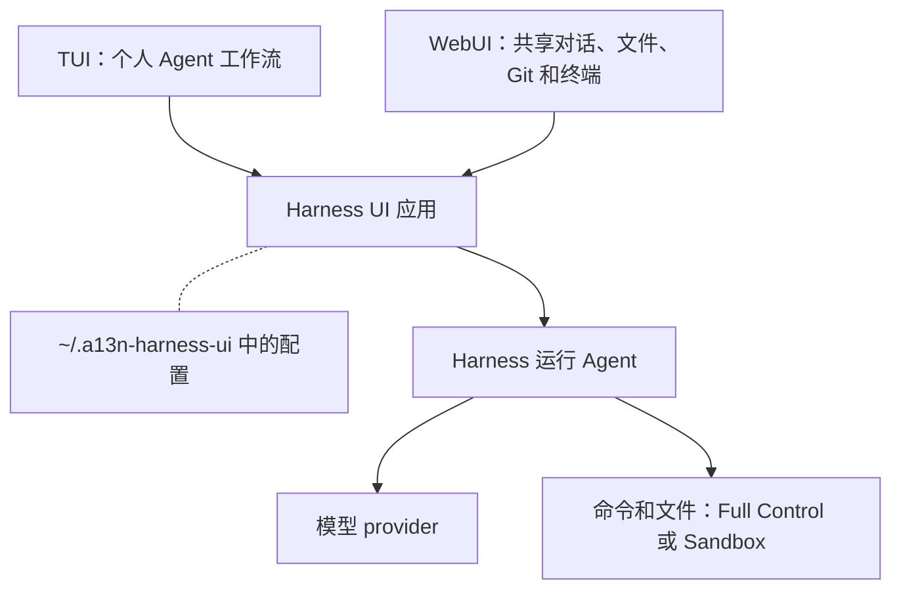

Harness UI 是面向个人和可信小团队的 [Harness](../a13n-harness/index.md) 交互式试验工作台。让 Agent 解释代码库、修改文件、运行检查或委派调查，并为每种工作流选择 Model、工具、Skill 和执行 Environment。

TUI 是终端中的交互界面，提供个人 Agent 编程工作流。WebUI 是浏览器中的界面，还支持共享对话和草稿、文件、Git 变更、终端和配置编辑。两者使用同一个 Harness UI 应用和 Harness，无须编写 SDK 代码或部署 Service。



## 安装并启动

使用 [uv](https://docs.astral.sh/uv/getting-started/installation/) 安装 `a13n-harness-ui` 命令：

```console
uv tool install a13n-harness-ui
cd your-repository
a13n-harness-ui
```

要启动 WebUI，运行：

```console
a13n-harness-ui webui
```

在浏览器中打开服务器打印的登录链接。WebUI 内提供设置向导；协作、身份验证、宿主机原生访问和服务器生命周期见 [WebUI](webui.md)。

TUI 支持 macOS、Linux 和 Windows。安装后的应用不需要 Node.js 或仓库检出目录。如果 PATH 中找不到命令，运行 `uv tool update-shell`，然后打开新终端。

首次启动时：

1. 通过受支持的订阅或 API 密钥连接 Model。
2. 选择设置向导提供的模型和设置。
3. 选择 Full Control 或 Sandbox 执行。
4. 设置向导保存配置并打开输入框后，发送提示。

先试一条范围明确的提示：

```text
Explain this repository's main entry point and tests. Do not modify any files.
```

> [!WARNING]
> Full Control 使用宿主机账户。Sandbox 要求受支持的 Linux/macOS 隔离机制；Windows 内置执行仅支持 Full Control。见[执行权限](environments-and-projects.md#execution-permissions)。

[安装与升级](installation.md)介绍源码开发和依赖更新；[设置](setup.md)介绍登录、取消和高级选项。

## 配置在哪里？

在 shell 中运行：

```console
a13n-harness-ui config path
a13n-harness-ui config show --format json
a13n-harness-ui config validate
```

也可以在 TUI 中输入 `/config`。默认根配置文件是 **`~/.a13n-harness-ui/a13n-harness-ui.yaml`**。Model 和 Agent 资源位于同级目录中，而不是写在该文件内：

| 要修改的内容                   | 文件或操作                                                                               |
| ------------------------------ | ---------------------------------------------------------------------------------------- |
| 默认 Agent、显示、内置工具     | `a13n-harness-ui.yaml`，见[根配置参考](configuration.md#starter-root-document)           |
| 模型、端点、凭据、推理、上下文 | `models/*.yaml`，见[Model 参考](models-and-authentication.md#model-file-reference)       |
| 指令、工具、MCP 选择、子级     | `agents/*.yaml`，见[Agent 参考](agents-and-subagents.md#agent-file-reference)            |
| 全局编程指导                   | 根 YAML 旁的 `AGENTS.md`                                                                 |
| Project 专用指导               | 工作目录中的 `AGENTS.md`                                                                 |
| 额外 Project 目录（根目录）    | `projects/*.yaml`，见[Project 参考](environments-and-projects.md#project-file-reference) |

需要可直接复制的修改示例时，从[常见配置用法](configuration-recipes.md)开始；要了解所有根字段和优先级，阅读[配置指南](configuration.md)。`--config PATH` 选择另一棵配置树，不会将其与默认配置树合并。

## TUI 操作

| 操作                            | TUI 中的操作         |
| ------------------------------- | -------------------- |
| 查看可用命令                    | `/help`              |
| 切换 Agent                      | `/agent`             |
| 选择并记住每个 Project 的 Model | `/model`             |
| 修改推理或优先服务              | `/thinking`、`/fast` |
| 修改执行权限                    | `/environment`       |
| 查看当前配置和用量              | `/status`            |
| 浏览已保存的对话                | `/resume`            |
| 引导正在执行的工作              | 输入消息并按 Enter   |
| 取消执行                        | Ctrl+C 或 `/cancel`  |

附件、审批、提问、历史和恢复见[使用 TUI](everyday-use.md)。在 TUI 之外运行 `a13n-harness-ui add model` 或 `a13n-harness-ui add agent`，可以添加可复用资源。

## 进一步使用

- **自定义：**[Agent 与 subagent](agents-and-subagents.md)、[模型与身份验证](models-and-authentication.md)。
- **连接工具：**[MCP 与扩展](extensions-and-mcp.md)、[原生工具与 Web 提供方](native-and-web-tools.md)。
- **跨目录工作：**[环境与 Project](environments-and-projects.md)。
- **自动化 Run 或排查故障：**[自动化与故障排查](automation-and-troubleshooting.md)。
- **构建其他界面：**[嵌入 Python App](embedding.md)或[使用 HTTP API](http-api.md)。

## 共享与执行边界

WebUI 实例只应与可信协作者共享：大家共用凭据、配置和可访问文件，没有分别设置的参与者权限。宿主机原生文件访问和终端默认开启；`--no-share-computer` 可以关闭它们，且与 Agent 的执行模式相互独立。

活动执行需要应用保持运行。关闭浏览器不会停止 Run。应用重启后，从最后保存的检查点继续。需要受管理的身份和可恢复的 Run 时，使用 [Service](../a13n-service/index.md)。
