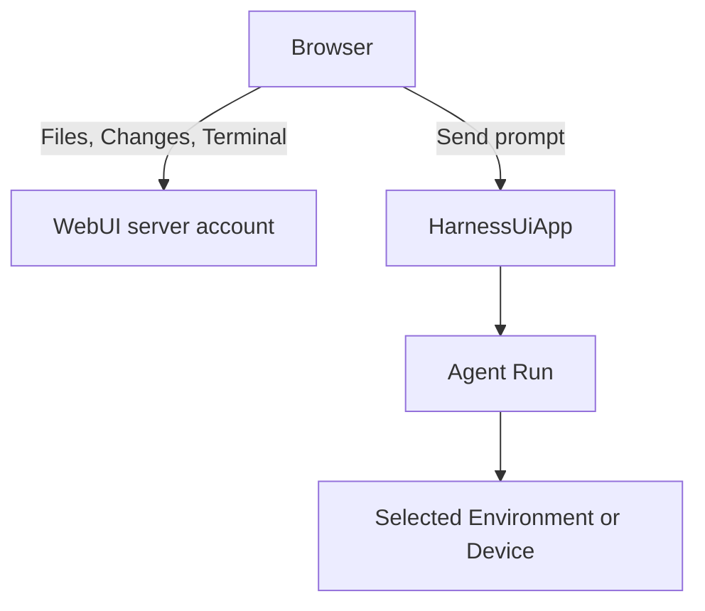

WebUI, the browser workbench, is Harness UI's collaborative playground for individuals and trusted small teams. It shares the same `HarnessUiApp` as the TUI, with conversations, execution controls, setup, provider accounts, configuration, and Environment readiness. WebUI is not Console and does not provide separate participant permissions or tenant isolation. Each conversation is one root Thread and its saved history.

Start the server, open its printed login link, connect a model, and send a first prompt. Keep the server process running while you work. Review [authentication](#authentication-and-key-retention) before sharing the instance.

## Start the server

Chat is the main view; **Files** and **Changes** open beside it, and **Terminal** below. Git viewing requires Git; native terminals require a POSIX Host. Comment controls are disabled, but saved comments remain available through the API.

```bash
a13n-harness-ui webui                       # 127.0.0.1:8765, generated per-process API key
a13n-harness-ui webui --host 127.0.0.1 --port 9000
a13n-harness-ui webui --no-share-computer   # Opt out of native computer sharing
```

Native [Files](http-api.md#native-host-files), [Changes](http-api.md#native-git-changes), and [Terminal](http-api.md#native-terminal) access is enabled by default. These panels use the server account or container mounts, **not** the Agent's selected Environment. Use `--no-share-computer` to disable them without changing shared chat, [drafts](http-api.md#shared-composer), or [page presence](http-api.md#page-presence). Git changes in the workbench are read-only; use a deliberate shell action for Git mutations. Presence and shared drafts are live state, not saved continuation.



Markdown opens in **Preview**; **Text** switches to the editor. Preview includes unsaved edits. **Add to chat** attaches selected source lines, or the complete file when nothing is selected, without sending. Agent links in the form `/threads/{root_thread_id}?native=files&native_path={URL-encoded absolute Host path}` open the Files drawer. Bare paths and Files API URLs do not; external links open separately.

## Observe Memory

The **Memory** button in the bottom-left navigation opens an observation-only Memory page when Memory is enabled. Global memory is separate from Project scopes. The center reuses conversation history, live tool activity and **Inspect & usage**, but has no input area or manual execution controls. Each automatic organization Run starts with fresh model context while previous rounds and recorded usage remain visible, including after server restart.

The right panel shows **current** scope files, not historical snapshots. You can inspect files even before the first organization Run; opening a scope never starts one. The viewer is read-only and works without Host computer sharing. To edit memory, change the files under `memory/` beside the selected root configuration through Host access to the server, for example in a shell or an editor.

Memory controls stay in **Settings → General**. Turning off automatic organization keeps the Memory button and viewer available; turning off Memory hides the button. Neither switch deletes files or saved history.

## Work with a Coordinator

Select a Project, enable **Coordinator** in the composer, and send an objective. This creates a Coordinator, or converts an existing ordinary conversation before sending. On narrow screens, the toggle stays in the composer header. Each Project can have several Coordinators; **Goal** is an independent option; see [Work toward a Goal](everyday-use.md#work-toward-a-goal).

The role is permanent after creation or conversion. If sending fails afterward, the conversation remains a Coordinator and your input stays available for retry. A Coordinator requires a Project.

Alternatively, open an existing conversation's actions or **Conversation details**, choose **Make Coordinator**, and confirm. It must be idle, unarchived, project-bound and have no pending decisions. Promotion keeps its URL, history, title and settings; the role is permanent. Workers cannot be promoted, and existing conversations, including conversations created earlier through [Sidekick](#agent-collaboration-and-sidekick), are not adopted.

The Coordinator creates workers, answers their questions, and integrates verified results. Expand its sidebar row to see its workers. Each worker is a root conversation with its own history and human controls, not a Subagent. Workers appear under their owner rather than again in Running or Recent; search labels them **Coordinator worker** and keeps the owner reachable.

To assign work yourself, choose **New worker** in the Coordinator's actions. Write and send the assignment directly in the new conversation; the Coordinator does not relay it. **Managed by · name** replaces the Coordinator toggle and fixes the Project. Before creation, its remove button changes the draft to an independent conversation without losing your message, attachments or selections. After creation the label is fixed, even if sending fails. Uncertain creation keeps the assignment locked until you inspect the retained conversation. The same owner label remains in existing worker composers.

Choose **Pause automatic follow-up** or **Enable automatic follow-up** in the Coordinator menu. The shared setting controls lifecycle notifications, not manual work or worker execution. New Coordinators enable follow-up; migrated ones retain their setting. Sidekick supplies defaults for Agent-created workers, while manually created workers use the composer choices. Disabling Sidekick does not disable Coordinators or follow-up.

Automatic follow-up attempts to notify the Coordinator when you first submit work directly to a worker, or when an owned worker finishes, fails, is cancelled or waits for input. The Coordinator inspects saved results before treating work as complete. Delivery is best effort, with no retry or restart replay. Closing the browser leaves this running; stopping the Coordinator neither stops its workers nor pauses later notifications. Question and approval deadlines still apply.

## Star important conversations

Hover or focus a conversation row, open its **…** menu, and choose **Star conversation**. On touch screens the **…** button is visible without hovering. A filled star then stays visible beside the menu; choose **Unstar conversation** to remove it. Stars are shared with everyone using the instance, not personal bookmarks, and survive browser changes and server restarts.

Starred conversations stay above the five ordinary **Recent** rows. Running and unread **New results** take priority without duplicates. Stars do not change visit time. Archive hides the conversation but retains its star. Workers remain nested under their Coordinator.

## Find unfinished input

**Drafts**, below conversation search, opens a list of saved conversations with unfinished shared input, even when their Projects are collapsed or they are outside the recent list. Each entry includes its Project name. A **Draft** marker also appears beside the conversation in ordinary lists, without replacing running or unread-result indicators. **Drafts** stays visible while you search or filter the lists below it.

Opening a conversation does not dismiss the reminder. Send successfully and clear the captured input, or remove the text and selected attachments yourself; edits added concurrently remain marked. Pending and failed attachment uploads count, but whitespace and changes to composer settings do not. Archiving removes the conversation from **Drafts** without discarding the draft.

These are shared conversation drafts, not a personal queue. Synchronized drafts can be rediscovered after refreshing the browser while the same server is running; server restart discards them. The separate, not-yet-created New conversation draft still opens through Home.

## Agent and Model settings

The composer footer right-aligns the current Agent and Model names as a read-only summary. Use the adjacent **Agent & Model settings** icon to change them. Agent, Model, and Reasoning mode open their choices inside the same panel; Thinking levels and the Fast button are directly available on the overview. Each has a **Use default** action to restore inherited settings instead of guessing an explicit equivalent.

On phones, the panel opens as a bottom sheet. **Goal**, **Coordinator**, and **Environments** remain in the composer header. On every screen size, the **Clear context** eraser beside attachments starts the next message without previous model messages, notes, tasks, or other saved Agent working state. Pending questions and approvals are discarded; chat history, files, conversation settings and unsent input are kept.

## Fast mode

Open **Agent & Model settings** and choose **Fast**, or **Ultrafast** on a supported Codex connection. The buttons are mutually exclusive; clicking the selected button requests Off. **Use default** inherits the Model setting; **Provider default** is not Off.

The choice affects subsequent Sends in this tab, not steering, thinking, or saved Model configuration. Changing Agent or Model clears it. The Context / Cost / Cache / Time row shows the active or saved Run's captured **On**, **Off**, **Ultrafast**, or **Default**, not the next Send. A dash means unavailable.

OpenAI/Codex, supported direct Anthropic, and supported Gemini connections use their native speed controls. Ultrafast is supported for `openai-codex:gpt-6-astra`. Unsupported choices are disabled with a reason. Requested speed is not guaranteed; the provider controls eligibility and charges, and higher usage rates may apply.

## Navigate conversation inputs

Use the left input rail, or **Input history** on narrow screens, to preview and revisit ordinary inputs. Steering stays in its original turn. Selecting an older input loads its saved history window; **Load later messages** and **Back to latest** return toward current work without resubmitting input.

Inputs, applied steering and Agent text stay in chronological order. **Execution details** groups the activity between them and starts collapsed. Expand a section to inspect it; mobile opens a full-screen reader. Counts cover only that section’s loaded tool calls.

Missing turn content loads automatically, with **Retry loading turn** on failure. Pending decisions stay actionable outside the disclosures. Navigation and expansion affect only your view, not execution or Agent context.

## Pending questions, approvals, and external results

The pending-decision form handles structured questions, generic tool approvals, and externally supplied tool results. Shell approvals show the risk assessment and reason before the command, working directory, and selected mount. Environment variable values are hidden in argument previews. Other approvals show the tool, arguments, and available review context without requiring a tool-specific form.

For a single approval, choose **Approve once** or **Deny**, optionally entering a denial reason first. **Edit arguments** appears only when the request permits replacements; bound shell approvals must keep their original arguments. To change such a command, deny it with an explanation and let the Agent propose another. Arguments omitted by the server cannot be approved from the form; missing risk assessments alone do not prevent a decision. Approval is not confirmation that execution succeeded.

Multiple or mixed requests must be answered together using **Submit responses**. **Provide a result** accepts the actual external tool result as JSON; it does not execute that tool in your browser. Enter `null` explicitly if that is the intended result—an empty editor is not a result. No approval is selected automatically. If submission acknowledgement is lost, inspect the current request instead of assuming failure; the browser never resends the decision automatically.

### Questions and approval timeouts

New pending root questions, approvals, and external-result requests share one server-owned response window per batch, controlled by `tools.interaction_timeout_seconds` (default **120 seconds**). The workbench displays the remaining time. Submit the complete form before it expires; partial selections and typed but unsubmitted answers are not sent to the Agent.

On timeout, the server continues with explicit failed results: unanswered questions tell the Agent to proceed with reasonable assumptions where possible, and approvals are **denied**, never automatically granted. Switching conversations, refreshing, opening another browser, or closing the page does not reset or stop the timer. Another participant can answer first.

Stopping the server or archiving the conversation cancels its pending timer. Restart does not replay elapsed deadlines: questions retained from an earlier process remain available for a manual answer without a countdown. If a timeout response fails to start or save, inspect the reported operation before manually retrying; the App does not repeatedly submit it. TUI questions retain their separate per-question countdown.

## Interactive MCP tool results

Opted-in [MCP Apps](mcp-apps.md) appear inline beside the real tool result and can remain interactive after the Run ends. Saved history executes no App HTML until **Open App**. Use **Activate interactions** for current-policy-checked server operations; tool approvals, selected context, message confirmation and external-link confirmation stay in the trusted WebUI card outside the iframe. Opening does not repeat a tool call, and closing a View does not discard its server connection. The [Apps guide](mcp-apps.md) covers setup, lifetime, limitations and the required separate sandbox origin for remote deployments.

## Install as an app

Open **Settings → General → Install Harness UI** to install the workbench in its own window. If the browser offers an install prompt, choose **Install app**. Otherwise use its **Install app** or **Add to Home Screen** option when available. On iPhone or iPad, open the page in Safari and choose **Share → Add to Home Screen**. On Mac, Safari offers **File → Add to Dock**. Browser support and menu wording vary; ordinary browser access remains available.

Installation requires HTTPS or a local loopback address such as `localhost` or `127.0.0.1`. A phone accessing a server by its LAN IP over plain HTTP does not receive the same installation guarantees. Keep the server address stable: changing its scheme, hostname, or port changes the browser origin and may require a new installation and login.

The installed app requires a reachable Harness UI server. Enter the instance key (**Instance API key**) if requested, and enable [background notifications](#task-notifications) separately for alerts while it is closed. Save private editor changes before reloading; installation adds no offline execution or editor recovery.

## Restart or update the server

Stop WebUI normally with **SIGTERM** (or Ctrl+C), **wait for the process to exit**, then start it again with the **same data directory**. No preparation request or settings action is required. For an update, install the new package after the old process exits and before starting the replacement.

Graceful shutdown saves root and child checkpoints and finalizes their Environments before recording a restart handoff. The next start consumes it once and continues compatible interrupted work in fresh Runs, without resending prompts or replaying the saved tool batch.

`shutdown_timeout_seconds` (60 seconds by default) bounds the safe-boundary wait, **not total process exit**. If a model/tool batch cannot finish within that interval, or checkpoint/Environment finalization fails, the batch is not armed for automatic recovery. Cancellation and cleanup still need to finish. Give the supervisor enough time for those steps; do not start the replacement while the old process is still executing.

Automatic continuation requires a successful graceful shutdown and compatible reconstruction. After a forced kill or failed recovery, inspect logs and saved history before retrying uncertain work. Pending decisions remain unanswered. Native terminals, old shell handles, unsent drafts and unsaved editors are not restored.

## Server logs and shutdown

The server reports startup, API responses, and cleanup using `process.log_level` and `process.log_format`. `INFO` shows ordinary API activity; `DEBUG` adds assets, health probes, and cleanup stages. API logs record route templates, status, elapsed time, error codes, and generated identifiers, not bodies, keys, query values, or native paths.

Refresh the conversation after `thread_history_continuation_changed` or `thread_continuation_conflict`. For `object_payload_incompatible`, inspect the storage warning's object, version, and validation details. Do not clear the data directory to repair compatibility. Legacy `context_window` inputs remain readable as `context_window_tokens`.

A printed login URL precedes startup; **WebUI ready** confirms the listener started successfully.

Press **Ctrl+C** once or send **SIGTERM**. **Stopping WebUI** marks cleanup; **WebUI stopped** confirms it finished. Browser disconnection does not stop Runs or terminals. Slow cleanup reports waiting time; `DEBUG` shows cleanup stages. Connection-drain timeout is not a hard deadline for App cleanup, and `WARNING` hides ordinary progress.

If WebUI loses its server connection, one compact **Connection interrupted** notice replaces repeated connection errors across panels. It reconnects automatically; **Retry now** skips the current retry delay. If the server was stopped, restart it first. Other actionable errors remain visible. This is not an offline mode: reconnecting refreshes observations and never replays a failed save or prompt submission.

## Configure the workbench

On a fresh installation, WebUI opens a two-step setup wizard automatically:

1. **Model**: connect a supported subscription account or save a provider API key, then choose a suggested Model or enter an API model ID and endpoint. Device login gives a link and code; advanced callback login requires access to the server’s loopback listener. Credentials are shared by the server, not the browser instance key. API keys save immediately. Suggested settings do not test model entitlement.
2. **Workspace**: Full Control runs as the Host account without isolation; Sandbox requires a successful explicit readiness check. Optionally enter an existing server Project directory, or leave it blank for a projectless conversation. Review the configuration, then choose **Save and start chatting**.

Setup opens one empty first conversation and focuses its composer. It never sends a prompt or makes a model-request test. **Set up later** retains your nonsecret draft without reopening the wizard on every navigation. Refresh and authorization in another tab preserve your choices; secret inputs are not browser-persisted. If a save response is lost, use **Check saved setup and open conversation** before retrying. Partial or changed files remain explicit and are not treated as a completed save.

Existing installations keep their conversations and configuration. **General → Setup & diagnostics** offers focused repair rather than reinitialization. Open **Settings** for General, Notifications, Agents, Models, Capabilities, Environments, Projects, Accounts & API keys, MCP connections, and Advanced. Later provider connection uses the same flow under **Accounts & API keys**.

**Capabilities** enables installed Capabilities for a selected Agent after **Save changes**; it is not a global toggle. Reusable agent plugin configurations remain distinct. **Environments** shows remote Devices, configured profiles, built-in read-only Environments, and installed providers. **Configure** opens a profile draft for an available provider; provider-specific adapter/settings remain in the configuration file. Installing packages happens on the server, not through these controls.

Use **Advanced** to create, inspect, save, or delete configuration. Forms and YAML share one draft; **Save changes** also validates. Unsaved edits survive navigation in the tab, not reload. Saves replace the whole file, with the last write winning; detected external changes leave your dirty draft intact. Active Runs retain their captured configuration. MCP source text is hidden, so replacing an MCP file also replaces unseen fields and all resources in that file.

In **Projects**, edit server directories and creation defaults. **Browse → Use this directory** updates the draft; save to apply it. With `--no-share-computer`, enter paths manually. New conversations use saved defaults; existing ones retain their roots unless explicitly changed. Default, None and Custom remain distinct. The preview shows saved values and their sources, not unsaved edits or a model test.

The top-right header automatically shows a generated collaboration name on first entry. Click it to change the name; **Save name** remembers it in this browser and updates live presence and composer labels. The online indicator opens the per-tab participant directory. This display name is not a provider login or an authenticated identity.

### Add or forget a working Environment

In **Settings → Environments**, add a Device connection with its identity, HTTP endpoint or reverse WebSocket transport, and credential reference. **Check connection** reads the live Device descriptor; saving a connection does not require the Device to be online. This resource can be reused with different working directories and aliases.

In **Projects** or **Configuration → Change next Run selections**, use **Add environment**, select the Device, and enter a known absolute working directory or browse the online Device. **Use this directory** updates only the draft. Choose a default Environment explicitly when adding or removing the selected default, then save. A Project can combine local folders and remote Environments, or use only remote Environments; it cannot remove its final working Environment. Device directory browsing remains available independently of native computer sharing.

Use **Forget** on an unused Device or custom profile to remove its local configuration, including when the Device is offline or the provider is no longer installed. The dialog lists current configuration references and links to their editors. Repair those defaults first, then return and forget the resource. This does not delete remote data, uninstall a provider, or remove conversation history. Built-in Environments cannot be forgotten.

Existing conversations keep their saved choices. A removed resource appears as **Not configured**, not as a silently substituted Environment. Open **Conversation details → Configuration → Change next Run selections**, remove or replace the missing Environment, select a replacement default if necessary, and save. These changes apply to future Runs; the captured configuration and continuation of earlier Runs remain unchanged.

Files, Changes, and Terminal panels still address the listener Host. Selecting a Device does not turn them into remote panels, and a Device working directory is not a filesystem sandbox. See [Device configuration and removal](environments-and-projects.md#add-device-bindings) for file-based setup.

### Environments for subsequent Runs

Open **Environments** in the composer to edit local mode, directories, remote bindings and the default working location together. **Local · Harness server → Local mode** offers **Sandbox**, **Full Control** and configured profiles, including in an existing conversation. **Follow conversation local mode** inherits the saved local profile. Closing without applying discards the draft; **Use conversation defaults** clears all temporary overrides. Full Control runs as the server's Host account; it is not a sandbox. Sandbox requires the Host's supported isolation launcher and native runtime and fails explicitly if unavailable, without switching to Full Control. The Host establishes that boundary; the Device daemon does not enforce Project roots as an access policy.

An explicit choice is sent with each Run you start from that tab until you change it or choose Default. It does not rewrite the conversation's defaults, affect another participant's selection, or change an active Run. While work is running, the picker prepares the next Send; **Steer** does not change the active Run's Environment. Answering a deferred question or its automatic timeout retains the suspended Run's selected Environment. New subagents inherit the captured Environment; resumed subagents keep their own conversation configuration. Switching modes does not copy or isolate your Project files or conversation history.

Open **Configuration** to distinguish saved conversation defaults from the Environment captured by a Run. An unavailable custom profile remains visible and must be explicitly replaced. An unsent new-conversation draft retains its choice across reloads; an existing conversation's override is private to the current tab.

### Thinking for the next Run

Open **Agent & Model settings → Thinking** in the composer. **Default** shows the selected Model's configured thinking and inherits its settings unchanged. The menu comes from the server's model-aware controls: effort levels and token-budget presets depend on the model and installed adapter. Off appears only where supported; minimal effort does not necessarily mean Off. Unknown models keep Default and explain why overrides are unavailable.

Your explicit choice stays private to the current tab and is sent with the next Run, not with steering. Selecting another Agent or Model clears it. It does not edit Model settings or persist a conversation preference. Running work keeps its captured selection; inspect **Configuration** for the requested thinking captured for that Run. Thinking controls do not change the output-token limit. A disabled budget or custom-settings conflict must be resolved in Model configuration rather than silently reduced or ignored.

## New results in this browser

Opening or starting a conversation follows it in this browser. An unread saved success adds a **New result** dot. Project groups keep unread results reachable beyond the five recent rows. Later running or failed work does not erase an unread success.

The dot clears when the saved conversation is visible in a focused browser tab and you reach the bottom of its history. Merely selecting the conversation or receiving live text is not enough. Reading an older saved snapshot cannot clear a newer result. Archived conversations show their dots on **Archived**, not in ordinary Project counts.

Reminders belong to this browser and site address, and synchronize across its tabs. Reopening refreshes followed conversations, including results saved while closed. First visits treat existing results as historical. Clearing site data removes follow/read state; storage or refresh failures show a warning and retry.

This does not require desktop-notification permission and does not add closed-page push delivery. **Task notifications** below remain separate; reopening restores dots rather than replaying old notification banners.

## Task notifications

**Background notifications can reach Android Chrome after you close WebUI or lock your phone.** Use a stable HTTPS address, including the same port you normally use to log in. The Harness UI server must stay running and have outbound access to your browser's push service. No separate push account or manually configured VAPID key is required.

1. Open **Settings → Notifications** on the device that should receive alerts.
2. Choose **Allow notifications** or **Enable background notifications**, then accept the browser prompt if shown. The initial **Enable task notifications** prompt can also set this up. Existing browser permission alone does not enable background delivery after an upgrade.
3. Check that **Background delivery** says **Enabled on this device**, then choose **Send test notification**.
4. Keep a WebUI page visible to mark this device active.
5. Send a prompt.
6. Close WebUI and wait for the system notification. Clicking it opens the matching conversation; ordinary login may still be required.

Enable this independently on each device. On Android, allow both this site's notifications and Chrome's system notifications. Force-stopping Chrome, battery restrictions, Do Not Disturb, network loss, or vendor push-service reachability can prevent or delay alerts. On iPhone or iPad, notifications require **iOS/iPadOS 16.4 or later and a Home Screen web app**, not a regular Chrome or Safari tab. In Chrome, choose **Share → Add to Home Screen → Add**, then open Harness UI from that icon and enable notifications inside the app. If Chrome does not offer this action, open the same address in Safari to add it. Manage permission for the Home Screen app in the device's notification settings; changing Chrome's app-level permission alone does not enable website push. Browser support varies; remote plain HTTP is not supported. Loopback addresses can be used for local browser development.

Notices cover completion, failure, and requests for input across **all root conversations**, including ones never opened on this device. They contain actual reply/question/failure previews without an additional model call. **Previews may appear on your lock screen.** Archived conversations do not generate push alerts. System notifications are sent only to opted-in devices active within the last **six hours**. Keeping any WebUI page visible renews this window roughly every minute; it does not need keyboard/mouse activity or focus. After six hours without a visible page, open WebUI again to resume eligibility.

Every open page also shows in-app notices, including for the conversation you are viewing. These have no six-hour or visit-history restriction. System push and in-app notices may appear together. **Web Push is the only system-notification path:** if it is unsupported or its provider cannot be reached, only in-app notices remain. There is no local system-notification fallback.

After upgrading, reload any previously open WebUI pages. Existing subscriptions and signing keys are retained, but old Thread interest lists are removed. Devices become eligible when a visible updated page first reports activity; registration synchronization alone does not count as activity.

If enabling notifications reports **Browser push registration failed**, the browser failed to obtain a subscription before it could be saved to Harness UI. The error keeps the original browser detail and distinguishes this stage from server delivery. For Android Chrome push-service errors, check Google Play services and the device's push-service connectivity, including VPN or firewall restrictions; opening the WebUI successfully is not a push connectivity test. Compare Wi-Fi and mobile data, then explicitly retry registration. Avoid clearing browser storage as a first step because it also removes private drafts and preferences.

The test reports whether the push service accepted the message, **not whether your device displayed it**. If no alert appears, check site permission, system notification settings, and network access. On macOS, check **System Settings → Notifications** and **Focus**. **Enabled on this device** means the subscription was synchronized, not that delivery was confirmed. A stored subscription starts as **Checking subscription…**; a failed refresh or test shows **Subscription needs attention**, rather than continuing to claim enabled delivery. Foreground return and network reconnection retry synchronization. **Reconnect background notifications** replaces a rejected/expired endpoint and repairs a changed server signing key. Subscription registrations survive server restart, but unmaintained registrations expire after 90 days without registration refresh or activity. This retention period is separate from the six-hour delivery window.

Turn off **Enable browser notifications** to remove this browser's subscription and stop permission reminders without disabling in-app notices or affecting other devices. Logging out also attempts cleanup. If both browser and server cleanup fail, use the site's browser notification permissions to block delivery. Clearing browser storage is not a server-side unsubscribe; turn notifications off first when possible.

Push is best effort, not a durable notification inbox. The server uses a bounded memory queue and limited retries; shutdown or provider failure can lose reminders. Reopening WebUI does not replay old completions. Push does not alter saved history, browser-local new-result dots, or the lifetime of the Agent's work. Back up the server data root securely to retain its signing identity and subscriptions.

## Organize Projects and work in a conversation

Use **Add project** beside the **Projects** heading to save a name and server directory; additional roots are optional. It creates only the Project, not an empty conversation. Expand a Project to see its five most recently updated root conversations. **Show more** loads the next page for that Project only; collapsing a group retains its loaded pages. **Without a project** and **Unavailable projects** keep unassigned conversations and those with removed Project references accessible.

Drag a Project’s handle to reorder it, or use its menu’s Move and Reset actions. Keyboard: focus the handle, Space, Up/Down, then Enter to save or Escape to cancel. Order and expansion are browser-local. **Rename project** changes only its display name. Active work appears first; completed work updates its navigation time. Search covers all saved roots, including unloaded pages. Open **Archived** to restore archived conversations; conversations cannot be dragged between Projects.

**Home** and each Project’s **+** share one browser-local New conversation draft. Switching Project preserves input and explicit selections. Text and settings survive reload; local file bytes do not, so reattach unavailable files. **Send** creates the Thread. Accepted submission clears the saved draft; uncertain submission retains it and locks Project selection until reviewed, without automatic resubmission. A direct Thread link opens the saved conversation. Use its **…** menu to star, rename, share, inspect or archive it; **Project settings** edits the Project instead.

Enter sends; Shift+Enter adds a line. Ctrl/Cmd+Enter also sends; input-method composition does not. **Send** waits for your edits to synchronize. Attach, paste or drop files at the desired text position. Click an attachment to inspect it; pending or failed uploads block Send, so retry in the originating tab or remove them. Editing and undo preserve attachment identity; plain filename text does not attach a file. Submitted input preserves text/attachment order. A positive receipt clears only the submitted snapshot; concurrent edits remain. An uncertain acknowledgement keeps input for outcome review, never automatic retry. Remote media URLs do not load automatically.

While a Run is active, **Next message** remains editable without becoming a queue. **Steer** (the Send button while a Run is active) targets the current operation, rather than creating a new turn. Steering preserves the same ordered text and attachments as ordinary Send. **Stop** addresses the exact displayed receipt. Closing a page stops observation, not execution. Questions, approvals (including allowed argument overrides) and external-result requests have complete-set response controls; stale or competing decisions are refreshed rather than represented as a second success. After a question is answered, its short title and recorded answer remain visible, including multiple selections and custom text. Expand **Questions & details** to revisit the full questions and options.

Saved history stays visible while replacement history loads. Live output is provisional until saved history arrives; stream completion alone does not prove a saved continuation. Failed work shows a short reason with expandable details. **Retry** sends `Continue completing the previous task.` as a new turn, preserving your draft. It does not restore the failed Run or replay history, and is unavailable while submission is pending or uncertain.

Expand **Explored**, Shell, browsing or **File changes** to inspect grouped activity, arguments, results and observed edit diffs. Failures and missing results remain visible when collapsed; **Awaiting result** is not success. Older omitted content remains unavailable, and **Requested replacement** is not an applied diff. **Open on host** opens an absolute server/container path, not an Agent Environment path. It preserves dirty buffers; current disk content may differ from the recorded content.

Open **Details** for the root operation, child executions, tasks, notes, usage and configuration. Execution, continuation saving and Environment cleanup report separate outcomes. Child controls target the exact parent execution; saved results are paged, while activity previews are bounded. Applying Project defaults requires a reviewed before/after preview. Competing changes retain your edits and require fresh review.

Draft collaboration lives only in this App instance. In-app navigation retains the browser's editor state, and reconnecting to the same instance resynchronizes it. After server restart, explicitly rejoin the replacement draft and choose whether to restore this browser's text. Edits that this browser has not yet synchronized are lost on reload or browser crash; synchronized text stays in the shared draft while the server runs. Display names are not authenticated identities; undo is local to the editor, and accepted Send establishes a new undo boundary.

### Skills and work inspection

Type `$` followed by a Skill name to see available Skills and their descriptions. Use Up/Down to choose and Enter or Tab to insert the name; Escape dismisses the list. Accepting a completion does not send the prompt. The reference stays editable as ordinary `$name` text and works in new conversations, saved conversations, and steering. Recognized references are validated against the current or active Run's catalog; unknown names remain ordinary text. No slash-command interface is added.

**Tasks**, **Notes**, **Subagents**, and **Processes** above the composer open floating inspectors without changing your draft or conversation. Processes shows the last observed background command and status, with expandable process handle, Run identity, and exit code. Its count reflects observed running handles, not all processes on the server. Foreground shell calls do not count. Run completion or loss of observation marks unfinished handles unavailable rather than exited; gaps and bounded omissions are explicit. At most 16 entries are shown from 128 retained observations. Reloading or changing conversations does not reconstruct processes from saved messages. Output stays in tool details; the inspector cannot stop or control processes.

## Agent collaboration and Sidekick

WebUI Agents receive their Thread ID and captured Project/roots in their instructions. Collaboration tools inspect and start other root conversations through the same App. Click their inline conversation links to inspect the work.

| Root role     | Agent's collaboration scope                                                              |
| ------------- | ---------------------------------------------------------------------------------------- |
| Ordinary root | Other roots, excluding managed Workers                                                   |
| Coordinator   | Its own Workers; creation stays in the Coordinator's Project                             |
| Worker        | Inspect itself and its owner; message its owner; use Subagents for task-local delegation |

Workers are independent root conversations, not Subagents. A Worker cannot create roots, control its owner, or access siblings. These model-tool limits do not restrict human WebUI access.

For an ordinary root, `create_thread` can keep the current Project, select another Project ID, or use null for no Project. Select `agent_id` to use a configured Agent. Without Sidekick or explicit Agent/Project changes, the new conversation inherits the source selections. Supply the task's context: the new root does not inherit the complete conversation history. It receives the requesting Thread ID and uses `send_thread_message` for questions and results. Optional `model_id` overrides its first Run; `run_thread` accepts the same override for a later turn.

`send_thread_message` steers an active target or starts a turn on an idle target. The result confirms acceptance, not processing or saved delivery. If a send fails or its result is uncertain, inspect the target before retrying. Archived Threads, Subagent Threads, and unresolved pending decisions cannot receive a new turn.

Sidekick supplies default Agent, Model, and reporting instructions for roots created with `create_thread`. It is enabled by default. In **Settings → General → Sidekick**, choose an Agent, a Model, or **Disabled**. **Inherit current agent** keeps the source Agent; **Use agent model** follows the selected Agent's Model. The chosen Model becomes the new Thread's default for later turns. Saving affects future Run captures and newly created roots, not current Runs or existing Threads. The preference starts no work by itself. See [Sidekick configuration](configuration.md#webui-sidekick).

In conversation configuration, **Default model** sets a persistent Model independently of the composer Run picker. Choose **Follow Agent model** to clear it. The picker displays **Thread default** when following a saved default; choosing another Model affects only that Run draft. Configuration inspection distinguishes the next Model from the captured Model used by the current or saved Run.

## Saved output and comments

WebUI comment creation, selection actions, highlights, menus and discussion panels are disabled pending redesign. This does not delete backend comments or their API. Feedback references captured before this change remain readable in messages and drafts. Child saved results remain available in their inspection panels without comment controls.

## Read, edit and capture Host files and Git changes

Open **Files** or **Changes** at the top right. They use the conversation’s Project roots on the server/container, not the browser or an Agent’s remote Environment. Choose a root, browse folders, and select a file; **Back to files** or **Back to changes** returns to the list. Tabs and dirty buffers survive drawer closure and file switches. Resize the drawer or use **Expand drawer** for more space. A projectless conversation asks you to open a Project rather than selecting one silently.

Files supports editing, upload/download, create, rename/move and confirmed deletion. Ctrl/Cmd+G goes to a line; Ctrl/Cmd+S saves. Filters cover loaded paths, not recursive search. Editing requires complete NUL-free UTF-8 up to 512 KiB; uploads, whole-file captures and image previews allow 10 MiB. Larger downloads and audio/video stream; playback is not automatic. Access links expire after 30 minutes; refresh renews them. Unsaved buffers survive tab navigation, not reload or closure. On a disk conflict, inspect the latest version and choose **Use disk version** or **Keep local text** before saving. Refresh preserves dirty text, and uncertain writes are not retried automatically. CRLF/LF are preserved; mixed endings normalize to the first style with a notice.

Changes separates staged HEAD/index, unstaged index/worktree and untracked new-file comparisons. Filter loaded paths, fold groups, and move between loaded comparisons or hunks. Selecting a new-file line in an unstaged or untracked diff can jump to that line in the current working file; a staged or deleted-side line is not assumed to match it. Its unified diff uses separate old/new file-line gutters, monospace code and light/dark-aware addition, deletion and hunk colors. Headers and no-newline notices remain part of the reviewed patch. Text selection reports its original patch lines for capture; displayed file numbers do not replace those coordinates. Repository, HEAD, index and diff identities remain inspectable, including rename/conflict/binary and unborn states. Git errors are not shown as clean results, and Files works outside repositories. Refresh after your native actions or return to the pane to inspect new observations; there is no recursive watcher or claim of Run-specific change attribution. There are no stage, commit, discard or worktree buttons.

Use **Add to chat** for a file or **Add to message** for a diff to capture its reviewed revision into the shared draft. Select lines first to capture only that range. Review the attachment card before sending; later file edits do not change the captured bytes. You can also steer an active Run with the same attachments.

## Share a native terminal

Open **Terminal**, then **New terminal** to start in the currently browsed directory. Files also offers **Open terminal here** for folders; this creates a new terminal session rather than injecting `cd` into an existing one. Only that Project's terminal sessions appear in the panel. Switching Projects hides and detaches the old view without ending its terminal sessions or changing their working directories. Opening the panel alone does not start a shell, and creating one requires a Project with a configured root. Existing unassociated terminal sessions remain available through the native API. The displayed initial directory does not follow later shell `cd` commands; terminal execution remains independent of the Agent's Environment.

The creator requests terminal control once; input waits for server confirmation. Other viewers use **Take control** or **Take over input**. **Release control** leaves the session running. Only the controller resizes the shared terminal. Input is UTF-8, with a 16 KiB browser paste limit; legacy binary mouse reports are unsupported.

**Disconnect**, Settings and panel collapse detach without ending the process. Reopening reconnects read-only; after explicit Disconnect, choose **Reconnect**. Reconnection repeats no keystrokes and does not take control. Retained output is bounded (1 MiB server bytes, 2,000 local lines), not a durable log; gaps are disclosed. Slow rendering pauses the connection rather than growing an unbounded queue.

**End session** requires confirmation because it closes the shared terminal session and its jobs for everyone. Exited terminal sessions remain inspectable until closed. An uncertain create/close result is not automatically replayed: refresh the terminal session list before deciding on another action. App restart does not restore or recreate terminal sessions. POSIX Hosts support native PTY; Windows explicitly reports it unavailable while Files and Git remain independently usable.

Use **Find in output** (Ctrl/Cmd+F), previous/next matches, and **Copy selection** to inspect retained output. HTTP links open separately; unambiguous absolute `path:line` references open Host files. **Add selection to message** appends an attributed excerpt to the current shared draft without sending it, and **Return to conversation** focuses that draft. Relative or ambiguous terminal paths are not guessed.

After shell file or Git mutations, return to Files/Changes or refresh native observations. Native actions, focus returns, and Run completion also refresh observations without replacing dirty buffers. Refreshing observations retains selected paths and private dirty text. The browser tab title follows the current conversation; other pages use `a13n harness ui`. The drawer's **Share explorer view** link icon creates an instance-key-free same-instance explorer link. The participant directory can also open an exact focused file or diff. The participant directory reports the focused conversation, native file/diff, terminal or configuration page, and **Open page** deliberately opens an available peer view; it never enables continuous following or moves another participant. Background tabs remain distinguishable from foreground attention.

## Authentication and key retention

Startup stdout prints the ordinary URL and, only for a generated instance key, the key and a convenience fragment URL. The browser consumes and removes the key fragment, sends `Authorization: Bearer <key>` on API requests, and retains successfully used keys in same-origin localStorage. Use **Log out** to remove the retained key and close protected views. Static assets contain no key and need no authentication.

Key precedence is `--apikey`, then `A13N_HARNESS_UI_API_KEY`, then a fresh process key. Supplied keys are not echoed; command arguments may still be visible to the shell and operating system. Explicitly empty keys and conflicting repeated key values are rejected. `--dangerous-skip-permissions` disables Web authentication only, not Agent permissions or computer-sharing gates; combining it with a CLI or environment key is an error. `--api-key` and `--dangerously-bypass-permission` remain compatibility aliases.

## Reverse proxies and public addresses

For a public domain or a TLS-terminating reverse proxy, add the external address to the selected `a13n-harness-ui.yaml` and restart WebUI:

```yaml
webui:
  allowed_origins:
    - "https://anui.wh1isper.top:8090/"
```

The scheme, domain and port must match. This permits that address without permitting HTTP, port 443, or other domains as alternatives. To explicitly allow any address, use `allowed_origins: ["*"]`; the default `[]` retains the existing listener-address restrictions. Neither setting relaxes API authentication or permits cross-origin API access. See [allowed origins](configuration.md#webui-allowed-origins) for validation and restart behavior.

The reverse proxy must preserve the external `Host` (including `:8090`) and the browser's `Origin`, forward the original HTTPS scheme with `X-Forwarded-Proto: https`, and support WebSocket upgrades. Do not rewrite these headers to an internal loopback address to bypass admission. Harness UI uses Uvicorn's proxy-header handling; set `FORWARDED_ALLOW_IPS` in the WebUI process environment to the trusted proxy peer IPs or networks when the proxy does not connect from the default trusted `127.0.0.1`. Trust only actual proxies, and have the proxy overwrite forwarded headers from clients. Do not use `FORWARDED_ALLOW_IPS=*` unless every possible connecting peer is trusted. In containers, the relevant peer is the proxy's address as seen by the WebUI container, not the browser address.

Device pairing returns root-relative approval and connection paths. The daemon resolves them against its paired Host URL, preserving the external HTTPS scheme and port rather than using the proxy's internal address. Pairing approval still does not prove that the Device has connected or obtained desktop permissions.

## Listener and application lifetime

Non-loopback listening grants shared instance authority on a trusted network, not tenant isolation; use external TLS when needed. The server owns the App lifetime even without browsers; Ctrl+C or SIGTERM closes it. Unauthenticated `/healthz` and `/readyz` report bounded liveness and App readiness. A fresh instance can be ready for setup before any Model is configured.

TUI and WebUI processes can share one local database across compatible package upgrades. A newer migration revision alone does not reject an older compatible reader or gate an active Run's save. An older App leaves unknown newer migration history unchanged and checks that its required tables and columns remain available. Missing storage and real continuation/version conflicts still fail explicitly; schema compatibility does not share live execution ownership. Already released binaries keep their own startup checks, and incompatible payload formats cannot be made readable merely by relaxing revision validation.

## Container and installed assets

Harness UI ships as a Python wheel and sdist; no official Harness UI container image is published. Install the Python distribution on the computer that owns the workbench. If you need a containerized server, build your own image from a pinned Python distribution and configure authentication, listeners and persistent mounts explicitly. `a13n-sandbox` is an Agent execution image, not a replacement WebUI server.

WebUI assets ship inside the wheel. End users do not need Node.js or a separate frontend checkout. For repository development, use `make webui`: it builds and installs the bundled assets, then starts the foreground server with isolated configuration/data in `var/harness-ui/`. No manual instance key is required: without a supplied CLI or environment key, stdout contains a directly usable login link. Authentication is still required. Use `make webui WEBUI_ARGS='--port 9000 --no-share-computer'` to forward server options; `CLI_ARGS` forwards global options before the subcommand. See the [development guide](https://github.com/converge-ai-labs/agent-foundation/blob/main/dev/harness-ui/README.md) for configuration seeding and environment overrides.

## Options and ownership

See [the registered webui options](command-reference.md#webui) for listener, authentication, and compatibility aliases. Bind address, port, authentication and native-sharing options are process arguments; additional allowed request origins are configured through `webui.allowed_origins` in root YAML. An open server owns active App work; closing a tab does not stop the server, and this is not a detached worker service.

For API clients, follow [the HTTP workflow and route reference](http-api.md). For an in-process interface, use [the Python App](embedding.md). For automation without a WebUI server, use [one-shot execution](automation-and-troubleshooting.md#automation-and-diagnostics).
