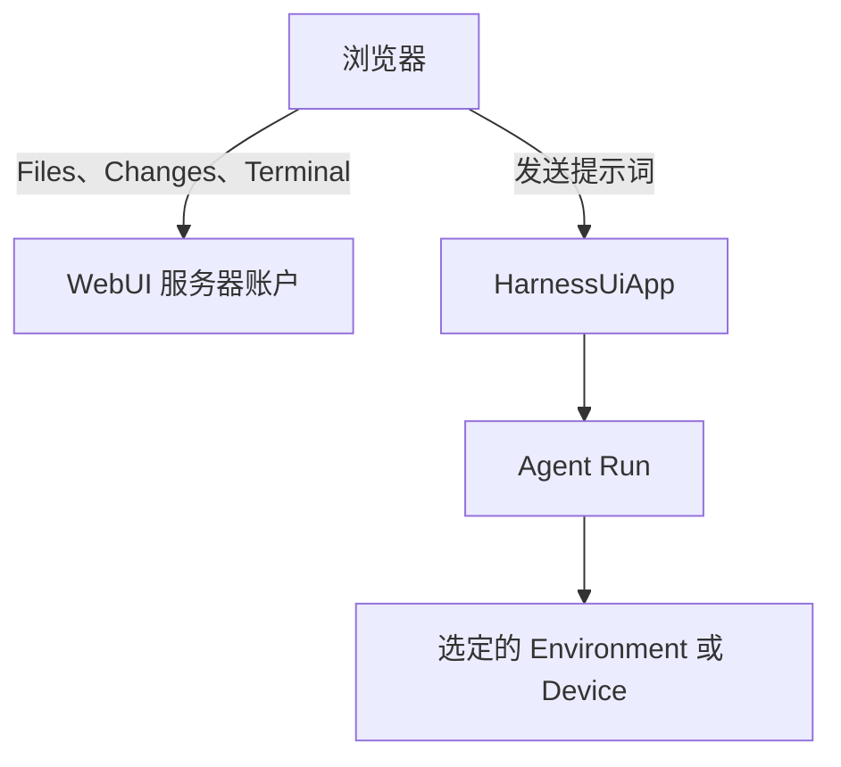

WebUI 是 Harness UI 的浏览器工作台，是面向个人和可信小团队的协作环境。它与 TUI 共用同一个 `HarnessUiApp`，提供对话、执行控制、初始化设置、provider 账户、配置和 Environment 就绪检查。WebUI 不是 Console，不提供参与者之间独立的权限或租户隔离。每个对话就是一个根 Thread 及其保存的历史。

启动服务器，打开输出中的登录链接，连接模型，然后发送第一条提示词。使用期间请保持服务器进程运行。共享实例前，先了解[认证方式](#authentication-and-key-retention)。

## 启动服务器

Chat 是主视图，**Files** 和 **Changes** 在侧边打开，**Terminal** 位于下方。查看 Git 需要安装 Git；原生终端需要 POSIX Host。评论控件已停用，保存的评论仍可通过 API 读取。

```bash
a13n-harness-ui webui                       # 127.0.0.1:8765, generated per-process API key
a13n-harness-ui webui --host 127.0.0.1 --port 9000
a13n-harness-ui webui --no-share-computer   # Opt out of native computer sharing
```

原生 [Files](http-api.md#native-host-files)、[Changes](http-api.md#native-git-changes) 和 [Terminal](http-api.md#native-terminal) 访问默认开启。这些面板使用服务器账户或容器挂载，**不使用** Agent 选定的 Environment。可以用 `--no-share-computer` 关闭它们，不影响共享聊天、[草稿](http-api.md#shared-composer)或[页面在线状态](http-api.md#page-presence)。工作台中的 Git 变更只能查看；修改 Git 状态需要明确执行 shell 操作。在线状态和共享草稿都是实时状态，不属于保存的续接状态。



Markdown 默认以 **Preview** 打开，**Text** 切换到编辑器。预览包含未保存编辑。**Add to chat** 附加选中的源码行，未选中时附加完整文件，不会发送。Agent 的 `/threads/{root_thread_id}?native=files&native_path={URL-encoded absolute Host path}` 链接打开 Files 抽屉；单独的路径和 Files API URL 不会，外部链接仍单独打开。

## 查看 Memory

启用 Memory 后，左下导航的 **Memory** 按钮会打开一个只能观测的 Memory 页面。Global memory 与各个 Project 的作用域分开。中间区域复用对话历史、实时工具活动和 **Inspect & usage** ，但没有输入框或手动执行控件。每次自动整理 Run 都使用新的模型上下文，之前的轮次和记录的用量仍可查看，服务器重启后也会保留。

右侧面板展示当前作用域的**现有** 文件，而非历史快照。即使尚未执行过整理 Run，也可以查看文件；打开作用域不会触发整理。查看器只读，无需开启 Host 计算机共享。如需修改记忆，请通过对服务器的 Host 访问（例如 shell 或编辑器）修改所选根配置旁 `memory/` 下的文件。

Memory 控制仍位于 **Settings → General**。关闭自动整理会保留 Memory 按钮和查看器；关闭 Memory 则隐藏按钮。这两个开关都不会删除文件或已保存的历史。

## 与 Coordinator 协作

选择一个 Project，在输入框中开启 **Coordinator**，然后发送目标。这会创建 Coordinator，或在发送前将已有普通对话转换为 Coordinator。窄屏下，开关仍位于输入框顶部。每个 Project 可以有多个 Coordinator；**Goal** 是独立选项，参阅[围绕 Goal 持续工作](everyday-use.md#work-toward-a-goal)。

创建或转换后，该角色不可撤销。如果之后发送失败，对话仍保留 Coordinator 角色，输入也会保留以便重试。Coordinator 必须归属一个 Project。

也可以打开已有对话的操作菜单或 **Conversation details**，选择 **Make Coordinator** 并确认。该对话必须空闲、未归档、已绑定 Project，且没有待处理决策。转换保留 URL、历史、标题和设置，角色不可撤销。worker 不能转换，已有对话（包括以前通过 [Sidekick](#agent-collaboration-and-sidekick) 创建的对话）也不会被自动收编。

Coordinator 创建 worker、回答问题并整合已验证结果。展开其侧栏行可查看 worker。每个 worker 都是有独立历史和人工控件的根对话，不是 Subagent。worker 显示在所属 Coordinator 下，不会重复出现在 Running 或 Recent；搜索以 **Coordinator worker** 标记，并保留访问 owner 的入口。

如果要自行分配工作，在 Coordinator 的操作菜单中选择 **New worker**，直接在新对话中编写并发送工作内容，Coordinator 不会代为转发。**Managed by · name** 会替代 Coordinator 开关，并固定 Project。创建前，可用标签上的移除按钮将草稿改为独立对话，消息、附件和选项都不会丢失。创建后标签固定，即使发送失败也一样。创建结果不确定时，归属关系保持锁定，直到查看保留的对话。已有 worker 的输入框中也会显示相同的所属标签。

在 Coordinator 菜单选择 **Pause automatic follow-up** 或 **Enable automatic follow-up**。共享设置控制生命周期通知，不阻止手动工作或 worker 执行。新 Coordinator 默认启用，迁移时保留原设置。Agent 创建的 worker 使用 Sidekick 默认值，手动创建的使用输入框选择。关闭 Sidekick 不关闭 Coordinator 或自动跟进。

当你首次直接向 worker 提交任务，或所属 worker 完成、失败、取消、等待输入时，自动跟进会尝试通知 Coordinator。Coordinator 会先检查保存的结果，再判断工作是否完成。通知采用尽力交付，没有重试或重启后重放。关闭浏览器不影响它继续运行；停止 Coordinator 不会停止 worker，也不会暂停之后的通知。问题和审批的截止时间仍有效。

## 为重要对话加星标

将鼠标移到对话行上或让其获得焦点，打开 **…** 菜单并选择 **Star conversation**。触屏上不需要悬停就能看到 **…** 按钮。加星标后，菜单旁始终显示实心星；选择 **Unstar conversation** 可取消。星标与实例中的所有参与者共享，不是个人书签，切换浏览器或重启服务器后仍保留。

星标对话置于五个普通 **Recent** 行上方。Running 和未读 **New results** 优先显示，不重复。星标不改变访问时间。归档隐藏对话但保留星标；worker 仍嵌套在所属 Coordinator 下。

## 找回尚未发送的输入

对话搜索框下方的 **Drafts** 会打开一个列表，列出留有未完成共享输入的已保存对话，即使 Project 已折叠或对话不在最近列表中也能找到。列表中每一项都显示 Project 名称。普通列表中的对应对话旁还会出现 **Draft** 标记，不会替换运行中或未读结果指示。搜索或筛选下方列表时，**Drafts** 仍然可见。

打开对话不会消除提醒。成功发送并清除提交时捕获的输入，或手动删除文字和选定附件，才会清除；其他参与者同时新增的编辑仍会保留标记。待上传和上传失败的附件也计入未发送输入，纯空白和输入框设置变更则不计入。归档会将该对话从 **Drafts** 中移除，不丢弃草稿。

这些是共享对话草稿，不是个人队列。同一服务器仍在运行时，刷新浏览器后可以重新找到已同步的草稿；服务器重启会丢弃它们。尚未创建对话的独立 New conversation 草稿仍从 Home 打开。

## Agent 与模型设置

输入框底部右侧只读显示当前 Agent 和模型名称。通过旁边的 **Agent & Model settings** 图标修改。Agent、Model 和 Reasoning mode 在同一面板中打开各自选项；Thinking 等级和 Fast 按钮直接显示在概览中。每项都有 **Use default** ，可以恢复继承设置，无需猜测哪个显式值与默认值等效。

手机上面板以底部弹层打开。**Goal**、**Coordinator** 和 **Environments** 仍位于输入框顶部。在任何屏幕尺寸下，附件旁的 **Clear context** 橡皮擦按钮都会让下一条消息不带之前的模型消息、笔记、任务或其他已保存的 Agent 工作状态开始。待处理的问题和审批会被丢弃；聊天历史、文件、对话设置和未发送输入会保留。

## Fast 模式

打开 **Agent & Model settings**，选择 **Fast**，或在支持的 Codex 连接上选择 **Ultrafast**。按钮互斥，再次点击选中按钮请求 Off。**Use default** 继承 Model 设置；**Provider default** 不等于 Off。

选择影响当前标签页后续 Send，不影响引导、thinking 或保存的 Model 配置。更换 Agent 或 Model 会清除选择。Context / Cost / Cache / Time 一行显示活动或已保存 Run 捕获的 **On**、**Off**、**Ultrafast** 或 **Default**，不是下次 Send 的选择。短横线表示不可用。

OpenAI/Codex、支持的直连 Anthropic 和 Gemini 连接使用原生速度控件。`openai-codex:gpt-6-astra` 支持 Ultrafast。不支持的选择会禁用并说明原因。请求速度不代表保证提速；资格和费用由提供方决定，用量费率可能更高。

## 浏览对话输入

使用左侧输入导航条，或窄屏上的 **Input history**，预览和重看普通输入。引导仍属于原轮次。选择较旧输入会加载对应保存历史；**Load later messages** 和 **Back to latest** 返回较新工作，不重新提交输入。

输入、已应用引导和 Agent 文字按时间顺序显示。**Execution details** 将文字之间的活动分组，默认折叠。展开可检查该段活动，移动端以全屏阅读器打开。计数只包括该段已加载的工具调用。

轮次缺失内容自动加载，失败时提供 **Retry loading turn**。待处理决策仍可在折叠区外操作。导航和展开只影响你的视图，不影响执行或 Agent 上下文。

## 待处理问题、审批和外部结果

待决策表单处理结构化问题、通用工具审批和外部提供的工具结果。Shell 审批先显示风险评估和理由，再显示命令、工作目录和选定挂载点。参数预览会隐藏环境变量值。其他审批显示工具、参数和可用审查上下文，不要求专门的工具表单。

单个审批可选择 **Approve once** 或 **Deny** ，拒绝前也可填写原因。仅当请求允许替换参数时，才显示 **Edit arguments** ；绑定的 shell 审批必须保留原参数。如需修改这类命令，应拒绝并解释原因，让 Agent 提出新命令。服务器省略了参数的请求无法从表单批准；仅缺少风险评估不会阻止决策。批准不代表执行已经成功。

多个请求或混合请求必须通过 **Submit responses** 一次性完整回答。**Provide a result** 接受 JSON 格式的真实外部工具结果，不会在浏览器中执行工具。如果结果就是 `null`，必须明确输入；空编辑器不算结果。不会自动选中任何批准操作。如果提交确认丢失，应检查当前请求，不要直接认定失败；浏览器绝不会自动重发决策。

### 问题与审批超时

每批新出现的根问题、审批和外部结果请求，共用一个由服务器管理的响应窗口，由 `tools.interaction_timeout_seconds` 控制，默认 **120 秒**。工作台显示剩余时间。必须在截止前提交完整表单；只选择部分选项，或填写但尚未提交的答案，都不会发给 Agent。

超时后，服务器以明确的失败结果继续：未回答的问题会要求 Agent 在可行时作合理假设并继续，审批则被**拒绝**，绝不会自动批准。切换对话、刷新、打开其他浏览器或关闭页面都不会重置或停止计时，其他参与者也可能先行回答。

停止服务器或归档对话会取消待处理计时器。重启不会重放已经过去的截止时间：此前进程保留的问题仍可手动回答，但没有倒计时。如果超时响应未能启动执行或保存，应先检查报告的操作，再决定是否手动重试；App 不会反复提交。TUI 中的问题仍使用独立的逐题倒计时。

## 交互式 MCP 工具结果

已选择启用的 [MCP Apps](mcp-apps.md)会在真实工具结果旁内联展示，Run 结束后仍可交互。已保存历史只有点击 **Open App** 后才会执行 App HTML。**Activate interactions** 用于经过当前策略检查的服务器操作；工具审批、选定上下文、消息确认和外部链接确认都位于 iframe 外可信的 WebUI 卡片中。打开不会重复工具调用，关闭 View 也不会丢弃服务器连接。[Apps 指南](mcp-apps.md)说明了设置、生命周期、限制，以及远程部署必须使用的独立沙箱 origin。

## 安装为应用

打开 **Settings → General → Install Harness UI**，将工作台安装到独立窗口。如果浏览器提供安装提示，选择 **Install app** ；否则使用浏览器提供的 **Install app** 或 **Add to Home Screen** 。iPhone 或 iPad 上，在 Safari 打开页面，选择 **Share → Add to Home Screen** ；Mac 上，Safari 提供 **File → Add to Dock** 。不同浏览器的支持情况和菜单文字有所差异，仍可直接通过普通浏览器访问。

安装需要 HTTPS，或 `localhost`、`127.0.0.1` 等本地回环地址。手机通过局域网 IP 和普通 HTTP 访问服务器时，不能保证同样的安装能力。请保持服务器地址稳定：改变协议、主机名或端口会改变浏览器 origin，可能需要重新安装和登录。

安装后的应用仍需要能连接到 Harness UI 服务器。提示时输入实例密钥（**Instance API key**）；关闭应用后的提醒，需要另行启用[后台通知](#task-notifications)。重新加载前保存编辑器中的私人修改；安装不会增加离线执行或编辑器恢复能力。

## 重启或更新服务器

通过 **SIGTERM**（或 Ctrl+C）正常停止 WebUI，**等待进程退出** ，再使用**同一数据目录** 启动。无需预先发请求或操作设置。更新时，应在旧进程退出后、启动新进程前安装新版本。

优雅关闭先保存根及子 agent 检查点、完成 Environment 收尾，再记录重启交接。下次启动只消费一次交接，在新 Run 中继续兼容的中断工作，不重发提示词或重放保存的工具批次。

`shutdown_timeout_seconds`（默认 60 秒）限制的是等待安全边界的时间，**不是整个进程的退出时间**。如果模型或工具批次不能在此时间内完成，或者检查点、Environment 收尾失败，该批次就不会被登记为可自动恢复。取消和清理仍需完成。请给进程管理器预留这些步骤的时间，不要在旧进程仍执行时启动替代进程。

自动继续需要成功的优雅关闭，以及兼容的重建。强制终止或恢复失败后，应先检查日志和保存的历史，再重试结果不确定的工作。待决策请求仍未回答。原生终端、旧 shell handle、未发送草稿和未保存的编辑器都不会恢复。

## 服务器日志与关闭

服务器按 `process.log_level` 和 `process.log_format` 报告启动、API 响应和清理。`INFO` 显示普通 API 活动；`DEBUG` 增加静态资源、健康探测和清理阶段。API 日志记录路由模板、状态、耗时、错误码和生成标识，不记录请求体、密钥、查询值或本机路径。

遇到 `thread_history_continuation_changed` 或 `thread_continuation_conflict` 时，刷新对话。遇到 `object_payload_incompatible` 时，检查存储警告中的对象、版本和验证详情。不要清空数据目录来修复兼容性。旧 `context_window` 输入仍可按 `context_window_tokens` 读取。

登录 URL 在启动前输出；**WebUI ready** 才表示监听器成功启动。

按一次 **Ctrl+C** 或发送 **SIGTERM**。**Stopping WebUI** 表示正在清理，**WebUI stopped** 确认完成。浏览器断开不会停止 Run 或终端。清理较慢时报告等待时间，`DEBUG` 显示各阶段。连接排空超时不是 App 清理的硬截止时间，`WARNING` 会隐藏普通进度。

WebUI 与服务器失联时，会用一条紧凑的 **Connection interrupted** 提示替代各面板重复的连接错误。它自动重连，**Retry now** 可以跳过当前等待间隔。服务器已停止时，应先重新启动。其他可操作错误仍保留。这不是离线模式：重连只刷新观测，不重放失败的保存或提示词提交。

## 配置工作台

全新安装时，WebUI 会自动打开两步设置向导：

1. **Model**：连接支持的订阅账户或保存 provider API key，再选择建议 Model，或输入 API 模型 ID 和端点。设备登录提供链接和验证码；高级回调登录需要访问服务器回环监听器。凭据由服务器共享，与浏览器实例密钥分开。API key 立即保存。建议设置不验证模型使用资格。
2. **Workspace**：Full Control 以 Host 账户运行，不隔离；Sandbox 必须通过显式就绪检查。可以填写已有的服务器 Project 目录，也可以留空创建无 Project 的对话。审阅配置后，选择 **Save and start chatting** 。

设置会打开一个空的首次对话，并聚焦输入框，不会发送提示词或发起模型请求测试。**Set up later** 保留不含秘密的草稿，不会在每次导航时重新打开向导。刷新和在另一标签页认证后仍保留选择，但秘密输入不会持久保存在浏览器中。如果保存响应丢失，先用 **Check saved setup and open conversation** 检查，再重试。部分保存或文件变更会明确提示，不会被当作完整保存。

已有安装保留对话和配置。**General → Setup & diagnostics** 提供针对性的修复，不会重新初始化。**Settings** 包含 General、Notifications、Agents、Models、Capabilities、Environments、Projects、Accounts & API keys、MCP connections 和 Advanced。之后连接 provider，也使用 **Accounts & API keys** 下的同一流程。

**Capabilities** 在 **Save changes** 后为选定 Agent 启用已安装的 Capability，不是全局开关。可复用的 agent 插件配置仍单独管理。**Environments** 展示远程 Device、已配置 profile、内置只读 Environment 和已安装 provider。**Configure** 为可用 provider 打开 profile 草稿；provider 专属的适配器和设置仍放在配置文件中。软件包安装在服务器上完成，不通过这些控件执行。

用 **Advanced** 创建、查看、保存或删除配置。表单和 YAML 共用一份草稿；**Save changes** 同时验证。未保存编辑在标签页内导航时保留，重新加载会丢失。保存替换整个文件，后写覆盖前写；检测到外部变化时保留本地未保存草稿。活动 Run 保留捕获配置。MCP 源文本隐藏，因此替换 MCP 文件也会替换不可见字段和文件中的全部资源。

在 **Projects** 编辑服务器目录和创建默认值。**Browse → Use this directory** 修改草稿，保存后生效。使用 `--no-share-computer` 时手动输入路径。新对话使用保存的默认值，已有对话保留根目录，除非明确修改。Default、None 和 Custom 含义不同。预览显示已保存值及来源，不包含未保存修改，也不测试模型。

首次进入时，右上角会自动显示生成的协作名称；点击修改，**Save name** 会在当前浏览器记住它，并更新实时在线状态和输入框标签。在线指示打开按标签页区分的参与者目录。此显示名称不是 provider 登录，也不是经过认证的身份。

### 添加或移除工作环境

在 **Settings → Environments** 中，使用标识、HTTP endpoint 或反向 WebSocket 传输，以及凭据引用添加 Device 连接。**Check connection** 读取实时 Device 描述；保存连接不要求 Device 在线。同一资源可复用于不同工作目录和别名。

在 **Projects** 或 **Configuration → Change next Run selections** 中，使用 **Add environment** ，选定 Device，再输入已知绝对工作目录，或浏览在线 Device。**Use this directory** 只修改草稿。添加或移除当前默认 Environment 时，明确选择新的默认 Environment，再保存。Project 可以组合本地文件夹和远程 Environment，也可以只使用远程 Environment，但不能移除最后一个工作 Environment。Device 目录浏览不依赖原生计算机共享。

对未被使用的 Device 或自定义 profile 使用 **Forget**，即可删除本地配置，即使 Device 离线或 provider 已卸载也可以。对话框会列出当前配置引用，并链接到对应编辑器。先修复这些默认值，再回来移除资源。这不会删除远程数据、卸载 provider 或删除对话历史。内置 Environment 不能移除。

已有对话保留保存的选择。被移除的资源显示为 **Not configured**，不会静默换成其他 Environment。打开 **Conversation details → Configuration → Change next Run selections** ，移除或替换缺失的 Environment，必要时选择替代默认值，再保存。修改只应用于未来 Run；之前 Run 的捕获配置和续接状态不变。

Files、Changes 和 Terminal 面板仍操作监听器的 Host。选择 Device 不会让它们变成远程面板，Device 工作目录也不是文件系统沙箱。文件配置方式参阅 [Device 配置与移除](environments-and-projects.md#add-device-bindings)。

### 后续 Run 使用的环境

打开输入框中的 **Environments**，同时编辑本地模式、目录、远程绑定和默认工作位置。**Local · Harness server → Local mode** 提供 **Sandbox** 、**Full Control** 和已配置 profile，已有对话也可使用。**Follow conversation local mode** 继承保存的本地 profile。关闭而不应用会丢弃草稿，**Use conversation defaults** 清除所有临时覆盖。Full Control 以服务器 Host 账户运行，不是沙箱。Sandbox 需要 Host 支持的隔离启动器和原生运行时，不可用时会明确失败，不会转为 Full Control。隔离边界由 Host 建立，Device daemon 不把 Project 根目录当作访问策略强制执行。

显式选择会随此标签页启动的每次 Run 发送，直到修改或选择 Default。它不改写对话默认值，不影响其他参与者的选择，也不改变正在运行的 Run。执行期间，选择器准备的是下次 Send；**Steer** 不会改变活跃 Run 的 Environment。回答延后问题或其自动超时，仍保留暂停 Run 选定的 Environment。新 subagent 继承捕获的 Environment，恢复的 subagent 则保留各自对话配置。切换模式不会复制或隔离 Project 文件或对话历史。

打开 **Configuration**，可以区分保存的对话默认值和 Run 捕获的 Environment。不可用的自定义 profile 仍显示，必须明确替换。尚未发送的新对话草稿在重新加载后仍保留选择；已有对话的覆盖则只属于当前标签页。

### 下次 Run 的 Thinking 设置

打开输入框中的 **Agent & Model settings → Thinking**。**Default** 显示选定模型配置的 thinking，并原样继承其设置。菜单来自服务器提供的模型相关控件：effort 等级和 token 预算预设取决于模型及已安装适配器。只有支持时才显示 Off；最低 effort 不一定等于 Off。未知模型保留 Default，并解释为什么不能覆盖。

显式选择仅属于当前标签页，随下次 Run 发送，不随引导发送。改选 Agent 或模型会清除它。它不修改模型设置，也不保存对话偏好。正在执行的工作保留捕获的选择，可在 **Configuration** 中查看该 Run 请求的 thinking。Thinking 控件不改变输出 token 上限。预算被禁用或与自定义设置冲突时，必须在模型配置中解决，不会静默降低或忽略。

## 当前浏览器中的新结果

在当前浏览器打开或启动对话会自动关注它。未读的已保存成功结果以 **New result** 圆点标记。Project 分组保留最近五行以外的未读结果入口。之后的运行或失败不会清除未读成功结果。

当保存的对话在获得焦点的浏览器标签页中可见，并且你滚动到历史底部时，圆点才会清除。仅选择对话或收到实时文字还不够。阅读较旧快照不能清除更新的结果。归档对话的圆点显示在 **Archived** 中，不计入普通 Project 数量。

提醒只属于当前浏览器和站点地址，在标签页间同步。重新打开会刷新已关注对话，包括关闭期间保存的结果。首次访问将已有结果视为历史。清除站点数据会移除关注和阅读状态；存储或刷新失败时显示警告和重试。

这不需要桌面通知权限，也不增加关闭页面后的推送。下面的 **Task notifications** 是独立机制；重新打开恢复的是圆点，不会重放旧通知横幅。

## 任务通知

**关闭 WebUI 或锁定手机后，后台通知仍可到达 Android Chrome。** 请使用稳定的 HTTPS 地址，包括日常登录使用的同一端口。Harness UI 服务器必须保持运行，并能向外连接浏览器的推送服务。无需单独注册推送账户或手动配置 VAPID key。

1. 在需要接收提醒的设备上，打开 **Settings → Notifications**。
2. 选择 **Allow notifications** 或 **Enable background notifications** ，出现浏览器提示时允许。最初的 **Enable task notifications** 提示也可完成设置。升级后，仅有原先的浏览器权限并不会启用后台交付。
3. 确认 **Background delivery** 显示 **Enabled on this device** ，再选择 **Send test notification** 。
4. 保持一个 WebUI 页面可见，使设备被标记为活跃。
5. 发送一条提示词。
6. 关闭 WebUI，等待系统通知。点击通知会打开对应对话，可能仍需正常登录。

每台设备都需要独立启用。Android 上同时允许此站点通知和 Chrome 系统通知。强制停止 Chrome、省电限制、勿扰模式、断网或厂商推送服务不可达，都可能阻止或延迟提醒。iPhone 或 iPad 需要 **iOS/iPadOS 16.4 及以上，并使用主屏幕 Web App**，普通 Chrome 或 Safari 标签页不支持。在 Chrome 中选择 **Share → Add to Home Screen → Add** ，再从图标打开 Harness UI，并在应用中启用通知。如果 Chrome 没有此操作，在 Safari 中打开相同地址并添加。在设备通知设置中管理主屏幕应用的权限；只修改 Chrome 应用权限不会启用网站推送。各浏览器支持不同，远程普通 HTTP 不受支持。本地浏览器开发可使用回环地址。

通知覆盖**所有根对话** 的完成、失败和输入请求，包括此设备上从未打开的对话。预览来自真实回答、问题或失败，不会额外调用模型。**预览可能显示在锁屏上。** 归档对话不产生推送。系统通知只发送到已主动启用、且最近**六小时** 内活跃的设备。保持任意 WebUI 页面可见，大约每分钟更新一次此窗口，无需键盘、鼠标活动或页面焦点。六小时没有可见页面后，重新打开 WebUI 即可恢复接收资格。

每个打开的页面还会显示应用内通知，包括正在查看的对话。这些通知不受六小时或访问历史限制。系统推送和应用内通知可能同时出现。**Web Push 是唯一的系统通知路径**：如果不支持或无法连接 provider，就只剩应用内通知，没有本地系统通知后备机制。

升级后，请重新加载此前打开的 WebUI 页面。现有订阅和签名密钥保留，但旧 Thread 关注列表移除。更新后的可见页面首次报告活动时，设备才恢复接收资格；仅同步注册不算活动。

如果启用时报告 **Browser push registration failed**，表示浏览器在将订阅保存到 Harness UI 之前就未能取得订阅。错误保留浏览器原始详情，并将此阶段与服务器交付区分。Android Chrome 的推送服务错误，应检查 Google Play 服务和设备到推送服务的连通性，包括 VPN 或防火墙限制。能打开 WebUI 不代表推送可达。比较 Wi-Fi 与移动数据，再明确重试注册。不要一开始就清空浏览器存储，因为这也会删除私人草稿和偏好。

测试报告的是推送服务是否接受消息，**不是设备是否已经显示通知**。如果没有提醒，检查站点权限、系统通知设置和网络。macOS 上还应检查 **System Settings → Notifications** 和 **Focus** 。**Enabled on this device** 只代表订阅已同步，不代表交付已确认。保存的订阅最初显示 **Checking subscription…**；刷新或测试失败则显示 **Subscription needs attention** ，不会继续声称已启用交付。回到前台或网络重连时会重试同步。**Reconnect background notifications** 替换已拒绝或过期的 endpoint，并修复服务器签名密钥变化。注册在服务器重启后保留，但连续 90 天没有刷新注册或活动会过期。这与六小时交付窗口是两回事。

关闭 **Enable browser notifications** 会移除此浏览器订阅并停止权限提醒，不影响应用内通知或其他设备。退出登录也会尝试清理。如果浏览器和服务器两端清理都失败，可以在浏览器站点通知权限中阻止交付。清除浏览器存储不等于服务器取消订阅；可行时应先关闭通知。

推送采用尽力交付，不是持久通知收件箱。服务器使用有界内存队列和有限重试，关闭或 provider 故障可能丢失提醒。重新打开 WebUI 不会重放旧的完成事件。推送不改变已保存历史、浏览器本地新结果圆点，或 Agent 工作的生命周期。请安全备份服务器数据根目录，以保留签名身份和订阅。

## 整理 Project 并在对话中工作

**Projects** 标题旁的 **Add project** 用于保存名称和服务器目录，可另加根目录。它只创建 Project，不会创建空对话。展开 Project 可见最近更新的五个根对话；**Show more** 只加载该 Project 的下一页，折叠后仍保留已加载分页。**Without a project** 和 **Unavailable projects** 保留未分配对话，以及引用了已移除 Project 的对话入口。

拖动 Project 手柄排序，或使用菜单中的 Move 和 Reset 操作。键盘操作：聚焦手柄，Space，上下箭头，Enter 保存或 Escape 取消。排序和展开状态只保存在当前浏览器。**Rename project** 只改显示名称。活跃工作优先显示，完成时更新导航时间。搜索覆盖所有保存根对话，包括未加载分页。打开 **Archived** 可恢复归档对话；对话不能拖到其他 Project。

**Home** 和各 Project 的 **+** 共用一个浏览器本地 New conversation 草稿。切换 Project 保留输入和显式选择。文字和设置在重载后保留，本地文件字节不会，需重新附加不可用文件。**Send** 创建 Thread。提交获接受后清除保存草稿；结果不确定时保留并锁定 Project 选择，先检查，不自动重发。Thread 链接打开保存对话。用其 **…** 菜单加星标、改名、共享、查看或归档；**Project settings** 修改 Project。

Enter 发送，Shift+Enter 换行，Ctrl/Cmd+Enter 也发送；输入法组合输入不会发送。**Send** 等待你的编辑同步。可在指定文字位置附加、粘贴或拖放文件。点击附件检查；待上传或失败会阻止发送，应在原标签页重试或移除。编辑和撤销保留附件身份，普通文件名文字不会附加文件。提交保留文字和附件顺序。提交确认成功后，只清除已提交内容，同时新增的编辑仍会保留。无法确认提交结果时，保留输入并先检查结果，不自动重试。远程媒体 URL 不自动加载。

Run 活跃时，**Next message** 仍可编辑，但不会成为队列。**Steer**（Run 活跃时的 Send 按钮）发往当前操作，不创建新轮次。引导与普通 Send 一样保留有序文字和附件。**Stop** 针对当前显示的准确回执。关闭页面只停止观测，不停止执行。问题、审批（包括允许的参数覆盖）和外部结果请求都有完整响应集控件；过时或竞争的决策会刷新，不会显示成第二次成功。问题回答后，简短标题和记录的答案仍可见，包括多选和自定义文字。展开 **Questions & details** 可重看完整问题和选项。

替换历史加载时，已保存历史仍可见。实时输出在保存历史到达前只是临时显示，流结束不证明续接已保存。失败工作显示短原因，可展开详情。**Retry** 将 `Continue completing the previous task.` 作为新轮次发送，保留草稿，不恢复失败 Run 或重放历史；提交待处理或结果不确定时不可用。

展开 **Explored**、Shell、浏览或 **File changes** 可检查分组活动、参数、结果和观测到的编辑 diff。折叠时仍显示失败和缺失结果；**Awaiting result** 不代表成功。旧版省略内容仍不可获得，**Requested replacement** 不代表已应用 diff。**Open on host** 打开服务器或容器绝对路径，不是 Agent Environment 路径，保留未保存缓冲区；当前文件可能不同于记录内容。

打开 **Details** 查看根操作、子执行、任务、笔记、用量和配置。执行、续接保存和 Environment 清理分别报告结果。子控件针对准确父执行；保存结果分页，活动预览有界。应用 Project 默认值需审阅前后差异。配置竞争时保留编辑并要求重新审阅。

草稿协作只存在于当前 App 实例。应用内导航保留浏览器编辑器状态，重新连接同一实例会再次同步。服务器重启后，需要明确加入替代草稿，并决定是否恢复本浏览器的文字。本浏览器尚未同步的编辑会在重新加载或浏览器崩溃时丢失；已同步的文字在服务器运行期间保留在共享草稿中。显示名称不是认证身份，撤销仅属于本地编辑器，已接受的 Send 建立新的撤销边界。

### Skill 与工作检查

输入 `$` 加 Skill 名称，可查看可用 Skill 和说明。上下箭头选择，Enter 或 Tab 插入名称，Escape 关闭列表。接受补全不会发送提示词。引用保持为可编辑的普通 `$name` 文字，适用于新对话、已保存对话和引导。识别的引用会针对当前或活跃 Run 的目录校验，未知名称保留为普通文字，不新增 slash-command 接口。

输入框上方的 **Tasks**、**Notes** 、**Subagents** 和 **Processes** 打开浮动检查面板，不改变草稿或对话。Processes 显示最后观测到的后台命令及状态，可展开进程 handle、Run 标识和退出码。数量只统计观测到的运行中 handle，不代表服务器上的全部进程，前台 shell 调用不计入。Run 完成或观测丢失时，未完成 handle 标记为不可获得，不会认定进程已退出；缺口和有界省略会明确展示。最多显示保留的 128 条观测中的 16 条。重新加载或切换对话不会从保存消息重建进程。输出仍在工具详情中，面板不能停止或控制进程。

## Agent 协作与 Sidekick

WebUI Agent 的指令包含 Thread ID 和已捕获的 Project、根目录。协作工具通过同一个 App 查看和启动其他根对话。点击工具行中的对话链接查看工作。

| 根角色      | Agent 的协作范围                                              |
| ----------- | ------------------------------------------------------------- |
| 普通根对话  | 其他根对话，不包括托管 Worker                                 |
| Coordinator | 自己的 Worker；创建时保持在 Coordinator 的 Project 内         |
| Worker      | 查看自己和 owner，向 owner 发消息；使用 Subagent 做任务内委派 |

Worker 是独立根对话，不是 Subagent。Worker 不能创建根对话、控制 owner 或访问兄弟 Worker。这些模型工具限制不限制人类通过 WebUI 操作。

普通根对话的 `create_thread` 可保留当前 Project、选择其他 Project ID，或用 null 不绑定 Project。用 `agent_id` 选择已配置的 Agent。未使用 Sidekick，也未显式更改 Agent/Project 时，新对话继承来源选择。提供任务所需上下文：新根对话不会继承完整历史。它会收到请求方 Thread ID，并通过 `send_thread_message` 提问和汇报。可选 `model_id` 覆盖首个 Run；`run_thread` 可为后续轮次传入相同覆盖。

`send_thread_message` 向活动目标发送引导，或在空闲目标上开始一轮。结果表示接受，不代表已处理或已保存交付。发送失败或结果不确定时，先检查目标再重试。已归档 Thread、Subagent Thread，以及尚有待决策请求的 Thread，不能开始新轮次。

Sidekick 为 `create_thread` 创建的根对话提供默认 Agent、Model 和汇报指令，默认启用。在 **Settings → General → Sidekick** 中选择 Agent、Model 或 **Disabled**。**Inherit current agent** 保留来源 Agent；**Use agent model** 跟随所选 Agent 的 Model。所选 Model 成为新 Thread 后续轮次的默认值。保存影响未来 Run 捕获和新创建的根对话，不影响当前 Run 或已有 Thread。该偏好本身不会开始工作。见 [Sidekick 配置](configuration.md#webui-sidekick)。

对话配置中的 **Default model** 可独立于输入框 Run 选择器设置持久模型；选择 **Follow Agent model** 清除它。遵循保存的默认值时，选择器显示 **Thread default** ；改选模型只影响该 Run 草稿。配置检查会区分下一次的模型与当前或保存 Run 实际捕获的模型。

## 保存的输出与评论

WebUI 评论创建、选区操作、高亮、菜单和讨论面板目前停用，等待重新设计。这不会删除后端评论或 API。此变更前捕获的反馈引用，在消息和草稿中仍可读取。子执行保存结果仍可从检查面板读取，不提供评论控件。

## 读取、编辑与捕获 Host 文件和 Git 变更

用右上角 **Files** 或 **Changes** 打开抽屉。它们使用对话 Project 在服务器或容器上的根目录，不使用浏览器或 Agent 的远程 Environment。选择根目录、浏览文件夹并打开文件；**Back to files** 或 **Back to changes** 返回列表。关闭抽屉或切换文件保留标签页和未保存缓冲区。可调整宽度或使用 **Expand drawer**。无 Project 时提示打开 Project，不静默选择。

Files 支持编辑、上传下载、创建、重命名移动和确认删除。Ctrl/Cmd+G 跳行，Ctrl/Cmd+S 保存。筛选只覆盖已加载路径，不递归搜索。编辑要求完整、无 NUL 的 UTF-8，最大 512 KiB；上传、整文件捕获和图片预览最大 10 MiB。更大下载和音视频流式读取，不自动播放。访问链接 30 分钟后过期，刷新可续期。未保存缓冲区在标签页导航时保留，重载或关闭会丢失。磁盘冲突时查看最新版本，选择 **Use disk version** 或 **Keep local text** 后保存。刷新保留未保存文字，不自动重试不确定写入。CRLF/LF 保留，混合换行统一为首次风格并提示。

Changes 分开比较暂存区的 HEAD/index、未暂存的 index/worktree，以及未跟踪的新文件。可以筛选已加载路径、折叠分组，并在已加载比较或 hunk 间移动。选择未暂存或未跟踪 diff 的新文件行，可跳到当前工作文件对应行；不会假定暂存或已删除侧的行与当前文件对应。Unified diff 为旧、新文件分别提供行号栏，采用等宽代码，以及适应浅色和深色主题的添加、删除与 hunk 颜色。标题和缺少结尾换行的提示仍属于审阅的 patch。文字选区记录原始 patch 行号以供捕获，显示的文件行号不会替换这些坐标。仓库、HEAD、index 和 diff 标识仍可检查，包括重命名、冲突、二进制和尚无首个 commit 的状态。Git 错误不会显示成无变更结果，Files 在仓库外也可用。完成原生操作后刷新，或返回面板查看新观测；没有递归 watcher，也不会声称变更属于某次 Run。没有 stage、commit、discard 或 worktree 按钮。

文件使用 **Add to chat**，diff 使用 **Add to message** ，将审阅的版本捕获到共享草稿。先选中行可只捕获该范围。发送前审阅附件卡片；后续文件修改不会改变捕获的字节。也可以用同一附件对活跃 Run 进行引导。

## 共享原生终端

打开 **Terminal**，再选择 **New terminal** ，从当前浏览目录启动。Files 中的 **Open terminal here** 也可从文件夹创建新终端会话，不会向已有终端会话注入 `cd`。面板只显示当前 Project 的终端会话。切换 Project 会隐藏并断开旧视图，但不结束终端会话或改变工作目录。只打开面板不会启动 shell；创建需要 Project 已配置根目录。未绑定 Project 的已有终端会话仍可通过原生 API 使用。显示的初始目录不随后续 shell `cd` 更新，终端执行独立于 Agent 的 Environment。

创建方请求一次终端控制权，服务器确认前不能输入。其他查看者用 **Take control** 或 **Take over input**。**Release control** 保留会话运行。只有控制方调整共享终端尺寸。输入为 UTF-8，浏览器粘贴限制 16 KiB，不支持旧式二进制鼠标报告。

**Disconnect**、打开 Settings 或折叠面板只断开连接，不结束进程。重新打开以只读方式连接；明确 Disconnect 后需选择 **Reconnect**。重连不重复按键或取得控制权。保留输出有界（服务器 1 MiB 字节、本地 2,000 行），不是持久日志，缺口会提示。渲染较慢时暂停连接，不积累无界队列。

**End session** 需要确认，因为它会为所有人关闭共享终端会话及其作业。已经退出的终端会话在关闭前仍可检查。创建或关闭结果不确定时不会自动重放，先刷新终端会话列表再决定后续操作。App 重启不恢复或重建终端会话。POSIX Host 支持原生 PTY；Windows 明确报告不可用，Files 和 Git 则仍可独立使用。

通过 **Find in output**（Ctrl/Cmd+F）、前后匹配和 **Copy selection** 检查保留输出。HTTP 链接单独打开；明确的绝对 `path:line` 引用打开 Host 文件。**Add selection to message** 将带来源的片段追加到当前共享草稿，不会发送；**Return to conversation** 聚焦该草稿。不会猜测相对或有歧义的终端路径。

Shell 修改文件或 Git 后，返回 Files/Changes 或刷新原生观测。原生操作、焦点返回和 Run 完成也会刷新观测，不替换未保存缓冲区。刷新观测时，选定路径和私人未保存文字保持不变。浏览器标签页标题跟随当前对话，其他页面使用 `a13n harness ui`。抽屉中的 **Share explorer view** 链接图标生成不含实例密钥的同实例浏览链接。参与者目录也可打开准确聚焦的文件或 diff；它报告聚焦的对话、原生文件/diff、终端或配置页，**Open page** 会明确打开可用的其他参与者视图，不会启用持续跟随或移动别人。后台标签页与前台关注仍可区分。

## 认证与密钥保存

启动时 stdout 输出普通 URL；只有生成的实例密钥才会额外输出密钥和便捷的 URL fragment 登录链接。浏览器读取并移除密钥 fragment，通过 API 请求的 `Authorization: Bearer <key>` 发送，成功使用的密钥保存在同 origin 的 localStorage 中。**Log out** 移除保存的密钥并关闭受保护视图。静态资源不含密钥，也不需要认证。

密钥优先级为 `--apikey`、`A13N_HARNESS_UI_API_KEY`、新生成的进程密钥。提供的密钥不会回显，但命令行参数仍可能对 shell 和操作系统可见。显式空密钥和重复传入的冲突值会被拒绝。`--dangerous-skip-permissions` 只关闭 Web 认证，不关闭 Agent 权限或计算机共享检查；与 CLI 或环境密钥同时使用会报错。`--api-key` 和 `--dangerously-bypass-permission` 仍是兼容别名。

## 反向代理与公开地址

使用公开域名或终止 TLS 的反向代理时，将外部地址添加到选定的 `a13n-harness-ui.yaml`，再重启 WebUI：

```yaml
webui:
  allowed_origins:
    - "https://anui.wh1isper.top:8090/"
```

协议、域名和端口必须一致。这只允许该地址，不会同时允许 HTTP、443 端口或其他域名。显式允许任意地址可用 `allowed_origins: ["*"]`；默认 `[]` 保留原有监听地址限制。两种设置都不放宽 API 认证，也不允许跨 origin API 访问。校验和重启行为参阅[允许的 origin](configuration.md#webui-allowed-origins)。

反向代理必须保留外部 `Host`（包括 `:8090`）和浏览器 `Origin`，通过 `X-Forwarded-Proto: https` 转发原始 HTTPS 协议，并支持 WebSocket 升级。不要把这些头改成内部回环地址来绕过准入。Harness UI 使用 Uvicorn 的代理头处理；如果代理不是从默认可信的 `127.0.0.1` 连接，在 WebUI 进程环境中用 `FORWARDED_ALLOW_IPS` 设置可信代理的 IP 或网段。只信任实际代理，并要求代理覆盖客户端传来的转发头。除非每个可能连接的对端都可信，否则不要使用 `FORWARDED_ALLOW_IPS=*`。容器中，对端指 WebUI 容器看到的代理地址，不是浏览器地址。

Device 配对返回相对于根的批准和连接路径。daemon 针对已配对的 Host URL 解析它们，保留外部 HTTPS 协议和端口，不使用代理内部地址。配对批准仍不代表 Device 已连接或获得桌面权限。

## 监听器与应用生命周期

监听非回环地址，会向可信网络开放共享实例权限，不提供租户隔离；需要时使用外部 TLS。即使没有浏览器，服务器也负责 App 生命周期，Ctrl+C 或 SIGTERM 会关闭它。无需认证的 `/healthz` 和 `/readyz` 分别报告有界存活状态和 App 就绪状态。新实例即使尚未配置模型，也可处于可进行设置的就绪状态。

TUI 和 WebUI 进程可在兼容的软件包升级之间共享同一本地数据库。仅有更新的迁移版本，不会拒绝较旧但兼容的读取方，也不会阻止活跃 Run 保存。较旧 App 保留不认识的新迁移历史，检查自身所需表和列仍可用。存储缺失，以及真实的续接或版本冲突，仍会明确失败；schema 兼容不代表共享实时执行所有权。已发布二进制仍使用自身启动检查，不兼容的 payload 格式也不能仅靠放宽修订版本校验就变得可读。

## 容器与安装资源

Harness UI 通过 Python wheel 和 sdist 分发，不再发布官方 Harness UI 容器镜像。请在承载工作台的计算机上安装 Python 分发包。如需容器化服务器，请基于固定版本的 Python 包自行构建镜像，并显式配置认证、监听地址和持久挂载。`a13n-sandbox` 是 Agent 执行镜像，不是替代 WebUI 服务器。

WebUI 资源随 wheel 发布，最终用户无需 Node.js 或独立前端 checkout。仓库开发使用 `make webui`：构建并安装打包资源，再以 `var/harness-ui/` 下隔离的配置和数据启动前台服务器。无需手动准备实例密钥；未提供 CLI 或环境密钥时，stdout 会输出可直接登录的链接，认证仍然必需。使用 `make webui WEBUI_ARGS='--port 9000 --no-share-computer'` 转发服务器选项，`CLI_ARGS` 将全局选项传到子命令之前。配置初始化与环境覆盖参阅[开发指南](https://github.com/converge-ai-labs/agent-foundation/blob/main/dev/harness-ui/README.md)。

## 选项与职责

监听器、认证和兼容别名参阅[已注册的 webui 选项](command-reference.md#webui)。绑定地址、端口、认证和原生共享选项是进程参数；额外允许的请求 origin 通过根 YAML 的 `webui.allowed_origins` 配置。运行中的服务器持有活跃 App 工作；关闭标签页不会停止服务器，它也不是独立后台 worker 服务。

API 客户端请遵循 [HTTP 工作流程与路由参考](http-api.md)。进程内接入使用 [Python App](embedding.md)。不需要 WebUI 服务器的自动化，使用[单次执行](automation-and-troubleshooting.md#automation-and-diagnostics)。
