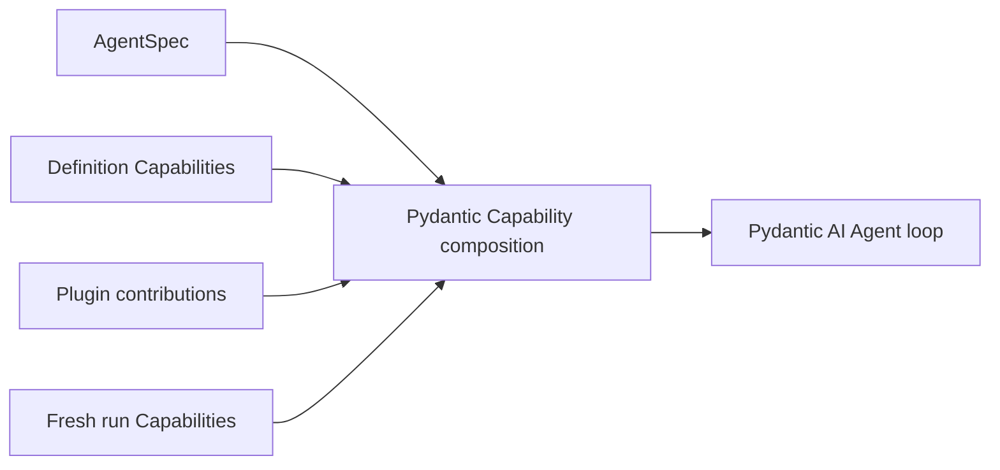

# Capabilities

Pydantic AI Capabilities are the primary feature-composition mechanism inside the Agent loop. Agent Harness provides first-party Capabilities that compose model context, Toolsets, portable state, run collaborators, and lifecycle hooks without introducing another registry or tool dispatcher.

## Composition Sources

Capabilities can enter from four trusted sources:

1. native `AgentSpec.capabilities`;
2. `AgentDefinition.capabilities` or `HarnessBuilder.build(..., capabilities=...)`;
3. a Harness plugin's Agent-bound contribution;
4. fresh `RunBindings.capabilities`.

Use definition composition for stable Agent behavior. Use run Capability composition for current invocation policy or MCP. Supply provider clients and feature overrides through typed `RunBindings` fields, not a second feature Capability.



Capability presence does not itself authorize external work. Tools that cross a managed boundary still evaluate fresh run policy and provider enforcement.

## Select Capabilities with AgentSpec

`AgentSpec.capabilities` is the declarative feature-selection surface. It can select native Pydantic AI Capability types, the closed set of Harness types supported for declarative reconstruction, and exact custom types authorized by the current Host. It does not select Harness middleware plugins, Environment run extensions, Providers, credentials, policies, or live clients.

For example, `ToolPermissionsCapability` is a Harness-owned declarative type and can be selected directly as shown in [Shell Command Review](#shell-command-review). Most first-party Harness features are composed as concrete definition or run instances because they accept typed collaborators or code-first configuration that does not belong in portable data.

### Authorize a custom declarative type

A trusted Host can make one directly declared dataclass Capability type available to its builder:

```python
from dataclasses import dataclass

from a13n_harness import (
    AgentContext,
    AgentSpec,
    HarnessBuilder,
)
from a13n_harness.capability_types import CapabilityTypeCatalog
from pydantic_ai.agent.spec import CapabilitySpec
from pydantic_ai.capabilities import AbstractCapability


@dataclass
class PolicyInstructionsCapability(AbstractCapability[AgentContext]):
    instructions: str
    id: str | None = "policy-instructions"

    @classmethod
    def get_serialization_name(cls) -> str:
        return "policy_instructions"

    def get_instructions(self) -> str:
        return self.instructions


catalog = CapabilityTypeCatalog.from_types(
    (PolicyInstructionsCapability,),
)
agent_spec = AgentSpec(
    capabilities=[
        CapabilitySpec(
            name="policy_instructions",
            arguments={
                "instructions": "Explain material assumptions before the answer.",
            },
        )
    ]
)
executable = HarnessBuilder(
    capability_type_catalog=catalog,
).build(
    agent_spec,
    output_type=str,
    model=model,
)
```

The two steps have different authority:

1. `CapabilityTypeCatalog` makes an exact serialization name and Python type available to this builder. It performs no package discovery and enables no feature by itself.
2. `AgentSpec.capabilities` selects and configures an instance for this Agent. A name absent from the native, first-party, and Host catalogs fails during construction.

Use `HarnessBuilder.build(..., capabilities=(PolicyInstructionsCapability(...),))` instead when the definition already exists as trusted Python code. Use `RunBindings.capabilities` for fresh policy or MCP Capabilities; provider collaborators belong in typed binding fields. A plugin may also contribute a Capability from its trusted `get_capabilities()` implementation after that plugin is explicitly enabled.

Do not confuse `AgentSpec.capabilities`, which selects Agent-loop behavior, with `AgentSpec.model_characteristics.capabilities`, which records explicit image, video, and audio understanding characteristics of the active Model.

The [integration package example](https://github.com/converge-ai-labs/agent-foundation/tree/main/examples/plugins#custom-capability) runs both the Host-authorized `AgentSpec` path and direct code composition against an offline Model.

## Common Definition Capabilities

| Capability                     | Adds                                                                                        | Needs fresh run collaborator                                   |
| ------------------------------ | ------------------------------------------------------------------------------------------- | -------------------------------------------------------------- |
| `RuntimeContextCapability`     | Bounded current time, elapsed time, usage, context-window, and selected metadata projection | No                                                             |
| `WorkspaceOutlineCapability`   | Bounded metadata-only file outline from the current Environment                             | Environment file facet                                         |
| `FileContextCapability`        | Run-frozen `AGENTS.md` and explicit file contents                                           | Environment file facet                                         |
| `DynamicEnvironmentCapability` | File and shell Toolset composition, current mount context, and mount-change notices         | Environment mount; managed calls also need current policy      |
| `ToolPermissionsCapability`    | Stable-ID permissions and optional risk review, with shell input specialization             | Fresh invocation policy still authorizes every managed call    |
| `SkillsCapability`             | Explicit Skill discovery, selection, instructions, and paths                                | Entered Environment and optional `RunBindings.skill_selection` |
| `WorkingStateCapability`       | Task and note tools plus model-context projection                                           | Optional `TaskStateBinding` in provider mode                   |
| `FileMemoryCapability`         | Mounted file memories: guides, `memory_file_*` tools, and changed-file context at run start | One opened `FileStore` per mount; optional `MemoryCursors`     |
| `UserInteractionCapability`    | Structured user questions through native deferred tools                                     | Host handles suspension and resume                             |
| `MediaCapability`              | Media-reading Toolset                                                                       | `RunBindings.media_reader`                                     |
| `DocumentsCapability`          | Document-conversion Toolset                                                                 | `RunBindings.document_converter`                               |
| `WebCapability`                | Search, fetch, and scrape Toolset                                                           | `WebBinding` with current client and policy                    |
| `HandoffCapability`            | Explicit `summarize` tool and continuation reminder                                         | No                                                             |
| `CompactionCapability`         | Provider-usage-triggered same-Agent plain-text compaction with retained user input replay   | No                                                             |
| `SubagentCapability`           | Inline or asynchronous execution of exact declared children                                 | Definition-selected `SubagentOperator`                         |
| `CodeActCapability`            | Restricted Python runners and explicit key-to-JSON stored values                            | Explicit eligible tools and Environment files for programs     |
| `ContextualMCP`                | URL-based MCP with headers resolved once from the current logical run                       | Current `AgentContext` supplied by the Harness                 |

For large local tool collections, [ToolProxyCapability](tool-proxy.md) accepts a `groups` mapping of passive `ToolProxyGroup(source=..., description=...)` values. This single code-first entry provides grouped discovery with dynamic schemas and CodeAct compatibility, without replacing native execution. The [Host integration guide](tool-proxy.md#host-integration) covers source selection and plugin composition.

Each feature has one public Capability. Its internal active replacement stays private and is reused across ModelAttempts in the same logical Run, not across Runs. Host collaborators use `RunBindings.web`, `media_reader`, `document_converter`, `file_media_understanding`, `skill_selection`, `task_state`, and `client_toolsets`. `WebBinding` and `TaskStateBinding` are passive frozen values, not Capabilities. These fields do not enable a missing feature, and never enter `HarnessState`. The Host owns provider lifetime and may share a transport when its provider contract permits it.

For inline children, `SubagentDefinition.run_bindings_factory` receives the child's baseline `RunBindings` and returns a replacement with that child's collaborators. It must preserve the child instance, borrowed Environment, and inherited invocation policy. Parent feature bindings are not inherited automatically; an explicit shared task-state policy supplies the borrowed cell and rejects a conflicting factory binding.

## Native Image Generation with Saving

`NativeImageGenerationCapability` combines the provider-native `ImageGenerationTool` with a required async saver. Unlike selecting the raw upstream tool, a completed generation produces a saved reference rather than leaving the image only inside the model response. There is no separate output-replacement Capability, image API client, or fallback Model.

```python
from uuid import uuid4

from anyio import Path
from pydantic_ai import RunContext
from pydantic_ai.agent.spec import AgentSpec
from pydantic_ai.messages import FilePart
from pydantic_ai.native_tools import ImageGenerationTool

from a13n_harness import AgentContext, HarnessBuilder
from a13n_harness.capabilities import NativeImageGenerationCapability


async def save_image(ctx: RunContext[AgentContext], image: FilePart) -> str:
    # This Host owns this directory and makes it available to its users/Agents.
    directory = Path("/path/to/generated-images")
    await directory.mkdir(parents=True, exist_ok=True)
    target = directory / f"image-{uuid4().hex}.png"
    await target.write_bytes(image.content.data)
    return str(target)


agent = HarnessBuilder().build(
    AgentSpec(model="openai-responses:gpt-5.4"),
    output_type=str,
    capabilities=(
        NativeImageGenerationCapability(
            tool=ImageGenerationTool(output_format="png"),
            saver=save_image,
        ),
    ),
)
```

The saver receives the current `RunContext` and native image `FilePart`; it can use authorized Environment storage, Host storage, or an upload service. Return a non-empty model-visible path or URL only after the write succeeds. Its code and credentials are process-local, not serialized configuration. The Host owns naming, access, retention, and sharing. Harness UI provides a default implementation that saves under the current Thread's `tmp` directory.

The Capability retains native generation call/return metadata, withholds image previews, saves final images, and includes text references in output and continuation history. Image-only replies work with `output_type=str`. Interrupted images are not embedded into checkpoints, and a saver exception fails the Run. Generation, saving, and continuation publication are separate effects; a failure or cancellation can leave a saved file without a published reference. Saved references do not automatically attach pixels on later turns; an Agent needs an authorized file/media reader to inspect them.

Native search remains independently composable with `NativeTool(WebSearchTool(...))` or upstream `WebSearch`. Provider support and account entitlement are checked by the native Model integration, not by a Harness provider matrix.

## Context Composition

See [Context and working state](context.md#context-composition) for configuration, examples, and lifecycle boundaries.

## Tool permissions and general review

Use one `ToolPermissionsCapability` for stable-ID `allow`, `deny`, `ask`, and `review` rules together with an optional model-backed or custom reviewer. It is also available as a declarative `AgentSpec` type; `inherit` resolves the tool's declared default. [Tool permissions](managed-tools.md#select-tool-permissions) covers configuration, custom instructions, reviewer implementations, approval provenance, result events, and usage. Ordinary Pydantic tools and local MCP targets use the same gate without requiring managed metadata.

## Shell Command Review

Shell review is an optional function of `ToolPermissionsCapability`, not a separate Capability. To review only shell launches, select their permission mode explicitly:

```python
from a13n_harness import AgentSpec

agent_spec = AgentSpec(
    capabilities=[
        {
            "name": "ToolPermissionsCapability",
            "arguments": {
                "default": "inherit",
                "rules": {"environment.shell_exec": "review"},
                "review": {
                    "model": "gateway@openai-responses:gpt-5.4-mini",
                    "risk_threshold": "extra_high",
                    "on_flagged": "deny",
                    "timeout_seconds": 20,
                },
            },
        },
    ]
)
```

Without an explicit review permission or trusted tool default, all tools default to `allow` without review. Installing a reviewer or defining its risk rules alone does not activate it. The single reviewer Agent and common prompt assess risk and reason; runtime policy chooses the action. Shell inputs separate the command from working directory, timing, Environment alias, and environment variable names (never values). Other tools retain their structured schema and arguments. Compact previous reviews and action observations provide context, never authorization or automatic risk reduction.

The Harness defaults to `extra_high` triggering `deny`; configure `on_flagged: approval_required` to ask instead. Non-timeout failures follow `on_error` (default `approval_required`, or `deny` or explicit `allow`). A reviewer timeout always denies before dispatch, regardless of error policy or an earlier approval. Hosts separately own human interaction timeouts. See [reviewer configuration](managed-tools.md#configure-or-replace-the-reviewer) for per-tool rules and custom reviewers.

## Working State

See [Context and working state](context.md#working-state) for configuration, examples, and lifecycle boundaries.

## Structured User Interaction

`UserInteractionCapability` exposes `ask_user_question` when current `RunBindings.deferred_tools_supported` is enabled, for both roots and children. The call does not hold an open Harness run while waiting for a person. It produces `status="suspended"` with native requests and portable state. A Host later supplies fresh bindings, previous state, and a correlated `DeferredToolResume`. [Built-in inline children](delegation-and-codeact.md#host-managed-feedback) explicitly disable deferred tools; Host-managed children use the native resume boundary. Unsupported Runs receive neither the tool nor its guidance.

See [State and Resume](state-and-resume.md).

## Media, Documents, and Web

These features separate stable model-facing schemas from fresh provider implementations:

```python
from a13n_harness import RunBindings
from a13n_harness.capabilities import (
    DocumentsCapability,
)

executable = HarnessBuilder().build(
    agent_spec,
    output_type=str,
    model=model,
    capabilities=(DocumentsCapability(),),
)

bindings = RunBindings.embedded(
    document_converter=document_converter,
)
```

The same pattern applies to the general URL-oriented `MediaCapability` and to Web. The definition owns what behavior the Agent may request; the run collaborator owns current provider access. Environment file [multimedia understanding](multimedia-understanding.md) is a separate first-party path: native support comes from the active `AgentSpec.model_characteristics.capabilities` value supplied through the `model_characteristics` construction key, and dedicated image, video, or audio Agents can be configured directly through process environment variables without a Host collaborator. Web additionally evaluates a live `WebPolicy` for each Host request.

### Restrict Web domains

`WebConfiguration` restricts fetch/download/scrape destinations; nested `WebSearchConfiguration` independently filters returned search URLs:

```python
from a13n_harness.capabilities import (
    WebCapability,
    WebConfiguration,
    WebSearchConfiguration,
)

web = WebCapability(
    WebConfiguration(
        allow_domains=("example.org", "*.example.org"),
        deny_domains=("private.example.org",),
        search=WebSearchConfiguration(
            mode="host",
            allow_domains=("example.org", "*.example.org"),
            deny_domains=("private.example.org",),
        ),
    )
)
```

An exact host matches only itself; `*.example.org` matches subdomains but not the apex. Entries normalize case, IDNA, and trailing dots. Deny wins; empty lists add no restrictions. Set both destination and search fields when you need both behaviors. Search can return fewer or zero results after filtering. Restricted `native` search is rejected; restricted `auto` uses Host search and needs a bound backend.

Host transports must retain `WebDomainPolicy` checks on each redirect before DNS/network work as well as their normal address and credential checks. These controls are not universal egress restrictions for shell, remote MCP, installed plugins, or model-provider tools.

### Web search and scrape backends

`WebCapability()` defaults search to `mode="auto"`: it uses provider-native Web search when the effective Model profile supports it and otherwise uses the first usable Host search backend. Native search uses the Model provider's account and billing; it does not use Host search credentials or `WebPolicy`.

Bind multiple Host backends in default fallback order, and keep search and scrape ordering independent:

```python
from a13n_harness.capabilities import (
    WebCapability,
    WebConfiguration,
    WebBinding,
    WebScrapeBackendBinding,
    WebScrapeConfiguration,
    WebSearchBackendBinding,
    WebSearchConfiguration,
)

web = WebCapability(
    WebConfiguration(
        search=WebSearchConfiguration(
            mode="auto",
            backend_priority=("brave", "tavily"),
            search_context_size="high",
        ),
        scrape=WebScrapeConfiguration(
            backend_priority=("firecrawl", "local"),
        ),
    )
)

bindings = RunBindings.embedded(
    web=WebBinding(
        client=web_client,
        policy=web_policy,
        search_backends=(
            WebSearchBackendBinding("google", google_search),
            WebSearchBackendBinding("brave", brave_search),
            WebSearchBackendBinding("tavily", tavily_search),
        ),
        scrape_backends=(
            WebScrapeBackendBinding("local", local_scraper),
            WebScrapeBackendBinding("firecrawl", firecrawl_scraper),
        ),
    ),
)
```

With no configured preference, tuple order is the default priority. `backend_priority` moves available named backends first and then retains the remaining bound order. Set `backend="tavily"` to require exactly one Host backend with no fallback. A selected backend that is not bound fails before model dispatch. Use `search.mode="host"` to forbid native search, `search.mode="native"` to forbid Host search, and `search.mode="off"` when the Web capability is used only for fetch, scrape, or download. Scrape supports `mode="host"` and `mode="off"` and has its own exact selection or priority.

One search or scrape call shares a single operation deadline across its ordered backends. A provider error, invalid response, or provider exception advances to the next backend. A timeout, cancellation, Harness `RunError`, policy failure, or post-result authorization failure ends the operation without fallback. A valid empty search result is successful and also stops fallback.

When `WebCapability()` is constructed without an explicit configuration, these environment variables select its defaults:

| Variable                                   | Values                             | Default       |
| ------------------------------------------ | ---------------------------------- | ------------- |
| `A13N_HARNESS_WEB_SEARCH_MODE`             | `off`, `host`, `native`, or `auto` | `auto`        |
| `A13N_HARNESS_WEB_SEARCH_BACKEND`          | One exact bound backend ID         | unset         |
| `A13N_HARNESS_WEB_SEARCH_BACKEND_PRIORITY` | Comma-separated backend IDs        | binding order |
| `A13N_HARNESS_WEB_SEARCH_CONTEXT_SIZE`     | `low`, `medium`, or `high`         | `medium`      |
| `A13N_HARNESS_WEB_SCRAPE_MODE`             | `off` or `host`                    | `host`        |
| `A13N_HARNESS_WEB_SCRAPE_BACKEND`          | One exact bound backend ID         | unset         |
| `A13N_HARNESS_WEB_SCRAPE_BACKEND_PRIORITY` | Comma-separated backend IDs        | binding order |

An exact `*_BACKEND` value ignores the corresponding `*_BACKEND_PRIORITY` and disables fallback. Environment variables select only modes and backend IDs; provider objects and credentials still come from the fresh `WebBinding` in `RunBindings.web`. Passing `WebCapability(WebConfiguration(...))` is authoritative and does not merge environment defaults, which keeps loaded presets deterministic.

## Run-local Shell Observations

`DynamicEnvironmentCapability` derives shell execution, native discovery/inspection through `shell_info`, explicit-offset `shell_wait`, and supported input/control tools from the current mount actions. The tool surface does not require a Host process operator or all-or-nothing interactive permissions.

Run cleanup releases local observations without blanket command termination. References and buffers are Run-local; a later Run can discover commands actually retained by the Provider under fresh references. Completion hints report native exit, not complete output capture. No process database or post-Run wake service is introduced.

See [Environment tools](environments.md) for signatures, output provenance, observation limits, and Provider-specific recovery behavior.

## Filters

See [Context and working state](context.md#filters) for configuration, examples, and lifecycle boundaries.

## MCP

See [MCP tools](mcp.md) for native composition, Run-scoped headers, local versus provider-native execution, and result boundaries.

## Native Capabilities and Tools

Ordinary Pydantic AI Capabilities remain valid. Place native tools or Toolsets inside a Capability rather than bypassing native composition:

```python
from pydantic_ai.capabilities import Capability


def double(value: int) -> int:
    return value * 2

capabilities = (Capability(id="math", tools=[double]),)
```

Unannotated native tools remain trusted in-process calls. Managed tool metadata activates the additional Harness policy, credential, grant, retry, event, and bounded-output path. Do not infer managed authority from a tool name.

## State and Identity

A stateful Capability owns one stable namespace in `AgentContext.state` and one exact codec version. It can read and write typed Pydantic values through `AgentContextState`; the Harness snapshots namespaces without interpreting feature-specific data.

Capability IDs, tool IDs, binding IDs, and other compact selectors are correlation and composition identities. They do not grant permissions or restore provider authority.

Successful compaction emits `CompactionSummaryEvent` from `a13n_harness.capabilities` through the native Capability event channel. Its `operation_id` matches the compaction lifecycle events and `summary` contains the generated replacement text. Treat it as content-bearing output, not an assistant answer or proof of a saved checkpoint. The lifecycle extensions themselves remain metadata-only.
