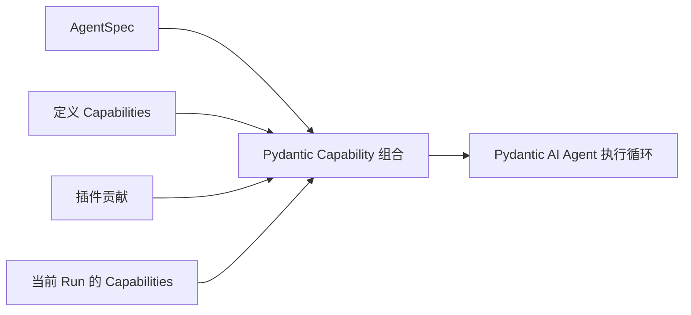

Pydantic AI Capabilities 是 agent 循环内组合功能的主要机制。Agent Harness 提供第一方 Capabilities，用于组合模型上下文、Toolset、可移植状态、执行协作对象和生命周期 hook，不另建注册表或工具分派器。

## 组合来源

Capabilities 可来自四种可信来源：

1. 原生 `AgentSpec.capabilities`；
2. `AgentDefinition.capabilities` 或 `HarnessBuilder.build(..., capabilities=...)`；
3. Harness 插件绑定 agent 的贡献；
4. 每次 Run 新提供的 `RunBindings.capabilities`。

稳定 agent 行为通过定义组合。当前调用策略或 MCP 通过 Run 的 Capability 组合。provider 客户端和功能覆盖通过带类型的 `RunBindings` 字段提供，不添加第二个功能 Capability。



存在 Capability 本身不授权外部工作。跨越托管边界的工具仍检查当前执行策略和 provider 强制限制。

## 通过 AgentSpec 选择 Capabilities

`AgentSpec.capabilities` 是声明式功能选择接口。它可以选择原生 Pydantic AI Capability 类型、支持声明式重建的有限 Harness 类型，以及当前 Host 授权的精确自定义类型。它不选择 Harness 中间件插件、环境执行扩展、provider、凭据、策略或活跃客户端。

例如，`ToolPermissionsCapability` 是 Harness 管理的声明式类型，可按 [shell 命令审查](#shell-command-review)直接选择。多数第一方 Harness 功能组合为具体定义或执行实例，因为它们接受带类型协作对象或代码配置，不属于可移植数据。

### 授权自定义声明式类型

可信 Host 可为 builder 提供一个直接声明的 dataclass Capability 类型：

```python
from dataclasses import dataclass

from a13n_harness import (
    AgentContext,
    AgentSpec,
    HarnessBuilder,
)
from a13n_harness.capability_types import CapabilityTypeCatalog
from pydantic_ai.agent.spec import CapabilitySpec
from pydantic_ai.capabilities import AbstractCapability


@dataclass
class PolicyInstructionsCapability(AbstractCapability[AgentContext]):
    instructions: str
    id: str | None = "policy-instructions"

    @classmethod
    def get_serialization_name(cls) -> str:
        return "policy_instructions"

    def get_instructions(self) -> str:
        return self.instructions


catalog = CapabilityTypeCatalog.from_types(
    (PolicyInstructionsCapability,),
)
agent_spec = AgentSpec(
    capabilities=[
        CapabilitySpec(
            name="policy_instructions",
            arguments={
                "instructions": "Explain material assumptions before the answer.",
            },
        )
    ]
)
executable = HarnessBuilder(
    capability_type_catalog=catalog,
).build(
    agent_spec,
    output_type=str,
    model=model,
)
```

两个步骤的权限不同：

1. `CapabilityTypeCatalog` 将精确序列化名称和 Python 类型提供给该 builder。它不发现软件包，也不自行启用功能。
2. `AgentSpec.capabilities` 为该 agent 选择并配置实例。名称不存在于原生、第一方或 Host 目录时，构建失败。

定义已是可信 Python 代码时，改用 `HarnessBuilder.build(..., capabilities=(PolicyInstructionsCapability(...),))`。当前策略或 MCP Capability 使用 `RunBindings.capabilities`；provider 协作对象放在带类型绑定字段中。插件显式启用后，也可从可信 `get_capabilities()` 实现提供 Capability。

不要混淆选择 agent 循环行为的 `AgentSpec.capabilities`，与记录活跃模型显式图像、视频和音频理解特性的 `AgentSpec.model_characteristics.capabilities`。

[集成包示例](https://github.com/converge-ai-labs/agent-foundation/tree/main/examples/plugins#custom-capability)使用离线模型运行 Host 授权 `AgentSpec` 路径和直接代码组合。

## 常用定义 Capabilities

视频输入支持是内置行为，不是可选的定义 Capability。`video_understanding` 支持内联视频和有界直接 URL 下载，`url_input.video: [youtube]` 声明原生 YouTube 支持；工具权限仍控制 `media.read_video_url`。本地文件使用 `view`，同样受内联视频预算约束。

| Capability                     | 添加内容                                                             | 需要当前执行的协作对象                               |
| ------------------------------ | -------------------------------------------------------------------- | ---------------------------------------------------- |
| `RuntimeContextCapability`     | 大小受限的当前时间、已用时间、用量、上下文窗口和选定元数据投影       | 否                                                   |
| `WorkspaceOutlineCapability`   | 从当前环境获取有界、仅元数据的文件概览                               | 环境文件接口                                         |
| `FileContextCapability`        | 执行期间固定的 `AGENTS.md` 和显式文件内容                            | 环境文件接口                                         |
| `DynamicEnvironmentCapability` | 文件和 shell Toolset 组合、当前挂载上下文和挂载变化通知              | 环境挂载；托管调用还需当前策略                       |
| `ToolPermissionsCapability`    | 基于稳定 ID 的权限和可选风险审查，支持 shell 输入特化                | 当前调用策略仍逐次授权托管调用                       |
| `SkillsCapability`             | 显式 skill 发现、选择、指令和路径                                    | 已进入环境及可选 `RunBindings.skill_selection`       |
| `WorkingStateCapability`       | 任务、笔记工具和模型上下文投影                                       | provider 模式中可选 `TaskStateBinding`               |
| `FileMemoryCapability`         | 挂载文件记忆：指南、`memory_file_*` 工具和执行开始时的文件变化上下文 | 每个挂载一个已打开 `FileStore`；可选 `MemoryCursors` |
| `RecordMemoryCapability`       | 挂载记录记忆：指南、`memory_record_*` 工具和执行开始时召回           | 每个挂载一个已打开 `RecordStore`                     |
| `UserInteractionCapability`    | 通过原生延后工具提出结构化用户问题                                   | Host 处理暂停与恢复                                  |

| `DocumentsCapability` | 文档转换 Toolset | `RunBindings.document_converter` | | `WebCapability` | 搜索、获取和抓取 Toolset | 具有当前客户端和策略的 `WebBinding` | | `HandoffCapability` | 显式 `summarize` 工具和续接提醒 | 否 | | `CompactionCapability` | provider 用量触发的同 agent 纯文本压缩，重放保留用户输入 | 否 | | `SubagentCapability` | 明确声明的子 agent 的内联或异步执行 | 定义选择的 `SubagentOperator` | | `CodeActCapability` | 受限 Python runner 和显式键到 JSON 存储值 | 明确选定的适用工具，以及用于程序的环境文件 | | `ContextualMCP` | 基于 URL 的 MCP，请求头从当前逻辑执行解析一次 | Harness 提供的当前 `AgentContext` |

大型本地工具集合可使用 [ToolProxyCapability](tool-proxy.md)，它接受由被动 `ToolProxyGroup(source=..., description=...)` 值组成的 `groups` 映射。这个统一代码入口支持分组发现、动态 schema 和 CodeAct，不替代原生执行。来源选择和插件组合见 [Host 集成指南](tool-proxy.md#host-integration)。

每个功能只公开一个 Capability。内部活跃替代实例保持私有，在同一逻辑执行的 ModelAttempt 之间复用，不跨执行复用。Host 协作对象通过 `RunBindings.web`、`document_converter`、`file_media_understanding`、`skill_selection`、`task_state` 和 `client_toolsets` 提供。`WebBinding` 和 `TaskStateBinding` 是被动冻结值，不是 Capability。这些字段不会启用缺失功能，也绝不进入 `HarnessState`。Host 负责 provider 生命周期，在 provider 契约允许时可以共享传输。

内联子 agent 的 `SubagentDefinition.run_bindings_factory` 接收子 agent 基础 `RunBindings`，返回携带其协作对象的替代绑定。必须保留子实例、借用环境和继承的调用策略。父功能绑定不会自动继承；显式共享任务状态策略提供借用状态单元，并拒绝与工厂绑定冲突。

## 原生图像生成与保存

`NativeImageGenerationCapability` 将 provider 原生 `ImageGenerationTool` 与必需异步 saver 组合。与直接选择上游工具不同，完成生成会产生已保存引用，不只将图像留在模型响应中。该功能不另设输出替换 Capability、图像 API 客户端或回退模型。

```python
from uuid import uuid4

from anyio import Path
from pydantic_ai import RunContext
from pydantic_ai.agent.spec import AgentSpec
from pydantic_ai.messages import FilePart
from pydantic_ai.native_tools import ImageGenerationTool

from a13n_harness import AgentContext, HarnessBuilder
from a13n_harness.capabilities import NativeImageGenerationCapability


async def save_image(ctx: RunContext[AgentContext], image: FilePart) -> str:
    # This Host owns this directory and makes it available to its users/Agents.
    directory = Path("/path/to/generated-images")
    await directory.mkdir(parents=True, exist_ok=True)
    target = directory / f"image-{uuid4().hex}.png"
    await target.write_bytes(image.content.data)
    return str(target)


agent = HarnessBuilder().build(
    AgentSpec(model="openai-responses:gpt-5.4"),
    output_type=str,
    capabilities=(
        NativeImageGenerationCapability(
            tool=ImageGenerationTool(output_format="png"),
            saver=save_image,
        ),
    ),
)
```

saver 接收当前 `RunContext` 和原生图像 `FilePart`；可使用获授权环境存储、Host 存储或上传服务。只有写入成功后，才返回非空模型可见路径或 URL。代码和凭据留在进程内，不序列化为配置。Host 负责命名、访问、保留和共享。Harness UI 默认实现在当前线程的 `tmp` 目录下保存。

Capability 保留原生生成调用/返回元数据，不公开图像预览，保存最终图像，并在输出和续接历史中加入文本引用。纯图像回复可配合 `output_type=str`。中断图像不会嵌入检查点，saver 异常使执行失败。生成、保存和续接发布是独立副作用；失败或取消可能留下已保存文件，却没有发布引用。已保存引用不会在后续轮次自动附带像素；agent 需要获授权文件/媒体 reader 才能检查图像。

原生搜索仍可独立通过 `NativeTool(WebSearchTool(...))` 或上游 `WebSearch` 组合。provider 支持和账号资格由原生模型集成检查，不由 Harness provider 矩阵决定。

## 上下文组合

配置、示例和生命周期边界见[上下文与工作状态](context.md#context-composition)。

## 工具权限与通用审查

使用一个 `ToolPermissionsCapability` 为稳定 ID 设置 `allow`、`deny`、`ask`、`review` 规则，按需提供模型审查器或自定义审查器。也可作为声明式 `AgentSpec` 类型使用；`inherit` 解析工具声明的默认值。[工具权限](managed-tools.md#select-tool-permissions)介绍配置、自定义指令、审查器实现、批准来源、结果事件和用量。普通 Pydantic 工具和本地 MCP 目标使用相同门控，无需托管元数据。

## Shell 命令审查

shell 审查是 `ToolPermissionsCapability` 的可选功能，不是独立 Capability。只审查 shell 启动时，显式选择其权限模式：

```python
from a13n_harness import AgentSpec

agent_spec = AgentSpec(
    capabilities=[
        {
            "name": "ToolPermissionsCapability",
            "arguments": {
                "default": "inherit",
                "rules": {"environment.shell_exec": "review"},
                "review": {
                    "model": "gateway@openai-responses:gpt-5.4-mini",
                    "risk_threshold": "extra_high",
                    "on_flagged": "deny",
                    "timeout_seconds": 20,
                },
            },
        },
    ]
)
```

未显式设置 review 权限或可信工具默认值时，全部工具默认 `allow`，不审查。仅安装审查器或定义风险规则不会启用审查。统一审查 agent 和公共提示判断风险与原因；运行时策略决定操作。shell 输入把命令与工作目录、时间、环境别名和环境变量名称（绝不包含值）分离。其他工具保留结构化 schema 和参数。精简历史审查与操作观测提供上下文，绝不提供授权或自动降低风险。

Harness 默认在 `extra_high` 风险时触发 `deny`；配置 `on_flagged: approval_required` 可改为请求批准。非超时失败遵循 `on_error`（默认 `approval_required`，或 `deny`、显式 `allow`）。审查器超时始终在分派前拒绝，不受错误策略或之前批准影响。Host 单独管理人工交互超时。逐工具规则和自定义审查器见[审查器配置](managed-tools.md#configure-or-replace-the-reviewer)。

## 工作状态

配置、示例和生命周期边界见[上下文与工作状态](context.md#working-state)。

## 结构化用户交互

当前 `RunBindings.deferred_tools_supported` 启用时，`UserInteractionCapability` 为根和子 agent 提供 `ask_user_question`。等待用户时，调用不会让 Harness 执行一直打开。它返回 `status="suspended"`，携带原生请求和可移植状态。Host 随后提供新绑定、之前状态和关联的 `DeferredToolResume`。[内置内联子 agent](delegation-and-codeact.md#host-managed-feedback)显式禁用延后工具；Host 管理的子 agent 使用原生恢复边界。不支持的执行既不提供工具，也不提供其指导。

请求与答案载荷、应用自定义类型和关联恢复示例见[人机协作工具](human-in-the-loop.md)。[状态与恢复](state-and-resume.md)介绍通用的继续执行生命周期。

## 媒体、文档与 Web

这些功能将稳定模型工具 schema 与当前 provider 实现分离：

```python
from a13n_harness import RunBindings
from a13n_harness.capabilities import (
    DocumentsCapability,
)

executable = HarnessBuilder().build(
    agent_spec,
    output_type=str,
    model=model,
    capabilities=(DocumentsCapability(),),
)

bindings = RunBindings.embedded(
    document_converter=document_converter,
)
```

视频 URL 无需 provider 绑定。默认 `VideoUrlCapability` 为支持二进制视频或原生视频 URL 的模型提供 `read_video_url`。直接 HTTP(S) 视频下载为原始字节并附加为 `BinaryContent`；SDK 负责编码 Base64，默认编码后单个和整次请求视频总预算均为 10 MiB。YouTube 仅走明确声明的原生 URL 路径，不支持时拒绝，不下载或转换。预算和兼容性过滤只改变 provider 请求，不改变保存的历史；没有 reader、压缩、切分或辅助模型。环境文件[多媒体理解](multimedia-understanding.md)是独立第一方路径：原生支持来自通过 `model_characteristics` 构建键提供的活跃 `AgentSpec.model_characteristics.capabilities`，专用图像、视频或音频 agent 可直接通过进程环境变量配置，无需 Host 协作对象。Web 还会逐次 Host 请求检查活跃 `WebPolicy`。

### 限制 Web 域名

`WebConfiguration` 限制获取/下载/抓取目标；嵌套 `WebSearchConfiguration` 独立过滤返回搜索 URL：

```python
from a13n_harness.capabilities import (
    WebCapability,
    WebConfiguration,
    WebSearchConfiguration,
)

web = WebCapability(
    WebConfiguration(
        allow_domains=("example.org", "*.example.org"),
        deny_domains=("private.example.org",),
        search=WebSearchConfiguration(
            mode="host",
            allow_domains=("example.org", "*.example.org"),
            deny_domains=("private.example.org",),
        ),
    )
)
```

精确主机只匹配自身；`*.example.org` 匹配子域，不匹配根域。条目规范化大小写、IDNA 和末尾点。拒绝优先；空列表不添加限制。两种行为都需要时，同时设置目标和搜索字段。过滤后搜索可能返回更少或零结果。受限 `native` 搜索被拒绝；受限 `auto` 使用 Host 搜索，需要绑定后端。

Host 传输必须在每次重定向的 DNS/网络操作之前保留 `WebDomainPolicy` 检查，同时保留普通地址和凭据检查。这些控制不是 shell、远程 MCP、已安装插件或模型 provider 工具的通用出站网络限制。

### Web 搜索与抓取后端

`WebCapability()` 默认搜索 `mode="auto"`：生效模型 profile 支持时使用 provider 原生 Web 搜索，否则使用首个可用 Host 搜索后端。原生搜索使用模型 provider 账号和计费，不使用 Host 搜索凭据或 `WebPolicy`。

按默认回退顺序绑定多个 Host 后端，搜索和抓取顺序分别设置：

```python
from a13n_harness.capabilities import (
    WebCapability,
    WebConfiguration,
    WebBinding,
    WebScrapeBackendBinding,
    WebScrapeConfiguration,
    WebSearchBackendBinding,
    WebSearchConfiguration,
)

web = WebCapability(
    WebConfiguration(
        search=WebSearchConfiguration(
            mode="auto",
            backend_priority=("brave", "tavily"),
            search_context_size="high",
        ),
        scrape=WebScrapeConfiguration(
            backend_priority=("firecrawl", "local"),
        ),
    )
)

bindings = RunBindings.embedded(
    web=WebBinding(
        client=web_client,
        policy=web_policy,
        search_backends=(
            WebSearchBackendBinding("google", google_search),
            WebSearchBackendBinding("brave", brave_search),
            WebSearchBackendBinding("tavily", tavily_search),
        ),
        scrape_backends=(
            WebScrapeBackendBinding("local", local_scraper),
            WebScrapeBackendBinding("firecrawl", firecrawl_scraper),
        ),
    ),
)
```

未配置偏好时，元组顺序是默认优先级。`backend_priority` 将可用命名后端提前，再保持其余绑定顺序。设置 `backend="tavily"` 只允许精确一个 Host 后端，不回退。所选后端未绑定时，在模型分派前失败。`search.mode="host"` 禁止原生搜索，`search.mode="native"` 禁止 Host 搜索，Web 功能仅用于获取、抓取或下载时使用 `search.mode="off"`。抓取支持 `mode="host"` 和 `mode="off"`，有自己的精确选择或优先级。

一次搜索或抓取在有序后端之间共享一个操作期限。provider 错误、无效响应或 provider 异常会转向下一个后端。超时、取消、Harness `RunError`、策略失败或结果后的授权失败会终止操作，不回退。有效空搜索结果属于成功，也停止回退。

未显式配置 `WebCapability()` 时，下列环境变量选择默认值：

| 变量                                       | 值                                | 默认值   |
| ------------------------------------------ | --------------------------------- | -------- |
| `A13N_HARNESS_WEB_SEARCH_MODE`             | `off`, `host`, `native` 或 `auto` | `auto`   |
| `A13N_HARNESS_WEB_SEARCH_BACKEND`          | 一个精确绑定后端 ID               | 未设置   |
| `A13N_HARNESS_WEB_SEARCH_BACKEND_PRIORITY` | 逗号分隔的后端 ID                 | 绑定顺序 |
| `A13N_HARNESS_WEB_SEARCH_CONTEXT_SIZE`     | `low`, `medium` 或 `high`         | `medium` |
| `A13N_HARNESS_WEB_SCRAPE_MODE`             | `off` 或 `host`                   | `host`   |
| `A13N_HARNESS_WEB_SCRAPE_BACKEND`          | 一个精确绑定后端 ID               | 未设置   |
| `A13N_HARNESS_WEB_SCRAPE_BACKEND_PRIORITY` | 逗号分隔的后端 ID                 | 绑定顺序 |

精确 `*_BACKEND` 忽略对应 `*_BACKEND_PRIORITY`，禁用回退。环境变量只选择模式和后端 ID；provider 对象和凭据仍来自 `RunBindings.web` 中的新 `WebBinding`。显式传入 `WebCapability(WebConfiguration(...))` 是权威配置，不合并环境默认值，使加载预设保持确定性。

## 执行内 shell 观测

`DynamicEnvironmentCapability` 根据当前挂载操作派生 shell 执行、通过 `shell_info` 进行原生发现/检查、显式偏移量 `shell_wait`，以及支持的输入/控制工具。工具接口不要求 Host 进程 operator，也不要求全有或全无的交互权限。

执行清理释放本地观测，不统一终止所有命令。引用和缓冲只在本次执行有效；后续执行可通过新引用发现 provider 实际保留的命令。完成提示报告原生退出，不代表输出完整捕获。不引入进程数据库或执行后的唤醒服务。

签名、输出来源、观测限制和 provider 专属恢复见[环境工具](environments.md)。

## 过滤器

配置、示例和生命周期边界见[上下文与工作状态](context.md#filters)。

## MCP

原生组合、执行范围请求头、本地与 provider 原生执行，以及结果边界见 [MCP 工具](mcp.md)。

## 原生 Capabilities 与工具

普通 Pydantic AI Capability 仍可使用。将原生工具或 Toolset 放入 Capability，不绕过原生组合：

```python
from pydantic_ai.capabilities import Capability


def double(value: int) -> int:
    return value * 2

capabilities = (Capability(id="math", tools=[double]),)
```

没有注解的原生工具仍是可信进程内调用。托管工具元数据启用额外 Harness 策略、凭据、grant、重试、事件和有界输出路径。不要从工具名称推断托管权限。

## 状态与身份

有状态 Capability 在 `AgentContext.state` 中拥有一个稳定命名空间和一个精确编解码器版本。可通过 `AgentContextState` 读写带类型的 Pydantic 值；Harness 对命名空间取快照，不解释功能专属数据。

Capability ID、工具 ID、绑定 ID 和其他紧凑选择器用于关联和组合，不授予权限，也不恢复 provider 权限。

压缩成功时，`a13n_harness.capabilities` 通过原生 Capability 事件通道发出 `CompactionSummaryEvent`。其 `operation_id` 与压缩生命周期事件一致，`summary` 包含生成的替代文本。它是带内容的输出，不是助手回答，也不证明检查点已保存。生命周期扩展本身仍只含元数据。
