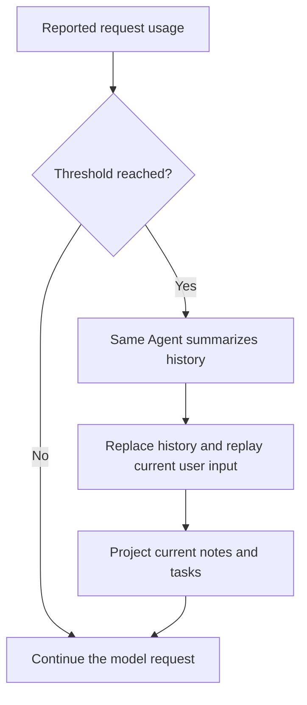

Use context projections for the current request, compaction for long history, and working state for task facts.

## Choose the right mechanism

| Need                                   | Mechanism                             |
| -------------------------------------- | ------------------------------------- |
| Current time, usage, file metadata     | Runtime context and workspace outline |
| Current instructions or selected files | File context                          |
| Long Thread histories                  | Handoff and compaction                |
| Tasks and notes across turns           | Working state in `HarnessState`       |
| Durable files shared across Threads    | [File memory](memory.md)              |
| Facts recalled by similarity           | [Record memory](memory.md)            |
| Smaller requests after idle time       | Cold-start filter                     |

Select the Capability for your task. Use [State and Resume](state-and-resume.md) to persist and continue a Thread.

## Run configuration

Pass shared per-Run settings through `RunConfiguration`:

```python
from a13n_harness import RunBindings, RunConfiguration

configuration = RunConfiguration(
    allowed_hosts={"api.example.com", "docs.example.com"},
    extensions={"example.reader": {"images": True}},
)
bindings = RunBindings.embedded(configuration=configuration)
# Pass bindings to executable.run(..., bindings=bindings).
```

Plugins and tools read `AgentContext.configuration` (`ctx.deps.configuration` inside a tool). Each integration validates its own namespaced `extensions` values.

`allowed_hosts=None` allows all destinations; an empty set denies all. Entries match exact normalized hostnames/IPs or explicit `regex:` rules. First-party HTTP integrations apply this allowlist. In your own integrations, call `configuration.authorize_url(url)` before requests and redirects. Under a restricted allowlist, use local MCP and Host Web tools, and materialize media as authorized `BinaryContent` instead of forwarding a URL. Shell and third-party plugin networking needs Environment or deployment isolation.

### Host rules and regular expressions

Host rules match the entire normalized hostname using `re.fullmatch`, not the URL path or port. DNS names are lowercased and IDNA-normalized; write lowercase ASCII patterns or use `(?i)`. Exact and regex rules can coexist.

```python
configuration = RunConfiguration(
    allowed_hosts={
        "api.vendor.example",                         # Exact host only.
        r"regex:(api|docs)\.example\.com",            # Two named subdomains.
        r"regex:(?:[a-z0-9-]+\.)*assets\.example\.com", # Base and all subdomain levels.
    },
)
```

| Rule                                  | Allows                              | Does not allow                            |
| ------------------------------------- | ----------------------------------- | ----------------------------------------- |
| `example.com`                         | `example.com`                       | `api.example.com`                         |
| `regex:[a-z0-9-]+\.example\.com`      | `api.example.com`                   | `example.com`, `eu.api.example.com`       |
| `regex:(?:[a-z0-9-]+\.)*example\.com` | `example.com`, `eu.api.example.com` | `notexample.com`, `example.com.evil.test` |

Escape literal dots as `\.`. Use `regex:(?:[a-z0-9-]+\.)*example\.com` for a base domain and its subdomains; `*.example.com` is not a glob. Every redirect destination must match a rule.

When writing YAML, use single quotes to preserve backslashes, for example `'regex:(api|docs)\.example\.com'`. JSON requires doubled backslashes: `"regex:(api|docs)\\.example\\.com"`. Python raw strings, as shown above, avoid extra escaping.

## Context Composition

Combine these Capabilities to show current metadata and selected files:

```python
from a13n_harness.capabilities import (
    FileContextCapability,
    RuntimeContextCapability,
    WorkspaceOutlineCapability,
)

capabilities = (
    RuntimeContextCapability(),
    WorkspaceOutlineCapability(),
    FileContextCapability(),
)
```

- Runtime context is refreshed for each request and can expose only explicitly selected metadata keys.
- Workspace outline reads metadata, not file content, and appears only on user-input requests.
- File context loads selected files once for the logical Run and fences the Environment route used to load them.

Use each Capability's configuration to set byte, item, depth, and line limits for your workspace.

## Compact a long Thread

Add `CompactionCapability()` to enable automatic history compaction. The default trigger is 90% of the effective Model's context window, using reported token usage. Set `AgentSpec.model_characteristics` when your Model lacks context-window information. For a fixed trigger, select a token policy:

```python
from a13n_harness.capabilities import CompactionCapability, CompactionPolicy

compaction = CompactionCapability(CompactionPolicy(trigger_tokens=100_000))
# Include compaction in HarnessBuilder.build(..., capabilities=(compaction,)).
```



The summary request uses the same Agent and complete history. The summary replaces old history; current user input and delivered steering are replayed in order, including media. Compaction emits `CompactionSummaryEvent` and stores the replacement in returned state. It makes a model request, so include that request in your budget.

Select `HandoffCapability()` when you also want the `summarize` tool for explicit handoffs. Its default reminder starts at 65% of the context window. Both Capabilities are opt-in; threshold configuration alone enables neither.

## Working State

`WorkingStateCapability` can keep tasks and notes inside its portable Capability namespace:

```python
from a13n_harness.capabilities import WorkingStateCapability

capabilities = (WorkingStateCapability(),)
```

This embedded mode, with no `TaskStateBinding`, is useful for one process-local or state-resumed Agent. Provider mode replaces task storage with a fresh `TaskStateBinding` in `RunBindings.task_state`; the provider remains authoritative, while Harness events report bounded committed deltas.

The note tools have explicit mutation semantics:

- `note_write(key, value)` creates or updates a note and reports `created` or `updated`;
- `note_delete(key)` is idempotent and reports `deleted` or `already_absent`;
- `note_get(key=None)` reads one complete value or lists sorted keys with a count.

Notes appear on user-input requests; tasks also refresh on tool-result requests. Complete notes appear as `<note>`; `<note-ref>` and `<notes-omitted>` point to values available through `note_get`. `WorkingStateConfiguration` defaults to 256 projected notes and 128 tasks within a shared 64 KiB budget.

Use notes for facts, tasks for execution progress, and `summarize` for the continuation narrative. Reconcile stale notes and task statuses before a handoff rather than copying them all into the summary.

Working state is not a distributed workflow engine. Cross-worker ownership, durable leases, schedules, and delivery belong to the Host or task provider.

## Filters

Harness applies message-integrity and media compatibility filters before model requests. Media preparation leaves saved history and source files unchanged. Use [media acquisition](multimedia-understanding.md) for video and [image input policy](models.md#image-input-policy) for image limits. Content filtering is optional; cold-start filtering is on by default after one hour of idle time:

```python
from a13n_harness import AgentSpec
from a13n_harness.filters import (
    ColdStartFilterConfiguration,
    ContentFilterCapability,
    ContentFilterConfiguration,
)

capabilities = (
    ContentFilterCapability(
        ContentFilterConfiguration(
            accepted_media=frozenset({"image", "document"}),
            max_media_items=16,
        )
    ),
)
spec = AgentSpec(cold_start_filter=ColdStartFilterConfiguration(idle_seconds=3_600))
without_cold_compression = spec.with_updates(cold_start_filter=None)
```

Content filtering selects compatible media. Cold-start filtering shortens old tool-result text, preserving user input, thinking, media, and pending results. An explicit `ColdStartFilterCapability` replaces the default policy.

Image preparation is on by default. Override the selected Model's policy or disable it:

```python
from a13n_harness import HarnessModelCharacteristics, ImageInputPolicy

characteristics = HarnessModelCharacteristics(
    image_input=ImageInputPolicy(max_images=10, split_large_images=False),
)
spec = AgentSpec(model_characteristics=characteristics)
without_image_preparation = spec.with_updates(
    model_characteristics=characteristics.model_copy(update={"image_input": None}),
)
```

Omitting `image_input` uses defaults; `None` disables preparation. See [Image input policy](models.md#image-input-policy) for limits and custom filters.

## Handoff versus automatic compaction

A continuation summary carries the paths and roles of Skills still needed. Reread them on resume when their full content is no longer available.

Use `summarize` for an explicit handoff or let compaction react to usage. See [Compact a long Thread](#compact-a-long-thread) for thresholds.

Persist the returned `HarnessState` under your Host's acceptance policy; a summary does not save application storage.
