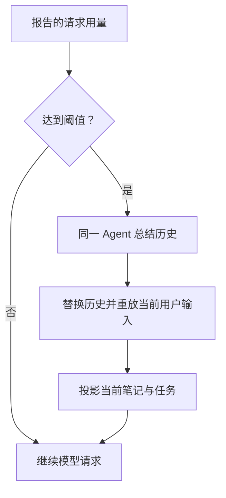

上下文投影准备当前请求，压缩处理较长历史，工作状态保存任务事实。

## 选择合适的机制

| 需求                       | 机制                        |
| -------------------------- | --------------------------- |
| 当前时间、用量、文件元数据 | 运行时上下文与工作空间概览  |
| 当前指令或选定文件         | 文件上下文                  |
| 长 Thread 历史             | Handoff 与压缩              |
| 跨轮次的任务和笔记         | `HarnessState` 中的工作状态 |
| 多个 Thread 共享的持久文件 | [文件记忆](memory.md)       |
| 按相似度召回事实           | [记录记忆](memory.md)       |
| 空闲一段时间后缩减请求     | 冷启动过滤器                |

按任务选择 Capability。Thread 的保存与续接见[状态与恢复](state-and-resume.md)。

## Run 配置

通过 `RunConfiguration` 传入一次 Run 共享的配置：

```python
from a13n_harness import RunBindings, RunConfiguration

configuration = RunConfiguration(
    allowed_hosts={"api.example.com", "docs.example.com"},
    extensions={"example.reader": {"images": True}},
)
bindings = RunBindings.embedded(configuration=configuration)
# Pass bindings to executable.run(..., bindings=bindings).
```

插件和工具通过 `AgentContext.configuration` 读取配置（工具内使用 `ctx.deps.configuration`）。各集成验证自身命名空间下的 `extensions` 值。

`allowed_hosts=None` 放行全部目标，空集合拒绝全部。条目匹配规范化的主机名/IP 或显式 `regex:` 规则。第一方 HTTP 集成执行此允许列表；自定义集成应在请求和重定向前调用 `configuration.authorize_url(url)`。限制目标时，使用本地 MCP 和 Host Web 工具，将已授权媒体物化为 `BinaryContent`，不直接转发 URL。Shell 与第三方插件的网络流量需要 Environment 或部署隔离。

### 主机规则与正则表达式

主机规则通过 `re.fullmatch` 匹配完整的规范化主机名，不匹配 URL 路径或端口。域名会转为小写并做 IDNA 规范化；使用小写 ASCII 表达式或 `(?i)`。精确规则与正则规则可混用。

```python
configuration = RunConfiguration(
    allowed_hosts={
        "api.vendor.example",                         # Exact host only.
        r"regex:(api|docs)\.example\.com",            # Two named subdomains.
        r"regex:(?:[a-z0-9-]+\.)*assets\.example\.com", # Base and all subdomain levels.
    },
)
```

| 规则                                  | 放行                                | 不放行                                    |
| ------------------------------------- | ----------------------------------- | ----------------------------------------- |
| `example.com`                         | `example.com`                       | `api.example.com`                         |
| `regex:[a-z0-9-]+\.example\.com`      | `api.example.com`                   | `example.com`、`eu.api.example.com`       |
| `regex:(?:[a-z0-9-]+\.)*example\.com` | `example.com`、`eu.api.example.com` | `notexample.com`、`example.com.evil.test` |

字面点使用 `\.` 转义。`regex:(?:[a-z0-9-]+\.)*example\.com` 匹配基础域名及其子域名；`*.example.com` 不是 glob。每个重定向目标都必须匹配规则。

YAML 中使用单引号保留反斜杠，例如 `'regex:(api|docs)\.example\.com'`。JSON 需要双反斜杠：`"regex:(api|docs)\\.example\\.com"`。上面的 Python 原始字符串可避免额外转义。

## 组合上下文

组合以下 Capabilities，提供当前元数据与选定文件：

```python
from a13n_harness.capabilities import (
    FileContextCapability,
    RuntimeContextCapability,
    WorkspaceOutlineCapability,
)

capabilities = (
    RuntimeContextCapability(),
    WorkspaceOutlineCapability(),
    FileContextCapability(),
)
```

- 运行时上下文在每次请求时刷新，只暴露显式选定的元数据键。
- 工作空间概览只读取元数据，不读取文件内容，且仅出现在用户输入请求中。
- 文件上下文在一次逻辑 Run 中只加载一次选定文件，并固定加载时使用的 Environment 路由。

通过各 Capability 的配置设置适合工作空间的字节数、条目数、深度和行数限制。

## 压缩较长的 Thread

添加 `CompactionCapability()` 以启用自动历史压缩。默认根据报告的 token 用量，在有效 Model 上下文窗口的 90% 处触发。Model 缺少窗口信息时，设置 `AgentSpec.model_characteristics`。固定 token 阈值可使用以下策略：

```python
from a13n_harness.capabilities import CompactionCapability, CompactionPolicy

compaction = CompactionCapability(CompactionPolicy(trigger_tokens=100_000))
# Include compaction in HarnessBuilder.build(..., capabilities=(compaction,)).
```



总结请求使用同一 Agent 和完整历史。总结替换旧历史后，按顺序重放当前用户输入与已交付的 steering，包括媒体。压缩发出 `CompactionSummaryEvent`，返回状态中保存替换后的历史。压缩会调用模型，应将该请求纳入预算。

需要显式交接时，添加 `HandoffCapability()` 以启用 `summarize` 工具；默认在上下文窗口的 65% 处提醒。两种 Capability 均需显式选择，仅配置阈值不会启用。

## 工作状态

`WorkingStateCapability` 可以在自身可移植的 Capability 命名空间中保存任务和笔记：

```python
from a13n_harness.capabilities import WorkingStateCapability

capabilities = (WorkingStateCapability(),)
```

这种不使用 `TaskStateBinding` 的嵌入式模式，适合在单个进程内运行或从状态恢复的 Agent。Provider 模式通过 `RunBindings.task_state` 中新建的 `TaskStateBinding` 替换任务存储：provider 仍是权威来源，Harness 事件只报告大小受限、已经提交的变更。

笔记工具具有明确的修改语义：

- `note_write(key, value)` 创建或更新笔记，返回 `created` 或 `updated`；
- `note_delete(key)` 是幂等操作，返回 `deleted` 或 `already_absent`；
- `note_get(key=None)` 读取一条完整的值，或列出排序后的键及数量。

笔记在用户输入请求时投影；任务还会在工具结果请求时刷新。完整笔记以 `<note>` 显示；`<note-ref>` 和 `<notes-omitted>` 指向可通过 `note_get` 读取的值。`WorkingStateConfiguration` 默认投影最多 256 条笔记和 128 个任务，共享 64 KiB 预算。

笔记保存事实，任务记录执行进度，`summarize` 保留续接叙事。交接前清理过时笔记和任务状态，不必将全部内容复制到总结中。

工作状态不是分布式工作流引擎。跨 worker 的所有权、持久租约、调度和交付，由 Host 或任务 provider 负责。

## 过滤器

Harness 在模型请求前执行消息完整性与媒体兼容性过滤。媒体预处理不改变保存的历史或源文件。视频使用[媒体读取](multimedia-understanding.md)，图片限制见[图片输入策略](models.md#image-input-policy)。内容过滤可选，冷启动过滤默认在空闲一小时后启用：

```python
from a13n_harness import AgentSpec
from a13n_harness.filters import (
    ColdStartFilterConfiguration,
    ContentFilterCapability,
    ContentFilterConfiguration,
)

capabilities = (
    ContentFilterCapability(
        ContentFilterConfiguration(
            accepted_media=frozenset({"image", "document"}),
            max_media_items=16,
        )
    ),
)
spec = AgentSpec(cold_start_filter=ColdStartFilterConfiguration(idle_seconds=3_600))
without_cold_compression = spec.with_updates(cold_start_filter=None)
```

内容过滤选择兼容媒体。冷启动过滤缩短旧工具结果文本，保留用户输入、思考、媒体和待处理结果。显式 `ColdStartFilterCapability` 替换默认策略。

图片预处理默认启用。可覆盖所选 Model 的策略或禁用：

```python
from a13n_harness import HarnessModelCharacteristics, ImageInputPolicy

characteristics = HarnessModelCharacteristics(
    image_input=ImageInputPolicy(max_images=10, split_large_images=False),
)
spec = AgentSpec(model_characteristics=characteristics)
without_image_preparation = spec.with_updates(
    model_characteristics=characteristics.model_copy(update={"image_input": None}),
)
```

省略 `image_input` 使用默认策略，`None` 禁用预处理。限制与自定义过滤器见[图片输入策略](models.md#image-input-policy)。

## Handoff 与自动压缩

续接总结保留仍需使用的 Skill 路径与作用。恢复时，若完整内容已不可用，应重新读取。

显式交接使用 `summarize`，自动压缩根据用量触发。阈值见[压缩较长的 Thread](#compact-a-long-thread)。

按 Host 的接受策略保存返回的 `HarnessState`；总结不会保存应用存储。
