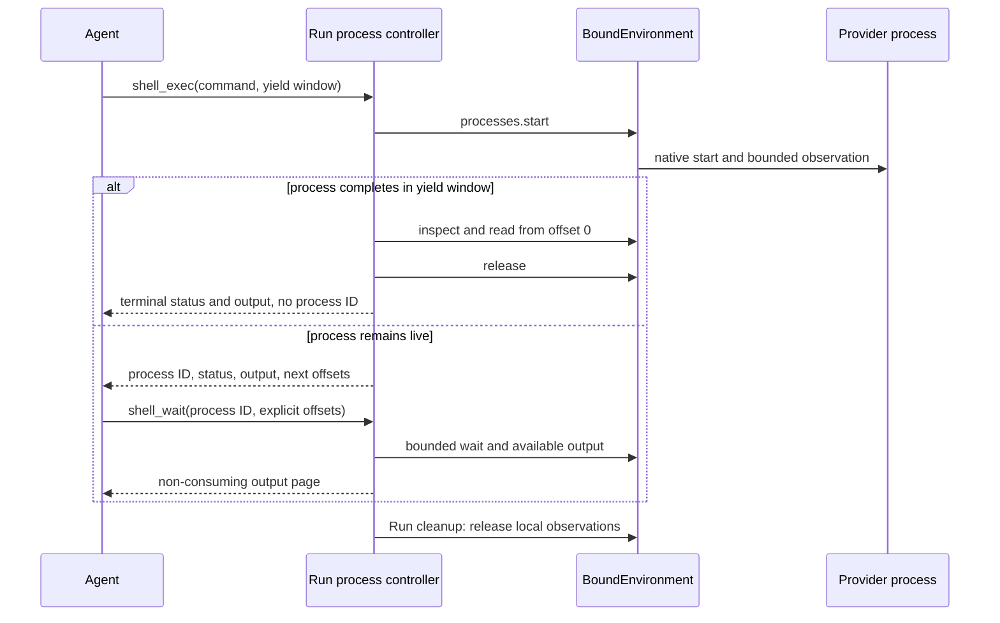

# Environments

An Environment is one fresh process-local adapter for a single provider target. The Environment package owns target creation, re-entry, provider operations, cached state, and explicit destruction. Harness owns only one Run's mount names, access ceilings, routing, state aggregation, and non-destructive cleanup.

Applications pass already constructed `Environment` instances to `run()` or `stream()`. Harness never accepts a Provider, provider key, specification, state envelope, or transport session as a Run input.

Environment lifecycle is separate from model-facing tools:

- a Host selects a trusted Provider, configuration, current `EnvironmentState`, and fresh runtime collaborators;
- the Provider constructs a fresh Environment without external I/O;
- Harness enters the Environment before input production and closes it after the terminal Run fence;
- `DynamicEnvironmentCapability` optionally exposes permitted operations to the model;
- `close()` releases process-local resources and never destroys the backing target;
- only explicit Host policy creates a fresh adapter and calls `destroy()`.

## Start without an Environment

Environment input is optional. A Run with no Environment receives an empty facade and no Environment tools:

```python
result = await executable.run("Answer without using a workspace")
```

## Construct one fresh Environment per Run

Use a trusted Provider before calling Harness. Direct Local is stateless, so each Run passes `state=None`:

```python
from pathlib import Path

from a13n_harness.providers.environment import (
    DirectLocalEnvironmentProvider,
    DirectLocalProviderConfiguration,
    DirectLocalRootConfiguration,
)

provider = DirectLocalEnvironmentProvider()
configuration = provider.validate_configuration(
    schema_version="1",
    value=DirectLocalProviderConfiguration(
        root=DirectLocalRootConfiguration(
            path=Path("./workspace").resolve(),
        ),
    ).model_dump(mode="json"),
)
environment = provider.create_environment(
    configuration=configuration,
    environment_id="workspace",
    state=None,
)

result = await executable.run(
    "Update the workspace",
    environment=environment,
)
```

Provider validation and `create_environment()` are inert. The Host calls `await environment.prepare()` for eager preparation, or leaves preparation to the first readiness check for lazy use. `environment.enter(...)` only binds the local Run scope. Harness closes the adapter on success, failure, cancellation, abandoned stream consumption, or initial multi-mount unwind. That close is non-destructive; Direct Local never deletes the Host directory, and Docker close never removes the container.

Do not retain and reuse the adapter for a later independent Run. Construct a fresh adapter each time, even when several Runs re-enter the same provider target.

## Re-enter stateful targets

For a stateful Provider, the Host supplies its latest authoritative state before Harness receives the adapter. Harness does not restore a Provider after entry and does not treat `HarnessState` as live authority:

```python
current_state = await environment_state_store.load(thread_id, "workspace")
environment = provider.create_environment(
    configuration=configuration,
    environment_id="workspace",
    state=current_state,
    runtime=fresh_runtime,
)

try:
    result = await executable.run(
        "Continue the task",
        environment=environment,
        previous_state=previous_harness_state,
    )
finally:
    await environment_state_store.publish(
        thread_id,
        "workspace",
        environment.dump_state(),
    )
```

`dump_state()` is a synchronous, infallible read of a detached copy of the latest validated cache. It performs no target I/O. The Host can therefore read it in unconditional finalization after partial entry, cancellation, checkpoint failure, execution failure, or close failure.

`HarnessState.environment_states` records the current mount-name-to-state aggregate for continuation export. It is useful evidence, but the Host still decides which managed state is authoritative, reconstructs fresh credentials and runtime collaborators, and supplies a fresh Environment. State contains no credential, live client, PID, transport session, mount policy, or destruction authority.

## Explicit destruction belongs to the Host

Harness never calls `destroy()`. When retention policy selects cleanup, the Host constructs a fresh adapter from the exact current state and calls `destroy()` explicitly:

```python
cleanup = provider.create_environment(
    configuration=configuration,
    environment_id="workspace",
    state=current_state,
    runtime=fresh_runtime,
)
try:
    await cleanup.destroy()
finally:
    latest_state = cleanup.dump_state()
    await cleanup.close()
    await environment_state_store.publish(
        thread_id,
        "workspace",
        latest_state,
    )
```

Successful destruction clears the adapter's state. An incompatible target or unknown external outcome fails and preserves the last validated state for later Host inspection or retry. The Provider removes only the exact target and provider-owned bootstrap material represented by that state; external bind sources and shared Host workspaces remain Host-owned.

## Use several Environments

Pass `environments=` to name several already constructed adapters. `EnvironmentMount` adds one Run-local access ceiling and working directory:

```python
from a13n_harness import EnvironmentAccess, EnvironmentMount

result = await executable.run(
    "Read the source data and write the build output",
    environments={
        "build": build_environment,
        "data": EnvironmentMount(
            data_environment,
            access=EnvironmentAccess.READ_ONLY,
        ),
    },
    default_environment="build",
)
```

The routing rules are deterministic:

| Input                                             | Mount name(s)  | Default route |
| ------------------------------------------------- | -------------- | ------------- |
| `environment=source`                              | `workspace`    | `workspace`   |
| one `environments` entry                          | supplied name  | that entry    |
| several entries with `default_environment="name"` | supplied names | named entry   |
| several entries without `default_environment`     | supplied names | none          |

The default mount serves `/workspace`. Every named mount is addressable at `/environment/{name}`. With several entries and no explicit default, `/workspace/...` fails instead of selecting the first mapping entry. Mapping order never grants authority.

Initial setup is atomic. Harness validates the complete input before entry and publishes no partial mount set. If any adapter fails, Harness closes every supplied adapter that may own process-local resources in reverse order. It never destroys a target during unwind.

## Restrict a mount

`EnvironmentMount` adds a user-facing access level and default working directory to one source:

```python
from a13n_harness import (
    EnvironmentAccess,
    EnvironmentMount,
)

read_only_docs = EnvironmentMount(
    docs_resource,
    access=EnvironmentAccess.READ_ONLY,
    working_directory="/reference",
)
```

Access defaults to `EnvironmentAccess.FULL`. `READ_ONLY` exposes file reads, `READ_WRITE` exposes all file operations, and `FULL` exposes every Agent-facing Environment capability offered by the Provider, including command and process operations when supported. Provider capabilities always narrow the selected level. `FULL` does not grant Host administration, bypass a sandbox, or override operating-system security.

Exact action sets remain an internal advanced runtime and Provider enforcement seam rather than ordinary `EnvironmentMount` configuration. `working_directory` must be `None` or a canonical absolute provider path without `.` or `..` segments.

## Expose tools to the model

The Environment can exist without model-facing tools. Add `DynamicEnvironmentCapability` when the model should receive a selected stable tool surface:

```python
from a13n_harness.environment import (
    DynamicEnvironmentCapability,
    DynamicEnvironmentConfiguration,
)

capabilities = (
    DynamicEnvironmentCapability(DynamicEnvironmentConfiguration()),
)
```

Three decisions remain separate:

1. the Agent definition includes or omits the dynamic Environment Capability;
2. an optional run policy can narrow a managed invocation for the current identity and arguments;
3. the selected Environment mount and Provider enforce the exact operation.

Without an explicit Invocation Policy, managed Environment tools default to allow at the Harness boundary. That default does not create Provider capability, credentials, approval, or mount access. Tool injection improves discovery and cannot replace execution-time checks.

Authorization applies to the requested operation and arguments, not a reserved backend. Canonical resources describe the mount and path observed during policy evaluation. If the Host replaces a mount or changes the default while policy or approval is waiting, execution selects the current route and checks its current permissions. Resource metadata and custom approval revisions do not guarantee that dispatch uses the observed backend; exact-target Host policy must also be enforced on the execution path, such as by the Provider or a Host-controlled stable binding.

After execution starts, compound file work stays on its selected scope. Document conversion retains that scope from source read through output publication, and downloads retain it while fetching and writing. Replacing a mount does not move an in-flight operation to another backend. Exact process handles, generation validation, Provider draining, and the prohibition on automatically replaying unknown outcomes remain unchanged.

The tool surface follows the effective actions of current mounts. With the standard access presets:

- `read_only` exposes `view`, `ls`, `glob`, and `grep`;
- `read_write` adds `write`, `edit`, `multi_edit`, `mkdir`, `move`, `copy`, and `delete`;
- `full` adds `shell_exec` when a Provider offers shell execution, and independently adds `shell_info`, `shell_wait`, `shell_input`, and `shell_signal` according to their actions.

Partial-capability Providers expose only usable tools: list, query, and text-search independently enable `ls`, `glob`, and `grep`; text-write can expose write/create-edit tools without read permission. Text `view` needs text-read, while media `view` needs stat plus byte-read on the same mount. Existing edits need byte-read plus text-write. Writing directly under a selected mount root does not require mkdir, including explicit roots without a default mount. Nested writes require mkdir when the tool creates the parent. Copy uses copy-source and copy-destination permissions, including across mounts. Actual arguments are checked again at execution.

On a single shell-enabled mount, `shell_exec` supersedes exactly `move`, `copy`, and `delete`; `mkdir` remains available. Multiple mounts retain file mutations so a shell on one mount does not hide operations on another. An empty Environment exposes no Environment tools.

A foreground-only mount exposes `shell_exec` with bounded inline output; it does not need standalone retained-output permissions. Process-capable mounts can add:

| Tool           | Behavior                                                                                                 |
| -------------- | -------------------------------------------------------------------------------------------------------- |
| `shell_exec`   | Starts a command, waits up to `yield_time_seconds`, and returns a Run-local reference when not completed |
| `shell_info`   | Without an ID, lists discoverable native commands; with an ID, inspects current status only              |
| `shell_wait`   | Waits boundedly, or polls with zero, then reads available stdout/stderr at explicit offsets              |
| `shell_input`  | Writes UTF-8 stdin and optionally closes stdin without reading output                                    |
| `shell_signal` | Requests supported `interrupt`, `terminate`, or `kill` control without reading output                    |

`execution_timeout_seconds` on `shell_exec` requests a Provider-enforced hard execution deadline. Providers such as native E2B reject it before starting when they cannot enforce it. `yield_time_seconds` and `shell_wait.timeout_seconds` only bound waiting. There is no background mode flag and no separate list, status or kill tool.

Use `shell_info(alias="workspace", limit=50)` to discover recoverable running commands only when the selected mount supports process listing. Direct Local supports inspection, not discovery: its `shell_info` schema requires a `process_id` returned by `shell_exec` in the current Run and omits `limit`. `shell_info(process_id=...)` only inspects; it does not attach, read, refresh or reset output. Listing and inspection are independently authorized. `alias` is an existing mount name from the Environment context, not a command/process label; omit it for default selection. An unknown or conflicting alias fails instead of retargeting a command or reference. Listing never exposes native PIDs, arbitrary arguments or environment variables.

Output pages identify `origin` (`native_bytes` or `sdk_text`), coverage, whether observation is closed, and any partial-coverage reason. SDK-text offsets describe UTF-8 encoding of text delivered by the SDK, not original process bytes. Producer counts and completion are null when unknown. `next_offset` advances only over returned bytes; repeat the same offsets to reread, or use the last returned offsets for the next page. Harness keeps no unread cursor.

References belong to one Run. A reconnect within that Run retains its reference and accumulated log offsets but reports a gap. A later Run starts fresh references and observations; old references in messages are not authority. A completion hint means the native process exited, not that all output was captured or every descendant was cleaned up. Conversely, capped or closed output does not mean the process exited. E2B keeps checking native status within the wait budget after its output cap; if final exit evidence is lost, it reports missing/unknown rather than success. A tool result with `ok=true` means the invocation returned normally; inspect the process status and exit code to determine command success.

Run cleanup cancels watchers and releases local observations before adapters close; it does not blanket-kill commands. Actual survival and recovery depend on the Provider and Host target lifetime. E2B can discover commands still running in the restored sandbox. Direct Local and Envd-backed Providers retain their own scope cleanup semantics. There is no Harness process database or post-Run notification service.



`glob` and `grep` send their include pattern, repository-ignore and hidden-name policy, context width, and scan/result ceilings to the selected `FileOperator` in one call. Direct Local performs one worker-thread scan; EIP performs one `file.find` or `file.search` request. Set `include_ignored=True` only when ignored repository paths should be searched.

For supported image, audio, and video files, `view` either attaches native `BinaryContent` or invokes a dedicated understanding Agent. The `model_characteristics` construction value on the active Harness `AgentSpec` is the sole native-input authority; Harness never infers support from a model name or Pydantic AI `Model.profile`. Dedicated defaults read ordinary process environment variables, and a fresh run Capability can override them.

See [Multimedia Understanding](multimedia-understanding.md) for capability declarations, environment configuration, default prompt behavior, run-scoped providers, usage attribution, and ordinary tool-result failures.

## Manage Provider state outside Harness

A production Host normally keeps desired Provider configuration and current `EnvironmentState` in its own authoritative records. For each independent Run it:

1. selects the trusted Provider and validates desired configuration;
2. loads current managed state, where authoritative `None` suppresses stale fallback state;
3. constructs fresh runtime collaborators and one fresh Environment per mount;
4. invokes Harness with those already constructed adapters;
5. reads every adapter's cached state in unconditional finalization;
6. publishes changed state according to Host concurrency policy;
7. invokes explicit destruction only when retention or prune policy authorizes it.

The shared package deliberately defines no Host table, lease, Thread-link, prune-candidate, pause-mode, or reconciliation-operation schema. A Host can add those models without moving lifecycle authority back into Harness.

## Advanced Run-local mount mutation

Most applications should use `environment=` or `environments=`. Trusted Harness integrations can use the advanced Environment runtime when they need live Run-local `mount()`, `replace()`, `unmount()`, or `set_default()` behavior.

Each mutation still accepts an `EnvironmentMount` containing one fresh adapter. A candidate is entered before commit; failure leaves the published mount set unchanged and closes the candidate. Replacement allocates a fresh mount incarnation, preserves default selection, and retires the old adapter only after its operation leases drain. Mutation never discovers a Provider, restores state, persists desired mounts, or calls `destroy()`.

High-level Environment arguments and an explicitly supplied advanced runtime are mutually exclusive. They use the same routing, permission, fencing, state-dump, and non-destructive cleanup implementation.

## Direct Local boundary

`direct-local` exposes an explicitly selected existing Host directory. It is an operation backend, not a sandbox claim:

- the Host creates, selects, retains, backs up, shares, and removes the directory;
- a fresh Direct Local Environment validates and uses it for one Run;
- `dump_state()` returns `None` because the target is deterministic and stateless;
- `close()` and `destroy()` never delete the directory;
- `read_only` constrains provider operations but is not an operating-system sandbox against an allowed child process.

Use Local Envd or Docker when untrusted code needs an isolated execution boundary. Both still require fresh adapters per independent Run; Local Envd owns only its current private daemon generation, while Docker can re-enter the exact container represented by state.

## Temporary tool-result files

Large tool results may include an `output_file_path` under a run-private directory. It uses an explicit mount root or `/environment/{name}`, so changing the default mount does not redirect an earlier result. Cleanup removes owned temporary directories through their original mount selections. If that mount is replaced, unmounted, or unavailable, cleanup can leave temporary files behind rather than deleting anything on a replacement. These paths are not durable artifacts or permanent handles across mount replacement. Downloaded files and document-conversion exports are user output and are not removed by this cleanup.
