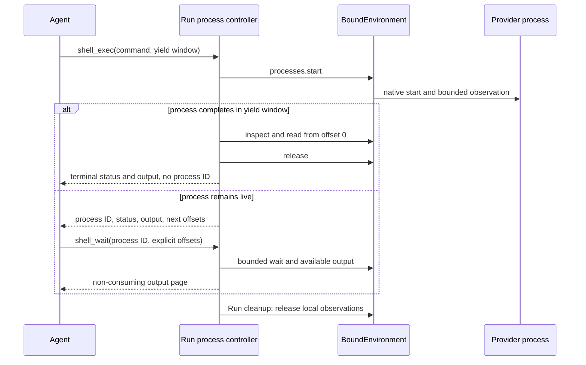

The independent `a13n-environment` library owns single-environment management and execution. The Host explicitly creates, starts, stops, renews, and destroys targets. Harness accepts fixed-target `EnvironmentConnector` inputs and owns Run-local mounts, permissions, routing, and execution cleanup.

## Start without an Environment

```python
result = await executable.run("Answer without using a workspace")
```

Environment input is optional. A Run without mounts receives an empty facade and no Environment tools.

## Supply a connector

```python
from pathlib import Path
from a13n_environment.direct_local.provider import DIRECT_LOCAL

connector = DIRECT_LOCAL.execution_connector(
    {"root": {"path": str(Path("./workspace").resolve())}},
    environment_id="env-workspace",
)
result = await executable.run("Inspect the workspace", environment=connector)
```

Connector construction performs no I/O. Harness calls `open()` for every mount, publishes only a complete ready set, and closes its executions after success, failure, or cancellation. The connector can serve later Runs; an already opened execution is not an ordinary Run input.

Enable `DynamicEnvironmentCapability` to expose permitted tools. `EnvironmentMount` adds Run-local path and permission policy.

## The Host owns management state

Complete management and save `EnvironmentState` before constructing the connector:

```python
current_state = await environment_state_store.load(thread_id, "workspace")
connector = definition.execution_connector(
    recipe, configuration=backend_configuration, credential=current_credential,
    environment_id="env-workspace", state=current_state,
)
result = await executable.run(
    "Continue the task", environment=connector, previous_state=previous_harness_state,
)
```

Execution uses this fixed state and produces no new target reference to publish at Run exit. `HarnessState.environment_states` aggregates mount state without replacing Host management records. After partial management failure or cancellation, the Host can obtain the known reference with `observed_environment_state()` and publish it; see [Lifecycle and state](../environments/lifecycle.md).

Execution close never destroys the target. The Host calls the separate `EnvironmentProvider.destroy()` and clears management state only after confirmed completion. Previously generated connectors remain usable after the management client closes; the Host closes borrowed runtimes separately.

## Use several Environments

Pass `environments=` to name several fixed-target connectors. `EnvironmentMount` adds one Run-local permission ceiling and working directory:

```python
from a13n_harness.environment import FILE_READ_ACTIONS, EnvironmentPermissionSet
from a13n_harness import EnvironmentMount

result = await executable.run(
    "Read the source data and write the build output",
    environments={
        "build": build_environment,
        "data": EnvironmentMount(
            data_environment,
            permission_ceiling=EnvironmentPermissionSet(operations=FILE_READ_ACTIONS),
        ),
    },
    default_environment="build",
)
```

The routing rules are deterministic:

| Input                                             | Mount name(s)  | Default route |
| ------------------------------------------------- | -------------- | ------------- |
| `environment=source`                              | `workspace`    | `workspace`   |
| one `environments` entry                          | supplied name  | that entry    |
| several entries with `default_environment="name"` | supplied names | named entry   |
| several entries without `default_environment`     | supplied names | none          |

Unless a mount sets `mount_path`, the default mount serves `/workspace` and every named mount is addressable at `/environment/{name}`. A mount with `mount_path` is addressable only at that root. With several entries and no explicit default, `/workspace/...` fails instead of selecting the first mapping entry. Mapping order never grants authority.

Initial setup is atomic. Harness validates the complete input before entry and publishes no partial mount set. If any adapter fails, Harness closes every supplied adapter that may own process-local resources in reverse order. It never destroys a target during unwind.

## Restrict a mount

`EnvironmentMount` adds a permission ceiling and default working directory to one source:

```python
from a13n_harness.environment import FILE_READ_ACTIONS, EnvironmentPermissionSet
from a13n_harness import EnvironmentMount

read_only_docs = EnvironmentMount(
    docs_resource,
    permission_ceiling=EnvironmentPermissionSet(operations=FILE_READ_ACTIONS),
    working_directory="/reference",
)
```

`permission_ceiling` is an exact `EnvironmentPermissionSet`. It defaults to `FILE_EXECUTION_ACTIONS`: file and execution operations, excluding desktop `COMPUTER_ACTIONS`. A Host must explicitly include desktop actions to expose them. `FILE_READ_ACTIONS` and `FILE_ACTIONS` are the shared constants for file observation and for the complete `environment.file.*` family. The Provider's supported operations always narrow the ceiling. The default ceiling does not grant Host administration, bypass a sandbox, or override operating-system security.

`working_directory` must be `None` or a canonical absolute provider path without `.` or `..` segments.

## Expose tools to the model

The Environment can exist without model-facing tools. Add `DynamicEnvironmentCapability` when the model should receive a selected stable tool surface:

```python
from a13n_harness.environment import (
    DynamicEnvironmentCapability,
    DynamicEnvironmentConfiguration,
)

capabilities = (
    DynamicEnvironmentCapability(DynamicEnvironmentConfiguration()),
)
```

Three decisions remain separate:

1. the Agent definition includes or omits the dynamic Environment Capability;
2. an optional invocation policy can narrow a managed invocation for the current identity and arguments;
3. the selected Environment mount and Provider enforce the exact operation.

Without an explicit invocation policy (`InvocationPolicyCapability`), managed Environment tools default to allow at the Harness boundary. That default does not create Provider support, credentials, approval, or mount access. Tool injection improves discovery and cannot replace execution-time checks.

Authorization applies to the requested operation and arguments, not a reserved backend. Canonical resources describe the mount and path observed during policy evaluation. If the Host replaces a mount or changes the default while policy or approval is waiting, execution selects the current route and checks its current permissions. Resource metadata and custom approval revisions do not guarantee that dispatch uses the observed backend. To pin the exact target, the Host enforces its policy on the execution path, for example in the Provider or through a Host-controlled stable binding.

After execution starts, compound file work stays on its selected scope. Document conversion retains that scope from source read through output publication, and downloads retain it while fetching and writing. Replacing a mount does not move an in-flight operation to another backend. Exact process handles, generation validation, Provider draining, and the prohibition on automatically replaying unknown outcomes remain unchanged.

The tool surface follows the effective actions of current mounts:

- `FILE_READ_ACTIONS` exposes `view`, `ls`, `glob`, and `grep`;
- `FILE_ACTIONS` adds `write`, `edit`, `multi_edit`, `mkdir`, `move`, `copy`, and `delete`;
- the default ceiling adds `shell_exec` when a Provider offers shell execution, and independently adds `shell_info`, `shell_wait`, `shell_input`, and `shell_signal` according to their actions.

Providers with partial operation support expose only usable tools: list, query, and text-search independently enable `ls`, `glob`, and `grep`; text-write can expose write/create-edit tools without read permission. Text `view` needs text-read, while media `view` needs stat plus byte-read on the same mount. Existing edits need byte-read plus text-write. Writing directly under a selected mount root does not require mkdir, including explicit roots without a default mount. Nested writes require mkdir when the tool creates the parent. Copy uses copy-source and copy-destination permissions, including across mounts. Actual arguments are checked again at execution.

On a single shell-enabled mount, `shell_exec` supersedes exactly `move`, `copy`, and `delete`; `mkdir` remains available. Multiple mounts retain file mutations so a shell on one mount does not hide operations on another. An empty Environment exposes no Environment tools.

A foreground-only mount exposes `shell_exec` with bounded inline output; it does not need standalone retained-output permissions. Process-capable mounts can add:

| Tool           | Behavior                                                                                                 |
| -------------- | -------------------------------------------------------------------------------------------------------- |
| `shell_exec`   | Starts a command, waits up to `yield_time_seconds`, and returns a Run-local reference when not completed |
| `shell_info`   | Without an ID, lists discoverable native commands; with an ID, inspects current status only              |
| `shell_wait`   | Waits boundedly, or polls with zero, then reads available stdout/stderr at explicit offsets              |
| `shell_input`  | Writes UTF-8 stdin and optionally closes stdin without reading output                                    |
| `shell_signal` | Requests supported `interrupt`, `terminate`, or `kill` control without reading output                    |

`execution_timeout_seconds` on `shell_exec` requests a Provider-enforced hard execution deadline. Providers such as native E2B reject it before starting when they cannot enforce it. `yield_time_seconds` and `shell_wait.timeout_seconds` only bound waiting. There is no background mode flag; `shell_info` covers listing and status, and `shell_signal` covers kill.

Use `shell_info(alias="workspace", limit=50)` to discover recoverable running commands only when the selected mount supports process listing. Direct Local supports inspection, not discovery: its `shell_info` schema requires a `process_id` returned by `shell_exec` in the current Run and omits `limit`. `shell_info(process_id=...)` only inspects; it does not attach, read, refresh or reset output. Listing and inspection are independently authorized. `alias` is an existing mount name from the Environment context, not a command/process label; omit it for default selection. An unknown or conflicting alias fails instead of retargeting a command or reference. Listing never exposes native PIDs, arbitrary arguments or environment variables.

Output pages identify `origin` (`native_bytes` or `sdk_text`), coverage, whether observation is closed, and any partial-coverage reason. SDK-text offsets describe UTF-8 encoding of text delivered by the SDK, not original process bytes. Producer counts and completion are null when unknown. `next_offset` advances only over returned bytes; repeat the same offsets to reread, or use the last returned offsets for the next page. Harness keeps no unread cursor.

References belong to one Run. A reconnect within that Run retains its reference and accumulated log offsets but reports a gap. A later Run starts fresh references and observations; old references in messages are not authority. A completion hint means the native process exited, not that all output was captured or every descendant was cleaned up. Conversely, capped or closed output does not mean the process exited. E2B keeps checking native status within the wait budget after its output cap; if final exit evidence is lost, it reports missing/unknown rather than success. A tool result with `ok=true` means the invocation returned normally; inspect the process status and exit code to determine command success.

Run cleanup cancels watchers and releases local observations before adapters close; it does not blanket-kill commands. Actual survival and recovery depend on the Provider and Host target lifetime. E2B can discover commands still running in the restored sandbox. Direct Local and Envd-backed Providers retain their own scope cleanup semantics. There is no Harness process database or post-Run notification service.



`glob` and `grep` send their include pattern, repository-ignore and hidden-name policy, context width, and scan/result ceilings to the selected `FileOperator` in one call. Direct Local performs one worker-thread scan; Envd-backed Providers send one EIP `file.find` or `file.search` request. Set `include_ignored=True` only when ignored repository paths should be searched.

For supported image, audio, and video files, `view` either attaches native `BinaryContent` or invokes a dedicated understanding Agent. The `model_characteristics` construction value on the active Harness `AgentSpec` is the sole native-input authority; Harness never infers support from a model name or Pydantic AI `Model.profile`. Dedicated defaults read ordinary process environment variables, and a fresh `RunBindings.file_media_understanding` provider can override them.

See [Multimedia Understanding](multimedia-understanding.md) for model input capability declarations, environment configuration, default prompt behavior, Run-scoped providers, usage attribution, and ordinary tool-result failures.

## Manage Provider state outside Harness

A production Host normally keeps desired Provider configuration and current `EnvironmentState` in its own authoritative records. For each independent Run it:

1. selects the trusted Provider and validates desired configuration;
2. loads current managed state, where authoritative `None` suppresses stale fallback state;
3. performs any required management operation and publishes its observed state, including partial failure or cancellation;
4. constructs fixed-target connectors from the published state;
5. invokes Harness, which opens and closes one fresh execution per mount;
6. invokes explicit destruction only when retention or prune policy authorizes it.

Execution does not update authoritative Provider state. A stopped or missing target fails opening; the Host must manage it explicitly before retrying.

The shared package deliberately defines no Host table, lease, Thread-link, prune-candidate, pause-mode, or reconciliation-operation schema. A Host can add those models without moving lifecycle authority back into Harness.

## Advanced Run-local mount mutation

Most applications should use `environment=` or `environments=`. Trusted Harness integrations can use the advanced Environment runtime when they need live Run-local `mount()`, `replace()`, `unmount()`, or `set_default()` behavior.

Each mutation accepts an `EnvironmentMount` containing a connector. A fresh candidate execution is opened and checked before commit; failure leaves the published mount set unchanged and closes the candidate. Replacement allocates a fresh mount incarnation, preserves default selection, and retires the old execution only after its operation leases drain. Mutation never discovers a Provider, restores state, persists desired mounts, or calls `destroy()`.

High-level Environment arguments and an explicitly supplied advanced runtime are mutually exclusive. They use the same routing, permission, fencing, and non-destructive cleanup implementation.

## Direct Local boundary

`direct_local` exposes an explicitly selected existing Host directory. It is an operation backend, not a sandbox claim:

- the Host creates, selects, retains, backs up, shares, and removes the directory;
- a Direct Local connector opens a fresh execution that validates and uses it for one Run;
- `state` returns `None` because the target is deterministic and stateless;
- `close()` and `destroy()` never delete the directory;
- the Provider root is always writable; a permission ceiling constrains Environment operations but is not an operating-system sandbox against an allowed child process.

Use Local Envd or Docker when untrusted code needs an isolated execution boundary. Each Run opens a fresh execution. The Host owns the Local Envd daemon, while a Docker connector attaches to the exact running container represented by state.

## Temporary tool-result files

Large tool results may include an `output_file_path` under a Run-private directory. It uses an explicit mount root or `/environment/{name}`, so changing the default mount does not redirect an earlier result. Cleanup removes owned temporary directories through their original mount selections. If that mount is replaced, unmounted, or unavailable, cleanup can leave temporary files behind rather than deleting anything on a replacement. These paths are not durable artifacts or permanent handles across mount replacement. Downloaded files and document-conversion exports are user output and are not removed by this cleanup.
