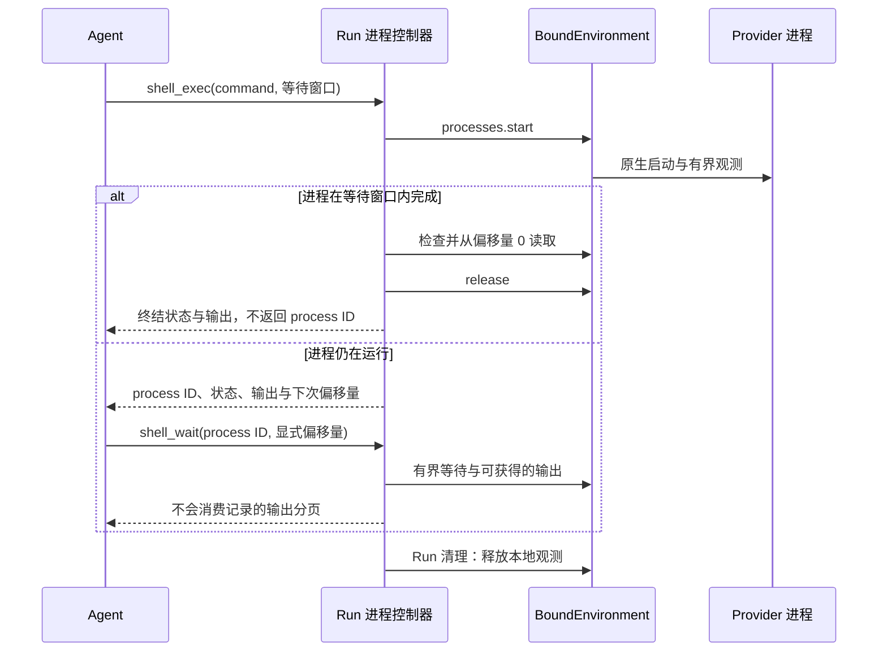

独立的 `a13n-environment` 库拥有单环境管理和执行契约。Host 通过管理接口创建、启动、停止、续期和销毁目标；Harness 只接收固定目标的 `EnvironmentConnector`，拥有 Run 内的挂载、权限、路由和执行清理。

## 不使用环境

```python
result = await executable.run("Answer without using a workspace")
```

环境是可选输入。没有挂载的 Run 使用空环境接口，不会获得环境工具。

## 传入连接配置

```python
from pathlib import Path
from a13n_environment.direct_local.provider import DIRECT_LOCAL

connector = DIRECT_LOCAL.execution_connector(
    {"root": {"path": str(Path("./workspace").resolve())}},
    environment_id="env-workspace",
)
result = await executable.run("Inspect the workspace", environment=connector)
```

连接配置构造不进行 I/O。Harness 为每个挂载调用 `open()`，在完整集合就绪后才发布挂载，并在成功、失败或取消后关闭自己打开的执行对象。连接配置可供后续 Run 使用；已经打开的执行对象不能作为普通 Run 输入。

启用 `DynamicEnvironmentCapability` 后才会向模型暴露允许的工具。`EnvironmentMount` 添加 Run 内的路径与权限策略。

## 管理状态由 Host 负责

Host 必须先完成管理操作并保存 `EnvironmentState`，再创建连接配置：

```python
current_state = await environment_state_store.load(thread_id, "workspace")
connector = definition.execution_connector(
    recipe, configuration=backend_configuration, credential=current_credential,
    environment_id="env-workspace", state=current_state,
)
result = await executable.run(
    "Continue the task", environment=connector, previous_state=previous_harness_state,
)
```

执行只使用固定状态，不会在 Run 结束时生成新的目标引用。`HarnessState.environment_states` 是挂载状态汇总，不能代替 Host 的管理记录。管理部分失败或取消时，Host 可通过 `observed_environment_state()` 取得已知引用并保存；完整示例见[生命周期与状态](../environments/lifecycle.md)。

关闭执行不会销毁目标。Host 使用独立的 `EnvironmentProvider.destroy()` 执行销毁，并在确认完成后清空管理状态。管理客户端关闭后，已经生成的连接配置仍可独立使用；借用的运行时由 Host 负责关闭。

## 使用多个环境

通过 `environments=` 为多个固定目标的 connector 命名。`EnvironmentMount` 添加执行内权限上限和工作目录：

```python
from a13n_harness.environment import FILE_READ_ACTIONS, EnvironmentPermissionSet
from a13n_harness import EnvironmentMount

result = await executable.run(
    "Read the source data and write the build output",
    environments={
        "build": build_environment,
        "data": EnvironmentMount(
            data_environment,
            permission_ceiling=EnvironmentPermissionSet(operations=FILE_READ_ACTIONS),
        ),
    },
    default_environment="build",
)
```

路由规则是确定的：

| 输入                                        | 挂载名称    | 默认路由       |
| ------------------------------------------- | ----------- | -------------- |
| `environment=source`                        | `workspace` | `workspace`    |
| 一个 `environments` 条目                    | 提供的名称  | 该条目         |
| 多个条目且设置 `default_environment="name"` | 提供的名称  | 指定名称的条目 |
| 多个条目且不设置 `default_environment`      | 提供的名称  | 无             |

除非挂载设置了 `mount_path`，否则默认挂载提供 `/workspace`，每个命名挂载都可通过 `/environment/{name}` 访问。设置了 `mount_path` 的挂载只能通过该根路径访问。多个条目没有显式默认值时，`/workspace/...` 会失败，不选择映射中的首项。映射顺序绝不授予权限。

初始设置是原子的。Harness 在进入前验证完整输入，不发布部分挂载集合。任何适配器失败时，按反向顺序关闭所有可能持有进程内资源的已提供适配器。回退清理绝不销毁目标。

## 限制挂载

`EnvironmentMount` 为一个来源添加权限上限和默认工作目录：

```python
from a13n_harness.environment import FILE_READ_ACTIONS, EnvironmentPermissionSet
from a13n_harness import EnvironmentMount

read_only_docs = EnvironmentMount(
    docs_resource,
    permission_ceiling=EnvironmentPermissionSet(operations=FILE_READ_ACTIONS),
    working_directory="/reference",
)
```

`permission_ceiling` 是精确的 `EnvironmentPermissionSet`，默认使用 `FILE_EXECUTION_ACTIONS`：包含文件和执行操作，但不包含桌面 `COMPUTER_ACTIONS`。Host 必须显式加入桌面操作才会开放这些能力。`FILE_READ_ACTIONS` 和 `FILE_ACTIONS` 是文件观测和完整 `environment.file.*` 类别的共享常量。provider 支持的操作始终进一步收窄上限。默认上限不授予 Host 管理权限，不绕过沙箱，也不覆盖操作系统安全。

`working_directory` 必须为 `None`，或不含 `.`、`..` 段的规范 provider 绝对路径。

## 向模型提供工具

环境可以存在而不提供模型工具。模型需要所选稳定工具接口时，添加 `DynamicEnvironmentCapability`：

```python
from a13n_harness.environment import (
    DynamicEnvironmentCapability,
    DynamicEnvironmentConfiguration,
)

capabilities = (
    DynamicEnvironmentCapability(DynamicEnvironmentConfiguration()),
)
```

三项决策相互独立：

1. Agent 定义是否包含动态环境 Capability；
2. 可选调用策略是否根据当前身份和参数收窄托管调用；
3. 所选环境挂载和 provider 是否允许精确操作。

未显式提供调用策略（`InvocationPolicyCapability`）时，托管环境工具在 Harness 边界默认允许。默认值不会创建 provider 支持、凭据、批准或挂载访问权限。工具注入有助于发现，不能替代执行时检查。

授权针对所请求操作和参数，不预留后端。规范资源描述策略检查时观测到的挂载和路径。等待策略或批准时，Host 如果替换挂载或改变默认挂载，执行会选择当前路由并检查当前权限。资源元数据和自定义批准修订号不保证分派时使用观测到的后端。要固定精确目标，Host 需在执行路径中实施其策略，例如在 provider 中或通过 Host 控制的稳定绑定实施。

执行开始后，复合文件工作始终使用已选范围。文档转换从读取源文件到发布输出都保留该范围，下载在获取和写入时也保留。替换挂载不会把在途操作移到其他后端。精确进程句柄、代次验证、provider 排空，以及禁止自动重放未知结果的规则保持不变。

工具接口遵循当前挂载的有效操作：

- `FILE_READ_ACTIONS` 提供 `view`、`ls`、`glob` 和 `grep`；
- `FILE_ACTIONS` 添加 `write`、`edit`、`multi_edit`、`mkdir`、`move`、`copy` 和 `delete`；
- provider 支持 shell 执行时，默认上限添加 `shell_exec`，并按各自操作独立添加 `shell_info`、`shell_wait`、`shell_input` 和 `shell_signal`。

只支持部分操作的 provider 仅开放可用工具：列表、查询和文本搜索分别启用 `ls`、`glob`、`grep`；文本写入可在没有读取权限时提供写入/创建编辑工具。文本 `view` 需要文本读取；媒体 `view` 需要同一挂载的 stat 和字节读取。编辑已有文件需要字节读取和文本写入。直接写入所选挂载根目录不要求 mkdir，包括没有默认挂载的显式根目录。工具需要创建父目录的嵌套写入才要求 mkdir。复制使用源复制和目标复制权限，包括跨挂载复制。执行时再次检查实际参数。

只有一个启用 shell 的挂载时，`shell_exec` 仅替代 `move`、`copy` 和 `delete`；`mkdir` 仍可用。多个挂载保留文件修改工具，避免一个挂载的 shell 隐藏另一个挂载的操作。空环境不开放环境工具。

仅支持前台执行的挂载提供带有界内联输出的 `shell_exec`，无需独立保留输出权限。支持进程的挂载还可添加：

| 工具           | 行为                                                             |
| -------------- | ---------------------------------------------------------------- |
| `shell_exec`   | 启动命令，最多等待 `yield_time_seconds`；未完成时返回执行内引用  |
| `shell_info`   | 不带 ID 时列出可发现原生命令；带 ID 时只检查当前状态             |
| `shell_wait`   | 有界等待，或设置零进行轮询，再按显式偏移量读取可用 stdout/stderr |
| `shell_input`  | 写入 UTF-8 stdin，按需关闭 stdin，不读取输出                     |
| `shell_signal` | 请求支持的 `interrupt`、`terminate` 或 `kill` 控制，不读取输出   |

`shell_exec` 的 `execution_timeout_seconds` 请求由 provider 实施的硬执行期限。原生 E2B 等 provider 无法实施时，会在启动前拒绝。`yield_time_seconds` 和 `shell_wait.timeout_seconds` 只限制等待。没有后台模式标志；`shell_info` 负责列表和状态，`shell_signal` 负责 kill。

只有所选挂载支持进程列表时，才使用 `shell_info(alias="workspace", limit=50)` 发现可恢复的运行命令。Direct Local 支持检查，不支持发现：其 `shell_info` schema 要求本次执行 `shell_exec` 返回的 `process_id`，不提供 `limit`。`shell_info(process_id=...)` 只检查，不附加、读取、刷新或重置输出。列表和检查分别授权。`alias` 是环境上下文中的已有挂载名，不是命令/进程标签；省略时选择默认挂载。未知或冲突别名会失败，不会重新指定命令或引用的目标。列表绝不公开原生 PID、任意参数或环境变量。

输出页标识 `origin`（`native_bytes` 或 `sdk_text`）、覆盖范围、观测是否关闭，以及覆盖不完整的原因。SDK 文本偏移量描述 SDK 交付文本的 UTF-8 编码，不是原始进程字节。生产方计数和完成状态未知时为 null。`next_offset` 只按返回字节推进；重复相同偏移量可重读，使用最后返回偏移量可读取下一页。Harness 不维护未读游标。

引用只属于一次执行。执行内重连保留引用和累计日志偏移量，但报告缺口。后续执行创建新引用和观测；消息中的旧引用不授予权限。完成提示表示原生进程退出，不表示全部输出已捕获或所有后代已清理。反过来，输出达到上限或关闭不表示进程退出。E2B 在输出达到上限后，仍在等待预算内检查原生状态；最终退出证据丢失时报告缺失/未知，不报告成功。工具结果 `ok=true` 仅表示调用正常返回；检查进程状态和退出码才能判断命令成功。

适配器关闭前，执行清理取消 watcher 并释放本地观测，不统一终止所有命令。实际存活和恢复取决于 provider 和 Host 目标生命周期。E2B 可发现恢复沙箱中仍运行的命令。Direct Local 和 Envd provider 保留各自资源范围的清理语义。Harness 没有进程数据库或执行后通知服务。



`glob` 和 `grep` 在一次调用中，将 include 模式、仓库忽略和隐藏名称策略、上下文宽度，以及扫描/结果上限传给所选 `FileOperator`。Direct Local 在一个 worker 线程中扫描；Envd provider 发送一个 EIP `file.find` 或 `file.search` 请求。只有确实要搜索仓库忽略路径时，才设 `include_ignored=True`。

对于支持的图像、音频和视频文件，`view` 附加原生 `BinaryContent`，或调用专用理解 Agent。活跃 Harness `AgentSpec` 的 `model_characteristics` 构建值是原生输入支持的唯一依据；Harness 绝不从模型名称或 Pydantic AI `Model.profile` 推断。专用默认值读取普通进程环境变量，新的 `RunBindings.file_media_understanding` provider 可覆盖。

模型输入能力声明、环境配置、默认提示行为、执行范围 provider、用量归因和普通工具结果失败见[多媒体理解](multimedia-understanding.md)。

## 在 Harness 之外管理 provider 状态

生产 Host 通常在自己的权威记录中保存期望 provider 配置和当前 `EnvironmentState`。每次独立执行时：

1. 选择可信 provider，验证期望配置；
2. 加载当前托管状态，其中权威 `None` 阻止使用过旧回退状态；
3. 执行所需管理操作，发布观测状态，包括部分失败或取消时已确认的状态；
4. 根据已发布状态构建固定目标的 connector；
5. 调用 Harness，为每个挂载打开并关闭独立执行对象；
6. 只有保留或修剪策略授权时才显式销毁。

执行不更新权威 provider 状态。目标停止或缺失时打开失败；Host 必须先显式管理目标，再重试。

共享包有意不定义 Host 表、租约、线程链接、修剪候选、暂停模式或核对操作 schema。Host 可以添加这些模型，不把生命周期权限移回 Harness。

## 高级执行内挂载修改

多数应用应使用 `environment=` 或 `environments=`。可信 Harness 集成需要执行内实时 `mount()`、`replace()`、`unmount()` 或 `set_default()` 时，可使用高级环境运行时。

每次修改接收包含 connector 的 `EnvironmentMount`。新候选执行对象先打开并检查就绪，再提交；失败保持已发布挂载集合不变，并关闭候选。替换分配新的挂载实例，保留默认选择，等旧执行对象的操作租约全部释放后才将其退役。修改绝不发现 provider、恢复状态、持久保存期望挂载或调用 `destroy()`。

高层环境参数和显式高级运行时互斥。两者使用相同的路由、权限、隔离失效资源和非破坏性清理实现。

## Direct Local 边界

`direct_local` 开放显式选择的已有 Host 目录。它是操作后端，不承诺沙箱隔离：

- Host 创建、选择、保留、备份、共享和移除目录；
- 新 Direct Local 环境为一次执行验证并使用目录；
- 目标确定且无状态，因此 `state` 返回 `None`；
- `close()` 和 `destroy()` 绝不删除目录；
- provider 根目录始终可写；权限上限约束环境操作，不为获准子进程提供操作系统沙箱。

不可信代码需要独立执行边界时，使用 Local Envd 或 Docker。每次 Run 都打开独立执行对象。Host 管理 Local Envd 守护进程；Docker connector 连接到状态代表的精确运行中容器。

## 临时工具结果文件

大型工具结果可能包含执行私有目录下的 `output_file_path`。它使用显式挂载根目录或 `/environment/{name}`，因此更改默认挂载不会改变旧结果路径。清理通过原挂载选择删除自己管理的临时目录。该挂载被替换、卸载或不可用时，清理可能留下临时文件，而不会删除替代挂载上的任何内容。这些路径不是跨挂载替换的持久产物或永久句柄。下载文件和文档转换导出属于用户输出，不会被此清理删除。
