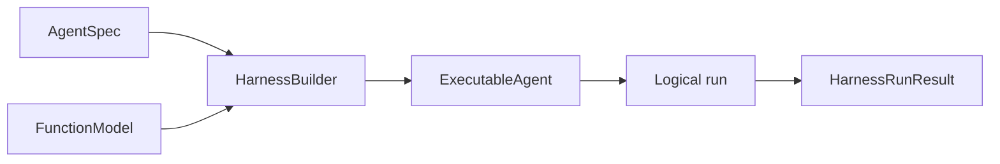

# Getting Started

This guide builds the smallest useful Agent Harness application, explains its ownership boundaries, and then switches from a deterministic test model to a real model provider.

## Requirements

- Python 3.13 or later
- [uv](https://docs.astral.sh/uv/)

These guides track the source API on `main`. To reproduce them with matching dependencies, clone the repository and synchronize the locked Harness package:

```bash
git clone https://github.com/converge-ai-labs/agent-foundation.git
cd agent-foundation
uv sync --locked --package a13n-harness
```

The Harness workspace package installs its runtime dependencies and supported provider integrations. Provider credentials, endpoints, model selection, and client lifecycle remain application configuration. The offline example below imports test-model and message types from the runtime dependency; application construction uses the Harness API.

## Run an offline Agent

Create `app.py`:

```python
import asyncio
from collections.abc import AsyncIterator

from a13n_harness import (
    AgentSpec,
    HarnessBuilder,
)
from pydantic_ai.messages import ModelMessage
from pydantic_ai.models.function import AgentInfo, FunctionModel


async def respond(
    messages: list[ModelMessage],
    info: AgentInfo,
) -> AsyncIterator[str]:
    del messages, info
    yield "Hello from the Harness"


async def main() -> None:
    executable = HarnessBuilder().build(
        AgentSpec(),
        output_type=str,
        model=FunctionModel(stream_function=respond),
    )

    result = await executable.run("Say hello")
    print(result.output_or_raise())


if __name__ == "__main__":
    asyncio.run(main())
```

Run it:

```bash
uv run python app.py
```

The output is:

```text
Hello from the Harness
```

The deterministic `FunctionModel` keeps this path offline and makes it suitable for tests.

## Understand the execution path



- `AgentSpec` declares stable Agent configuration.
- `HarnessBuilder` validates composition and creates a reusable `ExecutableAgent`.
- `FunctionModel` replaces an external provider in this example.
- `run()` creates fresh embedded bindings when `bindings` is omitted.
- `HarnessRunResult` normalizes completion, suspension, failure, cancellation, state, usage, and correlation.
- `ExecutableAgent` is immutable reusable build output; each `run()` owns and closes its temporary resources.

The concrete model is trusted build input, so `AgentSpec.model` remains unset. Use exactly one model source: either put a model selection in `AgentSpec.model` or pass a concrete native `Model` through `model=`.

### Which `AgentSpec` should I import?

Use `a13n_harness.AgentSpec` in application code. It includes instructions, tools, and capabilities along with Harness configuration such as `system_prompt`, `toolset_instructions`, `cold_start_filter`, definition usage limits, resolved model characteristics, and `with_updates()`. The builder also accepts compatible native definitions from the runtime dependency.

## Use a real model

Move the model selection into `AgentSpec`:

```python
from a13n_harness import (
    AgentSpec,
    HarnessBuilder,
)

executable = HarnessBuilder().build(
    AgentSpec(
        model="openai-responses:gpt-5",
        instructions="Answer clearly and concisely.",
    ),
    output_type=str,
)
```

Configure the selected provider using [Models](models.md) and [Authentication and HTTP clients](model-authentication.md). For this OpenAI example, set the provider credential before running the application:

```bash
export OPENAI_API_KEY=your-api-key
uv run python app.py
```

The application owns credentials, provider SDK configuration, HTTP clients, and transport retry policy. For tenant-specific routing or short-lived credentials, resolve the model through fresh `RunBindings` rather than storing current authority in the Agent definition.

## Build once and continue a Thread

An executable is reusable across calls. Each call creates a new `run_id`; passing `previous_state` continues the same Harness Thread:

```python
first = await executable.run("Remember that the release is Friday.")
second = await executable.run(
    "When is the release?",
    previous_state=first.state,
)
```

Persist the complete returned `HarnessState` when continuation must survive a process restart. It is continuation data, not restored credentials, authorization, Environment resources, or durable execution ownership.

## Stream public events

Use an explicitly scoped stream when the application needs incremental output or lifecycle observations:

```python
from a13n_harness import HarnessRunResultEvent

terminal = None
async with executable.stream("Write a short greeting") as stream:
    async for item in stream:
        await application.handle_harness_event(item)
        if isinstance(item, HarnessRunResultEvent):
            terminal = item.result

if terminal is None:
    raise RuntimeError("Harness stream ended without a terminal result")
terminal.raise_for_status()
```

`application.handle_harness_event()` represents application code; it is not a Harness API. Entering the stream scope ensures early consumer exit still closes the logical run and its temporary resources.

## Add behavior deliberately

The minimal Agent has mandatory Harness boundaries but no optional tools. Add stable behavior through definition-selected Capabilities:

```python
from a13n_harness.capabilities import (
    RuntimeContextCapability,
    WorkingStateCapability,
)

executable = HarnessBuilder().build(
    AgentSpec(model="openai-responses:gpt-5"),
    output_type=str,
    capabilities=(
        RuntimeContextCapability(),
        WorkingStateCapability(),
    ),
)
```

Definition Capabilities describe stable Agent behavior. Current credentials, user identity, authorization policy, provider clients, and other run authority belong in fresh bindings or Host-owned integrations.

## Next steps

- [Test the Agent offline](testing.md) before adding provider or Environment integration.
- Read [Agents and Runs](agents-and-runs.md) for model routing, streaming, results, cleanup, and usage.
- Read [Capabilities](capabilities.md) to select optional first-party behavior.
- Read the [Environment overview](../environments/index.md) before exposing files, commands, processes, or ports.
- Run the [Agent Application example](https://github.com/converge-ai-labs/agent-foundation/tree/main/examples/agent-app) for repeated streaming turns, persisted state, and restart recovery.
