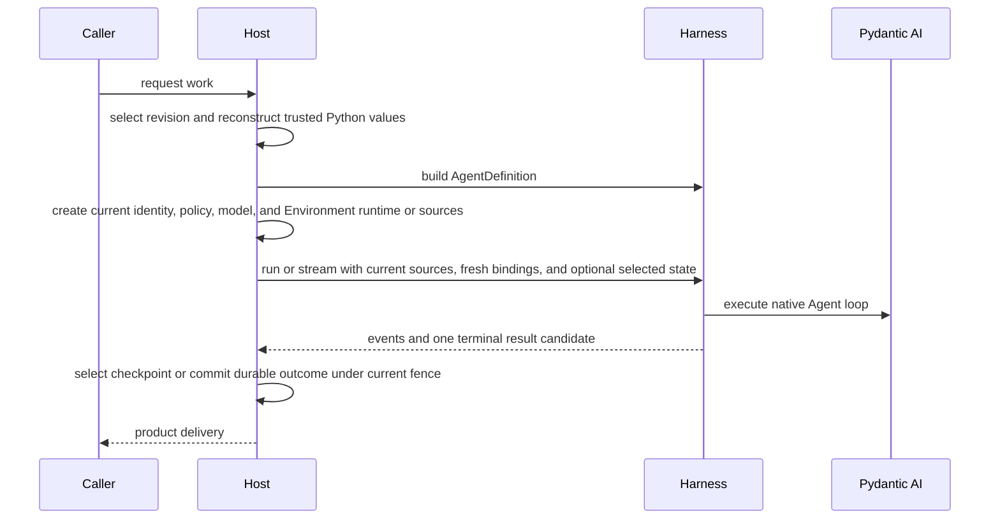

# Embedding in a Host

Embedded applications and hosted execution workers use the same Agent Harness API. A Host adds durable definition selection, current authority, checkpoint selection, worker ownership, and terminal commit around the process-local Harness path; it does not need a second Agent format or execution loop.

## Core Integration Path



The Harness owns the process-local portion from build through clean result delivery. The Host owns everything that must survive or coordinate multiple processes.

## Reconstruct Trusted Definitions

A Host can persist its own schema containing values such as:

- logical model IDs and model settings;
- native `AgentSpec` fields selected by the product;
- output-schema selection;
- Capability and tool declarations under Host-owned schemas;
- plugin configuration and exact artifact locks;
- child topology and recovery policy.

At execution time, trusted adapters reconstruct native Python objects and call `HarnessBuilder`. Do not persist Python classes, callables, model instances, Toolsets, Capabilities, plugin objects, or live clients in a Harness definition document.

Harness owns only its narrow middleware-plugin configuration envelope. It is not a universal Agent or Environment configuration language.

For large tool collections, the Host can offer direct versus grouped presentation in its own configuration and assemble one `ToolProxyCapability(groups=...)` from concrete sources at build time. [ToolProxy Host integration](tool-proxy.md#host-integration) describes source factories, configuration/UI responsibilities, and plugin contribution support without runtime interception.

## Build and Reuse

A worker can cache a built executable for one exact trusted definition revision and reuse it across non-overlapping or supported concurrent runs. Each run still receives fresh bindings:

```python
result = await executable.run(
    input_value,
    bindings=reconstruct_current_bindings(execution_attempt),
    previous_state=selected_checkpoint,
)
```

The executable has no `close()` or context-manager API. Retire a cached executable after its active Runs finish; scope each `stream()` with `async with`, and close separately owned Host clients/operators at their own lifespan boundary. Construct and validate replacement builders or plugin graphs before routing new Runs to them. See [cleanup ownership](agents-and-runs.md#cleanup).

## Fresh Authority

For each logical run, reconstruct:

- authenticated `AgentInstanceContext` when the embedded default is insufficient;
- current Provider selection, configuration, authoritative `EnvironmentState`, and runtime collaborators;
- one fresh already constructed `Environment` per mount, or an advanced Host-owned `EnvironmentRuntime`;
- current model resolver and credentials;
- run Capabilities for invocation policy, approvals, media/documents/Web, monitoring, delegation, or Skill selection;
- bounded non-authoritative metadata.

Saved messages and Capability state never restore these values. A resume must re-evaluate current policy and Provider availability before constructing fresh adapters. Model-cost policy is definition-scoped rather than a fresh run collaborator: the Builder inserts the default catalog policy or accepts exactly one code-first replacement, and inline descendants inherit the parent's effective policy.

## Durable State Boundary

Persist a complete `HarnessState` candidate only as one part of a Host checkpoint. Keep the following Host facts alongside or outside it:

- exact definition revision and dependency/artifact lock;
- durable run and execution-attempt identity;
- current generation, lease, and opaque fence;
- selected checkpoint reference and producing provenance;
- desired Environment mount definitions and authoritative `EnvironmentState` values;
- pending deferred calls, approvals, or external delivery records;
- durable asynchronous-child state;
- usage/accounting and terminal output records.

The state candidate itself remains portable process-local continuation data.

## Attempts and Recovery

One logical Harness run can contain bounded internal model attempts. They share one context, Environment, plugin graph, state coordinator, usage accumulator, `thread_id`, and `run_id`.

A replacement worker attempt is different. It starts a new Harness run with:

- a new `run_id`;
- fresh bindings and freshly constructed Environment adapters;
- the Host-selected prior `HarnessState`;
- current fenced lifecycle ownership.

Do not create another durable worker-attempt record for an internal model recovery. Do not blindly replay a tool or provider mutation whose prior outcome is uncertain.

## Events and Streaming

The Host consumes one `HarnessRunStream` and can project observations to its own stream protocol or storage. Earlier events remain observations even if a later model attempt succeeds.

The terminal `HarnessRunResultEvent` is emitted only after Harness-owned cleanup succeeds. It still does not mean:

- the Host committed durable completion;
- an output was delivered to a user or connector;
- usage was reconciled for billing;
- an external side effect happened exactly once.

Commit those facts under the Host's own current fence and transaction rules.

## Deferred Work

A suspended root Harness result closes the process-local run. The Host owns:

- durable pending-call or approval records;
- authentication of the person or external executor;
- idempotent feedback acceptance;
- exact result/category coverage;
- selection of the continuation checkpoint;
- reconstruction of the exact current tool surface.

Resume through `DeferredToolResume` in a new root run. Do not keep a database transaction, worker lease call, or live stream open while waiting for human input.

A Host selects child deferred support through fresh `RunBindings.deferred_tools_supported`. Hosts supporting this lifecycle retain exact terminal pending requests with the child checkpoint and resume through `DeferredToolResume`, just like roots. Hosts without it set the flag to `False`: declarative deferrals disappear, dynamic deferrals become denied results, and unexpected terminal deferral fails with `deferred_tools_unsupported`. Harness UI currently disables async child deferred support while retaining ordinary prompt resume. Deferred events alone never authorize waiting work. Harness-owned [inline continuation](delegation-and-codeact.md#resume-a-waiting-inline-child) stores pending requests in complete parent state and routes trusted results without retaining a live parent stack.

## Environments

Harness accepts only already constructed `Environment` or `EnvironmentMount` values through `environment=` and `environments=`. Each adapter is fresh and single-use. Harness validates the aggregate, enters every selected adapter, maps Provider state into `HarnessState.environment_states`, and closes all adapters non-destructively before terminal result delivery.

The Host remains responsible for Provider allowlisting, exact configuration validation, current credentials and runtime collaborators, durable desired mount definitions, authoritative `EnvironmentState` persistence, and retention policy. It supplies state before adapter construction and persists `environment.dump_state()` after any lifecycle outcome. A later Run always receives a newly constructed adapter, even when it re-enters the same target.

Harness never calls `destroy()`. When retention selects removal, the Host constructs a fresh not-yet-entered adapter from the exact current state and invokes `destroy()` explicitly. Successful destruction clears cached state; an incompatible target or unknown outcome preserves the last validated state for inspection or retry.

With several aliases, set `default_environment` explicitly when `/workspace` should route to one of them; mapping order never grants authority. An `EnvironmentRuntime` in `RunBindings.environment` remains the advanced route for exact runtime mounts and Host-retained mutation authority. Do not combine that route with high-level Environment inputs, and never copy credentials, live clients, runtime bindings, or destruction authority into `HarnessState` or model context.

## Run-local Shell Observations

The Host supplies fresh Environment adapters, current Provider state and permissions. It does not construct another process manager. Harness assigns Run-local references, observes native commands and releases observations before adapter close, without blanket command termination.

Provider state owns backend-specific recovery. A fresh E2B adapter can discover commands still running in a retained sandbox through `shell_info`, but neither old references nor historical output are restored. Host state publication and sandbox lifetime remain the ordinary Environment responsibilities.

`HarnessState` contains no process-reference map, output buffer, unread offset or watcher. Completion hints are best-effort while the current Run is active, not durable delivery or a scheduler for later Runs. See [Environment tools](environments.md).

## Minimal vs. Production Host

| Embedded application                            | Distributed Host                                                     |
| ----------------------------------------------- | -------------------------------------------------------------------- |
| Omit `bindings` or use `RunBindings.embedded()` | Explicit authenticated instance context                              |
| In-memory selected state                        | Durable immutable checkpoints and selection                          |
| No Environment or one fresh local adapter       | Host-managed Provider state and fresh adapters for every Run attempt |
| Process-local policy collaborators              | Current tenant/user policy and credentials                           |
| Direct result handling                          | Fenced terminal commit and delivery lifecycle                        |
| Inline child execution                          | Optional durable child Execution lifecycle                           |

Start with the embedded path and add Host-owned durable boundaries only when the product requires them.

## Runnable Example

The [Agent Application example](https://github.com/converge-ai-labs/agent-foundation/tree/main/examples/agent-app) runs entirely offline and demonstrates the boundary before a full durable Host: it streams repeated turns, atomically stores the returned `HarnessState` only after successful completion, resumes the same Thread after application restart, and constructs one fresh Direct Local Environment per turn.

The [Provider plugin example](https://github.com/converge-ai-labs/agent-foundation/tree/main/examples/plugins) demonstrates installed manifest selection and direct definition selection, strict configuration validation, fresh adapter construction, multi-mount routing, state export, non-destructive close, and an Environment Run extension.

Its single state file is application teaching code, not an Execution ledger, lease, fence, or prescribed production persistence implementation. Add the Host-owned records described above when multiple workers, replacement attempts, side effects, or durable terminal delivery require them.
