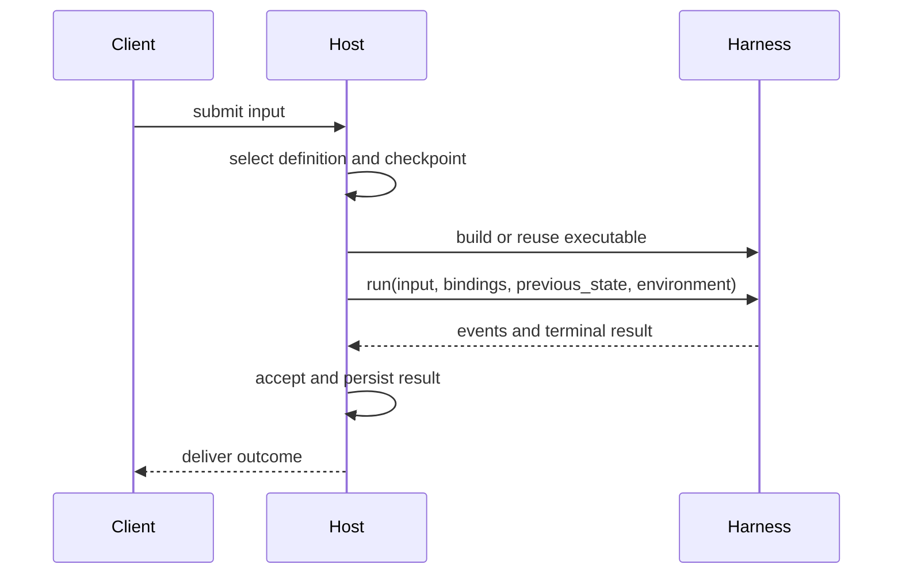

An embedded application calls Harness directly. A durable Host adds definition selection, current policy, checkpoint storage, and delivery around the same process-local API. Start with the [offline application example](https://github.com/converge-ai-labs/agent-foundation/tree/main/examples/agent-app) before adding a worker or database.

## Core Integration Path



Harness executes one Run; the Host decides which result becomes durable.

## Reconstruct Trusted Definitions

Store a Host-owned schema for model selection, output type, tools, Capabilities, plugins, and child topology. Trusted code resolves those choices into Python objects before calling `HarnessBuilder`; do not deserialize a Python callable or plugin from untrusted input. Harness UI YAML is one Host format, not a universal SDK schema.

For large tool catalogs, a Host can assemble `ToolProxyCapability(groups=...)` from selected sources. See [ToolProxy Host integration](tool-proxy.md#host-integration).

## Build and Reuse

Cache an executable by its exact trusted definition revision, then supply current inputs to each Run:

```python
result = await executable.run(
    input_value,
    bindings=reconstruct_current_bindings(execution_attempt),
    previous_state=selected_checkpoint,
)
```

Scope streams with `async with executable.stream(...)`. The executable has no `close()` method; close Host-owned clients at their own lifespan boundary.

## Fresh Authority

On every Run, select the current user/policy, model credentials, Provider state, and fresh Environment adapters. Saved `HarnessState` restores conversation and feature data, not clients or permissions. `RunBindings` supplies current collaborators, including optional `model_call_check`; see [Agents and Runs](agents-and-runs.md) and [Environments](environments.md).

### Check Model Calls Before Dispatch

A Host may supply `RunBindings.model_call_check` implementing `ModelCallCheck.check(ModelCall)`. Harness invokes it before a public model call; return to permit the call or raise to refuse it. This is a per-call admission check, not a record that an HTTP request or billable usage occurred. The check is fresh Run authority and is never serialized into `HarnessState`. See [usage correlation](usage-and-limits.md#usage).

## Durable State Boundary

Persist the returned `HarnessState` alongside your Host's definition revision, run/attempt identity, selected Environment state, pending deferred calls, and delivery status. For distributed workers, also keep lease/fence and checkpoint provenance. None of those Host records is recreated from `HarnessState`.

## Attempts and Recovery

Harness may retry a model within one Run; those attempts share its `run_id`. A replacement worker attempt is a **new** Run with a fresh `run_id`, current bindings, new Environment adapters, and the Host-selected checkpoint. If a previous tool mutation has an uncertain outcome, reconcile it before replaying. See [State and Resume](state-and-resume.md).

## Events and Streaming

Consume `HarnessRunStream` within its async scope and project its public events to the application stream or store. A terminal `HarnessRunResultEvent` follows Harness cleanup; persist the result before promising durable completion or delivery to a client.

## Deferred Work

A suspended Run is closed. Store its pending request and checkpoint, authenticate the external result, then start a new Run with `DeferredToolResume`. Retain accepted results when a resume is interrupted before they enter history. [Deferred resume](state-and-resume.md#resume-unanswered-tool-calls) covers the request/result contract.

For async child deferrals, the Host must explicitly support them through fresh `RunBindings.deferred_tools_supported` and retain child checkpoint plus pending requests. Otherwise leave that feature disabled; ordinary prompt continuation does not require it.

## Environments

Construct one fresh `Environment` per Run and pass it through `environment=` or a named `environments=` mapping. Harness enters adapters and closes them without destroying their backing targets; the Host owns Provider configuration, authoritative `EnvironmentState`, retention, and explicit `destroy()`. For multiple mounts, choose `default_environment` explicitly when a default route is needed. [Environments](environments.md) has runnable examples.

## Run-local Shell Observations

Harness issues process references only within the current Run and releases its observations on close; it does **not** kill every backend command. A later Run constructs a new adapter and uses Provider state/native discovery if the backend retained the process. Do not persist `process-*` references as a recovery mechanism.

## Minimal vs. Production Host

A single-process application can use embedded bindings and persist only successful conversation state. Add durable acceptance, fencing, separate Environment state, pending-call records, and delivery tracking when multiple workers or deferred actions require them. These are Host workflows, not extra Harness loop APIs.

## Runnable Example

The [Agent Application example](https://github.com/converge-ai-labs/agent-foundation/tree/main/examples/agent-app) streams turns, atomically stores successful `HarnessState`, and constructs a fresh Direct Local Environment on each call. [Provider plugin examples](https://github.com/converge-ai-labs/agent-foundation/tree/main/examples/plugins) show installed Provider selection and Environment Run extensions.
