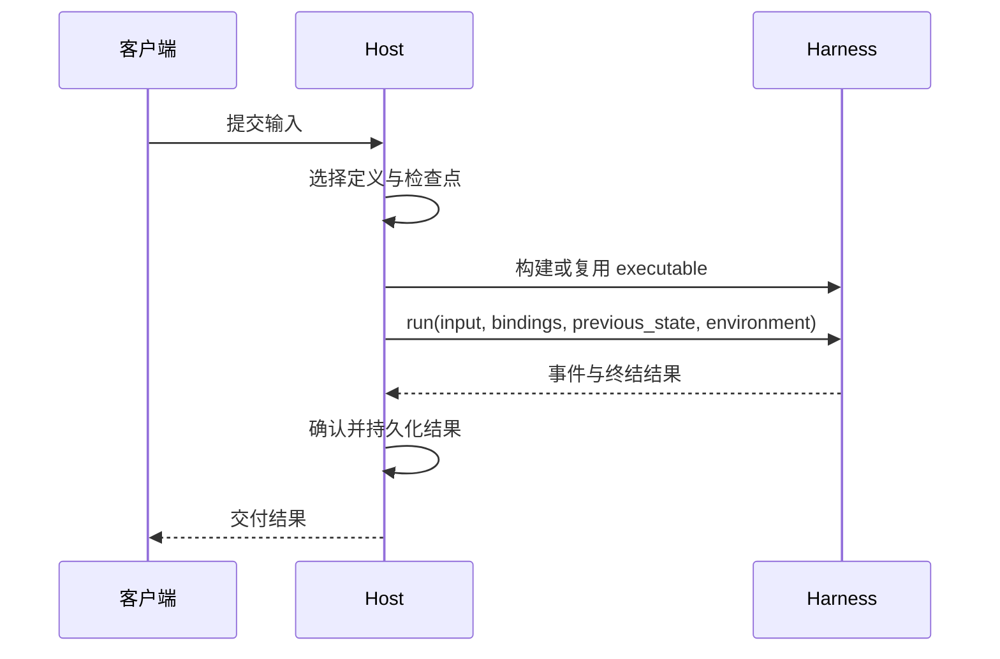

嵌入式应用可以直接调用 Harness。需要持久化的 Host 则在同一套进程内 API 周围增加定义选择、当前访问策略、检查点存储和结果交付。在引入 worker 或数据库之前，建议先运行[离线应用示例](https://github.com/converge-ai-labs/agent-foundation/tree/main/examples/agent-app)。

## 核心接入流程



Harness 负责执行一次 Run；哪些结果最终持久化，由 Host 决定。

## 重建可信定义

由 Host 定义并保存配置 schema，涵盖模型选择、输出类型、工具、Capabilities、插件和子 agent 拓扑。可信代码先将这些配置解析为 Python 对象，再调用 `HarnessBuilder`；不要从不可信输入中反序列化 Python callable 或插件。Harness UI 的 YAML 是一种 Host 配置格式，并不是通用的 SDK schema。

如果工具目录较大，Host 可以从选定来源组装 `ToolProxyCapability(groups=...)`。参阅 [ToolProxy 的 Host 集成](tool-proxy.md#host-integration)。

## 构建与复用

以可信定义的准确修订版本作为缓存键，复用构建好的 executable；每次 Run 都传入当前输入：

```python
result = await executable.run(
    input_value,
    bindings=reconstruct_current_bindings(execution_attempt),
    previous_state=selected_checkpoint,
)
```

通过 `async with executable.stream(...)` 管理流的作用域。executable 没有 `close()` 方法；Host 自己持有的客户端，应在各自生命周期结束时关闭。

## 每次执行都使用当前权限

每次 Run 都应重新选择当前用户和策略、模型凭据、Provider 状态，并创建新的 Environment 适配器。保存的 `HarnessState` 只恢复对话和功能状态，不恢复客户端或权限。`RunBindings` 提供当前执行所需的协作对象，也可传入 `model_call_check`。参阅 [Agent 与执行](agents-and-runs.md)及[环境](environments.md)。

### 发起模型调用前检查

Host 可以通过 `RunBindings.model_call_check` 提供实现了 `ModelCallCheck.check(ModelCall)` 的对象。Harness 会在公开模型调用发出前执行检查：正常返回表示允许调用，抛出异常表示拒绝。这只是单次调用的准入检查，不能据此认定 HTTP 请求已经发出或产生了计费用量。检查对象属于当前 Run 的权限配置，绝不会序列化到 `HarnessState` 中。参阅[用量关联](usage-and-limits.md#usage)。

## 持久化状态的边界

保存返回的 `HarnessState` 时，还应一并保存 Host 的定义修订版本、Run 与执行尝试的标识、选定的 Environment 状态、待处理的延后调用和交付状态。使用分布式 worker 时，还需保存租约、fence 和检查点来源信息。`HarnessState` 无法重建这些 Host 记录。

## 执行尝试与恢复

Harness 可以在同一次 Run 中重试模型调用，这些尝试共用同一个 `run_id`。替代 worker 发起的执行尝试则是一次**新的** Run：使用新的 `run_id`、当前绑定、新的 Environment 适配器，以及 Host 选定的检查点。如果上一次工具操作可能已修改数据，但结果无法确定，应先核实并处理实际状态，再决定是否重放。参阅[状态与恢复](state-and-resume.md)。

## 事件与流式输出

在异步作用域内消费 `HarnessRunStream`，并将公开事件转换为应用的输出流或存储记录。Harness 完成清理后，才会产生终结事件 `HarnessRunResultEvent`；只有先持久化结果，才能向客户端承诺任务已持久完成或结果已交付。

## 延后执行的工作

进入暂停状态的 Run 已经关闭。保存其待处理请求和检查点，验证外部结果后，通过 `DeferredToolResume` 启动新的 Run。如果恢复过程在已接受的结果写入历史之前中断，应保留这些结果。[恢复未完成的工具调用](state-and-resume.md#resume-unanswered-tool-calls)说明了请求与结果的约定。

对于异步子 agent 的延后调用，Host 必须通过当前 `RunBindings.deferred_tools_supported` 明确声明支持，并保留子 agent 的检查点及待处理请求。否则应关闭此功能；普通的提示词续接不需要它。

## 环境

每次 Run 都创建一个新的 `Environment`，通过 `environment=` 或具名的 `environments=` 映射传入。Harness 会进入并关闭适配器，但不会销毁其背后的目标资源。Provider 配置、权威 `EnvironmentState`、保留策略和显式 `destroy()` 都由 Host 管理。挂载多个环境时，如果需要默认路由，请显式选择 `default_environment`。[环境](environments.md)中有可运行的示例。

## 当前 Run 中的 Shell 观测

Harness 发出的进程引用只在当前 Run 内有效，关闭时会释放观测资源；这并**不** 意味着它会终止所有后端命令。如果后端仍保留进程，之后的 Run 应创建新的适配器，并通过 Provider 状态或后端原生发现机制找到它。不要持久化 `process-*` 引用来实现恢复。

## 从简单应用到生产 Host

单进程应用可以使用嵌入式绑定，只保存成功的对话状态。当多个 worker 或延后操作需要协调时，再增加持久化的请求接收记录、fencing、独立的 Environment 状态、待处理调用记录和交付跟踪。这些属于 Host 的工作流程，不是新增的 Harness 执行循环 API。

## 可运行的示例

[Agent 应用示例](https://github.com/converge-ai-labs/agent-foundation/tree/main/examples/agent-app)支持流式执行对话轮次、原子保存成功的 `HarnessState`，并在每次调用时创建新的 Direct Local Environment。[Provider 插件示例](https://github.com/converge-ai-labs/agent-foundation/tree/main/examples/plugins)演示了如何选择已安装的 Provider，以及使用 Environment Run 扩展。
