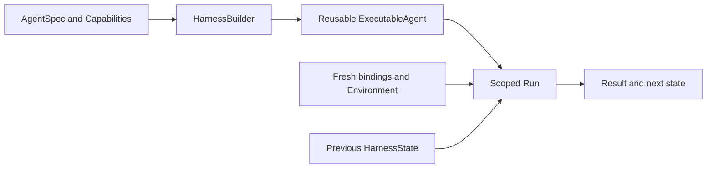

# Harness

Harness (`a13n-harness`) is Agent Foundation's embeddable agent execution SDK. It provides reusable Agent composition, scoped execution, portable continuation state, Environment tools, and public observations. Your application owns users, storage, credentials, and delivery.

Harness is the shared foundation for [Harness UI](../a13n-harness-ui/index.md), the interactive playground, and [Service](../a13n-service/index.md), the managed-agent runtime. Use either application when you do not want to build your own Host.

## Start with a small Agent

The [Getting started guide](getting-started.md) runs a complete offline agent before connecting a real model provider. It needs no credentials, Environment, plugins, or Service deployment for the first example.

The core flow is to declare an `AgentSpec`, build a reusable `ExecutableAgent` with `HarnessBuilder`, then call `run()` or consume `stream()`. Add tools and other capabilities only when your application needs them.

Build once; create fresh run inputs each time. The executable is reusable, while each Run owns its temporary resources. Persist returned state only when your application accepts that checkpoint.

## Learn by feature

Each guide starts with the use case, then shows the public API and the boundary it does not own.

| Feature                                                 | What you use it for                                                          | Design boundary                                                        |
| ------------------------------------------------------- | ---------------------------------------------------------------------------- | ---------------------------------------------------------------------- |
| [Agents and Runs](agents-and-runs.md)                   | Build definitions, run, stream, cancel, recover                              | Process-local execution, not a durable job queue                       |
| [Models and authentication](models.md)                  | Native Models, routing, gateways, request settings, subscription integration | Host owns credentials; provider owns model behavior                    |
| [Tools and dependencies](tools-and-dependencies.md)     | Typed functions and current application services                             | Typed tool composition with one execution boundary                     |
| [Inputs and outputs](inputs-and-outputs.md)             | Text/media input and typed business output                                   | Output contract is fixed at build; progress is not final output        |
| [Capabilities](capabilities.md)                         | Select behavior, hooks, Toolsets, and trusted implementations                | Feature selection is not permission to access a resource               |
| [Context and working state](context.md)                 | Context projections, tasks, notes, handoff, compaction                       | Continuation is not workflow ownership                                 |
| [Memory](memory.md)                                     | Files and records that conversations share through memory tools              | Host opens stores and persists cursors; no silent merges               |
| [Environments](environments.md)                         | Files, shell, processes, output, ports, multi-mount routing                  | Host selects Providers; Provider owns the target                       |
| [State and Resume](state-and-resume.md)                 | Continue, fork, export checkpoints, answer deferred calls                    | State restores data, not clients, credentials, or current authority    |
| [MCP tools](mcp.md)                                     | External tools and per-run headers                                           | MCP transport and provider-native tools have different execution paths |
| [Multimedia understanding](multimedia-understanding.md) | Read image, audio, and video files                                           | Native modality or an explicit fallback, not guessed provider support  |
| [Delegation and CodeAct](delegation-and-codeact.md)     | Declared child agents and restricted Python orchestration                    | No implicit detached workers or unrestricted Python I/O                |
| [Skills](skills.md)                                     | Discover and select procedural knowledge                                     | Skill text is context, not authority or automatic execution            |
| [Usage, limits, and pricing](usage-and-limits.md)       | Bound work and attribute observed usage                                      | Local estimates are not durable billing                                |
| [Observation](observation.md)                           | Events, traces, metrics, and correlation                                     | Export/delivery policy belongs to the embedding process                |
| [Plugins and extensions](plugins.md)                    | Trusted outer middleware and Environment integration                         | Plugins wrap execution; Capabilities work inside the Agent loop        |
| [Embedding in a Host](hosting.md)                       | Add persistence, acceptance, fresh policy, and recovery                      | Host owns distributed lifecycle and product policy                     |
| [Testing](testing.md)                                   | Exercise the real loop with offline Models and fake services                 | Provider smoke tests remain a separate validation layer                |

## What Harness owns

Harness supplies `AgentSpec`, `HarnessBuilder`, `ExecutableAgent`, `RunBindings`, `AgentContext`, normalized events/results, and `HarnessState`. These define composition, scoped execution, continuation, and the boundary between an agent and its Host.

The SDK also accepts native model, message, tool, and output types from its dependencies. Technical guides use their real import paths where required; Harness does not add a second model protocol or a parallel tool dispatcher. Your Host remains responsible for persistence, current authority, distributed scheduling, and recovery policy.

## Three places to put configuration

| Place                                         | Put here                                                           | Do not put here                                                      |
| --------------------------------------------- | ------------------------------------------------------------------ | -------------------------------------------------------------------- |
| Definition: `AgentSpec` / `AgentDefinition`   | Instructions, output contract, stable Capabilities, child topology | Current user credentials or live per-request clients                 |
| Invocation: `RunBindings`, Environment, input | Current identity, routing, collaborators, policy, request context  | A previously entered adapter from another Run                        |
| Continuation: `HarnessState`                  | Messages and portable feature state                                | A live client, restored authorization, or proof of durable execution |

Harness UI YAML is a **Host configuration format**, not the SDK's `AgentSpec` format. An SDK application can use Python composition without adopting UI resource directories or IDs.

## Runnable applications

- [Agent Application](https://github.com/converge-ai-labs/agent-foundation/tree/main/examples/agent-app): repeated streaming turns, successful-turn persistence, restart recovery, and a fresh Environment per turn.
- [Plugin Integration](https://github.com/converge-ai-labs/agent-foundation/tree/main/examples/plugins): packaged middleware, Environment extensions, and custom Capabilities.

Both use deterministic Models and include tests. Start with the [offline quickstart](getting-started.md), then use an example when you need a complete application boundary.

## Versions and scope

These pages track the source API on `main`; use the locked source setup to reproduce their examples. Match published-package usage to its release documentation and metadata rather than assuming all `0.x` versions are interchangeable.

Harness, Environment, and Stream Protocol publish at the same release version. Harness UI releases independently. The [accepted specifications](https://github.com/converge-ai-labs/agent-foundation/tree/main/spec/a13n-harness) contain architecture contracts; these guides explain how to use the SDK.
