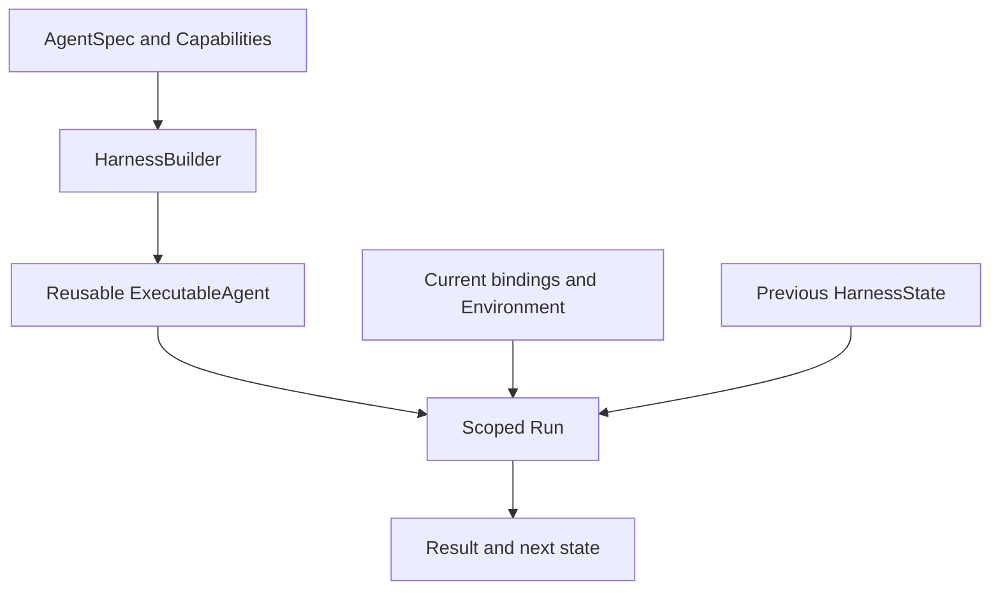

Harness (`a13n-harness`) runs or streams agent work inside your own process. Your application supplies current credentials and chooses what to persist. [Harness UI](../a13n-harness-ui/index.md) provides an interactive local Host; [Service](../a13n-service/index.md) operates managed agents.

## Start with a small Agent

The [offline quickstart](getting-started.md) builds and runs an Agent without credentials or external services:

Build once, then supply current run inputs. Save the returned state to continue the same Thread.

## Learn by feature

| Task                                                | Guide                                                                   |
| --------------------------------------------------- | ----------------------------------------------------------------------- |
| Build, run, stream, and handle results              | [Agents and Runs](agents-and-runs.md)                                   |
| Select a model and configure authentication         | [Models](models.md) and [Model authentication](model-authentication.md) |
| Add function tools and application dependencies     | [Tools and dependencies](tools-and-dependencies.md)                     |
| Ask structured questions and supply human feedback  | [Human-in-the-loop tools](human-in-the-loop.md)                         |
| Accept media input and return typed output          | [Inputs and outputs](inputs-and-outputs.md)                             |
| Select optional behavior                            | [Capabilities](capabilities.md)                                         |
| Manage conversation context and tasks               | [Context](context.md)                                                   |
| Share file or record memory                         | [Memory](memory.md)                                                     |
| Work with files, shell, and multiple Environments   | [Environments](environments.md)                                         |
| Persist, resume, and fork Threads                   | [State and Resume](state-and-resume.md)                                 |
| Connect MCP tools                                   | [MCP](mcp.md)                                                           |
| Understand images, audio, and video                 | [Multimedia understanding](multimedia-understanding.md)                 |
| Run child agents or restricted Python orchestration | [Delegation and CodeAct](delegation-and-codeact.md)                     |
| Discover procedural instructions                    | [Skills](skills.md)                                                     |
| Set budgets and inspect usage                       | [Usage and limits](usage-and-limits.md)                                 |
| Trace runs and stream observations                  | [Observation](observation.md)                                           |
| Add middleware and Environment integrations         | [Plugins](plugins.md)                                                   |
| Embed Harness with durable application state        | [Hosting](hosting.md)                                                   |
| Test without provider credentials                   | [Testing](testing.md)                                                   |

## What Harness owns

`AgentSpec` and `HarnessBuilder` define and build an `ExecutableAgent`. Each run creates an `AgentContext` and returns events, results, usage, and `HarnessState`. Harness owns process-local execution; an embedding Host owns its users, persistence, and recovery policy.

The SDK accepts native model, message, tool, and output types from its dependencies. Harness UI YAML is Host configuration, not an `AgentSpec` schema.

## Three places to put configuration

- **Definition** (`AgentSpec` and builder arguments): instructions, output type, and stable capabilities.
- **Invocation** (`RunBindings`, Environment, input): current identity, clients, tools, and access policy.
- **Continuation** (`HarnessState`): messages and portable capability state; not credentials or live resources.

## Runnable applications

- [Agent application](https://github.com/converge-ai-labs/agent-foundation/tree/main/examples/agent-app): offline streaming, persisted turns, and restart recovery.
- [Environment Providers](https://github.com/converge-ai-labs/agent-foundation/tree/main/examples/environment-provider): fresh adapters, re-entry, and explicit destruction.
- [Plugins](https://github.com/converge-ai-labs/agent-foundation/tree/main/examples/plugins): trusted middleware and Environment extensions.
- [Installed Provider](https://github.com/converge-ai-labs/agent-foundation/tree/main/examples/provider-plugin): Provider package discovery.
- [MCP App](https://github.com/converge-ai-labs/agent-foundation/tree/main/examples/mcp-apps): interactive MCP tool results.

## Versions and scope

These guides track the source API on `main`. Harness and Stream Protocol publish at one exact release version; Harness UI releases independently. See the [accepted specifications](https://github.com/converge-ai-labs/agent-foundation/tree/main/spec/a13n-harness) for architecture contracts.
