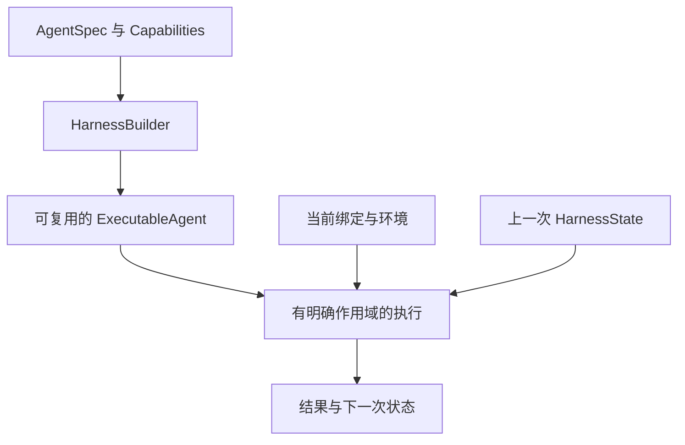

Harness（`a13n-harness`）在你的进程内运行 agent，也支持流式输出。当前凭据由应用提供，哪些内容需要持久化也由应用决定。[Harness UI](../a13n-harness-ui/index.md) 是交互式的本地 Host；[Service](../a13n-service/index.md) 则负责管理和运行托管 agent。

## 从一个简单的 Agent 开始

[离线快速入门](getting-started.md)会构建并运行一个 Agent，无需凭据或外部服务：

构建一次，即可在之后的每次执行中传入当前输入。保存返回的状态，就能在线程中继续工作。

## 按功能了解 Harness

| 任务                                  | 指南                                                   |
| ------------------------------------- | ------------------------------------------------------ |
| 构建、运行、流式输出与结果处理        | [Agent 与执行](agents-and-runs.md)                     |
| 选择模型并配置认证                    | [模型](models.md)和[模型认证](model-authentication.md) |
| 添加函数工具与应用依赖                | [工具与依赖](tools-and-dependencies.md)                |
| 接收媒体输入并返回指定类型的输出      | [输入与输出](inputs-and-outputs.md)                    |
| 选择可选能力                          | [Capabilities](capabilities.md)                        |
| 管理对话上下文和任务                  | [上下文](context.md)                                   |
| 共享文件记忆或记录记忆                | [记忆](memory.md)                                      |
| 操作文件、shell 和多个环境            | [环境](environments.md)                                |
| 保存、恢复与分叉线程                  | [状态与恢复](state-and-resume.md)                      |
| 接入 MCP 工具                         | [MCP](mcp.md)                                          |
| 理解图像、音频和视频                  | [多媒体理解](multimedia-understanding.md)              |
| 运行子 agent 或用受限 Python 编排任务 | [委派与 CodeAct](delegation-and-codeact.md)            |
| 发现并读取操作指引                    | [Skill](skills.md)                                     |
| 设置预算并检查用量                    | [用量与限制](usage-and-limits.md)                      |
| 跟踪执行并流式接收观测事件            | [观测](observation.md)                                 |
| 添加中间件和环境集成                  | [插件](plugins.md)                                     |
| 在应用中嵌入 Harness 并持久化状态     | [托管与嵌入](hosting.md)                               |
| 无需 provider 凭据进行测试            | [测试](testing.md)                                     |

## Harness 负责什么

`AgentSpec` 和 `HarnessBuilder` 用于定义并构建 `ExecutableAgent`。每次执行都会创建 `AgentContext`，并返回事件、结果、用量和 `HarnessState`。Harness 负责进程内的执行；嵌入它的 Host 负责用户管理、持久化和恢复策略。

SDK 接受依赖库原生的模型、消息、工具和输出类型。Harness UI 的 YAML 是 Host 配置，并不是 `AgentSpec` 的 schema。

## 配置应该放在哪里

- **定义**（`AgentSpec` 和 builder 参数）：指令、输出类型和稳定的能力配置。
- **调用**（`RunBindings`、Environment 和输入）：当前身份、客户端、工具和访问策略。
- **继续执行的状态**（`HarnessState`）：消息和可移植的能力状态，不包含凭据或运行中的资源。

## 可运行的应用示例

- [Agent 应用](https://github.com/converge-ai-labs/agent-foundation/tree/main/examples/agent-app)：离线流式执行、保存对话轮次和重启恢复。
- [Environment Provider](https://github.com/converge-ai-labs/agent-foundation/tree/main/examples/environment-provider)：创建新的适配器、重新进入环境和显式销毁资源。
- [插件](https://github.com/converge-ai-labs/agent-foundation/tree/main/examples/plugins)：可信中间件与环境扩展。
- [已安装的 Provider](https://github.com/converge-ai-labs/agent-foundation/tree/main/examples/provider-plugin)：发现 Provider 包。
- [MCP App](https://github.com/converge-ai-labs/agent-foundation/tree/main/examples/mcp-apps)：交互式呈现 MCP 工具结果。

## 版本与适用范围

这些指南对应 `main` 分支的源码 API。Harness 和 Stream Protocol 以完全相同的版本号发布；Harness UI 独立发布。架构约定请参阅[已接受的规范](https://github.com/converge-ai-labs/agent-foundation/tree/main/spec/a13n-harness)。
