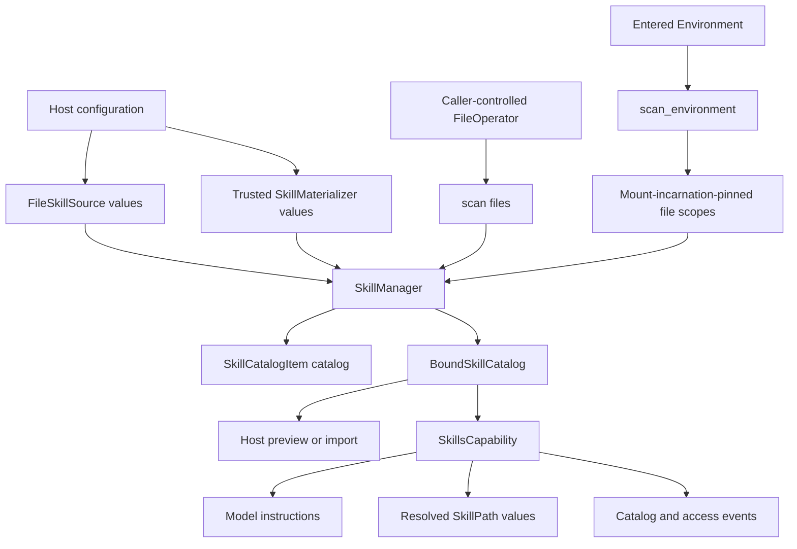

Scan Skills directly through a FileOperator or through an entered Environment:

| Host situation                                                 | API                                              | Result                         | Consistency owner                                                                                                          |
| -------------------------------------------------------------- | ------------------------------------------------ | ------------------------------ | -------------------------------------------------------------------------------------------------------------------------- |
| A CLI or embedded process directly controls one `FileOperator` | `SkillManager.scan(files=...)`                   | `tuple[SkillCatalogItem, ...]` | The caller keeps the operator's namespace stable                                                                           |
| A Host uses an entered `BoundEnvironment`                      | `SkillManager.scan_environment(environment=...)` | `BoundSkillCatalog`            | The manager pins mount incarnations; the Host checks that the catalog is still current before it uses a catalog path later |

Both modes use the same `SkillSource`, `SkillMaterializer`, frontmatter parser, limits, conflict policy, and path-containment checks. Neither mode scans a home directory, installed package, or sibling directory implicitly.

## Design



The design separates four responsibilities:

- `FileSkillSource` discovers bounded metadata below explicitly configured FileOperator roots.
- `SkillMaterializer` is trusted Host code that publishes managed packages beneath one configured root.
- `SkillManager` performs materialization, discovery, validation, conflict resolution, and optional Environment mount binding without depending on an Agent Run.
- `SkillsCapability` adapts one bound catalog into Run selection, model instructions, resolved `SkillPath` values, access observations, and model/tool-boundary stale checks.

The two APIs have exact, non-overlapping behavior:

- `scan(files=...)` uses exactly the supplied FileOperator and never constructs or probes an Environment;
- `scan_environment(environment=...)` uses only mount-incarnation-pinned scopes and never retries through the unpinned `environment.files` facade or direct scan mode;
- a source reads only its configured roots and never tries the process working directory, home directory, package locations, or alternate directories;
- a relevant route change raises `skill_catalog_stale`; it never triggers an automatic rescan or retarget;
- `FileSkillSource`, `SkillSource.roots`, and `SkillManager.roots` are the complete source/root surface.

`required=False` is explicit source policy rather than fallback discovery. It can omit that exact missing, unroutable, or unsupported root, but it never substitutes another path.

## Read Concurrency and Limits

Built-in scans use up to eight read workers while preserving source precedence and name-sorted results.

`max_entries_per_root` defaults to 256; `SkillsPolicy.max_skills` defaults to 512 per source and final catalog. Oversized catalogs fail instead of truncating.

## Skill Package Layout

A configured root can itself be a Skill package, and each immediate child directory can be one Skill package. Discovery does not recurse beyond that level.

```text
.agents/skills/
├── SKILL.md
├── code-review/
│   ├── SKILL.md
│   └── checklist.md
└── release/
    └── SKILL.md
```

Each `SKILL.md` starts with bounded YAML frontmatter:

```markdown
---
name: code-review
description: Review a code change for correctness and maintainability.
---

# Code review

Follow the repository review workflow.
```

`name` is the conflict and Run-selection identity. Skill content is untrusted model context; it grants no tools, credentials, filesystem access, plugin loading, or package authority.

## Scan a Direct FileOperator

For direct scanning, use canonical absolute roots in the FileOperator's namespace. A local operator rooted at the project uses `/.agents/skills`, not `/workspace/.agents/skills`:

```python
from a13n_harness.capabilities import (
    FileSkillSource,
    SkillCatalogItem,
    SkillManager,
)
from a13n_harness.environment import FileOperator


async def scan_cli_skills(
    files: FileOperator,
) -> tuple[SkillCatalogItem, ...]:
    manager = SkillManager(
        (
            FileSkillSource(
                "project",
                ("/.agents/skills",),
                required=False,
            ),
        )
    )
    return await manager.scan(files=files)
```

Keep the operator's namespace stable until you finish using the returned paths. Use Environment-aware scanning when mounts can change.

`SkillManager.default()` uses `/workspace/.agents/skills` in Environment-backed Runs. For explicit mount roots or direct FileOperators, provide a manager with roots in that namespace.

## Scan an Entered Environment

Use Environment-aware scanning when paths can route through `/workspace` or `/environment/{name}` and mounts can change while the Host is active:

```python
from a13n_harness.capabilities import (
    BoundSkillCatalog,
    SkillManager,
)
from a13n_harness.environment.advanced import BoundEnvironment


async def scan_environment_skills(
    environment: BoundEnvironment,
) -> BoundSkillCatalog:
    manager = SkillManager.default()
    catalog = await manager.scan_environment(environment=environment)

    # Call again immediately before consuming catalog paths after any await.
    catalog.require_current(environment)
    return catalog
```

`scan_environment()` pins configured routes while reading and returns exact paths. It checks that those routes remain current before returning.

A `BoundSkillCatalogItem` contains:

- `name`, `description`, `path`, and `source_id`;
- `directory`, the exact resolved Skill directory;
- `document`, the exact resolved `SKILL.md` path;
- `directory.mount_id` and `document.mount_id`, the opaque mount incarnation used during scanning;
- `observed_generation`, the provider generation held during scanning.

Call `catalog.require_current(environment)` before reusing catalog paths. A changed relevant mount, generation, or route fails with `skill_catalog_stale`; unrelated mounts do not invalidate it.

`EnvironmentPath` is valid only in the entered Environment. Import packages into Host-owned immutable storage for durable use.

## Add Explicit Sources

Retain the canonical `/workspace/.agents/skills` source and append Host roots with normal later-source precedence:

```python
from a13n_harness.capabilities import (
    FileSkillSource,
    SkillManager,
)

manager = SkillManager.default(
    additional_sources=(
        FileSkillSource(
            "organization",
            ("/environment/shared/skills",),
            required=True,
        ),
    )
)
```

An explicit manager replaces the defaults. Set `SkillsPolicy(conflict="error")` to reject duplicate names instead of applying source precedence.

With `required=False`, each missing, unroutable, or unsupported root is skipped independently. Permission denial, malformed paths or frontmatter, provider failures, and catalog overflow remain errors.

## Materialize Managed Skills

A trusted Host adapter can implement `SkillMaterializer` to populate one configured source root before scanning:

```python
from a13n_harness.environment import FileOperator


class ManagedSkillMaterializer:
    materializer_id = "managed-snapshot"
    target_root = "/workspace/.agents/skills"

    async def materialize(self, *, files: FileOperator) -> None:
        # Verify the Host-owned package manifest and digest first.
        # Then publish only beneath target_root through `files`.
        ...
```

Set `target_root` to one configured source root and materialize beneath it. The FileOperator or Environment supplies access permissions.

## Use Skills in a Harness Run

Pass the manager to `SkillsCapability` to expose the catalog and its paths to the Agent:

```python
from a13n_harness import RunBindings
from a13n_harness.capabilities import (
    SkillsCapability,
)

skills = SkillsCapability(manager)

bindings = RunBindings.embedded(
    environment=environment_binding,
    skill_selection=frozenset({"code-review", "release"}),
)
```

Selection is exact and fresh for each root, resumed, or child Run:

- leave `RunBindings.skill_selection=None` to expose the complete conflict-resolved catalog;
- provide a non-empty set to expose only those names;
- provide an empty set to inject no Skill instructions or paths;
- an unknown name fails Run preparation with `skill_selection_unknown`.

Selection is not portable `HarnessState` and grants no source or file authority. If a relevant Environment route changes, the current Run fails with `skill_catalog_stale`; it does not silently rescan or retarget frozen instructions.

## Host Responsibilities

The Host manages source authorization, package validation, and durable storage.

To import a package:

1. Scan through `scan_environment()` and select an item.
2. Check the catalog remains current; validate content through the same Environment.
3. Copy to Host-owned immutable storage and validate the copy before publication.
