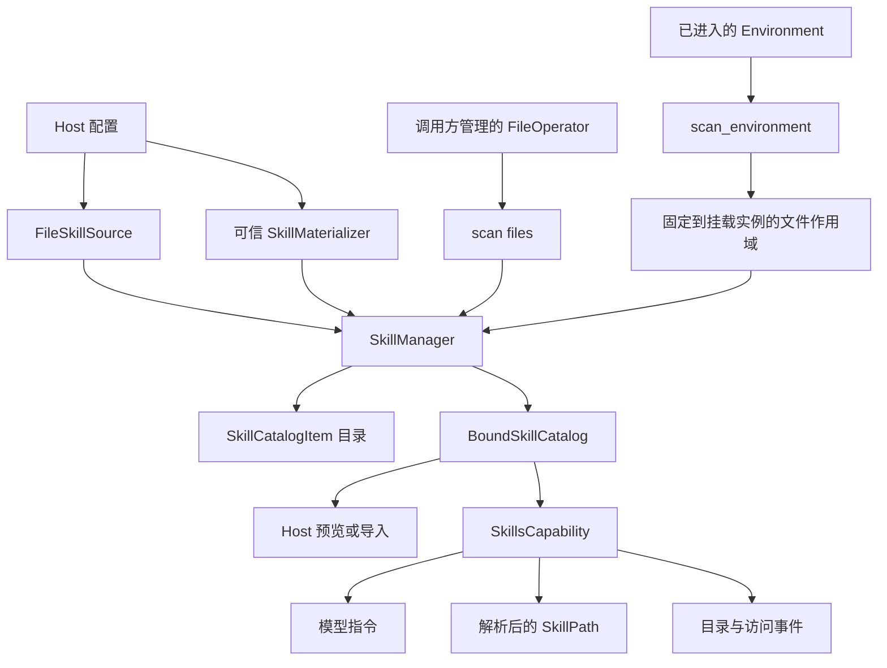

`a13n-harness` 的 Skill 发现可以在 Agent 执行之外复用。Host 明确选择以下两种模式之一：

| Host 场景                                   | API                                              | 结果                           | 谁负责一致性                                                        |
| ------------------------------------------- | ------------------------------------------------ | ------------------------------ | ------------------------------------------------------------------- |
| CLI 或嵌入式进程直接管理一个 `FileOperator` | `SkillManager.scan(files=...)`                   | `tuple[SkillCatalogItem, ...]` | 调用方保持 operator 命名空间稳定                                    |
| Host 使用已进入的 `BoundEnvironment`        | `SkillManager.scan_environment(environment=...)` | `BoundSkillCatalog`            | manager 固定挂载实例；Host 之后使用目录路径前，检查目录是否仍为最新 |

两种模式共用 `SkillSource`、`SkillMaterializer`、frontmatter 解析器、限制、冲突策略和路径范围检查。都不会隐式扫描 home 目录、已安装软件包或相邻目录。

## 设计



设计将四项职责分开：

- `FileSkillSource` 在明确配置的 FileOperator 根目录下发现大小受限的元数据。
- `SkillMaterializer` 是可信 Host 代码，在一个配置的根目录下发布托管软件包。
- `SkillManager` 负责准备包内容、发现、验证、冲突处理，以及可选的 Environment 挂载绑定，不依赖 Agent Run。
- `SkillsCapability` 将一个绑定目录接入 Run 选择、模型指令、解析后的 `SkillPath`、访问观测，以及模型和工具边界的失效检查。

两个 API 的行为明确且互不混用：

- `scan(files=...)` 只使用传入的 FileOperator，不会创建或探测 Environment；
- `scan_environment(environment=...)` 只使用固定到挂载实例的作用域，不会通过未固定的 `environment.files` 门面或直接扫描模式重试；
- 来源只读取配置的根目录，不尝试进程工作目录、home、软件包目录或其他目录；
- 相关路由变化会触发 `skill_catalog_stale`，绝不会自动重新扫描或改换目标；
- `FileSkillSource`、`SkillSource.roots` 和 `SkillManager.roots` 构成完整的来源与根目录接口。

`required=False` 是明确的来源策略，不是回退发现机制。它可以跳过对应的缺失、无法路由或不支持的根目录，但绝不会用其他路径替代。

## 读取并发与限制

内置文件发现和最终文档验证，每次操作最多使用八个读取 worker。Materializer、来源和根目录仍顺序处理；并发读取不改变来源优先级、跳过条目的诊断顺序，或按名称排序的模型目录。来源配置和内容不变时，读取完成顺序不会改变 Skill 指令前缀。取消时，会等待 worker 结束后再释放文件作用域。

大小限制独立于并发：`FileSkillSource.max_entries_per_root` 默认最多列出 256 个目录条目，`SkillsPolicy.max_skills` 默认将每个来源和最终解析目录都限制为 512 条。超限会明确失败，不会静默选择前几个条目。并发是内部实现，不需要 Host 配置或跨 Run 缓存。

## Skill 包结构

配置的根目录本身可以是一个 Skill 包，它的每个直接子目录也可以是一个 Skill 包。发现不会继续递归。

```text
.agents/skills/
├── SKILL.md
├── code-review/
│   ├── SKILL.md
│   └── checklist.md
└── release/
    └── SKILL.md
```

每个 `SKILL.md` 都以大小受限的 YAML frontmatter 开始：

```markdown
---
name: code-review
description: Review a code change for correctness and maintainability.
---

# Code review

Follow the repository review workflow.
```

`name` 是冲突处理和 Run 选择使用的标识。Skill 内容是不可信的模型上下文，不授予工具、凭据、文件系统访问、插件加载或软件包权限。

## 直接扫描 FileOperator

Host 已持有非虚拟 FileOperator，并管理其生命周期和目标变化时，可使用直接扫描。根目录必须是 operator 命名空间内的规范绝对路径：不允许重复分隔符、路径穿越片段，以及 `/` 之外的尾随斜线。例如，一个限制在 Project 根目录内的本地 operator，如果 `/` 对应该 Project，就使用 `/.agents/skills`，而非 `/workspace/.agents/skills`：

```python
from a13n_harness.capabilities import (
    FileSkillSource,
    SkillCatalogItem,
    SkillManager,
)
from a13n_harness.environment import FileOperator


async def scan_cli_skills(
    files: FileOperator,
) -> tuple[SkillCatalogItem, ...]:
    manager = SkillManager(
        (
            FileSkillSource(
                "project",
                ("/.agents/skills",),
                required=False,
            ),
        )
    )
    return await manager.scan(files=files)
```

此模式直接操作传入 FileOperator 的命名空间，没有 Environment 挂载路由语义。在返回目录派生出的所有路径都使用完之前，必须保持底层命名空间稳定。如果其他进程可同时替换底层目录，应提供满足 Host 所需快照或锁定行为的 operator，或改用已进入的 Environment。

`SkillManager.default()` 面向由 Environment 支持的 Run，包含规范的 `/workspace/.agents/skills` 来源。只有默认挂载没有显式 `mount_path` 时，该路径才能解析；使用显式聚合根目录的 Host 应提供显式 manager。直接使用 FileOperator 的 Host 通常应显式构建 manager，使用自身命名空间中的根目录。

## 扫描已进入的 Environment

路径可能通过 `/workspace` 或 `/environment/{name}` 路由，且 Host 活跃期间挂载可能变化时，应使用 Environment 感知的扫描：

```python
from a13n_harness.capabilities import (
    BoundSkillCatalog,
    SkillManager,
)
from a13n_harness.environment.advanced import BoundEnvironment


async def scan_environment_skills(
    environment: BoundEnvironment,
) -> BoundSkillCatalog:
    manager = SkillManager.default()
    catalog = await manager.scan_environment(environment=environment)

    # Call again immediately before consuming catalog paths after any await.
    catalog.require_current(environment)
    return catalog
```

`scan_environment()` 会：

1. 在等待 provider I/O 之前，通过 `BoundEnvironment.select_files()` 捕获每个配置的根目录；
2. 为这些根目录打开固定到挂载实例的文件作用域；
3. 在固定作用域内准备内容、列出条目、读取 frontmatter，并最终验证 `SKILL.md`；
4. 将每个最终条目解析为准确的目录和文档 `EnvironmentPath`；
5. 返回前，验证所有配置的扫描路由仍有效，包括空根目录和因冲突被覆盖的根目录。

`BoundSkillCatalogItem` 包含：

- `name`、`description`、`path` 和 `source_id`；
- `directory`：准确解析后的 Skill 目录；
- `document`：准确解析后的 `SKILL.md` 路径；
- `mount_id`：扫描期间持有的、不透明的 Harness 挂载实例标识；
- `observed_generation`：扫描期间持有的 provider generation。

`BoundSkillCatalog.require_current(environment)` 只重新选择目录条目所代表的路径。添加或替换不相关的 Environment 挂载不会使目录失效。相关挂载选择、不透明 mount ID、provider generation、默认路由或解析后的 provider 路径变化，会抛出错误码为 `skill_catalog_stale` 的 `DefinitionError`。

不要将 `EnvironmentPath` 持久化为长期权限依据。它描述的是某次已进入的 Environment，仅在该 Environment 仍活跃时有效。导入 Skill 包的 Host 应复制并验证包内容，存入自己管理的不可变修订格式。

## 添加明确的来源

保留规范的 `/workspace/.agents/skills` 来源，追加 Host 根目录，遵循普通的后来源优先规则：

```python
from a13n_harness.capabilities import (
    FileSkillSource,
    SkillManager,
)

manager = SkillManager.default(
    additional_sources=(
        FileSkillSource(
            "organization",
            ("/environment/shared/skills",),
            required=True,
        ),
    )
)
```

Host 如果要完全替换默认组合，应传入显式 `SkillManager(...)`。来源顺序是确定的。如果最终名称重复必须失败，而不是按优先级选择，配置 `SkillsPolicy(conflict="error")`。

`required=False` 会分别跳过每个缺失、无法路由或不支持的根目录。权限拒绝、路径或 frontmatter 格式错误、provider 失败和目录溢出，仍然报错。

## 准备托管 Skill

可信 Host 适配器可以实现 `SkillMaterializer`，在扫描前为一个配置的来源根目录准备内容：

```python
from a13n_harness.environment import FileOperator


class ManagedSkillMaterializer:
    materializer_id = "managed-snapshot"
    target_root = "/workspace/.agents/skills"

    async def materialize(self, *, files: FileOperator) -> None:
        # Verify the Host-owned package manifest and digest first.
        # Then publish only beneath target_root through `files`.
        ...
```

`target_root` 必须等于某个配置的来源根目录。这是组合与来源约定，不是沙箱包装。Materializer 是可信 Host 代码，必须限定在该根目录下；实际权限边界仍由传入的 FileOperator 或 Environment 提供。

## 在 Harness Run 中使用 Skill

将 manager 传给定义中选择的 `SkillsCapability`。Capability 使用 Environment 感知扫描，发布准确的 `SkillPath`、注入有界路由指令、观测普通的 `SKILL.md` 读取，并在模型和工具边界检查选定目录仍有效。

```python
from a13n_harness import RunBindings
from a13n_harness.capabilities import (
    SkillsCapability,
)

skills = SkillsCapability(manager)

bindings = RunBindings.embedded(
    environment=environment_binding,
    skill_selection=frozenset({"code-review", "release"}),
)
```

每个根 Run、恢复 Run 或子 Run，都使用准确且重新提供的选择：

- `RunBindings.skill_selection=None` 暴露完整的冲突处理后目录；
- 非空集合只暴露指定名称；
- 空集合不注入任何 Skill 指令或路径；
- 未知名称使 Run 准备失败，错误码为 `skill_selection_unknown`。

选择不属于可移植 `HarnessState`，也不授予来源或文件权限。相关 Environment 路由变化时，当前 Run 会以 `skill_catalog_stale` 失败，不会静默重新扫描，也不会将冻结的指令改指向其他目标。

## Host 的职责

Harness 扫描器明确不负责：

- 来源的增删改查或启用；
- 原生路径授权；
- 软件包 manifest、摘要、签名或不可变修订；
- 导入包副本的符号链接和路径穿越策略；
- 持久化或刷新历史；
- 持久执行或重试；
- 凭据、插件、Capabilities 或工具。

导入包的 Host 应：

1. 通过 `scan_environment()` 扫描。
2. 选择一个准确条目。
3. 验证目录仍为最新。
4. 在同一个已进入的 Environment 中枚举并验证包内容。
5. 将包复制到 Host 管理的不可变存储。
6. 发布前再次验证副本。
