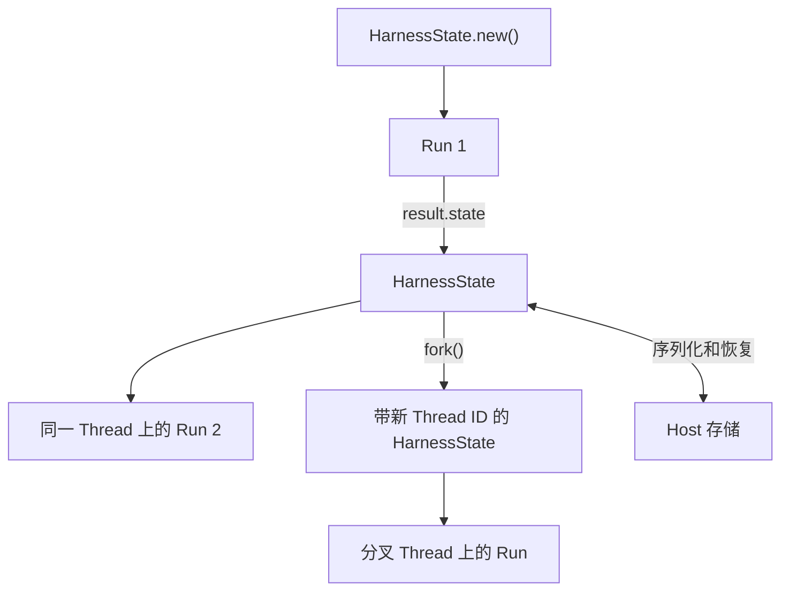

`HarnessState` 是单个独立推进 Thread 的可移植续接值。它保留模型历史、带版本的 Capability 命名空间和可选的可移植 Environment 数据，有意不保留权限或 Host 生命周期状态。



## 状态内容

状态结构包含：

- `schema_version`；
- 稳定 `thread_id`；
- 公共 Pydantic AI 消息历史；
- 由 Capability ID 管理、带版本的独立 JSON 值；
- 为已选择兼容挂载提供的可选 provider 专用可移植 Environment 状态。

不包含：

- Model、Toolset、Capability、插件、可调用对象或活动客户端；
- 身份验证、策略、授权、凭据或审批；
- 期望 Environment 挂载定义、运行时修改权限、provider 会话或启动状态；
- Host 执行记录、尝试、租约、队列或终态提交；
- 持久异步子级、长期记忆、交付、计费或统计状态。

状态恢复数据，不恢复权限。

## 继续 Thread

已完成、挂起或安全失败的结果可能携带候选状态：

```python
from a13n_harness import HarnessState

initial_state = HarnessState.new(thread_id="thr_productthread1")
first = await executable.run(
    "Draft the plan",
    bindings=fresh_bindings(),
    previous_state=initial_state,
)

if first.state is None:
    raise RuntimeError("No continuation state is available")

second = await executable.run(
    "Review it",
    bindings=fresh_bindings(),
    previous_state=first.state,
)
```

`first.thread_id == second.thread_id`，而 `first.run_id != second.run_id`。新 Run 重建当前绑定，创建新的上下文、`EnvironmentRuntime`、插件图和用量累加器。

## 序列化状态

`HarnessState` 是冻结的 Pydantic 模型：

```python
from a13n_harness import HarnessState

payload = state.model_dump_json()
restored = HarnessState.model_validate_json(payload)
```

持久化完整、经过验证的状态结构，不保存私有编码字段或原始模型增量。Host 应在 Harness 载荷之外，将它与自身定义版本、provider 生命周期状态、检查点来源及 Host 验证元数据关联。

## Fork Thread

将续接数据复制为独立推进的历史时，用 `fork()`。省略 ID 由 Harness 生成，或传入不同的 Host 自选 ID：

```python
branch_state = state.fork(thread_id="thr_productbranch1")

assert branch_state.thread_id != state.thread_id
assert branch_state.message_history == state.message_history
```

不要手动编辑序列化状态。显式初始身份用 `HarnessState.new(thread_id=...)`；改变身份并保留可移植续接数据用 `state.fork(thread_id=...)`。fork 会按设计清除可移植 Environment 状态。Harness 用 ID 关联一份历史和模型会话亲和性，不把它视为权限。

## 流式期间导出

活动流可导出最新安全公共边界：

```python
async with executable.stream("Work", bindings=fresh_bindings()) as stream:
    async for item in stream:
        checkpoint_candidate = await stream.export_state()
```

`export_state()` 不持久化内容，也不暴露任意 token 增量。调用方决定候选是否完整、当前有效且可安全选择。终态结果仍是最简单的完整检查点边界。

## 恢复未回答工具调用

检查点可能包含尚未记录结果的工具调用。崩溃后，即使结果缺失，操作也可能已运行。在将调用视为未知前，先提供 Host 保留的[已接受延迟输入](#recover-an-interrupted-deferred-resume)：外部结果、失败和显式拒绝在所有恢复模式下仍有效。其余未解决调用由 `run()` 和 `stream()` 的单 Run `tool_recovery` 决定是否重新执行：

| 模式                 | 恢复后未回答的调用                                   |
| -------------------- | ---------------------------------------------------- |
| `"declared"`（默认） | 执行显式声明可恢复重试的工具；其他调用填入未知结果。 |
| `"never"`            | 对每个未回答调用填入未知结果 `ToolReturnPart`。      |
| `"always"`           | 执行当前工具集合中仍可用的每个未回答调用。           |

已记录工具返回和参数重试结果仍有效。恢复保留原调用 ID 和部分结果，保存进度边界中断时也如此。不再可用工具得到未知结果。已有未知结果返回本身已是结果，即使 `"always"` 也不重新打开。新生成调用正常执行。

### 在来源声明可重试工具

用 `recovery_retryable()` 装饰器，或包装已有函数/原生 `Tool`：

```python
from a13n_harness.tools import recovery_retryable
from pydantic_ai import Tool
from pydantic_ai.capabilities import Capability

@recovery_retryable
def lookup_record(record_id: str) -> str:
    return read_record(record_id)

catalog = Capability(
    id="acme.catalog",
    tools=[lookup_record, recovery_retryable(Tool(search_records, name="search"))],
)
```

辅助函数返回原生 `Tool`，只添加元数据，不包装执行；已有 `Tool` 会被复制，保留设置和其他元数据。实例方法可在构造 Capability 时用 `recovery_retryable(self.lookup_record)`。Plugin 可如此声明各工具，无须 Host 知道工具名。

动态 Toolset 构建当前工具时也可使用此函数。已有 `ToolDefinition` 元数据的集成，将 `a13n_harness.tools` 的 `RECOVERY_RETRY_SAFE_METADATA_KEY` 设为布尔 `True`。也支持原生 `SetToolMetadata`。声明从新准备的定义读取，不从已保存消息读取。

声明表示即使之前结果未知，重复操作仍可接受。它与提供方派发重试和 `HarnessToolMetadata.idempotency` 独立：仅有 provider key 不能证明恢复调用会复用原上游操作。

### 按策略恢复

```python
result = await executable.run(
    bindings=fresh_bindings(),
    previous_state=checkpoint,
    tool_recovery="declared",  # The default; use "never" to disable all replay.
)
```

也可提供新输入。原生 Pydantic AI 续接在下次模型请求前处理保留调用和部分结果。恢复使用原生 `ToolApproved` 作为重放所选调用的程序许可。仍执行原生参数验证；当前需审批或外部执行的工具仍挂起；受管理调用按新策略和资源检查。恢复重放许可不满足当前审批要求。新的 `DeferredToolResume` 独立于 `tool_recovery` 使用提供的审批/结果批次；中断恢复使用 `recovery=True` 和当前恢复策略。提供方挂起响应保留原生续接路径。

此选项属于 Run，不属于序列化状态或模型重试策略。不保证恰好一次副作用，也不阻止后续模型请求再次调用。

旧 `execute_pending_tools` 已由 `tool_recovery` 替代：`False` 迁移为 `"never"`，`True` 为 `"always"`，`"auto"` 为 `"declared"`。默认现在遵循逐工具声明；未标记工具继续收到未知结果。

## 结构化挂起

原生延迟工具和审批会以 `status="suspended"` 结束根逻辑 Run。结果包含：

- `state`：已接受历史和 Capability 数据；
- `deferred`：确切的原生待处理请求结构；
- `suspend_reason="deferred"`。

应用在 Run 关闭后处理外部交互，再启动新 Run：

```python
from a13n_harness import DeferredToolResume

first = await executable.run(
    "Ask for confirmation",
    bindings=fresh_bindings(),
)

if first.status != "suspended" or first.state is None or first.deferred is None:
    raise RuntimeError("Expected a suspended run")

results = first.deferred.build_results(approve_all=True)

second = await executable.run(
    bindings=fresh_bindings(),
    previous_state=first.state,
    deferred_resume=DeferredToolResume(first.deferred, results),
)
```

确切结果构造 API 取决于延迟项是审批、外部调用还是结构化用户问题。对全部待处理项各回答一次，并保留类别。[客户端工具示例](client-tools.md)展示完整离线声明、挂起、关联外部结果和恢复。[受管理工具策略](managed-tools.md)说明审批元数据和新授权。

恢复会验证：

- 存在之前状态；
- 延迟请求与提供结果精确关联；
- 待处理调用符合合法消息历史和当前工具类别；
- 覆盖参数再次通过验证；
- 新策略和提供方约束仍允许派发。

之前审批不绕过当前策略。Host 可构造合法历史，并提供原生 `bool`、`ToolApproved` 或 `ToolDenied`，无须私有 Harness 元数据。不要求历史参数或 schema 的指纹、资源版本或受管理身份声明证明。保持待处理请求与历史一致；替换参数使用 `ToolApproved.override_args`。当前 schema 验证、审查、策略和 Environment 约束仍适用。审批不预留底层目标，也不授权未知结果后的自动重放。

当前绑定支持延迟工具时，此原生流程也适用于 Host 管理的子级。[内置内联子级](delegation-and-codeact.md#host-managed-feedback)关闭延迟工具，只支持普通提示续接。没有延迟生命周期的 Host 显式设置 `deferred_tools_supported=False`；仅有父子血缘不会关闭交互。

## 恢复中断的延迟续接

外部结果可能在原生历史记录前就已接受。例如批次同时包含外部结果和本地批准动作，执行可能在动作运行前停在检查点。中间 `HarnessState` 本身不是已接受批次的完整记录。Harness 不在 Capability 状态中保留第二份延迟结果表示。

Host 将关联的原生 `DeferredToolRequests` 和 `DeferredToolResults` 与所选检查点一起保留，或放入已有持久输入记录，直到历史纳入它们。发布新检查点时，`accepted.remaining(checkpoint.message_history)` 返回未纳入批次；已纳入或被后续响应替代时返回 `None`。按 Host 普通发布规则将此值与检查点持久化；收到输入或仅调用 `export_state()` 不会保存。

从中断的恢复 Run 继续时，提供保留批次和 `recovery=True`：

```python
from a13n_harness import DeferredToolResume

# Loaded from the Host's checkpoint and accepted-input storage.
recovery_input = (
    DeferredToolResume(accepted.requests, accepted.results, recovery=True)
    if accepted is not None
    else None
)
result = await executable.run(
    bindings=fresh_bindings(),
    previous_state=checkpoint,
    deferred_resume=recovery_input,
    tool_recovery="declared",
)
```

恢复过滤历史已有结果，验证剩余关联和当前工具集合；即使 `tool_recovery="never"`，也消费保留外部事实和显式拒绝。绝不复用正向审批作为重放许可。未解决本地任务遵循当前恢复策略，适用时需新审批。Host 管理的子检查点也如此；这不保证恰好一次副作用，也不能恢复 Host 未保存输入。

## 安全的失败状态候选

Harness 能规范化中断历史时，失败结果可包含安全候选状态。例如保留完整可见文本和已完成的思考内容，排除未完成思考片段。

候选不是持久恢复决策。选择前，Host 必须判断外部修改是否可能已派发但无权威结果。重放不确定操作前，应核对提供方状态，或复用操作专用幂等契约。

`RunCleanupError.outcome` 也只是结果不确定的候选，因为未完成正常终态交付。

## Capability 状态

有状态 Capability 使用稳定命名空间和确切版本：

```python
from pydantic import BaseModel


class CounterState(BaseModel):
    value: int


current = await context.state.read(
    "acme.counter",
    CounterState,
    version="1",
)
await context.state.write(
    "acme.counter",
    CounterState(value=(current.value if current else 0) + 1),
    version="1",
)
```

未知命名空间可在 Run 中保持不透明。只有所属 Capability 解释载荷和版本。不要在 Capability 命名空间存储凭据、客户端、锁或 `EnvironmentState`。

## Run 本地 shell 观测

`DynamicEnvironmentCapability` 按各挂载实际动作组合 shell 执行、`shell_info` 发现/检查、显式偏移 `shell_wait` 和支持的 stdin/控制工具。引用属于一个 Harness Run，不属于持久进程服务。查询不重置输出；原生完成不代表输出已完整捕获。

Run 关闭释放观测，不会统一终止全部进程。根据 Provider 状态恢复的新 adapter 可能发现后端保留的命令；新 Run 分配新引用，不能使用历史旧引用。进程引用、缓冲、watcher 和输出游标不进入 Harness Capability 状态。Provider 状态保存原生恢复证据；Host 负责目标生命周期和状态发布。

用法和 Provider 专用限制见 [Environment 工具](environments.md)。不要求 Host 进程管理器、进程数据库或持久 Run 后唤醒集成。

## Host 检查点

持久 Host 应将这些事实分开管理：

| 事实                                  | 负责方              |
| ------------------------------------- | ------------------- |
| 可移植对话续接                        | `HarnessState` 候选 |
| 所选检查点和来源                      | Host                |
| 定义版本和产物锁定                    | Host                |
| 当前身份、策略和凭据                  | Host 重新构造       |
| 期望挂载定义和权威 `EnvironmentState` | Host/Provider 集成  |
| 执行尝试、generation、fence 和租约    | Host                |
| 持久完成与输出交付                    | Host/产品           |

完整权限边界见[嵌入 Host](hosting.md)。可运行的 [Agent Application 示例](https://github.com/converge-ai-labs/agent-foundation/tree/main/examples/agent-app)展示更简单的单应用场景：流式执行一轮、提交返回状态、重建应用，然后继续同一 Thread。
