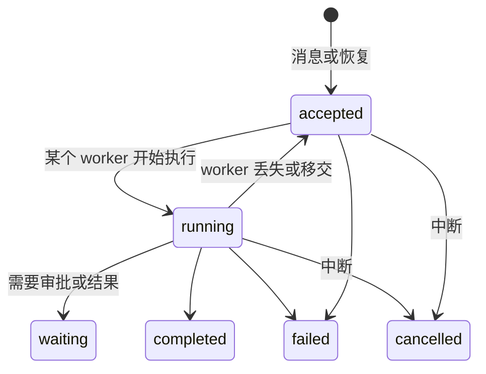
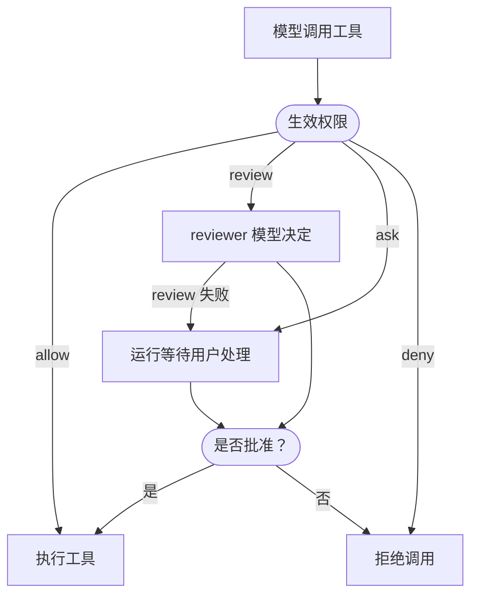
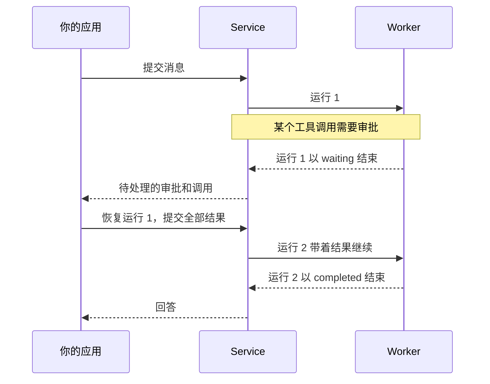

**Agent** 是有名称的资源，其配置（模型、指令、工具和策略）保存为不可变、带编号的**修订版本** 。用户和应用在**会话**中与 agent 对话。会话包含一个或多个 **线程** ，每个线程是一段独立推进的历史；发送的消息进入线程**收件箱** ，线程每一次被接收的推进都是一次**运行** 。运行在 worker 上通过一次或多次**执行尝试** 完成，最终状态为 `completed`、`waiting`、`failed` 或 `cancelled`。



下文路径均位于 `/api/v1` 下，作用于请求的[工作空间](http.md#workspace)。读取需要 `read`；启动、引导、恢复和停止运行需要 `run`；修改 agent 需要 `write`。参阅[身份与访问](identity.md#roles)。

## Agent

在 Console 中打开 **Agents → 手动创建**。配置变更创建不可变的修订版本；**版本** 列出这些修订版本，**设为默认版本** 选择之后未固定修订版本的运行所使用的修订版本，新对话和已有对话都适用。**导入 YAML**（位于 **手动创建** 菜单中）和 **导出 Agent** 用于在工作空间之间复制 agent，将每个引用资源匹配到目标工作空间中的资源。

通过 API 使用时，将 `your-model-key` 替换为 `GET /api/v1/models` 返回的模型 key：

```sh
curl -X POST "$A13N_URL/api/v1/agents" \
  -H "Authorization: Bearer $A13N_API_KEY" -H "Content-Type: application/json" \
  -d '{"name": "Support", "description": "Answers product questions",
       "config": {"model": "your-model-key", "instructions": "Be precise and cite sources.", "user_questions": true}}'
```

响应的 `id`（`ap_…`）用于路径和引用；agent 没有 key。

- `POST …/agents/{agent_id}/revisions` 传入 `{config, note?, make_default?}` 和 agent 的 `If-Match`，添加修订版本；除非 `make_default` 为 `false`，否则设为默认。`config` 与当前默认修订版本相同时，不做修改：无论 `make_default` 如何设置，都再次返回该修订版本（`201`），不创建新的修订版本。`POST …/revisions/{revision_id}/set-default` 修改默认修订版本。
- `POST …/agents/validate` 传入 `{config}`，按保存时相同的规则检查配置，返回 `204`。
- `PATCH …/agents/{agent_id}` 修改 `name`、`description` 和 `labels`；`PUT …/avatar` 设置图片。`POST …/duplicate` 从默认或选定修订版本复制 agent。
- `POST …/archive` 阻止 agent 的新运行（`422 disabled`）；已接收的运行会完成。`POST …/unarchive` 取消归档。
- 列表可按 `label`、`q`（名称或描述）、`archived`、`source`（`custom` 或 `builtin`）以及 `skill_id`、`skill_revision_id` 筛选，后两者保留包含引用该 skill 的修订版本的 agent。

内置 [Agent Composer](agent-composer.md)也是 agent，是工作空间中唯一 `source: "builtin"` 的 agent，不能修改或归档。

### Agent 配置

在手动配置页面展开 **工具** 下的工具集，可选择具体工具，并为每个操作设置 **允许**、**询问** 或 **拒绝**。三个权限按钮分别用勾号、手掌和禁止符号表示。

修订版本的 `config` 包含：

| 字段                              | 含义                                                                                                                                       |
| --------------------------------- | ------------------------------------------------------------------------------------------------------------------------------------------ |
| `model`                           | 模型 key。参阅[模型](models.md)。                                                                                                          |
| `model_settings`                  | 模型 API 专属设置，例如推理强度。                                                                                                          |
| `model_characteristics`           | 上下文窗口和上下文管理阈值。                                                                                                               |
| `instructions`                    | 系统指令，最多 256 KiB。                                                                                                                   |
| `toolsets`                        | 内置工具集及各工具的启用状态、配置和权限。参阅[工具与连接](tools.md#built-in-toolsets)。                                                   |
| `skills`                          | Skill 及其固定修订版本，`[{skill_id, revision_id}]`。参阅 [Skill](skills.md)。                                                             |
| `connection_tools`                | 连接及其工具。参阅[在 agent 中使用连接](tools.md#use-a-connection-in-an-agent)。                                                           |
| `client_tools`                    | 应用执行的工具；参阅[客户端工具](#client-tools-and-questions)。                                                                            |
| `user_questions`                  | 提供 `ask_user_question` 工具。                                                                                                            |
| `subagents`, `subagent_mode`      | 可委派的其他 agent；参阅[子 agent](#subagents)。                                                                                           |
| `reviewer`                        | 按 key 指定 reviewer 模型，决定权限为 `review` 的调用。                                                                                    |
| `media_understanding`             | 按 key 指定为 agent 读取图片、视频或音频的模型；参阅[媒体理解](models.md#media-understanding)。                                            |
| `plugins`                         | 部署已安装的 Harness 插件实例（`plugins.keys`）。                                                                                          |
| `output_spec`                     | 结构化输出：一个 JSON Schema，或 2–32 个命名 `variants`。未设置时结果为文本。                                                              |
| `retries`                         | 模型重试失败工具调用（`tools`）和无效输出（`output`）的次数，各为 0–100。                                                                  |
| `default_environment_template_id` | 用于为每个新线程创建独立主环境的[环境模板](environments.md#templates)。                                                                    |
| `lazy_environment`                | 默认 `true`：首次使用时准备挂载。设为 `false` 可在首次模型请求前准备全部挂载，参见[环境](environments.md#mount-environments-on-a-thread)。 |
| `memory_mounts`                   | 新线程首次接收运行时挂载的[记忆](memory.md#mount-a-memory-on-a-thread)，`[{name, memory_id, access}]`。                                    |

保存时按工作空间验证完整配置：每个引用的模型、skill、连接、provider 和 agent 必须存在且可由你使用，否则对应字段以 `invalid_argument` 拒绝；没有 `revision_id` 的 skill 和子 agent 引用会固定到当前默认修订版本。因此修订版本保留其配置以及 skill 和子 agent 的固定修订版本；它引用的模型、连接、provider 和模板是实时资源，每次使用时重新解析。

### 工具权限

每个内置工具、连接工具和客户端工具都有权限：

| 权限      | 作用                                                                                                                                   |
| --------- | -------------------------------------------------------------------------------------------------------------------------------------- |
| `allow`   | 模型调用时执行工具。                                                                                                                   |
| `ask`     | 运行[等待](#waits-approvals-and-questions)用户批准或拒绝调用。                                                                         |
| `review`  | `reviewer` 模型批准或拒绝；默认 `on_error: approval_required` 下，review 失败会转交用户。使用 `review` 的修订版本必须设置 `reviewer`。 |
| `deny`    | 拒绝调用。                                                                                                                             |
| `inherit` | 默认值：使用工具自身的默认权限。该权限为 `allow`，除非工具另行声明，例如配置工具集的写入工具为 `ask`。                                 |



内置工具通过 `toolsets.<toolset>.tools.<tool>.permission` 设置；连接通过 `connection_tools[].permission` 设置，`permissions` 按工具覆盖；客户端工具通过 `client_tools[].permission` 设置（`inherit`、`allow` 或 `deny`）。配置工具集中的写入工具默认 `ask`。

### 客户端工具与问题

客户端工具在修订版本中声明，由你的应用执行：

```json
{
  "client_tools": [
    {
      "name": "open_ticket",
      "description": "Open a support ticket in the customer's CRM.",
      "parameters_json_schema": {"type": "object", "properties": {"title": {"type": "string"}}, "required": ["title"]}
    }
  ]
}
```

模型调用时，运行以 `waiting` 结束，调用出现在 `pending.calls` 中。应用执行调用后，使用结果[恢复](#resume-a-waiting-run)运行。

设置 `user_questions: true` 后，模型可通过 `ask_user_question` 提问。运行等待，`pending.calls` 中包含该调用；通过[恢复](#resume-a-waiting-run)回复指定调用。普通消息留在收件箱中，直到等待被显式解决。

### 子 agent

`subagents` 指定该 agent 可以委派的同工作空间 agent。每条调用边设置 `agent_id`，可选固定 `revision_id` 和模型可见 `description`，以及 `context`（是否传递任务、历史摘要或选定历史，以及共享或隔离任务状态）、`usage_limits`；异步子 agent 还可设置 `environment`。

```json
{
  "subagent_mode": "async",
  "subagents": {
    "researcher": {"agent_id": "ap_...", "description": "Finds and summarizes sources.",
                   "usage_limits": {"request_limit": 20}, "environment": {"mode": "shared"}}
  }
}
```

- **内联**（`subagent_mode: "inline"`，默认值）：委派 agent 在父运行及其尝试内部执行，属于同一运行。内联子 agent 不能回到委派它的 agent，图的深度和大小有上限。`usage_limits` 限制每次委派的请求、token 和工具调用。
- **异步**（`subagent_mode: "async"`）：每次委派在同一会话中启动子线程，使用父运行主体。父 agent 可通过 Harness [委派工具](../a13n-harness/delegation-and-codeact.md#asynchronous-children)检查、等待、引导、取消和继续子 agent。子结果以 `child_result` 收件箱条目到达，引导活跃父运行或启动下一次运行；收件箱已满时投递重试。对于等待用户的子运行，父运行的委派工具报告其状态为 `running`。异步调用边只使用 `usage_limits.request_limit`。

异步子 agent 的环境遵循调用边配置：`shared`（默认）挂载父运行环境，`dedicated` 根据 `template_id` 预留新环境，`none` 不挂载。子 agent 自身的 `default_environment_template_id` 不生效。一次运行最多启动 `worker.child_count` 个子 agent，嵌套最多 `worker.child_depth` 层。

## 开始对话

`POST …/threads` 携首条消息创建线程；未提供 `session_id` 时同时创建新会话。需要 `Idempotency-Key`：

```sh
curl -X POST "$A13N_URL/api/v1/threads" \
  -H "Authorization: Bearer $A13N_API_KEY" -H "Content-Type: application/json" \
  -H "Idempotency-Key: 9f0c7c1e-2b1f-4a3e-8f53-5d7c0c1c9a10" \
  -d '{"agent_id": "ap_...",
       "payload": {"content": [{"type": "text", "text": "Summarize the attached report."},
                               {"type": "asset", "asset_id": "ast_..."}]},
       "options": {"labels": {"customer": "acme"}}}'
```

响应（首次 `201`，重放 `200`）为 `{thread, entry, run}`：新线程、保存消息的收件箱条目，以及启动的运行；暂时无法启动时 run 为 `null`。新线程还接受：

- `message_history`：可选的[导入对话上下文](#import-conversation-context)，仅用于初始化此线程；
- `mcp_headers`：MCP 连接的[调用方请求头](#caller-headers)；
- `environments`：初始[环境挂载](environments.md#mount-environments-on-a-thread)，`[{name, environment_id, working_directory?}]`；
- `memories`：初始[记忆挂载](memory.md#mount-a-memory-on-a-thread)，`[{name, memory_id, access}]`。

`POST …/sessions` 创建空会话，供后续作为 `session_id` 使用。`GET …/sessions` 列出会话，包含最新运行的 `preview`，可按 `q`（会话或线程 ID）、`agent_id`、`status`、`trigger`、`updated_after`、`updated_before` 和 `label` 筛选。`GET …/threads?session_id=…` 列出会话线程，`PATCH` 修改会话和线程的 `labels`。

会话按最近更新时间排列：新运行或标签编辑会将会话移到顶部。接收运行不改变会话 `ETag`，因此后续运行开始前读取的标签编辑 `If-Match` 仍适用。

Console 中，**会话 → 新建会话** 启动会话；agent 页的 **试用 Agent** 从该 agent 启动会话。

### 导入对话上下文

要继续 Service 外部产生的对话，在新线程请求中与当前 `payload` 一起添加 `message_history`：

```json
{
  "agent_id": "ap_...",
  "message_history": [
    {"kind": "request", "parts": [{"part_kind": "user-prompt", "content": "We are planning a trip to Kyoto."}]},
    {"kind": "response", "parts": [{"part_kind": "text", "content": "How many days will you stay?"}]}
  ],
  "payload": {"content": [{"type": "text", "text": "Three days. Suggest an itinerary."}]}
}
```

这些是 Pydantic AI 对话消息，而不是粘贴到当前提示词的文本。请求部分接受 `user-prompt` 文本（也接受字符串列表或原生 `TextContent` 对象）和 `tool-return`；响应部分接受 `text` 和 `tool-call`。历史工具调用使用 `tool_name`、`tool_call_id` 和 `args`（JSON 对象、编码对象的 JSON 字符串，或 null）；对应返回使用相同名称和 ID，以及 JSON `content` 和可选 `outcome`（默认 `success`，也可为 `failed`、`denied`、`interrupted`）。下一条响应、新用户提示或导入结束前，每次调用都必须有匹配返回。历史工具无需安装，也不会执行。

导入最多 256 条消息、256 KiB 规范化 JSON。不接受系统指令、媒体或暂停中的执行。指令请用 agent 配置，附件请放入当前 payload。原生时间戳、provider 字段和 usage 可以导入，但不计入 Service 用量。应用元数据以及消息中的 `run_id` 和 `conversation_id` 保留供回读，初始化执行前会清除；它们不能声称 Service 已消费输入，也不能赋予权限。

OpenAPI 和生成客户端将此字段表示为 JSON 对象，不重复 Pydantic AI 类型层级。已经使用 Pydantic AI 的 Python 用户可以直接序列化已完成的文本与工具历史；Service SDK 无需依赖 Pydantic AI：

```python
import json
from pydantic_ai.messages import ModelMessage, ModelMessagesTypeAdapter

def history_json(messages: list[ModelMessage]) -> list[dict]:
    return json.loads(ModelMessagesTypeAdapter.dump_json(messages))
```

将所得数组作为 `message_history` 传入。它必须满足以上导入限制，并非所有 Pydantic AI 历史都可导入。线程回读保留提交的 JSON 值，不插入省略的时间戳或其他原生默认值。同一幂等 key 重复提交相同请求会重放原结果。

线程保留不可变导入内容供回读，但不会据此生成历史运行、显示项、工具执行或用量。后续消息从已提交检查点继续，不再次导入；分叉继承该检查点。已有线程的历史不能替换。

## 提交消息

`POST …/threads/{thread_id}/inbox` 向线程添加消息。与新线程请求使用相同 `agent_id`、`payload` 和 `options`，需要 `Idempotency-Key`，返回 `{thread, entry, run}`。

消息的 `payload.content` 包含 1–32 个部分：

| 部分                                 | 内容                                                                                                   |
| ------------------------------------ | ------------------------------------------------------------------------------------------------------ |
| `{"type": "text", "text": ...}`      | 最多 65,536 个字符。                                                                                   |
| `{"type": "asset", "asset_id": ...}` | 工作空间[资产](files-and-webhooks.md#assets)，按提交者权限读取。                                       |
| `{"type": "url", "url": ...}`        | HTTP(S) URL。由 Service 按[出站策略](configuration.md#outbound-requests)获取，模型 provider 不会获取。 |
| `{"type": "json", "value": ...}`     | 结构化输入，最多嵌套 32 层。                                                                           |

被拒绝的 URL 会让对应收件箱条目失败。无法访问的 URL 或临时响应可在运行尝试额度内，由其他尝试重试。

`agent_revision_id` 固定修订版本；否则运行使用启动时 agent 的默认修订版本。`delivery` 决定有活跃运行时如何处理消息：

- `steer`（默认）在同一 agent 且未固定修订版本、或固定的修订版本与该运行相同时，于下一次模型请求加入当前运行。没有 `options` 的引导消息沿用运行启动选项；提供 `options` 时仅在选项相同的情况下加入。否则等待后续运行。
- `next_run` 始终等待下次运行。

线程空闲时，两种 delivery 都立即启动运行（trigger 为 `input`）。此前等待的消息在线程空闲后按收件箱顺序启动运行（trigger 为 `queued`）。

以下情况线程不接收新运行：

- 已有活跃运行；
- 最后一个运行因任一 pending 项处于 `waiting`，包括问题；必须先恢复该精确运行；
- 最近运行 `failed` 或 `cancelled`：排队消息等待，只有此刻新提交的消息会启动运行。该运行结束后，收件箱按顺序继续。

无法执行的消息，例如 agent 已归档或覆盖设置不再有效，会原地以 `failure` 失败，不阻塞后面的消息。

归档工作空间会停止执行：排队或新提交条目原地以 `disabled` 失败；已经执行的运行在 worker 下次刷新权限时以 `authority_revoked` 失败，最多等待 `worker.authority_seconds`。

### 附件

资产或 URL 内容以三种方式之一提供给模型：

- 如果运行模型在[能力](models.md)中声明对应理解能力（`image_understanding`、`audio_understanding`、`video_understanding` 或 `document_understanding`），JPEG、PNG、GIF、WebP 图片、常见音视频或 PDF 会以原生格式发送。SVG、TIFF、Word、Excel 等其他格式不原生发送，因为各 provider 支持情况不同。
- 最多 64 KiB 的文本文件直接作为文本提供：包括 `text/*`（纯文本、Markdown、CSV 等），以及 JSON、XML、YAML、JavaScript。URL 文本按声明字符集解码。运行没有环境时，URL 中较长文本截取前 64 KiB，并告知模型已截断。
- 其他文件，例如归档、模型无法读取的 PDF 或较大文本，会写入运行主环境（`workspace` 挂载）的 `/workspace/.a13n/attachments/`；文件名缩短到 200 字节，移除控制字符和 `/`。模型获得路径、名称、媒体类型和大小，使用文件与 shell 工具处理。同一文件在后续消息或重试中再次附加时，只写一次，除非运行修改了副本大小。文件只存在于该环境，因此线程替换主环境或分叉使用新环境后，不再拥有它。

无法通过任一方式处理文件时，消息返回 `400 invalid_argument`，原因为 `environment_required`，并给出该部分的 `field`（例如 `content.1.asset_id`）和文件 `media_type`。请给 agent 配置[环境模板](environments.md)、在线程挂载环境，或选择理解该媒体的模型。编辑排队消息时和运行启动时都会检查。URL 类型仅在获取后确定，无法读取的非文本 URL 会在此时让条目失败。环境拒绝写入文件时，条目以 `invalid_argument` 失败；其他引导消息继续处理。

### 管理排队消息

`GET …/threads/{thread_id}/inbox` 列出条目，`GET …/inbox/{entry_id}` 读取单条，包含 `status`：`pending`（排队）、`assigned`（已分配运行）、`consumed`、`failed` 或 `withdrawn`。修改 pending 条目需要**线程** 的 `If-Match`：

- `PATCH …/inbox/{entry_id}` 编辑自己 pending 消息的 `delivery`、`payload`、`agent_revision_id`（`null` 取消固定）或 `options`。
- `DELETE …/inbox/{entry_id}` 撤回 pending 条目。删除标记保留幂等 key。
- `PUT …/inbox/order` 传入 `{"entry_ids": [...]}` 重排 pending 条目；列表必须恰好包含全部 pending 条目。

任何有 `run` 权限的人都可撤回和重排。线程最多有 `control.inbox_count` 个 pending 和 assigned 条目，总大小受 `control.inbox_bytes` 限制；超过后提交返回 `429 rate_limited`。Console 在 **排队消息** 显示这些条目，并将运行进行中输入的消息作为引导消息（`steer`）发送。

### 单次运行选项

`options` 应用于该消息启动的运行：

- `labels` 成为运行标签，之后可用 `PATCH …/runs/{run_id}` 修改。
- `max_usage.requests`（1–10,000）限制运行模型请求数；需要更多时以 `usage_limit_exceeded` 失败。
- `overrides` 只覆盖本次运行的修订配置。`toolsets` 替换整个工具集；`retries` 和每条 `subagents` 调用边只修改指定字段，`null` 调用边会移除；`model`、`model_settings`、`model_characteristics`、`instructions`、`lazy_environment`、`skills`、`connection_tools`、`client_tools`、`plugins`、`reviewer`、`media_understanding` 和 `output_spec` 替换修订版本值。提交时和运行启动时按保存配置的规则验证结果，再固定到运行中。

```json
{"options": {"max_usage": {"requests": 40},
             "overrides": {"model": "claude-opus-4-6", "instructions": "Answer in German."}}}
```

恢复或子结果沿用前一运行的选项。在 Console 中，**运行选项** 为下次运行设置模型、指令覆盖、媒体理解、固定修订版本及其他配置。

## 调用方请求头

线程可通过 HTTP 请求头向 MCP 连接传递非凭据上下文，例如租户或对话 ID。创建线程时设置 `mcp_headers`，或使用 `PATCH …/threads/{thread_id}` 和线程的 `If-Match` 修改：

```json
{"mcp_headers": {"conn_...": {"x-tenant-id": "acme"}}}
```

每个 key 必须是工作空间中已启用的 MCP 连接。最多 32 个连接，名称和值合计 16 KiB；不允许 `authorization`、传输和协议请求头，以及连接自身认证使用的名称。每次运行在被接收时固定线程请求头，分叉和异步子 agent 继承它们。运行视图不显示这些值。

## 等待、审批与问题

需要外部信息的运行以 `waiting` 结束。`pending.approvals` 列出执行审批，`pending.calls` 列出外部结果，包括用户问题和自定义人工操作工具。`wait_reason` 将这些组概括为 `approval`、`call` 或 `multiple`：

```json
{
  "status": "waiting",
  "wait_reason": "approval",
  "pending": {
    "approvals": [{"tool_call_id": "call_delete", "tool_name": "delete_file", "arguments": {"path": "report.txt"}, "presentation": null}],
    "calls": []
  }
}
```



### 恢复等待中的运行

应用负责收集和保存答案、允许修改、协调审批人，以及决定何时恢复执行。Service 只接受完整批次，不保存部分答案，也不决定应用的审批流程何时结束。

提交一个完整批次，指定精确的等待运行和全部 pending call ID：

```bash
curl -X POST "$A13N_URL/api/v1/runs/$RUN/resume" \
  -H "Authorization: Bearer $A13N_API_KEY" \
  -H "Idempotency-Key: resume-1" \
  -H "Content-Type: application/json" \
  -d '{"approvals": {"call_delete": {"action": "deny", "reason": "Keep the file"}}, "calls": {}}'
```

审批值为 `{ "action": "approve" }` 或 `{ "action": "deny", "reason": "..." }`。调用结果为 `{ "status": "returned", "value": ... }` 或 `{ "status": "failed", "message": "..." }`。返回值可以是任意 JSON；显式失败成为 agent 可处理的工具失败，不一定导致运行失败。

用户问题的返回值包含结构化回答或自由文本：

```json
{
  "approvals": {},
  "calls": {
    "call_question": {
      "status": "returned",
      "value": {"response": "Up to 200 dollars per night."}
    }
  }
}
```

结构化值可以是 `{"answers": {"Which color?": "blue"}}`；多选回答使用数组。Service 使用 Harness 验证器按该调用的精确问题校验。要主动跳过问题，对该调用发送 `{"status": "failed", "message": "User chose not to answer"}`。

两个结果映射都是必填项，且必须完整覆盖对应的待答集合。缺少结果、未知 ID 或类别错误都会拒绝整个请求，等待状态不变。没有默认回答，也不接受部分提交。在 Console 中检查所有待处理项，然后提交完整结果；**跳过反馈继续** 在确认后显式提交拒绝和失败结果。

响应为后继运行（首次 `201`，幂等重放 `200`）。结果保存在其已有 `resume` 字段，不创建额外收件箱消息。只能恢复线程的最后一个运行，且它处于等待、没有其他运行活跃；过期请求返回 `409 conflict`，原因为 `not_idle_waiting_head`。后继运行失败后，它与其他运行一样成为线程历史，等待随之结束：下一条消息从它继续，它未得到结果的调用显示为已中断。

要随结果补充说明或附件，在同一恢复请求中包含可选 `input`：

```json
{
  "approvals": {},
  "calls": {"call_lookup": {"status": "returned", "value": {"available": true}}},
  "input": {"content": [{"type": "text", "text": "Use the updated delivery address."}]}
}
```

`input` 接受与 `payload` 相同的内容部分。整个恢复请求一并接受或拒绝，保存在后继运行中，不创建额外收件箱条目。模型先收到工具结果，再收到附带用户内容。恢复过程保留内容且不重复。资产必须在工作空间中可用，且可由继承配置读取。无法落地的 URL 或文件会使后继运行失败，不会悄悄丢弃补充说明。完整恢复请求体最多 256 KiB。

附带输入不能替代任何必需结果。普通收件箱消息仍然独立，不能结束等待。排队消息保留顺序；恢复后，兼容的 steer 可以加入后继运行，`next_run` 消息等待后续运行。

## 中断、分叉与归档

- **中断：** `POST …/runs/{run_id}/interrupt` 取消运行。尚未启动的运行立即变为 `cancelled`；执行中的运行在下一个安全点停止，此前显示 `cancel_requested_at`。中断已取消运行会返回该运行；已完成、等待或失败运行返回 `409`（`run_completed` 等）。Console 的 **停止** 中断当前运行。
- **分叉：** `POST …/runs/{run_id}/fork` 在同一会话中创建新线程，其首次运行携新消息（与提交请求体相同）从任一已结束运行继续，需要 `Idempotency-Key`。等待运行的分叉会在新分支处理新消息前，自动拒绝审批并将其他调用标为无响应。原始等待不变。分叉共享源线程环境挂载，除非 `fresh_environments` 为 `true`，`environments` 可添加更多挂载。它复制源线程记忆挂载，`memories` 可添加更多。分叉失败或取消的运行时，从其最后一个检查点继续，未完成的工具调用标为已中断。
- **归档：** `POST …/threads/{thread_id}/archive` 使用线程 `If-Match` 永久结束线程：撤回 pending 消息，移除挂载，中断活跃运行。历史仍可读取。

每个已结束运行都是其线程继续的历史，与结果无关。失败或取消运行之后，下一个运行从它的最后一个检查点继续；若它在首个检查点前失败，则从它开始时的状态继续。它未完成的工具调用显示为已中断，不会再次执行。如果失败由历史本身导致，例如模型服务拒绝该历史，请改为分叉更早的运行。

## 结果

读取 `GET …/runs/{run_id}` 并根据 `status` 处理。完成运行包含 `output`（文本或符合 `output_spec` 的 JSON）；等待运行包含 `pending`；失败运行包含 `failure {code, message}`。运行配置、血缘、挂载和时间戳请参阅 [API 参考](api-reference/index.md)。

- `GET …/threads/{thread_id}/runs` 按从新到旧列出线程运行。`last_run_id` 是最后结束的运行，下一个运行从它的历史继续；`current_run_id` 是活跃运行。
- `GET …/runs/{run_id}/items` 按顺序返回运行显示项（文本、推理消息、工具调用和观测），每项带 `ordinal`，并包含 `position`、可选 `resume_after` 和 `complete`。默认返回最新的 `limit` 项（默认 200，最多 500）；以首项的 ordinal 作为 `before` 可读取更早的项，以 `after` 可从某个 ordinal 往后读取。运行结束时尚在进行的项显示为 `interrupted`。
- 超过 32 KiB 的展示字段单独保存，每个字段最多保留压缩前 16 MiB 的 UTF-8 内容。超限时只保留文本前缀并标记 `truncated=true`，超限 JSON 也会转为文本前缀。Item 的 `content_refs` 按字段名提供正文引用，包含 `id`、已保存字节数 `size_bytes`、`media_type`、`truncated` 和短预览 `preview`。通过 `GET …/runs/{run_id}/contents/{content_id}` 读取已保存内容，需要相同的工作区读取权限。Console 提供“展开全文”入口；超限时改为“展开已保存内容”，并提示内容已截断。被丢弃的后续内容和旧版已截断记录无法据此恢复。此上限不改变 Agent 执行状态，实时 delta 仍保留原有大小限制。
- `GET …/runs/{run_id}/lineage` 返回运行及其祖先，可跨分叉，按最近到最远排列。
- `GET …/runs/{run_id}/attempts` 列出执行尝试及其 `start_reason`（`initial`、worker 丢失后的 `recovery`、worker 关闭时的 `handoff`）和结果。非 handoff 尝试达到 `max_attempts` 后运行失败。

失败运行的 `failure.code` 指出原因，例如 `usage_limit_exceeded`、`environment_unavailable`、校验错误码或 `attempt_failed`。

## 跟踪线程事件流

`GET …/threads/{thread_id}/stream` 是线程实时输出的 server-sent event 流：

```sh
curl -N "$A13N_URL/api/v1/threads/$THREAD/stream" -H "Authorization: Bearer $A13N_API_KEY"
```

| 事件       | 数据                                       | 含义                                                                                                   |
| ---------- | ------------------------------------------ | ------------------------------------------------------------------------------------------------------ |
| `delta`    | `{run_id, attempt, sequence, event, item}` | 活跃运行的一个 [AG-UI](https://docs.ag-ui.com) 事件及其修改的显示项（`{id, kind, state}` 或 `null`）。 |
| `boundary` | `{run_id, attempt, sequence}`              | 运行提交了检查点；显示项现在覆盖截至此处的全部内容。                                                   |
| `changed`  | `{version}`                                | 线程变化（运行开始、结束或收件箱变化）；请重新读取线程。                                               |
| `reset`    | `{run_id}`                                 | 运行进入新尝试；丢弃实时输出并重新读取显示项。                                                         |
| `gap`      | `{run_id}`                                 | 跳过了实时输出；请重新读取运行显示项。                                                                 |

事件流是临时观测，运行显示项才是持久记录。渲染线程时：

1. 对活跃运行读取 `GET …/runs/{run_id}/items`。
2. `position` 非 null 时，用 `?run=<run_id>&position=<position>` 打开事件流，并将非 null 的 `resume_after` 作为 `Last-Event-ID` 请求头。
3. 没有已保存位置时，不带游标打开事件流，进行保留事件回放。
4. 应用 `attempt` 和 `sequence` 晚于显示项 `position`（`"{attempt}-{sequence}"`）的 `delta` 帧。
5. 收到 `reset` 时，丢弃被替代的临时输出并重读显示项。收到 `gap` 时，重读显示项，将位置与 gap 的可选 `position` 比较：只有缺失范围被覆盖后才清除 gap，否则等待新检查点或终态。收到 `changed` 时重读线程。
6. 连接时及运行仍活跃期间定期检查运行：订阅前已经结束的运行可能不会再发送通知。封存后读取最终显示项。

重连时保留显示数据，发送最后连续应用的位置及匹配的恢复提示，并对重叠投递去重。提示缺失或过期时会回退到保留事件回放；这本身不表示输出丢失。页面刷新后先加载显示项。不能跨过 gap 推进位置。实时输出的保留量有限；合并和保留限制参阅 [worker 设置](configuration-reference.md#worker)。

`delta` 和 `boundary` 帧携带 SSE `id`。未提供运行和 position 的读取方可将最后 ID 放入 `Last-Event-ID` 重连，游标缺失时报告 `gap`。提供运行和 position 的读取方只在必需序列缺失或传输失败时收到 gap。请重新加载显示项，在后续 boundary 或运行封存时重新评估覆盖。Service 每 15 秒发送 keep-alive 注释，工作空间访问权限结束时关闭事件流。帧 JSON Schema 位于 `proto/a13n-service/thread-stream.schema.json`。

## 用量

每次模型请求记录 token 数量和模型价格快照。`GET …/usage` 按模型汇总：

```sh
curl "$A13N_URL/api/v1/usage?thread_id=$THREAD" -H "Authorization: Bearer $A13N_API_KEY"
```

```json
{"models": [{"model": "gpt-5.5", "requests": 12, "input_tokens": 48210, "output_tokens": 3104,
             "cache_read_tokens": 30112, "cache_write_tokens": 0, "cost": "0.0931"}]}
```

每条记录的 `model` 是模型 key；未归属模型的记录为 `null`。可按 `run_id`、`thread_id`、`session_id` 和 `ingested_after`/`ingested_before` 筛选。某模型没有任何已计价记录时，`cost` 为 `null`。运行的 `usage_at_seal` 是结束时的用量；延迟到达的报告仍计入 `/usage`。

## Trace

配置 trace 后端后（`telemetry.trace_backend`，参阅[日志、指标与 trace](configuration.md#logs-metrics-and-traces)），每次尝试导出 Harness span，工作空间可以查询。Console 在 **Traces** 中显示。

- `GET …/runs/{run_id}/attempts/{attempt_id}/trace` 列出尝试的 span，包括内联子 agent。
- `GET …/traces` 列出根 span，每次尝试一个，可按 `session_id`、`thread_id`、`run_id`、最多 8 个 `attribute=key:value`，以及 `started_after`/`started_before` 筛选（默认最近一天，最多 31 天）。游标绑定所提供的全部筛选条件，包括时间窗口：下一页修改 `started_after` 或 `started_before` 会返回 `invalid_cursor`；后续页保留第一页解析出的窗口。
- `GET …/traces/{trace_id}` 返回根 span，`…/spans` 返回其 span，每项包含名称、类别、时间、状态、模型、用量、成本、输入、输出和属性。
- `GET …/trace-backend` 返回后端 `type`（没有时为 `null`）和 `queryable_since`。

查询仅返回工作空间的 span。没有后端时返回 `503 unavailable`。Span 包含多少内容由 `telemetry.trace_content` 决定。
