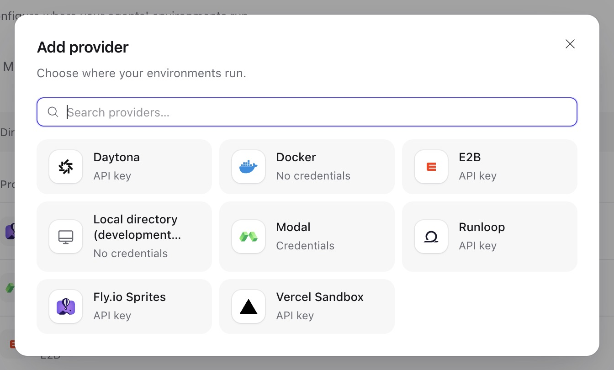

环境是 agent 工作的计算机，文件和终端工具都在那里执行。Service 提供两种环境：

- **托管环境：** Service 根据**模板** 创建、启动、停止和删除，例如为每个线程创建一个 Docker 容器。
- **外部目标：** 由你自行运行 `a13n-envd` 守护进程的计算机，Service 只负责连接。

线程**挂载** 环境。每次运行在被接收时固定线程挂载，并一直使用到结束。没有挂载环境时，agent 没有文件或终端工具。

Console 的 **Environments → Templates** 管理模板，**Environments → Instances** 列出环境；provider 位于 **Workspace settings → Providers → Environment** 。下文所有 API 路径均位于 `/api/v1` 下。

## 工作空间自动配置

挂载 Docker socket 的单机 Compose 部署在 Engine 可访问时，为每个工作空间自动添加 **Docker** provider 和 **Linux Sandbox** 模板。模板固定使用[Service 审定的独立版本 sandbox 镜像](#docker-image-versions)，并设置 `pull_policy: if_missing`。如果本地没有镜像，Engine 在创建首个实例时拉取；工作空间初始化不会拉取镜像。Linux 镜像包含 Python 3.13、pip、venv、uv、Node.js 24、npm、pnpm、Git、Bash、curl、ripgrep、jq、归档工具和 C/C++ 构建工具。命令以 `sandbox` 用户运行，可写目录为 `/workspace` 和 `/tmp/a13n`。项目依赖可以安装到虚拟环境或项目目录中。

新工作空间要使用本地构建镜像，运行 `make image-sandbox`，启动 Compose 时设置 `A13N_DOCKER_ENVIRONMENT_IMAGE=a13n-sandbox:local`。已有模板请在 Console 或 API 中修改；自动配置不会在初始化后替换它。

不挂载 socket 的快速入门配置不会启用 Docker 自动配置。源码开发时，`make dev` 显式启用 **Local**，并创建根目录为该检出目录 `var/dev/environments` 的 **Local Workspace** 模板。后续每个环境获得独立子目录。Local 直接以 Service 进程的操作系统用户身份运行命令，不提供隔离。

Local 和 Docker 自动配置默认关闭；可在 [Service 设置](configuration.md#workspace-provisioning)中启用。`all` 角色在创建工作空间和启动时补建缺失的默认资源。设置失败时，修复 Engine 访问并重启。成功设置会保留后续修改、禁用和删除结果。它只创建 provider 和模板：请预留环境，或设置 agent 的 `default_environment_template_id`。

## Provider

环境 provider 是运行环境所用的账号。像其他 [provider](resources.md#providers) 一样，在 `/api/v1/environment-providers` 中创建。`GET /api/v1/provider-types/environment` 返回各类型的配置、凭据和 recipe schema。



*图中使用 Seed 示例工作空间；Local directory 仅在设置 `provisioning.local.enabled` 时出现，该设置用于开发。*

| 类型      | 环境                              | 账号                                                                                                            | 停止行为                   |
| --------- | --------------------------------- | --------------------------------------------------------------------------------------------------------------- | -------------------------- |
| `docker`  | 容器                              | `docker_host`，可指定出站端点策略允许的远程 `tcp://host:port` 或 `https://host:port` Engine。无需凭据。         | 停止容器                   |
| `e2b`     | E2B 沙箱                          | 无配置；凭据为 `{"api_key": ...}`。账号始终使用 E2B 云。Recipe 的 `timeout_seconds` 至少为 300。                | 暂停，保留内存和文件       |
| `daytona` | Daytona 沙箱                      | `organization_id`、可选 `target` 区域；凭据为 `{"api_key": ...}`                                                | 停止，保留文件             |
| `modal`   | Modal 沙箱                        | `workspace`、`app_name`（托管沙箱的已部署 App）、可选 `environment_name`；凭据为 `{"token_id", "token_secret"}` | 保存文件快照后终止         |
| `vercel`  | 持久化 Vercel 沙箱                | `team_id`、`project_id`；凭据为 `{"api_key": ...}`（Vercel access token）                                       | 停止，保留文件             |
| `sprites` | Fly.io Sprites                    | `organization`；凭据为 `{"api_key": ...}`                                                                       | 不支持；Sprites 空闲时休眠 |
| `runloop` | Runloop devbox                    | `organization`；凭据为 `{"api_key": ...}`                                                                       | 挂起，保留文件             |
| `local`   | Worker 宿主机上的目录，供开发使用 | 仅在 `provisioning.local.enabled` 启用时提供。命令直接在 worker 宿主机执行，不构成隔离边界。                    | 无需停止                   |

Docker provider 默认使用运维人员设置的 `environments.docker_host`；provider 单独设置的 `docker_host` 必须是[出站策略](configuration.md#outbound-requests)允许的远程 TCP 或 HTTPS Engine。访问 Docker Engine 等同于获得宿主机级权限。模板只能绑定 `environments.docker_mount_roots` 下的宿主机目录（默认不允许任何目录）；不支持特权容器和宿主机命名空间。请在 Engine 上限制 CPU、内存和进程用量。[Compose 部署](https://github.com/converge-ai-labs/agent-foundation/tree/main/deploy/docker/compose)连接宿主机 Engine；Kubernetes chart 不包含 Engine。

云托管类型访问厂商固定的 API：账号指定组织、团队、工作空间或应用，不指定主机。沙箱费用计入该账号。Service 会在厂商终止前续期，维持就绪的 E2B、Modal、Vercel 或 Runloop 沙箱，因此应设置模板空闲策略来控制费用。provider 凭据可能改为另一个无法访问沙箱的账号。此时环境显示失败 `provider_credential_changed`。恢复沙箱所属账号的凭据后，环境重新可用。续期不能突破厂商硬限制：Modal 在 recipe 的 `timeout_seconds`（最多 24 小时）后终止沙箱，环境随后显示丢失；Vercel 在 recipe 的 `timeout_seconds` 后结束沙箱会话，环境变为停止，下次运行会恢复。如果模板的空闲停止先触发，文件会保留。所有 recipe 字段请参阅 [provider 配置](../environments/configuration-reference.md)。

只有 Docker provider 可以测试（`POST …/{provider_id}/test`）：Engine 响应一次 ping。远程 Engine 无法解析时，失败消息为 `provider_unavailable`；只有策略拒绝时才返回 `provider_endpoint_denied`。

## 模板

模板描述如何构建托管环境，以及何时停止和删除空闲环境。模板属于工作空间，创建和修改需要 `write`。此示例使用 Docker provider；将 `eprov_...` 替换为其 ID。

```sh
curl -X POST "$A13N_URL/api/v1/environment-templates" \
  -H "Authorization: Bearer $A13N_API_KEY" -H "Content-Type: application/json" \
  -d '{"name": "Python sandbox", "provider_id": "eprov_...",
       "config": {"recipe": {"cpus": 2, "memory_gb": 4},
                  "stop_after_seconds": 1800, "delete_after_seconds": 604800}}'
```

- `provider_id` 指定工作空间中的环境 provider，`config.recipe` 按该类型的 recipe schema 校验。Docker 中可设置 `image`、宿主机目录 `mounts`（源目录必须位于 `environments.docker_mount_roots` 下）、`environment` 变量、`init_script`、`disable_network`、`user` 和资源限制；参阅 [`DockerEnvironmentConfiguration`](../environments/configuration-reference.md#dockerenvironmentconfiguration)。Recipe 被拒绝时，会指出无效字段，不会返回提交的值。
- `stop_after_seconds`（默认 1800，范围 60–2,592,000）停止在指定时间内未被运行使用的环境。`delete_after_seconds`（60–31,536,000）删除在指定时间内未被运行使用且没有线程挂载的环境。设为 `null` 可关闭对应策略。两者均从最后使用时间计起。
- `PATCH` 使用模板的 `If-Match` 修改名称、描述、provider、config 和标签。新 provider 或 recipe 仅影响之后创建的环境：环境使用创建任务派发时的模板构建，并保留该 recipe。空闲策略始终使用当前设置。
- `PATCH {"enabled": false}` 阻止从该模板创建新环境；`{"enabled": true}` 重新允许。已有环境仍可使用。

要让 agent 的每个根线程都有自己的环境，设置 agent 的 `default_environment_template_id`。没有 `workspace` 挂载的线程的运行被接收时，Service 根据该模板预留新环境，并以 `workspace` 名称挂载。 此时状态为 `reserved`，不创建厂商资源，也不排队创建操作。默认使用懒加载，未使用环境的纯文本运行可直接完成。保留记录仍计入托管环境额度；Control 不会主动创建它。

### Docker 镜像版本

不设置 `recipe.image` 时，使用 Service 审定的 `ghcr.io/converge-ai-labs/a13n-sandbox` 版本。sandbox 版本由 Envd 管理，不跟随 Service 版本号：

| Service 构建                            | 镜像标签 |
| --------------------------------------- | -------- |
| 稳定版或 RC                             | `0.1.3`  |
| 源码（`0.0.0`，包括本地后缀）或 `.devN` | `dev`    |

发布镜像支持 `linux/amd64` 和 `linux/arm64`。显式设置 `recipe.image` 可在 Service 升级后保留指定标签，也可用 digest 固定精确内容。Docker recipe 默认 `pull_policy: if_missing`：Engine 优先使用本地镜像，缺失时拉取。设置 `never` 可要求镜像必须在本地。自动配置的模板显式保存审定的 sandbox 镜像，因此后续 Service 升级不会悄悄修改它。

每个实例在首次创建前保存解析后的镜像；升级和中断后的创建仍使用该镜像。没有已保存镜像的旧实例保留历史默认值 `a13n-docker-environment:dev`；删除旧镜像前请重新创建这些实例以完成迁移。要使用新镜像或修改后的模板，请创建新环境。

## 实例

`GET …/environments` 列出工作空间环境，可按 `status` 筛选；已删除环境仅在 `status=deleted` 时显示。每个环境都有 `status`：

| 状态                   | 含义                                       |
| ---------------------- | ------------------------------------------ |
| `reserved`             | 已预留，等待首次使用；尚无厂商资源。       |
| `creating`, `starting` | 正在创建或启动。                           |
| `ready`                | 可用。                                     |
| `stopping`, `stopped`  | 停止后保留文件；挂载它的运行会再次启动。   |
| `deleting`, `deleted`  | 正在删除或已删除。已删除环境不能再次使用。 |

`failure` 描述最近失败的操作，包含 `code`、`message`、`certainty`（`not_dispatched`、`known`，或调用可能已生效时的 `unknown`）和 `permanent`。维护任务使用相同操作 ID 重试未完成操作。永久失败会拒绝新挂载和运行，直到原因修复或环境删除。

### 预留托管环境

带模板的 agent 通常自动预留环境。也可以手动创建，例如在线程之间共享：

```sh
curl -X POST "$A13N_URL/api/v1/environments" \
  -H "Authorization: Bearer $A13N_API_KEY" -H "Content-Type: application/json" \
  -d '{"template_id": "envtpl_...", "name": "Shared data"}'
```

需要 `run`，初始状态为 `creating`，后台转为 `ready`。模板空闲策略与其他环境一样适用。一个工作空间最多拥有 `environments.managed_count` 个未删除的托管环境；显式预留或运行接收时超过限制，返回 `409 conflict`，原因为 `environment_limit`。

### 注册外部目标

在目标计算机上通过 HTTP(S) 运行 `a13n-envd` 守护进程，并设置设备 ID 和 token（参阅[连接已有 HTTP 守护进程](../environments/remote-envd.md#connect-to-an-existing-http-daemon)）。然后使用端点和 token 注册：

```sh
curl -X POST "$A13N_URL/api/v1/environments" \
  -H "Authorization: Bearer $A13N_API_KEY" -H "Content-Type: application/json" \
  -d '{"endpoint": "https://build-box.example.com:8443", "token": "...", "name": "Build box"}'
```

注册需要 `write`。端点是守护进程的 HTTP(S) 源；明文 HTTP 仅接受回环地址，且必须符合出站[端点策略](configuration.md#outbound-requests)。Service 查询设备身份并在其上打开 Envd 会话，然后记录 `ready` 环境；未指定名称时使用设备名称。Token 加密存储，永不返回；环境显示 `endpoint` 和 `device_id`。策略拒绝的端点返回 `409 conflict`，原因位于 `endpoint`。守护进程拒绝 token 与无法访问的表现相同：均返回 `503 unavailable`，原因为 `provider_connection_failed`。

后续每次连接都要求相同设备；该端点出现其他守护进程时，以 `provider_device_mismatch` 拒绝，挂载此环境的运行失败。守护进程迁移或 token 变化时，重新发送 token；迁移时也提供新端点：

```sh
curl -X PATCH "$A13N_URL/api/v1/environments/$ENVIRONMENT" \
  -H "Authorization: Bearer $A13N_API_KEY" -H "Content-Type: application/json" -H "If-Match: $ENVIRONMENT_ETAG" \
  -d '{"endpoint": "https://build-box-2.example.com:8443", "token": "..."}'
```

Service 先验证新连接；设备 ID 不同时返回 `409 conflict`，原因为 `provider_device_mismatch`。外部目标是**私有** 的：只有注册它的主体（用户或服务账号）可以挂载，只有该主体或工作空间管理员可以修改、删除。Service 不会停止或删除守护进程所在计算机；删除环境只会忘记 token。

### 停止、重命名与删除

这些操作需要环境的 `If-Match` 和 `write` 权限：

- `PATCH …/environments/{environment_id}` 传入 `{"name": ...}` 重命名；外部目标还接受新的 `token` 和 `endpoint`（见上文）。
- `POST …/stop` 停止没有运行使用的 `ready` 托管环境，并返回 `202`；后续运行再次启动。其他情况返回 `409 conflict`，原因例如 `in_use`、`environment_stopped`、`connect_only`（外部目标）、`stop_unsupported`，或停止可清除的永久失败码，例如 `environment_lost`。
- `DELETE …/environments/{environment_id}` 停用没有活跃运行使用的环境。请先从线程卸载，否则返回 `409 conflict`，原因为 `mounted`。**例外：** 删除永久失败的环境也会移除线程挂载，使配置了默认模板的线程在下次运行时获得新的 `workspace` 环境。未解决的操作返回 `409 conflict`，原因为 `operation_unresolved`。删除托管环境会销毁文件；删除外部目标只会忘记 token，不影响计算机。

`environment_lost` 等永久失败会阻止新使用；请删除环境，或在可行时修复原因。临时失败在重试成功后清除。

## 在线程上挂载环境

线程挂载决定后续运行使用哪些环境：

```sh
curl -X POST "$A13N_URL/api/v1/threads/$THREAD/environments" \
  -H "Authorization: Bearer $A13N_API_KEY" -H "Content-Type: application/json" -H "If-Match: $THREAD_ETAG" \
  -d '{"name": "data", "environment_id": "env_...", "working_directory": "/srv/data"}'
```

- `name` 必须匹配 `^[a-z][a-z0-9-]{0,62}$`。名为 `workspace` 的主挂载对 agent 显示为 `/workspace`，其他挂载显示为 `/mnt/{name}`。`working_directory` 是环境内的起始目录。
- 同一线程内，每个名称和环境只能挂载一次。替换挂载需先删除再添加。
- 一个线程最多 32 个挂载；超过时返回 `409 conflict`，原因为 `mount_limit`。接收运行时仍可在此限制之外，根据 agent 的默认模板添加 `workspace` 挂载。
- 挂载修改使用**线程** 的 `If-Match`，返回线程的新 ETag，需要 `run`，仅影响之后接收的运行；此前接收的运行保留原挂载。`GET …/threads/{thread_id}/environments` 返回挂载和线程 ETag，`DELETE …/threads/{thread_id}/environments/{name}` 移除挂载。
- 新线程和分叉线程通过 `environments` 字段指定初始挂载。分叉默认共享源线程挂载，除非设置 `fresh_environments`。归档线程会移除挂载。
- 多个线程可以同时挂载和使用同一环境。

`AgentConfig.lazy_environment` 默认为 `true`。每个挂载首次使用时，Worker 最多等待 `environments.wait_seconds` 让环境就绪，创建预留目标或启动已停止目标。其他实例持有操作 claim 时，Worker 会等待其发布结果；有实例正在处理不代表已经就绪。输入附件和依赖环境的技能可在调用模型前触发首次使用。未能及时就绪时，本次尝试失败，运行在尝试额度内重试；已无法使用的环境（例如已删除）让运行以 `environment_unavailable` 失败。

将 agent 配置中的 `lazy_environment` 设为 `false`，Service 会在进入 Harness 前创建或启动全部挂载的实例并等待就绪，即使工具不会使用它们。这个开关只控制实例准备时机。Harness 仍在首次实际使用时打开执行连接，并检查操作是否就绪及选定的工作目录。运行未使用某个环境时，就不会打开该环境的执行连接。没有挂载的运行无需准备。通过 `POST …/environments` 显式创建环境的行为保持不变。

消息可以通过以下选项仅覆盖本次运行：

```json
{"options": {"overrides": {"lazy_environment": false}}}
```

省略覆盖值或设为 `null` 时，沿用 agent 修订版本的配置。运行被接收后，重试和后续继续运行保持已接受的配置。异步子运行使用各自 agent 的配置；内联子 agent 共享父运行的环境。

异步[子 agent](agents-and-runs.md#subagents) 按调用边的策略获得环境：共享父运行挂载（`shared`）、根据模板新建（`dedicated`），或不使用环境。

### 复用实例并选择项目目录

在新会话的 **Options（选项）** 中选择 **Reuse existing（复用现有实例）**，可填写 **Working directory（工作目录）**。已有会话的 **Add environment（添加环境）** 表单也提供该字段。留空使用 Provider 默认目录。切换实例会清空上一次选择；会话的环境详情会显示已保存的目录。

目录必须已存在于所选环境内。Local 的 `/projects/app` 映射到 `{模板根目录}/{环境 ID}/projects/app`，不是浏览器所在电脑上的路径。其他 Provider 使用其环境内部的文件路径空间。Service 在首次激活时检查显式选择的目录；目录不存在或不可访问时会报错，不会自动创建目录，也不会将共享实例标记为故障。

两个会话可以在同一实例中使用不同项目目录，也可以主动选择同一目录共享文件。相对文件路径、`/workspace` 路由和命令默认工作目录均使用所选目录。进程、端口、已安装软件及系统权限仍然共享：这用于组织文件，不提供安全隔离。移除挂载不会删除目录；已接受的 Run 保留其捕获的目录选择。
