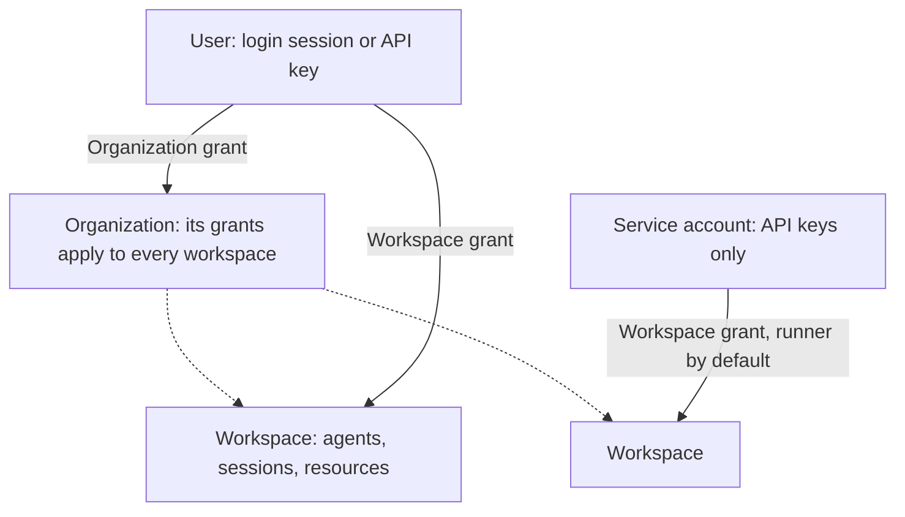

Every request acts as a **principal**: a user, who signs in with an email address and password, or a service account, which exists for applications. Principals receive **roles** through **grants** in an organization or a workspace, and authenticate with a login session or an API key.



## Organizations and workspaces

An **organization** is the administration boundary. It holds its members and its workspaces. A **workspace** is the boundary for work: agents, sessions, providers, models, connections, environments and every other resource belong to exactly one workspace.

[Bootstrap](get-started.md#register-your-administrator-account), in Console on a new Service or with the `bootstrap` command, creates the first organization, its first workspace and an administrator. There is no API to create further organizations. Organization administrators create workspaces in Console under **Organization settings → Workspaces**, or with `POST /api/v1/organizations/{organization_id}/workspaces` and a `{name}` body.

Administrators can rename an organization or workspace and set an icon (PNG, JPEG or WebP). Organizations and workspaces are identified by ID: workspace administration paths name the workspace ID, and every other request acts in the workspace its credential selects (see [HTTP conventions](http.md#workspace)).

**Archiving** a workspace (`POST /api/v1/workspaces/{workspace_id}/archive`, organization administrators only) is permanent and revokes its pending invitations. An archived workspace stays readable, but every change is refused with `disabled`, except offboarding: deleting grants, retiring or disabling service accounts, and revoking API keys.

## Roles

| Role      | Verbs                   | Typical use                                                    |
| --------- | ----------------------- | -------------------------------------------------------------- |
| `viewer`  | read                    | Inspect configuration, conversations and results.              |
| `runner`  | read, run               | Start and steer conversations with existing agents.            |
| `builder` | read, run, write        | Create and change agents and resources.                        |
| `admin`   | read, run, write, admin | Manage members, invitations, keys, service accounts and audit. |

A grant gives a role at one scope:

- An organization grant applies to the organization and to every workspace in it.
- A workspace grant applies to that workspace. In the organization itself it allows only `read`, so members of a workspace can see their organization.

A principal's permissions are the union of its grants in the organization. Resource views carry a `permissions` list with the verbs you currently hold there.

## Members and grants

Organization members are the principals holding a grant in the organization, plus the service accounts of its workspaces. Organization administrators list them with `GET /api/v1/organizations/{organization_id}/members` (filter with `kind=user` or `kind=service_account`).

Administrators manage grants at each scope with `/api/v1/organizations/{organization_id}/grants` and `/api/v1/workspaces/{workspace_id}/grants`:

- `POST` with `{principal_id, role}` grants a role to an existing member. A principal holds at most one grant per scope.
- `PATCH …/grants/{grant_id}` with `{role}` replaces the grant: the response carries a new grant ID, and the old ID no longer resolves.
- `DELETE …/grants/{grant_id}` removes it. A service account left without grants is retired.

The last active organization administrator cannot be removed, demoted or disabled (`409 conflict`, reason `last_organization_admin`). Grant routes take no `If-Match`.

## Invitations

Invite people who do not yet belong to the organization, or give existing users a role in a new scope. In Console use **Invitations** in workspace or organization settings; through the API, `POST /api/v1/workspaces/{workspace_id}/invitations` (or the organization equivalent) with `{email, role}`.

- Sending or resending an invitation requires a login session; API keys cannot do it.
- With [SMTP configured](configuration.md#identity-and-mail), the invitation link is mailed (`delivery: "queued"`). Without it, the response carries the link once in `invitation_url` (`delivery: "manual"`); share it yourself.
- The link opens Console's invitation page. A new user chooses a name and password; an existing user confirms with their own password. Accepting signs the person in and grants the invited role at that scope, replacing any grant they held there.
- An invitation expires after `auth.invitation_seconds` (seven days by default). **Resend** issues a new link and restarts the expiry; **Revoke** withdraws it (an API key may revoke). Only one pending invitation per address and scope may exist.
- Acceptance fails with `409 conflict` when the invitation was accepted, revoked or has expired, or when the inviter no longer administers that scope. Expired and revoked invitations are removed by a background sweep, after which their links return `404`.

There is no self-service sign-up: accounts are created only by bootstrap and by accepting invitations.

## Sign in and login sessions

Console signs in with `POST /api/v1/auth/login` and `{email, password}`. The Service sets a `__Host-a13n_session` cookie (`Secure`, `HttpOnly`, `SameSite=Strict`) and returns a CSRF token; when the public URL is plain HTTP, the cookie is `a13n_session` and not `Secure`. A session lasts `auth.session_seconds` (12 hours by default) from its last use. Login attempts are rate limited per client address and email.

Requests authenticated by the cookie that change state must send the CSRF token in `X-CSRF-Token`, and a browser `Origin` must equal the Service's public origin (for a loopback public URL, under either `localhost` or `127.0.0.1`). See [HTTP conventions](http.md#authentication).

Under **Personal settings → Login sessions**, or `GET /api/v1/users/me/login-sessions`, you see your live sessions and can revoke any of them. `POST /api/v1/auth/logout` ends the current one, and `GET /api/v1/auth/session` re-reads it and its CSRF token; both need the session cookie itself and refuse an API key with `403 forbidden`.

## Your account

Account operations require a login session; API keys cannot perform them.

- **Profile**: change your name, and your avatar (PNG, JPEG or WebP).
- **Password**: changing it (`POST /api/v1/users/me/password` with the current password) ends your other login sessions. Passwords have at least 8 characters.
- **Password reset**: **Forgot your password?** on the sign-in page mails a one-use link valid for `auth.link_seconds`. Resetting ends every login session. Reset requires SMTP.
- **Email change**: submit the new address with your current password; the Service mails a confirmation link to the new address, and the change takes effect when it is opened. Confirming ends every login session. Email change requires SMTP.
- **Disable**: `POST /api/v1/users/me/disable` with your current password disables your account, ends your other login sessions and revokes your outstanding password-reset and email-change links. Your grants and keys are kept but nothing authenticates as you; runs you started stop at their next authority check. Only an operator can re-enable you.

Operations that check your current password share one rate limit per client address and account.

## API keys

An API key authenticates as its principal and is always **confined to one workspace**. It carries no permissions of its own: each request gets the principal's current grants, limited to that workspace (and to `read` in its organization). Changing or removing a grant changes every key of that principal immediately.

Create a personal key in Console under **Workspace settings → My API keys**, or with `POST /api/v1/users/me/keys` and `{name, workspace_id, expires_at?}`. You need a login session and at least `read` in that workspace; API keys cannot create other keys (`403 forbidden`). The response contains the secret (`a13n_…`) exactly once; the Service stores only its hash. Send the key as a bearer token; requests with it act in its workspace:

```sh
curl "$A13N_URL/api/v1/agents" -H "Authorization: Bearer $A13N_API_KEY"
```

List and revoke your keys under **My API keys** (`GET /api/v1/users/me/keys`, `DELETE /api/v1/users/me/keys/{key_id}`). Workspace administrators see and revoke every key confined to their workspace under **Member keys** (`/api/v1/workspaces/{workspace_id}/keys`). `last_used_at` shows recent use, updated at most once a minute.

## Service accounts

A service account is an identity for an application. It belongs to one workspace for its whole life, can only be granted roles there, and authenticates only with API keys. Workspace administrators manage them under **Workspace settings → Service accounts**, or with `/api/v1/workspaces/{workspace_id}/service-accounts`:

- `POST` with `{name, description, role}` creates the account and its workspace grant (`runner` by default).
- `POST …/service-accounts/{account_id}/keys` with `{name, expires_at?}` issues a key to a logged-in administrator. Copy its secret from the one-time response.
- `PATCH` changes the name, description or role, or sets `status` to `disabled` or `active`. A disabled account keeps its keys, but they stop authenticating.
- `DELETE` retires the account: its grants are removed, its keys revoked and it is disabled. The record remains for audit history.

## Operator account control

Operators with access to the deployment can disable or re-enable any user, outside tenant authority:

```sh
a13n-service --config service.toml user disable --email person@example.com
a13n-service --config service.toml user enable --email person@example.com
```

Disabling stops every credential of the user; accepted runs stop at their next authority refresh. Enabling restores the account with the grants and keys it had. Both are audited with no actor and `details.authority = "operator"`.

## Audit

Changes to access and account security are recorded as immutable audit events: who acted (`actor_id`), the `action`, the target, the `outcome` (`ok`, `denied` or `failed`) and bounded details. Refused administrative changes are recorded as `denied`.

| Trail                                          | Where                                                                                         | Who                         |
| ---------------------------------------------- | --------------------------------------------------------------------------------------------- | --------------------------- |
| Organization, including its workspaces         | **Organization settings → Audit**, `GET /api/v1/organizations/{organization_id}/audit-events` | Organization administrators |
| One workspace                                  | **Workspace settings → Audit**, `GET /api/v1/workspaces/{workspace_id}/audit-events`          | Workspace administrators    |
| Your own actions and events about your account | `GET /api/v1/users/me/audit-events`                                                           | You, with a login session   |

Events are listed newest first with cursor paging.
