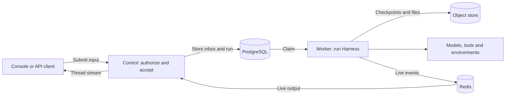

# Service

Service runs agents for users and applications through a browser Console or HTTP API. It manages workspaces, access, agent configurations and conversations; workers keep running after clients disconnect. [Get started](get-started.md) with a local deployment and your first agent.

## Start here

| Your situation                          | Guide                                              |
| --------------------------------------- | -------------------------------------------------- |
| Set up Service and get a first response | [Deploy and try locally](get-started.md)           |
| Your team already runs Service          | [Use an existing platform](use-platform.md)        |
| Call an agent from your application     | [Connect your application](connect-application.md) |

## Concepts

- **Organization and workspace:** an organization manages members; each workspace contains its own agents, resources and conversations.
- **Agent and revision:** an agent has saved configurations; each run uses a selected revision.
- **Session, thread and run:** a session groups conversations; a thread holds messages; each run advances that thread.
- **Provider and environment:** providers connect models, tools and sandboxes; a thread can mount an environment for file and terminal work.

[Core concepts](../core-concepts.md) follows one conversation through these pieces.

## How the pieces fit

1. A client sends a message. The Service adds it to the thread's inbox and starts a run when the thread is ready.
2. A worker executes the run with Harness, saves its progress and streams live output to the client.
3. The run returns a result or waits for an approval, client tool result or answer. Waiting requires an explicit resume; ordinary inbox messages remain queued. See [Agents, threads and runs](agents-and-runs.md) to continue the conversation.

Control and worker are roles of one executable; a single process can run both. See [Run and maintain](operations.md).

## Guides

- [Get started](get-started.md): deploy, connect a model and send a first message; [use Console](use-platform.md) on an existing deployment.
- [Identity and access](identity.md): workspaces, members, API keys and service accounts.
- [Agents, threads and runs](agents-and-runs.md): configure agents and integrate conversations; [Agent Composer](agent-composer.md) can help build them.
- [Resources](resources.md): discover [models](models.md), [tools and connections](tools.md), [skills](skills.md), [environments](environments.md), [memory](memory.md), and [files and webhooks](files-and-webhooks.md).
- [HTTP conventions](http.md), [API reference](api-reference.md) and [SDKs and CLI](sdks.md): build an integration.
- [Configuration](configuration.md), [operations](operations.md), [monitoring](monitoring.md) and [settings reference](configuration-reference.md): run a deployment.

## Interfaces

Console and the API share one origin; API operations use `/api/v1`. The `a13n-service` executable runs the server and operator commands. See the [Service specification](https://github.com/converge-ai-labs/agent-foundation/blob/main/spec/a13n-service/00-overview.md) for accepted contracts.
