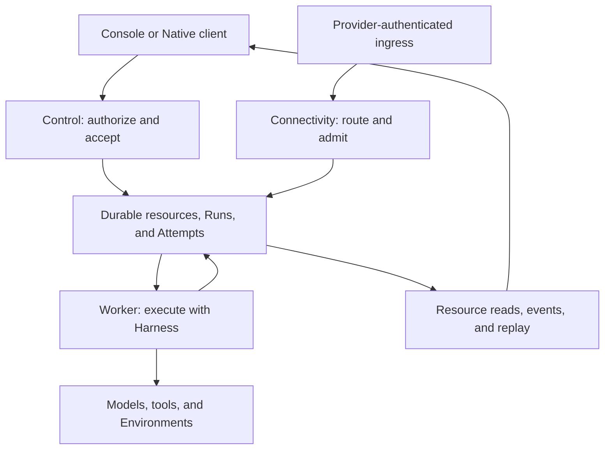

# Service

Run managed Agents behind an authenticated API. Service embeds Harness and adds durable acceptance, Agent revisions, Workspace authorization, scheduling, retained Runs and Attempts, resource management, and recovery. Use it when execution must survive a client's connection and be managed by a shared application.

For a personal terminal Agent, use [Harness UI](../a13n-harness-ui/index.md). For code-first execution in your own process, use [Harness](../a13n-harness/index.md). Neither requires deploying Service.

## Choose your starting point

| Goal                                                     | Guide                                                                                              |
| -------------------------------------------------------- | -------------------------------------------------------------------------------------------------- |
| Use a browser to manage Agents and conversations         | [Console](console.md)                                                                              |
| Configure and start a Service process                    | [Configuration](configuration.md)                                                                  |
| Initialize an administrator or create application keys   | [Identity and access](identity.md)                                                                 |
| Create an Agent and accept its first Run                 | [Agents, Threads, and Runs](agents-and-runs.md)                                                    |
| Integrate an application                                 | [SDKs](sdks.md) and [HTTP contracts](http-contracts.md)                                            |
| Consume output and recover an interrupted connection     | [Streams, events, and gateways](streams-and-events.md)                                             |
| Manage Providers, Environments, Skills, Assets, or Hooks | [Resources](resources.md)                                                                          |
| Operate workers, retention, and maintenance              | [Background tasks](background-tasks.md)                                                            |
| Look up exact fields or endpoints                        | [Configuration reference](configuration-reference.md) and [Native API reference](api-reference.md) |

## First working path

1. Start a configured Service and, for browser use, host Console on the matching public origin. The repository's local development launcher is `make dev`; it prepares local dependencies and starts Service and Console. See the [development guide](https://github.com/converge-ai-labs/agent-foundation/blob/main/dev/service/README.md) for its side effects and reset choices.
2. Complete administrator initialization and choose the intended Workspace.
3. Configure an authorized [Model Provider and Model](models.md). Credentials are write-only deployment/resource inputs, not instructions embedded in an Agent.
4. Create an Agent with that Model and the installed `native` input adapter.
5. Submit an input and save the returned acceptance receipt. A `202` response acknowledges durable work; it is not the output.
6. Read the Run, Items, pending actions, and optionally its stream. Use explicit feedback/control operations when the Run needs interaction.

The [Agent workflow](agents-and-runs.md) includes concrete JSON and curl examples. It requires an existing credential and Model and can consume paid provider quota; it is not an offline smoke test.

## Execution and ownership

The `all` role combines Control, Worker, and Connectivity. Split roles share appropriately configured durable infrastructure; a role-only process is not an interchangeable HTTP replica. [Configuration](configuration.md#roles-and-migration-authority) describes migration authority and readiness.

Agent revisions preserve authored configuration. Run acceptance freezes execution selection, while current permission and credential checks still apply at dispatch. Attempts record worker execution/recovery, not new user requests. Client disconnects do not cancel accepted work or reverse side effects.

## Product boundaries

- **Console** is the repository's private browser application for Service; it uses the TypeScript SDK and is hosted separately from Service API processes.
- **Native HTTP** is the main resource and execution contract. TypeScript covers it; Python, Go, and Rust currently cover Search Provider management, not general Run APIs.
- **`a13n-service`** is the process/operator CLI. **`a13n-service-cli`** is a separate remote client with label read and replacement commands.
- **AG-UI, A2A, and provider ingress** are separate protocol boundaries, not additional paths on the Native SDK's transport.
- **Tracing export** does not automatically enable authorized Service trace queries. Configure an installed query adapter; the default Run/IAM authorizer enforces access.

The site follows source `main`. Use package versions and contracts matching your deployed artifact, rather than assuming every published SDK or server release has the same surface.
