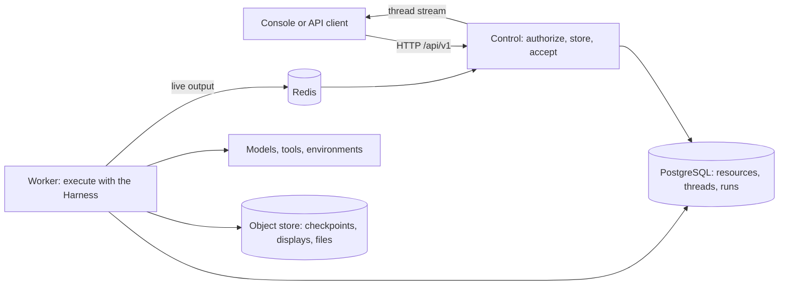

# Service

Service is Agent Foundation's managed-agent runtime, built on [Harness](../a13n-harness/index.md). It owns agent resources, identities and permissions, durable run acceptance, worker execution, and recovery. Use the Console browser application or the authenticated HTTP API to manage agents and conversations.

Choose Service when users or applications need managed access and execution independent of a connected client. Work can continue after a client disconnects; worker loss is handled through persisted state and recovery, not a promise that every external side effect can be replayed safely. See [run recovery](agents-and-runs.md).

For an interactive playground shared by trusted collaborators, use [Harness UI](../a13n-harness-ui/index.md). To own storage, users, and execution policy in your own application, embed Harness directly. Service and Harness UI both use Harness, but have different access and lifecycle boundaries.

Integrate through the [SDKs and remote CLI](sdks.md), or use the [HTTP API](http.md) directly. Client-specific installation and examples live with each independent SDK repository.

## Concepts

| Concept                    | Meaning                                                                                                                                                                     |
| -------------------------- | --------------------------------------------------------------------------------------------------------------------------------------------------------------------------- |
| **Organization**           | The administration boundary. It holds members and workspaces.                                                                                                               |
| **Workspace**              | The boundary for work: agents, conversations, providers, models and every other resource belong to one workspace.                                                           |
| **Principal, role, grant** | A user or service account; a role (`viewer`, `runner`, `builder`, `admin`) granted to it in an organization or workspace.                                                   |
| **API key**                | A bearer credential of one principal, confined to one workspace.                                                                                                            |
| **Provider**               | A configured integration for models, web search and retrieval, execution environments, connectors, or memory. See the resource guides for supported implementations.        |
| **Model**                  | An upstream model of a model provider, with its capabilities and pricing, that agents select by its key.                                                                    |
| **Agent, revision**        | An agent is a named head; each change adds an immutable, numbered revision of its configuration: model, instructions, tools, skills, connections, subagents and output.     |
| **Session, thread**        | A session is one conversation. It contains threads, each an independently advancing history with its own inbox and environments.                                            |
| **Run, attempt**           | A run is one accepted advancement of a thread with one agent revision. An attempt is one worker's execution of it.                                                          |
| **Inbox**                  | A thread's queue of input waiting to become a run or to steer the running one.                                                                                              |
| **Environment**            | A sandbox or computer where agent tools read files and run commands: created from an environment template, or an external envd target. Threads mount environments.          |
| **Memory**                 | What agents read and change across conversations: a tree of text files with the history of every change, or short records in mem0 that runs recall. Threads mount memories. |
| **Connection**             | A source of tools with its own credential: a remote MCP server, or an app account through a connector provider.                                                             |
| **Skill, asset**           | A versioned instruction package; immutable content uploaded or published by agents.                                                                                         |
| **Subscription**           | A webhook that receives run lifecycle events.                                                                                                                               |

## How the pieces fit

1. A client submits a message to a thread. The Service stores it in the thread's inbox and, when the thread is free, accepts it as a run that pins the agent revision and its resources.
2. A worker claims the run, executes the agent with the Harness, and commits a checkpoint and the run's display at each safe boundary, before model requests and tool calls. Live output flows through Redis to clients that follow the thread stream.
3. When the agent needs an approval, a client tool result or an answer, the run waits; a resume or a new message continues it as a successor run. When a run completes, the next queued input starts; after a failed or cancelled run, the thread waits for a new message.

Control and worker are roles of one executable; a single process can run both. See [Run and maintain](operations.md).

## Guides

| Goal                                                                 | Guide                                                                                                                                                                                                           |
| -------------------------------------------------------------------- | --------------------------------------------------------------------------------------------------------------------------------------------------------------------------------------------------------------- |
| Deploy, create the first administrator and hold a first conversation | [Get started](get-started.md)                                                                                                                                                                                   |
| Manage members, roles, invitations, API keys and service accounts    | [Identity and access](identity.md)                                                                                                                                                                              |
| Configure agents and run conversations through the API               | [Agents, threads and runs](agents-and-runs.md)                                                                                                                                                                  |
| Let an agent configure agents with you                               | [Agent Composer](agent-composer.md)                                                                                                                                                                             |
| Configure resources shared by agents                                 | [Resource basics](resources.md), [Models](models.md), [Tools and connections](tools.md), [Skills](skills.md), [Environments](environments.md), [Memory](memory.md), [Files and webhooks](files-and-webhooks.md) |
| Build a client                                                       | [HTTP conventions](http.md) and the [HTTP reference](api-reference.md)                                                                                                                                          |
| Configure and operate a deployment                                   | [Configure Service](configuration.md), [Run and maintain](operations.md), [Settings reference](configuration-reference.md)                                                                                      |

## Interfaces

- **Console** is the browser application for the Service. Deployments serve it on the same origin as the API.
- **HTTP API**: every operation is under `/api/v1`. A running Service publishes its OpenAPI document at `/api/v1/openapi.json`; the [HTTP reference](api-reference.md) is generated from it.
- **Specification**: the Service's accepted contracts start at the [Service overview specification](https://github.com/converge-ai-labs/agent-foundation/blob/main/spec/a13n-service/00-overview.md).
- **`a13n-service`** is the server and operator command. Language SDKs and the companion remote command-line client are developed in independent repositories of [converge-ai-labs](https://github.com/converge-ai-labs); check each one for the Service versions it supports.
