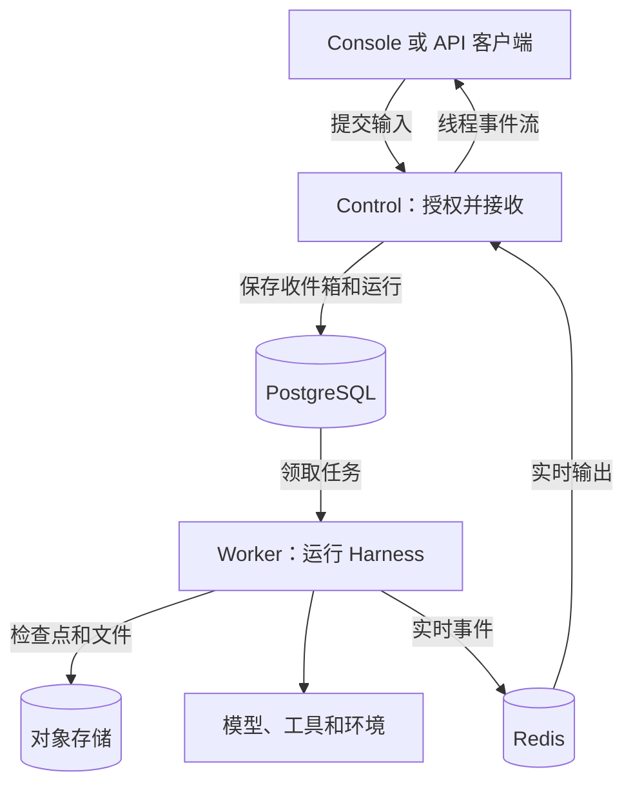

Service 管理工作空间、访问权限、agent 及其修订版本，以及对话；客户端断开连接后，运行仍会继续。从[入门指南](get-started.md)开始本地部署并试用第一个 agent。

## 从这里开始

| 你的情况                    | 指南                                   |
| --------------------------- | -------------------------------------- |
| 部署 Service 并获得首次回复 | [本地部署与试用](get-started.md)       |
| 团队已经在运行 Service      | [使用已有平台](use-platform.md)        |
| 从应用中调用 agent          | [连接你的应用](connect-application.md) |

## 概念

- **组织与工作空间：** 组织管理成员；每个工作空间包含自己的 agent、资源和对话。
- **Agent 与修订版本：** 配置变更会创建不可变的修订版本；运行使用 agent 的默认修订版本，除非消息固定了另一个修订版本。
- **会话、线程与运行：** 会话组织相关线程；线程保存一段历史及其收件箱；每次运行推进该线程。
- **Provider 与环境：** provider 是为模型、环境、connector、Web 工具和记忆配置的账号；线程可以挂载环境来操作文件和终端。

[核心概念](../overview/core-concepts.md)通过一次对话介绍这些组件。

## 组件如何协作

1. 客户端发送消息。Service 将其加入线程收件箱；线程上没有进行中或等待中的运行时，启动一次运行。
2. Worker 使用 Harness 执行运行，保存进度，并将实时输出流式传给客户端。
3. 运行以结果完成、失败、被取消，或等待审批、客户端工具结果或回答。等待需要显式恢复；普通消息仍留在收件箱中。继续对话的方法请参阅 [Agent、线程与运行](agents-and-runs.md)。

Control 和 worker 是同一个可执行程序的运行角色，单个进程可以同时承担两种角色。请参阅[运维 Service](operations.md)。

## 指南

- [快速入门](get-started.md)：部署、连接模型并发送第一条消息；在已有部署上[使用 Console](use-platform.md)。
- [身份与访问](identity.md)：工作空间、成员、API 密钥和服务账号。
- [Agent、线程与运行](agents-and-runs.md)：配置 agent，然后开始、跟踪和恢复运行；[Agent Composer](agent-composer.md)可以协助构建 agent。
- [资源](resources.md)：了解[模型](models.md)、[工具与连接](tools.md)、[skill](skills.md)、[环境](environments.md)、[记忆](memory.md)以及[文件与 webhook](files-and-webhooks.md)。
- [HTTP 约定](http.md)、[API 参考](api-reference/index.md)和 [SDK 与 CLI](sdks.md)：构建集成。
- [配置](configuration.md)、[运维](operations.md)、[监控](monitoring.md)和[设置参考](configuration-reference.md)：运行部署。

## 接口

Console 和 API 使用同一个源；API 操作位于 `/api/v1`。`a13n-service` 可执行程序用于运行服务器和运维命令。已接受的约定请参阅 [Service 规范](https://github.com/converge-ai-labs/agent-foundation/blob/main/spec/a13n-service/00-overview.md)。
