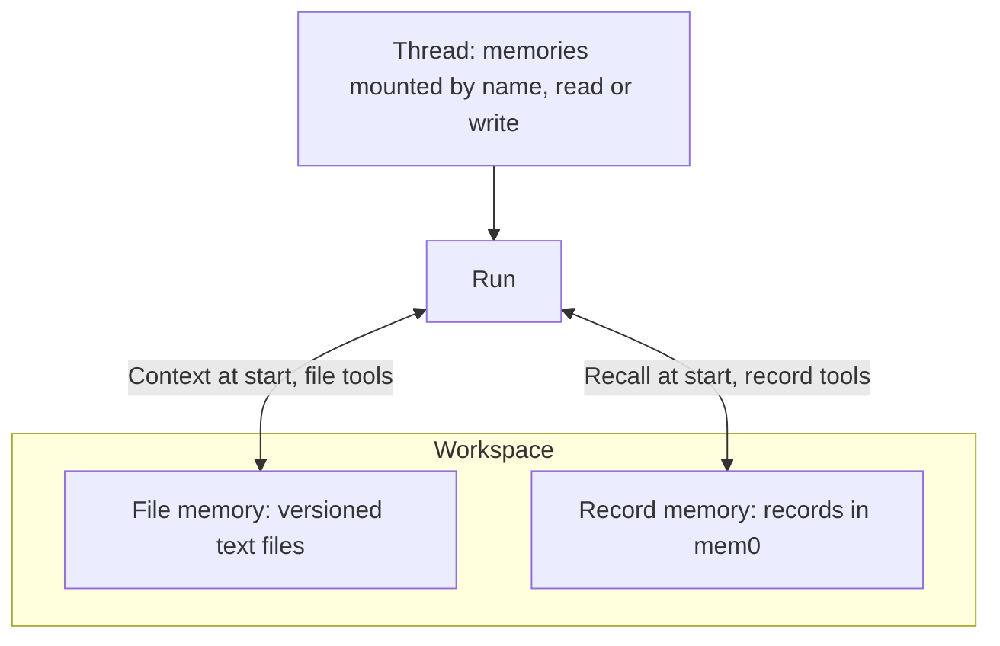

A memory is what agents keep across conversations: preferences, decisions, conventions and reference facts. It belongs to a workspace, and several conversations can use it at once. There are two kinds:

- A **file memory** is a small tree of text files. The Service keeps its files, and the history of every change, in PostgreSQL. Every write checks the file's version at the moment it runs, so a change based on stale content fails and returns the current file instead of overwriting another conversation's work. [File memory](../a13n-harness/memory.md) explains what the model sees and how to write good memory files.
- A **record memory** is a set of short text records, such as "The user prefers metric units", kept in a [mem0](https://mem0.ai) backend through a [Memory Provider](#set-up-a-memory-provider). At the start of each run, the records closest to the run's input are **recalled** into it. Records have no versions: the last write wins.

Threads **mount** memories under names. Each run freezes the thread's memory mounts when it is accepted, sees each memory's context or recalled records at its start, and changes the memories through the `memory_file_*` and `memory_record_*` tools.



All API paths below are under `/api/v1`.

## Create a file memory

Creating and changing memories needs `write`:

```sh
curl -X POST "$A13N_URL/api/v1/memories" \
  -H "Authorization: Bearer $A13N_API_KEY" -H "Content-Type: application/json" \
  -d '{"name": "Team conventions", "type": "postgres",
       "guide": "Keep one file per topic. Record decisions with their reason.",
       "always_load": ["README.md"]}'
```

- `type` is `postgres`, the Service's own store and the default. The response's `id` (`mem_…`) identifies the memory; memories have no key.
- `guide` tells agents what belongs in this memory and how to organize it, up to `memory.guide_bytes`. Leave it out or set it to `null` to use the deployment's guide for the memory's kind (`memory.default_guide.file` or `memory.default_guide.record`, else the built-in one); `""` gives the memory no guide. The memory's `inherited_guide` shows the guide `null` resolves to.
- `always_load` names up to 64 paths whose full content leads the memory's context in every run. A path need not exist yet. Only people who may change the memory choose them, so a conversation cannot pin its own writes into every later one.
- `PATCH …/memories/{memory_id}` with the memory's `If-Match` changes `name`, `description`, `labels`, `guide` and `always_load`. Runs that start afterwards use the change.
- `DELETE …/memories/{memory_id}` with `If-Match` deletes the memory with its files, history and thread mounts. A running run that uses it gets `memory_deleted` from its next memory tool call.

`GET …/memories` lists the workspace's memories, filtered by `label`, `kind` (`file` or `record`) and `type`. A file memory shows `file_count`, `content_bytes` and `history_bytes`; they are null for a record memory.

## Record memories

### Set up a Memory Provider

A Memory Provider is a [provider](resources.md#providers) of kind `memory`: one account of a record memory backend. Add it to the workspace in `/api/v1/memory-providers`.

For the hosted **mem0 Platform**, use type `mem0_platform` with an API key from the [mem0 dashboard](https://app.mem0.ai/dashboard/api-keys); `config.base_url` defaults to `https://api.mem0.ai`:

```sh
curl -X POST "$A13N_URL/api/v1/memory-providers" \
  -H "Authorization: Bearer $A13N_API_KEY" -H "Content-Type: application/json" \
  -d '{"type": "mem0_platform", "name": "mem0", "config": {}, "credential": {"api_key": "m0-..."}}'
```

For **self-hosted mem0**, run the [mem0 REST server](https://docs.mem0.ai/open-source/features/rest-api) with its own model, embedder and vector store, and use type `mem0_oss` with the server's address as `base_url`:

```sh
curl -X POST "$A13N_URL/api/v1/memory-providers" \
  -H "Authorization: Bearer $A13N_API_KEY" -H "Content-Type: application/json" \
  -d '{"type": "mem0_oss", "name": "mem0",
       "config": {"base_url": "https://mem0.internal.example.com"}, "credential": {"api_key": "..."}}'
```

The self-hosted credential is optional and is sent as `X-API-Key`; purging a deleted memory's records needs the server's admin key. A server on a private network or on plain HTTP must be allowed by the deployment's [outbound policy](configuration.md#outbound-requests). The self-hosted server lists at most 1000 records of a memory.

`POST …/memory-providers/{provider_id}/test` lists one page of a namespace no memory uses, which checks the address and key without changing anything.

### Create a record memory

```sh
curl -X POST "$A13N_URL/api/v1/memories" \
  -H "Authorization: Bearer $A13N_API_KEY" -H "Content-Type: application/json" \
  -d '{"name": "User facts", "type": "mem0_platform", "provider_id": "memprov_...",
       "guide": "Record one stable fact about the user per record."}'
```

- `type` is the provider's type, and the provider must be an enabled Memory Provider of the workspace. `always_load` does not apply.
- Each record memory owns a **namespace** in the backend, which is mem0's `user_id`. By default it is `a13n-` and 32 hex characters derived from the memory's ID. Set `namespace` to adopt records that already exist under a `user_id`, such as ones your application wrote; it is 1 to 256 printable characters with no whitespace and no `*`. One namespace belongs to one memory: another memory using it is `409 already_exists`.
- `type`, `provider_id` and `namespace` never change.
- Deleting a record memory deletes the records in its namespace too, in the background. Until that finishes, a new memory cannot take the namespace (`409 conflict` with reason `namespace_purging`). If the backend keeps refusing, the purge stops after `outbox.defaults.max_attempts` tries and the records stay in the backend. The mem0 Platform finishes a purge on its own after accepting it, so its records can linger briefly.

### Read and edit records

People can read and correct what agents recorded. Reading needs `read`; adding, updating and deleting need `run`.

| Request                                      | Does                                                                                       |
| -------------------------------------------- | ------------------------------------------------------------------------------------------ |
| `GET …/memories/{id}/records?limit=&cursor=` | Lists records in the backend's order, with `next_cursor` for the next page                 |
| `POST …/memories/{id}/records/search`        | Returns up to `limit` records closest in meaning to `{query}`, closest first, with `score` |
| `POST …/memories/{id}/records`               | Adds `{text}`                                                                              |
| `PUT …/memories/{id}/records/{record_id}`    | Replaces the record's whole text with `{text}`                                             |
| `DELETE …/memories/{id}/records/{record_id}` | Deletes the record                                                                         |

A record holds 1 to `memory.record_chars` characters (8000 by default). Records have no ETag, so the last write wins. A write the backend does not confirm answers `409 conflict` with reason `write_unconfirmed`: it may or may not have happened, so list or search before trying again. A backend that cannot answer is `503 unavailable` with dependency `memory:{type}`, and a disabled provider is `422 disabled`. Record changes are audited with the record ID, never the text.

### Recall

When a run starts, each mounted record memory with `recall` on searches for the `memory.recall_limit` records (5 by default) closest to the run's input, and the run receives them before its input as untrusted data, at most `memory.recall_bytes` (8 KiB) per memory. Recall waits at most `memory.recall_seconds` (2 seconds); a memory whose search fails or is too slow is skipped, and the run continues without it. Only the first input of a run recalls, so a run's history does not fill with repeated records.

## Mount a memory on a thread

A thread's memory mounts decide what its later runs use:

```sh
curl -X POST "$A13N_URL/api/v1/threads/$THREAD/memories" \
  -H "Authorization: Bearer $A13N_API_KEY" -H "Content-Type: application/json" -H "If-Match: $THREAD_ETAG" \
  -d '{"name": "team", "memory_id": "mem_...", "access": "write"}'
```

- `name` matches `^[a-z][a-z0-9-]{0,62}$`; the model addresses the memory by it. `access` is `read`, which offers only the reading and searching tools, or `write`, which offers every tool.
- `recall` (default `true`) lets a record memory recall records into each run; file memories ignore it.
- A thread mounts each name and each memory once. `PATCH …/threads/{thread_id}/memories/{name}` changes a mount's `access` and `recall`; to change its memory, remove it and add it again.
- A thread holds at most `memory.mounts_per_thread` memory mounts (8 by default); a request beyond that is `409 conflict` with reason `memory_mount_limit`.
- Mount changes take the **thread's** `If-Match`, return the thread's new ETag, need `run`, and affect runs accepted afterwards. `GET …/threads/{thread_id}/memories` lists the mounts with the thread's ETag, and `DELETE …/threads/{thread_id}/memories/{name}` removes one.
- New threads and forks take initial mounts in their `memories` field. A fork copies its origin thread's memory mounts. Archiving a thread removes them.

To give every conversation of an agent a memory, set the agent's `memory_mounts` to `[{name, memory_id, access, recall}]`. They join a thread when its first run is accepted, for each name and memory the thread does not use yet. Afterwards the thread's own mounts decide, so removing one keeps it removed. A default whose memory was deleted fails that first run with `invalid_argument`, and defaults that would take the thread over its limit fail it with `memory_mount_limit`.

An async [subagent](agents-and-runs.md#subagents)'s thread starts with the parent run's memory mounts and then adds its own agent's defaults. Inline subagents get no memory tools or context.

## What agents get

The `memory` [toolset](tools.md#built-in-toolsets) is enabled by default. Its tools are:

- the Harness [file memory tools](../a13n-harness/memory.md#what-the-model-gets), with tool keys `file_view` through `file_delete` and permission IDs `memory.file.view` through `memory.file.delete`, offered for mounted file memories;
- the record tools `memory_record_search`, `memory_record_list`, `memory_record_add`, `memory_record_update` and `memory_record_delete`, with tool keys `record_search` through `record_delete` and permission IDs `memory.record.search` through `memory.record.delete`, offered for mounted record memories.

Disabling a tool removes it from every mount; disabling the toolset leaves the run its memories' context and recall without tools.

At the start of a run, each file memory adds one context block: its always-loaded files and an index of its files the first time a conversation sees it, and afterwards only the files changed since, including changes by other conversations and people. A conversation whose history was compacted gets full context again. A run's memory context shares `memory.context_bytes` (32 KiB by default), of which each memory's always-loaded files take at most `memory.always_load_bytes`.

Each memory call checks the run's access to the workspace: `read` to view, list and search, `run` to change a file or record. A refused call fails with `forbidden`, and a call to a record memory whose provider was disabled fails with `unavailable`. A failed file call changes nothing; the model reads the file and decides again.

A worker can stop after a memory write and before the run records its progress. The recovered attempt then reports that the call's outcome is unknown, and the model reads the file, or searches the records, before writing again. A file write keeps its run and tool call in the history.

## Files and history

People can read and correct what agents wrote. Reading needs `read`, editing and restoring need `run`, and purging history needs `write`. `{path}` is the file's path, such as `prefs/language.md`.

| Request                                        | Does                                                                                                           |
| ---------------------------------------------- | -------------------------------------------------------------------------------------------------------------- |
| `GET …/memories/{id}/files?prefix=`            | Lists files without content, in path order, under a directory prefix ending in `/`                             |
| `GET …/memories/{id}/files/{path}`             | Returns one file with its content and `ETag`                                                                   |
| `POST …/memories/{id}/files`                   | Creates `{path, content}`; `409 already_exists` when the path is taken                                         |
| `PUT …/memories/{id}/files/{path}`             | Replaces the content of the file `If-Match` names                                                              |
| `POST …/memories/{id}/files/move`              | Moves `{source, destination}` of the file `If-Match` names to a free path                                      |
| `DELETE …/memories/{id}/files/{path}`          | Deletes the file `If-Match` names                                                                              |
| `GET …/memories/{id}/revisions`                | Lists changes newest first, filtered by `path` or `run_id`                                                     |
| `GET …/memories/{id}/revisions/{seq}`          | One change with `previous_content`, the `content` it left, and unified-diff `hunks`                            |
| `POST …/memories/{id}/revisions/{seq}/restore` | Puts back the content that change replaced, as a new change; `If-Match` names the file now at the path, if any |
| `DELETE …/memories/{id}/revisions?path=`       | Deletes the retained history of one path; the file stays                                                       |

Each revision records who made the change: `run_id` and `tool_call_id` for an agent's tool call, `principal_id` for both agents and people. A file's ETag changes with every change, so an edit based on an old read answers `412 precondition_failed`.

A file holds at most `memory.max_file_bytes` (64 KiB by default). Each file keeps its latest `memory.revisions_per_file` changes (10 by default), and one memory's content and history together fit `memory.max_total_bytes` (32 MiB by default): the oldest history is pruned first, and only content alone over the limit refuses a change, with `409 conflict` and reason `memory_full`. See the [settings reference](configuration-reference.md#memory) for every `memory.*` setting.
